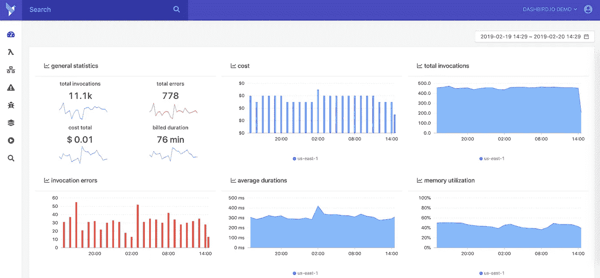
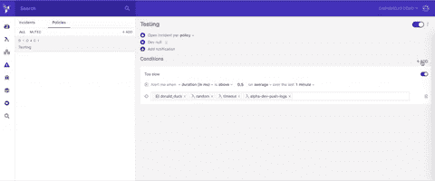
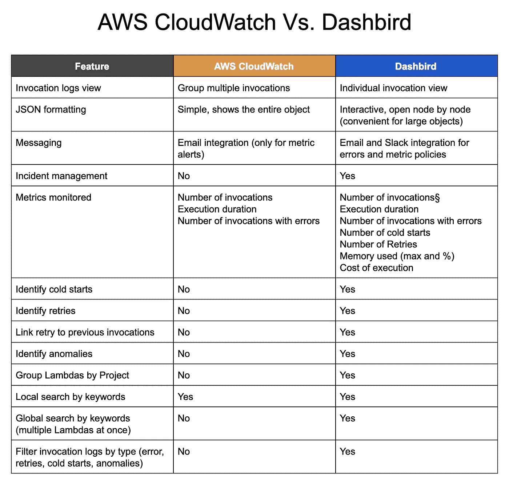

# 利用 AWS Lambda 的基于指标的警报来解决问题

> 原文：<https://medium.com/hackernoon/getting-down-and-dirty-with-metric-based-alerting-for-aws-lambda-44dee79df49a>

每当人们谈论监控或观察您的 AWS 资源时，“安全胜于遗憾”这句话就会被抛出，但事实是，您不能坐以待毙，直到问题出现，您需要主动寻找机会来改进您的应用程序，以便在竞争中领先一步。设置一个在特定事件发生时发出的警报是一个很好的方式来监视无服务器应用程序幕后发生的事情，这也正是我在这篇文章中想要解决的问题。

# AWS Lambda 指标

AWS Lambda 自动为您监控功能，同时通过 Amazon CloudWatch 报告指标。我们所说的度量包括总调用、节流、持续时间、错误、DLQ 错误等。您应该将 CloudWatch 视为一个度量库，因为度量是 CloudWatch 中的基本概念，它们代表一组按时间排序的数据点。指标由名称、一个或多个维度以及名称空间定义。每个数据点都有可选的测量单位和时间戳。

虽然 Cloudwatch 是获取函数指标的好工具，但 Dashbird 更上一层楼，它提供了正确调试那些讨厌的 Lambda 问题所需的缺失环节。它允许您检测平台支持的所有编程语言中的任何类型的故障。这包括崩溃、配置错误、超时、提前退出等。Dashbird 提供的另一个非常有价值的东西是错误聚合，它允许您查看关于错误、内存利用率、持续时间、调用以及代码执行的即时指标。

# AWS Lambda 指标解释

在我们开始之前，我觉得我们应该讨论指标本身，以确保我们都理解并知道每个术语的含义或它们所指的内容。

从那里，我们将看一下 AWS Lambda 中的一些名称空间指标，我们将解释它们是如何操作的。例如

**调用**将计算函数被调用的次数，以响应调用 API 调用或替代 RequestCount 指标的事件。所有这些都包括成功和失败的调用，但不包括被抑制的尝试。您应该注意到，只有当提到的度量值处于非零值时，AWS Lambda 才会将它们发送到 CloudWatch。

**错误**将主要测量由于函数本身的错误而发生的失败调用的数量，这是对 ErrorCount 度量的替代。失败的调用能够开始重试尝试，这可能是成功的。

**我们必须提到一些限制:**

*   不包括由于调用率超过默认设置的并发限制而失败的调用(429 错误代码)。
*   不包括由于内部服务错误(500 错误代码)而发生的故障。

**DeadLetterErrors** 当 Lambda 无法将失败的有效负载事件写入您预先配置的 DeadLetter 行时，错误数会开始离散增加。这种入侵可能是由于权限错误、错误配置的资源、超时甚至是下游服务的限制而发生的。

**持续时间**将测量函数代码因调用而开始执行的实时开始时间，直到它停止执行。计费的持续时间将四舍五入到最接近的 100 毫秒。值得注意的是，只有当值不为零时，AWS Lambda 才会将这些指标发送到 CloudWatch。

**Throttles** 将计算一个 Lambda 函数尝试调用并被超过用户并发限制的调用率阻止的次数(429 错误代码)。您还应该知道，失败的调用可能会自动触发重试尝试，这可能会成功。

**迭代器年龄**仅用于基于流的调用。这些功能由两个流中的一个触发:亚马逊的 DynamoDB 或 Kinesis 流。为每批处理的记录测量最后一个记录的年龄。年龄是 Lambda 接收批的时间与批中最后一条记录写入流的时间之间的唯一差异。

**并发执行**基本上是一个针对账户内所有功能以及所有其他具有自定义并发预设限制的功能的聚合指标系统。并发执行不适用于不同形式和版本的函数。基本上，这意味着它从某个时间点开始测量特定函数中并发执行的总和。考虑到其在一段时间内的聚合，将其视为平均指标至关重要。

**未保留的并发执行**与并发执行几乎相同，但是它们表示没有指定自定义并发限制的函数的并发总数。它们仅适用于用户的帐户，如果在一段时间内进行汇总，则需要将其视为平均指标。

# 你从哪里开始？

# 云观察

为了使用 CloudWatch 控制台访问指标，您应该打开控制台，并在导航面板中选择指标选项。此外，在 CloudWatch Metrics by Category 面板中，您应该选择 Lambda Metrics 选项。

# 仪表板鸟

要访问您的指标，您需要登录应用程序，第一个屏幕将向您展示您职能部门所有重要统计数据的鸟瞰图。从成本、调用、内存利用、功能持续时间以及错误。所有的东西都方便地装在一个屏幕上。

## 为 Lambda 函数设置基于度量的警报

当你的 Lambda 函数出错时，设置警报来通知你是很重要的，这样你就能熟练地做出反应。

# 云观察

要为失败的功能(可能是由于整个网站的崩溃，甚至是代码中的错误)设置警报，您应该进入 CloudWatch 控制台，选择左侧的警报，然后单击创建警报。选择“Lambda Metrics”，从那里，您应该在列表中查找您的 Lambda 名称。在那里，选中指标名称为“Error”的行的复选框然后点击下一步。

现在，您可以为警报输入名称和描述。从这里开始，您应该设置每次“错误”超过 0 时触发警报，持续一段时间。作为统计数据，在下拉“周期”窗口中选择“总和”和您的特殊情况所需的分钟数。

在通知框中，选择下拉菜单中的“选择通知列表”,然后选择您的 SNS 端点。此设置的最后一步是单击“创建警报”按钮。

# 仪表板鸟

使用 Dashbird 设置基于指标的警报并不复杂，事实上恰恰相反。在应用程序中，进入提醒菜单，点击屏幕右侧的添加按钮，并为其命名。然后，选择您感兴趣的指标，可以是冷启动、重试、调用，当然还有错误。你所要做的就是选择规则(例如:当 10 分钟内冷星数量超过 5 时提醒我)，然后你就完成了。

# 您如何为基于指标的警报选择正确的解决方案？

虽然问题。虽然 Cloudwatch 是一个很好的工具，但当你的系统中有更多 lambdas 时，你会发现很难调试，甚至很难理解你的错误，因为信息量很大。另一方面，Dashbird 提供了关于调用和错误的详细信息，这些信息简单明了，并且在定制方面更加灵活。我的同事 Renato 做了一个简单的表格来比较这两种服务。

我必须指出:使用 AWS CloudWatch，无论何时调用一个函数，它们都会启动一个微容器来服务请求，并在 CloudWatch 中为它打开一个日志流。只要这个容器还活着，它们就重用同一个日志流。这意味着同一个日志流从一个地方的多个调用中获取日志。

这很快变得非常混乱，并且很难调试问题，因为您需要打开最新的日志流并一直浏览到最新的调用日志，而在 Dashbird 中，我们显示按时间排序的各个调用，这使得开发人员更容易理解在任何时间点发生的事情。

有什么有用的补充吗？请在下面的评论框中填写。

*原载于 2019 年 2 月 20 日*[*dash bird . io*](https://dashbird.io/blog/metric-based-alerting-for-aws-lambda/)*。*