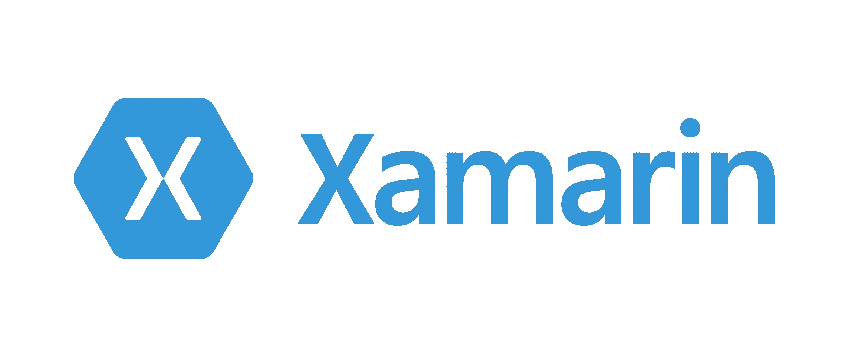
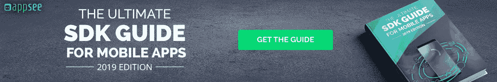

# 2019 年跨平台 App 开发入门

> 原文：<https://medium.com/hackernoon/getting-started-with-cross-platform-app-development-in-2019-dd2bf7f6161b>

Image credit: [Burst/Shopify](https://burst.shopify.com/photos/developers-discussing-javascript-code?q=programming)

***由赖因德创立***

*还记得 Adobe Flash 吗？它是终极的跨平台开发工具。Flash 可以在任何网络浏览器或操作系统上运行——它甚至可以在早期版本的 Android 上运行。然后是 HTML5，它做了很多 Flash 可以做的事情…*

*跨平台开发一直是构建软件的圣杯。大多数跨平台开发工具承诺你可以一次构建代码库，然后在任何平台上运行应用程序。如果您可以一次构建并在任意多的平台上部署，为什么要为每个不同的平台进行本机构建呢？*

*你可以看到为什么这是如此引人注目。它可以节省您将应用推向市场的时间和金钱，并且您可以将维护和开发成本减半。从开发人员的角度来看，这也很有趣。开发人员可以使用他们熟悉的工具——例如 JavaScript 或 C#——来构建他们不熟悉的平台。*

*在本文中，我们将浏览一些新的和成熟的跨平台工具。目标是通知您 2019 年跨平台应用程序开发的不同可用选项。*

**【无论你选择哪个平台，确保你使用了强大的分析工具来快速找到并修复任何错误或崩溃，而不必搜索代码。首先查看一个 app 的* [*免费试用版 see*](https://www.appsee.com/start?cpnid=701b0000000Wd7c&utm_source=medium&utm_medium=CTA_text&utm_campaign=learnappmaking_cross_platform_development&utm_content=free_trial_link) *，它会实时记录并重放崩溃的会话。】**

*我们开始吧！*

# *PhoneGap*

**

*Image credit: [Adobe PhoneGap](https://www.phonegap.com/about/logos/)*

*现在归 Adobe 所有的 PhoneGap 是一个跨平台的开发工具，依靠网络技术为 Android 和 iOS 开发应用。你可以使用 HTML、CSS 和 JavaScript 来构建一个具有本地外观和感觉的移动应用程序，而不需要为不同的平台编写两次相同的代码。*

*这正是大多数跨平台工具遇到麻烦的地方。以智能手机的摄像头为例。iOS 和 Android 使用该相机所需的代码是不同的。事实上，你用来在这些平台上创建原生应用的编程语言——Swift 和 Java——是 100%不同的。*

*PhoneGap 解决了这个问题，它为您提供了一个具有本地外观和感觉的 web 技术统一方法。它看起来像一个原生的 iOS 或 Android 应用程序，但它不是。*

*像 PhoneGap 这样的工具也提供了统一的 API 来与硬件交互，如相机、媒体库、文件存储和 GPS。它们的底层代码可能因平台而异，但它们的工作方式非常相似。最重要的是，像 PhoneGap 这样的工具允许你通过使用插件来访问特定于平台的代码。*

# *Xamarin*

**

*Image credit: [Xamarin](https://blogs.msdn.microsoft.com/microsoftimagine/2016/01/11/build-native-ios-and-android-apps-for-free-with-xamarin-and-visual-studio/)*

*微软旗下的 Xamarin 是一款跨平台的开发工具，开发者可以用 C#编程语言开发原生的 iOS 和 Android 应用。Xamarin 应用程序是提前编译的，这意味着它们不会遭受解释工具或基于网络的工具所具有的性能缺陷。*

*Xamarin 平台是使用跨平台工具的最大好处的一个很好的例子:开发人员可以使用他们已经知道的编程语言。C#是一种编程语言，最初由微软在其。NET 平台。熟悉微软构建软件环境的开发人员，如 C#和。NET 可以很容易地学习 Xamarin 开发，因为工具实际上是相同的。*

*值得研究 PhoneGap 与 Xamarin 有何不同。有了 PhoneGap，你的跨平台应用程序主要由加载 HTML 内容的本地 *web 视图*组成。模仿了按钮、工具栏等原生 UI，给人一种原生 app 的感觉。这样做，并即时解释 JavaScript，通常会让基于 web 的跨平台应用程序感觉迟钝。*

*Xamarin 应用程序是编译的，这意味着它们直接在智能手机硬件上运行，而不是在网络视图中运行。C#代码在本地平台之间共享，这意味着应用程序的大部分代码可以用一种编程语言编写一次。此外，Xamarin 应用程序还可以直接访问原生 API，这意味着开发人员可以使用像 iOS 的 ARKit 这样的平台特定框架。*

# *反应自然*

**

*Image credit: [GitHub](https://github.com/topics/react-native)*

*[React Native](https://facebook.github.io/react-native/) 最初由脸书在 2015 年宣布，近年来逐渐流行起来。它采用完全不同的方法进行跨平台开发，使用 JavaScript 代码来支持本地组件。*

*它不是模仿原生组件或编译成本生代码，而是在运行时解释 JavaScript 来显示原生 UI 元素、响应用户交互和执行任务。开发者不必依赖缓慢的 web 视图来渲染他们的应用，也不必[学习 iOS 开发](https://learnappmaking.com/learn-ios-development-how-to/)。*

*React Native 越来越受欢迎，而且它是开源的，这意味着许多开发人员为该平台构建了第三方组件，这进一步加快了它的采用。就像 Xamarin 和 C#一样，web 开发人员可以很容易地使用 React Native，因为它使用了他们已经喜欢的 JavaScript 语言。*

*跨平台开发中一个反复出现的主题是“一次编码，两次部署”真的可以在平台之间 100%共享代码库吗？根据您正在构建的应用程序的复杂性，您可以。尤其是 React Native 和 Xamarin 完善了共享代码库的原则，没有典型的性能瓶颈。*

*如果你正在研究跨平台工具，目标是构建一个跨平台的应用程序，请记住，你总是有机会需要编写特定于平台的代码。这意味着你的团队需要本地的 iOS 或 Android 开发者，尽管不是全职的。*

# *摆动*

**

*Image credit: [Flutter](https://flutter.io/)*

*Google 打造的 [Flutter](https://flutter.io/) ，将跨平台开发带到了一个新的高度。它于 2017 年 5 月首次发布，并于 2018 年 12 月发布了第一个稳定的 1.0 版本。*

*Flutter 处于跨平台开发的前沿，值得特别关注。通过完全避开本地平台，它非常接近“一次编码，两次部署”的现象。它在开发人员社区中的发展速度很快。*

*Flutter 的工作方式是将 Dart 源代码编译成本机代码，在 Dart 虚拟机上运行。你可以将其与 Xamarin 进行比较，后者直接在智能手机硬件上运行本机代码，而 React Native 则在本机应用程序中运行解释的 JavaScript 代码。*

*颤振的一个特别有趣的特性叫做*热重装*。通过热重装，可以在运行时直接注入对应用程序源代码的更改。这就像重新加载一个网页，不需要重新编译整个应用程序。热重新加载还保留了应用程序的状态，因此您可以同时编码和与应用程序交互。*

*与其他工具类似，Flutter 为 Android 和 Apple 的 UI 设计等平台特定的功能提供共享代码，以及构建平台特定插件的选项。特定于平台的 API 和 SDK 可以本机使用。*

# *进一步阅读*

*以其自己的方式，Adobe 的 Flash 可以成为 Xamarin、PhoneGap、Flutter 和 React Native 为跨平台开发带来的东西。我们永远不会知道 Flash 是太早了，还是太晚了。*

*Flash 成为跨平台开发故事的一部分是有原因的。随着新的概念和范例越来越受欢迎，其他的逐渐消失，开发工具必然会发生变化。谁知道 2019 年、2020 年以及以后会推出哪些跨平台开发工具？*

*随着这些工具越来越先进，“编码一次，部署两次”的圣杯越来越近了。也许有一天，我们真的可以一次开发一个应用程序，然后在任何地方运行它。*

**

# *关于作者*

*Reinder de Vries 是一名专业的 iOS 开发者。他在 LearnAppMaking.com 教应用开发者如何开发自己的应用。自 2009 年以来，他已经为 iOS 开发了几十个应用程序，为全球品牌工作，并领导了几家初创公司的开发。当他不编码时，他喜欢浓咖啡和旅行。*