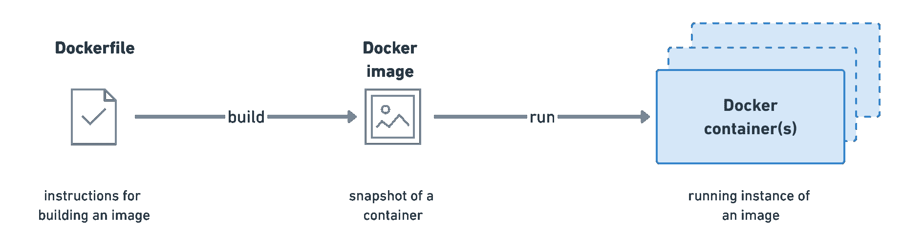
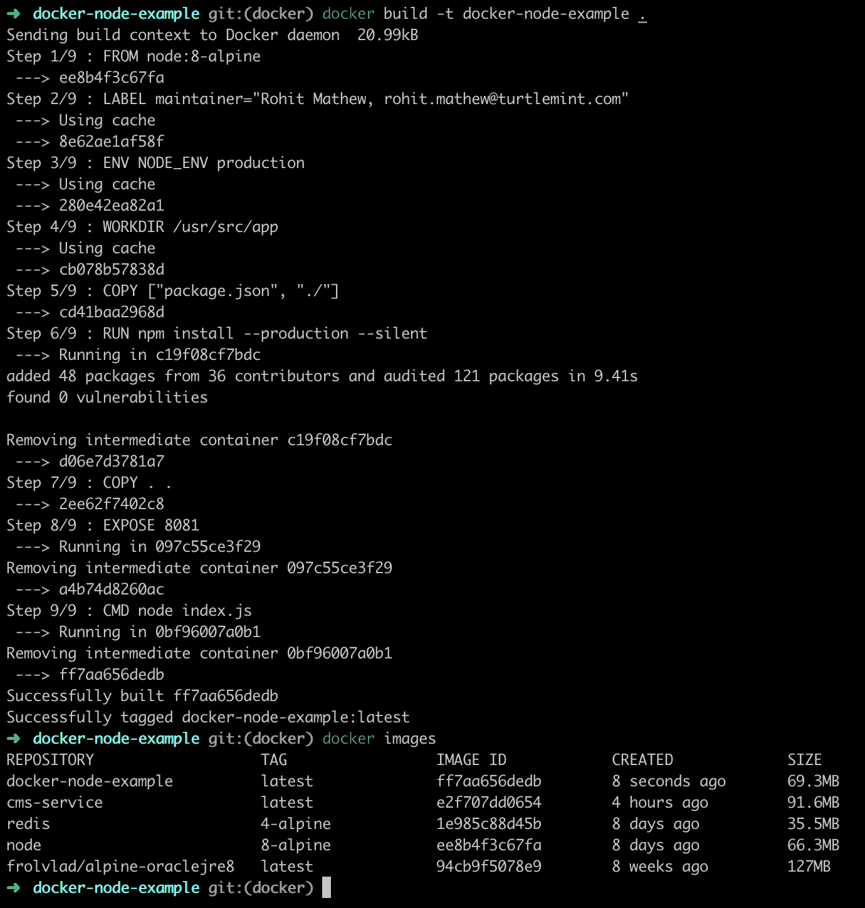

# Node.js 应用程序的 Dockerizing 入门

> 原文：<https://medium.com/hackernoon/getting-started-with-dockerizing-your-node-js-application-bab6b2451cde>


Photo by [chuttersnap](https://unsplash.com/photos/eqwFWHfQipg?utm_source=unsplash&utm_medium=referral&utm_content=creditCopyText) on [Unsplash](https://unsplash.com/photos/uBe2mknURG4?utm_source=unsplash&utm_medium=referral&utm_content=creditCopyText)

SaaS 公司有意识地转向微服务架构。为了方便起见，我们通常使用 Docker 设置。好吧，让我们不要跳过步骤，看看为什么人们推荐这个。

为了更好地理解集装箱化和码头工人，让我们以集装箱为例。

# 为什么使用集装箱？

嗯，集装箱通过标准化和简化大量货物的运输，彻底改变了运输业。这可能是在海上或陆地。现在有了这些标准集装箱，我们可以用一个集装箱装运多种物品，甚至用多个集装箱装运大量的单一物品。这里的一些关键特征是:

*   **标准化:**这些海运集装箱都是标准化的，可以以同样的方式在多个大陆和国家之间运输和移动，不管它们装的是什么或如何运输。
*   **搬运:**这些集装箱是标准化的，因此无论里面装的是什么或者在哪里，都可以用同样的方式搬运。
*   **安全性:**这些集装箱是独立的，彼此分离，因此为其中的内容物提供了免受外部干扰的屏障。
*   **可扩展的:**这些集装箱可以装下多种物品，也可以装下大量的单一物品。我们也可以根据货物的数量得到更多的集装箱。

# 这在软件容器化中是如何工作的？

软件容器化的工作原理与上面类似。稍后我会详细介绍，但我们可以通过以下方式实现上述所有关键功能:

*   **标准化:**我们为代码构建的容器独立于本地系统运行。因此，我们可以轻松地在我们的个人笔记本电脑上运行相同的代码到生产服务器/云服务器，同时期望它们在任何地方都有相同的体验。因此，我们已经标准化了我们期望我们的代码在所有环境中的行为，并消除了“在我的系统上工作”的问题。
*   **处理:**这些容器是标准化的，因此我们可以轻松地部署它们，并在需要时扩展它们。这些功能的扩展和管理由诸如 Kubernetes 或 Docker Compose 之类的编排工具来处理。此外，Docker 可以很容易地在这些容器上做任何事情，因为有一个标准定义的文档叫做 Dockerfile。
*   **安全性:**这些容器是不可变的，因此任何改变都会产生一个新的容器，提供安全的代码设置。代码在容器中，也更难访问和操作。
*   **可扩展:**这些容器可以根据我们为其指定的标准轻松地扩展或缩小。这基本上就是像 Kubernetes 或 Docker Compose 这样的编排工具所做的事情。它基本上能够启动或关闭容器，并处理所有容器上的负载。

# 集装箱化是如何工作的？

为了简单地解释这一点，我将再次使用集装箱的例子。我们每个集装箱都有一个 ***货单*** 文件，基本上规定了集装箱的内容，如何装卸等等。 ***集装箱*** 根据货单文件的指令装载，然后 ***码头工人*** 根据指令装载/卸载。

同样，我们使用两个工具来对我们的代码执行上述过程:Docker 和 Kubernetes。 [Docker](https://www.docker.com/why-docker) 是最流行的开源容器技术之一，允许您构建、运行、测试和部署分布式应用程序。



Docker Process. Image from [**Postman**](/postman-engineering/deploying-a-scalable-web-application-with-docker-and-kubernetes-a5000a06c4e9)

*   **Dockerfile:** 这个文件类似于海运集装箱中的清单文件。这个文件包含了所有的细节，我们的容器将如何制作，里面都有什么，以及如何运行它。
*   **Docker Image:** 这基本上有点像你的代码的一个可执行文件，当启动时，它将在一个容器中运行。这是一个标准文件，因此我们能够在多个实例(笔记本电脑/服务器)上获得相同的执行。
*   **Docker 容器:**当我们运行 Docker 映像时，我们可以在一个容器中运行多个映像，也可以运行单个映像。容器的概念有点复杂，我建议你参考下面这篇精彩的文章，作者是 [Preethi Kasireddy](https://medium.com/u/d446dafbe292?source=post_page-----bab6b2451cde--------------------------------) ，发表在 [freeCodeCamp](https://medium.com/u/8b318225c16a?source=post_page-----bab6b2451cde--------------------------------) 上

[](https://medium.freecodecamp.org/a-beginner-friendly-introduction-to-containers-vms-and-docker-79a9e3e119b) [## 对初学者友好的容器、虚拟机和 Docker 介绍

### 如果你是一个程序员或技术人员，你可能至少听说过 Docker:一个打包、运输…

medium.freecodecamp.org](https://medium.freecodecamp.org/a-beginner-friendly-introduction-to-containers-vms-and-docker-79a9e3e119b) 

很好，现在你已经知道了 Docker 和容器化背后的一些基本理论，让我们深入一些代码

# 设置 Node.js 项目

因此，我将基本上使用一个具有单一 API 端点的 Express 应用程序，我将在浏览器上对其进行测试。我不打算详细介绍 Express 应用程序，但是如果您需要设置和启动应用程序的帮助，可以通读自述文件。

[](https://github.com/rohitjmathew/docker-node-example) [## rohitjmathew/docker-node-示例

### 一个展示如何停靠任何节点应用程序的快速应用程序

github.com](https://github.com/rohitjmathew/docker-node-example) 

# 设置 Docker

我们首先需要设置 Docker。使用下面的链接之一。

[](https://docs.docker.com/docker-for-mac/install/) [## 安装 Mac 版 Docker 桌面

### 要下载 Mac 版 Docker 桌面，请访问 Docker Hub。从 Docker Hub 下载安装 README 前需要了解的内容…

docs.docker.com](https://docs.docker.com/docker-for-mac/install/) [](https://docs.docker.com/docker-for-windows/install/) [## 为 Windows 安装 Docker 桌面

### Docker Desktop for Windows 是 Docker for Microsoft Windows 的社区版(CE)。要下载 Docker 桌面…

docs.docker.com](https://docs.docker.com/docker-for-windows/install/) 

一旦您登录了您的帐户并设置了 Docker Hub，我们就可以继续对我们的 [Node.js](https://hackernoon.com/tagged/nodejs) 应用程序进行 dockerizing 了。

# 编写 Dockerfile 文件

我们需要创建一个名为 Dockerfile 的新文件来帮助我们设置图像和容器。下面是我们将使用的完整 Dockerfile 文件。我会解释每一行的作用。

*   **从 node:8-alpine:** 这里，我们正在运行一个基于 Node.js 的 Express 应用程序，我们从远程 Docker Hub 获取 node version 8-alpine 构建。Docker 保存了一组基本的标准图像，我们可以随时重复使用。Alpine 版本总是被推荐，因为它们重量轻，不占用太多空间，因此使我们的 Docker 图像尽可能小。
*   **ENV NODE_ENV production:** 这里我们将节点环境变量设置为 production。
*   **WORKDIR /usr/src/app:** 这将在我们将要构建的映像中设置工作目录。
*   **复制["package.json "，"。/]:**当我们构建 Docker 映像时，我们有一个除了 node:8-alpine 版本设置之外什么都没有的干净映像。作为标准做法，我们通常复制 package.json 并安装依赖项，然后复制代码。这也很有帮助，因为 docker 文件中的每个命令都会被缓存，从而加快构建速度。
*   **运行 npm 安装—生产—静默:**这基本上是在后台安装生产依赖项和。这个阶段是缓存的(如前所述),所以除非我们对 package.json 进行了更改，否则这个阶段不会重复，因此我们的构建会更快。
*   **复制。。现在我们将所有其他文件复制到工作目录中。**
*   **公开 8081:** 我们让服务在端口 8081 上运行。这基本上将端口 8081 暴露在容器内，而不是容器外。
*   **CMD node index.js:** 最后，我们设置将在容器上执行图像的主命令。

现在我们已经创建了 docker 文件，我建议你也创建一个类似 git ignore 的 docker ignore 文件(它会忽略这些文件，不会将它们复制到映像中)

# 建立码头工人形象

我们现在已经到了建立 docker 形象的阶段。为此，我们只需键入:

```
docker build -t docker-node-example .
```

这基本上执行了 docker 文件中所有步骤的 docker 构建过程，可以在终端上看到，如图所示。



如果我们想检查所有的图像，我们可以输入

```
docker images
```

由此产生的一组图像可以如上图所示

t 标志基本上是给图像加标签，或者给图像一个标准名称，我们可以通过这个名称来引用它。

# 运行 Docker 映像

现在我们需要运行 docker 映像。为此，请使用下面的命令

```
docker run -p 8081:8081 --name docker-node-example -d docker-node-example
```

这个命令基本上是告诉 Docker 守护进程使用图像 docker-node-example(标记的图像名称)启动一个容器，我们要求它将容器命名为 docker-node-example(标记/命名容器)，并要求它在后台运行(-d 标志)。— name 标志设置容器的名称，图像名称位于命令的末尾。

这里的一个重要论点是-p，这基本上是端口安装。因此，当我们制作 Docker 映像时，我们在容器内公开了端口 8081，但是在容器外无法访问该端口。您可以在没有-p 标志的情况下运行上面的命令并进行检查。在尝试访问 [http://localhost:8081/](http://localhost:8081/) 时，您将不会得到响应。这个标志基本上允许您将容器内部的 8081 端口暴露在外部。

我们还可以让容器在外部公开另一个端口，并将所有请求转发到容器内部的端口 8081。这可以通过将标志改为示例' *-p 8008:8081'* 来实现，其中 8008 是暴露在容器外部的端口，而它将 8008 上的请求转发到容器内部的 8081 端口。

现在容器已经启动并运行，我们可以测试服务了。去 [http://localhost:8081/](http://localhost:8081/) 就能看到 Hello World！

如果您想查看当前正在运行的容器，只需键入:

```
docker ps
```

## 恭喜，您现在已经对 Node.js 应用程序进行了 Dockerized！

如果你们有些困惑，那么看看同一个存储库中的以下分支。我已经添加了整个文档化的应用程序。

[](https://github.com/rohitjmathew/docker-node-example/tree/docker) [## rohitjmathew/docker-node-示例

### 一个展示如何停靠任何节点应用程序的快速应用程序

github.com](https://github.com/rohitjmathew/docker-node-example/tree/docker) 

我还添加了一个 [Makefile](https://github.com/rohitjmathew/docker-node-example/blob/docker/Makefile) 来使运行 Docker 命令更容易。

现在，您可以调查很多事情，例如:

*   体积安装
*   Docker 撰写
*   库伯内特斯
*   Docker Swarm 或另一个 Docker 存储库

在开发、测试和部署过程中，有很多方法可以使用容器。您选择的策略将取决于您当前的基础设施、人才和目标。

我真的希望这篇文章对你有用。我邀请你在下面的评论中参与讨论，我总是有兴趣知道你的想法，并乐意回答你脑海中的任何问题。

*感谢阅读！:)*

*附注:请随时在* [*LinkedIn*](https://www.linkedin.com/in/rohitjmathew) 上与我联系