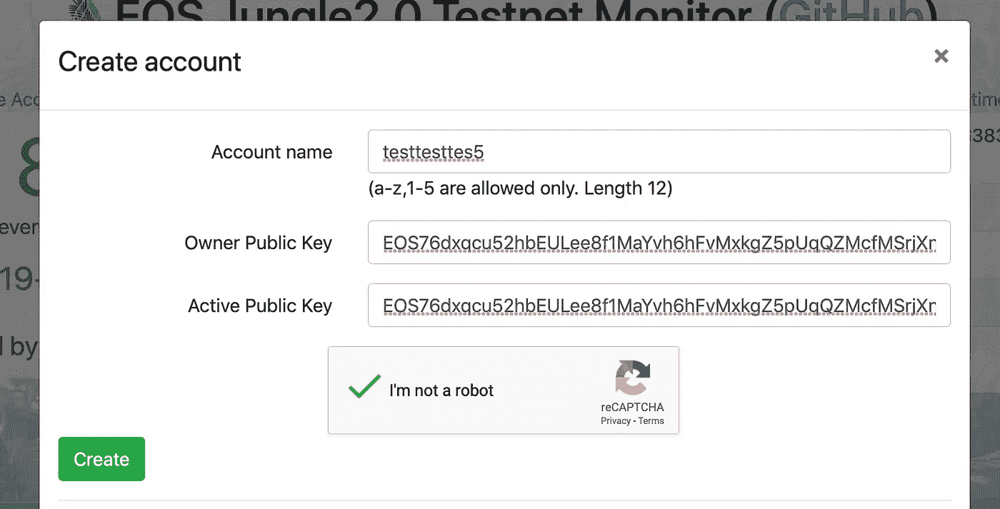
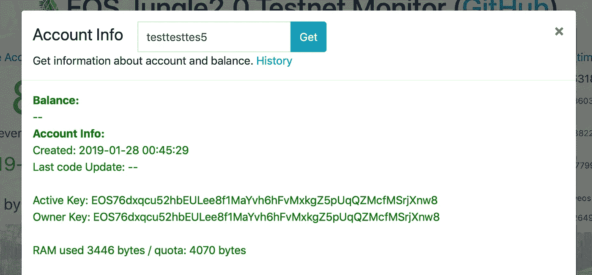
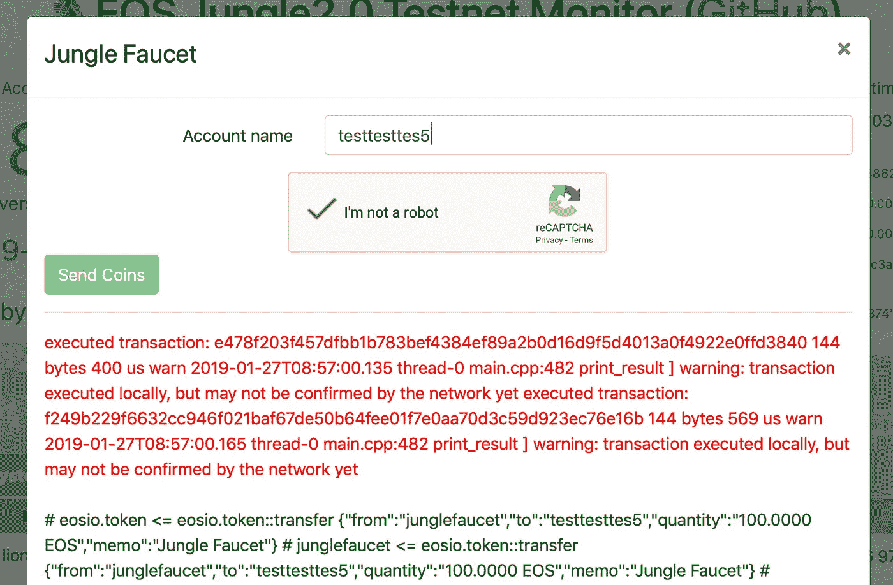
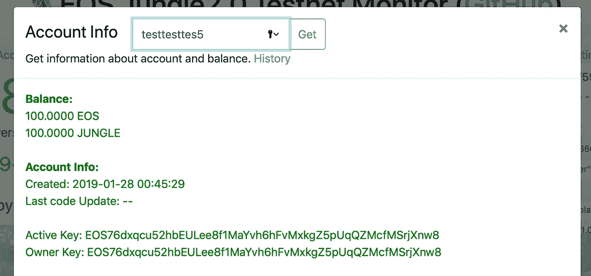

# EOS 入门——在 mainnet 和 testnet 上与您的第一个 EOS 帐户互动

> 原文：<https://medium.com/hackernoon/getting-started-with-eos-interact-with-your-first-eos-account-on-mainnet-and-testnet-2eb5b40aa00d>

# 概述和激励

自从 2017 年我出版了《 [***区块链/以太坊***](/taipei-ethereum-meetup/a-complete-guide-on-building-a-smart-contract-on-a-private-net-in-ethereum-726851c7c044) 入门教程》系列以来，它在各种各样的方面都让我受益匪浅。此外，由于我收到了越来越多的客户对我自己的区块链咨询公司[***turing chain***](https://turingchain.tech)的 [**EOS**](https://eos.io) 项目的请求，因此我决定再次开始为 EOS 初学者编写教程。

我用的是 mac。如果您遇到任何问题，请在评论中告诉我，以便我可以相应地更新:)

希望你会喜欢，黑客快乐！

# 开始编码！

在我们开始探索 EOS 之前，我们需要一些东西。你可以先跳过区块链的主要部分，因为它不是完全免费的。

**对于主 EOS 区块链(可选):**

1.  **安装您选择的 EOS 钱包手机应用:**我正在使用 [**Meet.one**](https://meet.one/download/en)
2.  **创建一个 EOS 帐户:**按照应用程序中的说明，您可能需要支付少量注册费，因为 EOS 中的存储不是免费的。您的帐户需要在 EOS 上创建和存储存储空间。
3.  **安装一个 EOS 钱包 Chrome 扩展名为** [**散点**](https://chrome.google.com/webstore/detail/scatter/ammjpmhgckkpcamddpolhchgomcojkle?hl=en) **:** 你可以看到*散点*为以太坊中的[](https://metamask.io)*。*

***对于 EOS 的测试网络:***

1.  ***打开你的终端，安装 EOS 命令行工具***

*以下命令适用于 Mac。如果使用其他操作系统，请参见[官方文件](https://developers.eos.io/eosio-home/docs/setting-up-your-environment)进行安装。*

```
*brew tap eosio/eosio
brew install eosio*
```

*如果您没有用于 MacOS 的软件包管理器 [brew](https://brew.sh/) ，请先输入以下命令:*

```
*/usr/bin/ruby -e "$(curl -fsSL [https://raw.githubusercontent.com/Homebrew/install/master/install](https://raw.githubusercontent.com/Homebrew/install/master/install))"*
```

***2。生成一个公钥来管理您将要创建的 EOS 帐户***

```
*cleos create key --to-console*
```

*名字 ***Cleos*** 代表 CLI(命令行界面)+EOS。更详细的解释见[公文](https://developers.eos.io/eosio-home/docs/how-it-all-fits-together)。*

***3。** **创建一个 EOS 账户***

*到目前为止维护得最好的测试网[**Jungle Testnet**](https://monitor.jungletestnet.io/#account)，通过输入您的 12 个字符的帐户名并复制粘贴您刚刚生成的公钥来创建一个新的 EOS 帐户。请记住，您输入的名称必须唯一。*

*此外，您现在可以保持您的所有者公钥和活动公钥不变。简而言之，所有者公钥具有最高权限，活动公钥可以执行除了更改所有者之外的大多数事务。*

*如果处理时间过长，请刷新整个网站并重试；)*

**

*Creating Account on Jungle Testnet*

*如果您看到类似这样的内容，您的:D 帐户已经创建成功*

**

*Account Successfully Created on Jungle Testnet*

***4。在此** **输入您的 12 位帐户名**，查看您的帐户信息[](https://monitor.jungletestnet.io/#accountInfo)*

***从这里，您可以看到您的帐户中没有任何余额，您的帐户创建时间的一些详细信息，以及您刚刚粘贴的公钥。***

******

***View Account Info on Jungle Testnet***

*****5。通过** [**龙头**](https://monitor.jungletestnet.io/#faucet) 获得免费 EOS 令牌***

***输入您的帐户名称，然后按“发送硬币”来接收代币。如果您看到以下屏幕，请继续下一步。***

******

***Get Free EOS Tokens Through Faucet***

***6。点击 查看您的账户信息 [**，确认您的账户余额**](https://monitor.jungletestnet.io/#accountInfo)***

***现在恭喜你成功获得 100 个 EOS 和 100 个丛林代币！:)***

******

***View Account Info on Jungle Testnet***

# ***有用的工具和网站***

***与以太坊类似，EOS 拥有自己的测试网络和区块链探索者。以下是我最常用的网站列表。***

1.  ***[**丛林测试网区块链探索者**](https://monitor.jungletestnet.io/#home)***

***丛林测试网是目前使用最广泛的测试网。它有一个 [**龙头**](https://monitor.jungletestnet.io/#faucet) ，在这里你可以获得免费的 EOS 令牌来开始部署你的智能合约，只需输入你的帐户名称，就像你在上面部分所做的那样。***

*****2。**[**EOS 官方开发者指南**](https://developers.eos.io/eosio-home/docs/introduction)***

***EOS 团队实际上在其官方网站上创建了一个全面且无错误的指南。我推荐它，因为它可以带您了解一些重要的主题，比如在 EOS 上部署和发布令牌，创建您的第一个智能合同，以及与它进行交互。官网也在用最新的 EOS 版本。与其他极有可能使用过时版本的在线教程相比，这是开始学习 EOS 的最佳地方。***

***[**3。EOS 官方 Github**](https://github.com/EOSIO/eos)***

***说实话，作为一个以太坊开发者，我很少去查看以太坊的官方 Github 资源库。然而，由于用于 EOS 库的文档太少，我不得不检查 Github 上的源代码，以便大多数时候正确地使用这些库。EOS 的大部分源代码组织得很好，可读性很高。此外，您还可以在此找到许多智能合同示例[。](https://github.com/EOSIO/eos/tree/master/contracts)***

# ***包裹***

***现在您已经创建了您的第一个 EOS 帐户，知道如何从水龙头获得一些免费的 EOS 令牌，并查询您的帐户信息。***

***非常感谢您的阅读，如果您能与感兴趣的人分享，我将不胜感激:)欢迎任何建议！***