# Magento PWA Studio with POC 入门

> 原文：<https://medium.com/hackernoon/getting-started-with-magento-pwa-studio-with-poc-c54c33f8d038>

2018 年 11 月 28 日，Magento 推出了最受期待的 [Magento 2.3](https://www.vtnetzwelt.com/ecommerce-blog/magento-development-blog/magento-2-3-everything-you-need-to-know/) 版本。

Magento 2.3 引入了大量的新特性和许多较小的优化。

但最令人期待的功能是 Magento PWA 工作室。它是一套工具，使开发人员能够开发渐进式 web 应用程序。

Magento PWA Studio 也使用 GraphQL，这是 Magento 2.3 中引入的新特性之一

# 什么是渐进式 Web 应用程序(PWA)？

渐进式 web 应用程序(PWA)是 Web 应用程序开发的未来。带有[安卓](https://www.vtnetzwelt.com/services/mobile-app-development/android-application-development/)即时应用的 PWA 是继响应式网络[设计](https://www.vtnetzwelt.com/services/ui-ux-design-services/)之后网络行业的下一个进步。

渐进式 Web 应用程序使用渐进式增强，提供类似于原生移动应用程序的功能。

渐进式网络应用程序和 Android 即时应用程序结合在一起，让您创建具有材料设计和动画的美丽应用程序，而无需安装在任何设备上。

在移动设备上浏览网站时，您是否遇到过弹出窗口显示“添加到主屏幕”的情况？当你点击按钮时，应用程序会在后台自动安装。现在，该应用程序显示在您的应用程序抽屉中，并提供原生移动应用程序的体验。

该应用程序是从 web 应用程序下载的，没有看到 Play Store 或 App Store 的外观。是不是很棒！！！

这些 PWA 应用程序提供对内容的离线访问，而不需要互联网连接。

渐进式 web 应用程序(PWA)是一种使用现代 web 功能向用户提供类似应用程序的体验的 Web 应用程序。这是-

*   **渐进式**——因为它自己会延迟加载。
*   **Web**——因为它是用 Web 语言写的——HTML、CSS 和 JavaScript。
*   **一个应用**——因为它在移动设备上安装并运行代码。

# PWA 的特点

PWA 拥有众多不同于传统 web 和本地应用的特性——

*   **全面响应&跨浏览器兼容性**

PWA 是使用渐进增强原则构建的，渐进增强原则是一种网页设计策略，为每个人提供基本功能和内容，而不考虑浏览器。因此，PWA 可以与所有可用的浏览器一起工作，并且完全响应，为平板电脑或移动用户提供相同的体验。

*   **快速&安全**

PWA 使用许多优化技术来提供极快的应用体验，并且由于应用是通过 HTTPS 提供的，因此完全安全，因此没有未经授权的用户可以访问应用。

*   **离线工作**

PWA 网站缓存内容，以确保当用户离线时可以提供一些内容。

*   **推送通知**

PWA 支持推送通知，这有助于保持最终用户的参与度，并激发他们更频繁地打开和使用应用程序。

*   **安装简便**

PWA 是应用程序，但不通过应用程序商店分发。这些应用程序可以通过 URL 共享，只需访问一个网站并将其添加到主屏幕即可轻松安装。

# 使用 PWA 的优势

# 对于网站所有者

*   **经济高效**

渐进式 web 应用程序使用 Web 堆栈进行开发。它减少了时间和工作量，从而提高了成本效率。此外，相同的应用程序可以在 iOS 和 Android 设备上运行，因此您不需要为多个平台构建应用程序。

*   **省时**

渐进式网络应用程序有助于节省您的宝贵时间，因为您不需要为 Android 和 iOS 安装单独的应用程序。一个应用程序可以在两个平台上使用，从而加快上市时间。

# 对于最终用户

*   **低数据使用率**

在许多发展中国家，移动数据仍然是一种昂贵的商品。PWA 解决了数据使用问题，因为与原生移动应用相比，它仅使用一小部分数据。

*   **轻松更新**

PWA 为用户提供最新的体验，无需任何安装。它还解决了软件碎片的问题，因为您不需要维护应用程序的旧版本。

*   **快速加载**

与响应式网站或 m.dot 网上商店相比，渐进式网络应用程序的加载时间要快 2-3 倍。它可以在移动设备上实现流畅的性能。

# Magento PWA 工作室是什么？

Magento 正在成为一个进步的网络应用平台。这意味着他们制作了一套工具，用于将在线商店构建为渐进式网络应用程序。

这些工具帮助开发人员学习 PWA 技术，构建闪电般快速的 PWA 前端，并创建 PWA 组件和扩展以供重用或在 Magento 市场上销售。

总之，他们暂时将这套工具称为 Magento PWA 工作室。换句话说，我们可以说

Magento PWA Studio 用于将在线 Magento 商店开发为渐进式 Web 应用程序。这是一套用于开发 React-powered Magento 2 模板的工具。

Magento PWA Studio 提供了以下工具

*   [PWA-build pack](https://magento-research.github.io/pwa-studio/pwa-buildpack/)—PWA build pack 是 Magento Progressive Web 应用程序的构建和开发工具和库。使用 PWA Buildpack 项目为 PWA 开发设置和配置本地环境。
*   [Peregrine](https://magento-research.github.io/pwa-studio/peregrine/)—Peregrine 项目是 Magento PWA 项目的 UI 组件集合。使用、扩展或重新组合这些组件来创建一个独特的 Magento PWA 店面。
*   [Venia store front/PWA store front](https://magento-research.github.io/pwa-studio/venia-pwa-concept/)——正如我们所知，Magento 2 到来时，它会以“Luma”的名称带来一个新的默认主题。Luma 是一个非常干净、悦目、优雅的主题，采用了更好的可用性实践。亮度只是 Magento 的一个证明，主题是如何建立在空白主题的基础上的。同样，Magento PWA Studio 引入 Venia storefront 作为使用 PWA Studio 构建的概念验证 PWA。在当前状态下，店面包含产品详细信息和类别页面的示例。Venia 是一个 PWA 店面，运行在现有 Magento 2 后端之上。

更多信息请参考—[https://magento-research . github . io/pwa-studio/venia-pwa-concept/](https://magento-research.github.io/pwa-studio/venia-pwa-concept/)

# PWA 工作室库

*   **网络包**

它是 JavaScript 应用程序的模块捆绑器和优化器。Webpack 的主要功能是从我们的项目模块中的依赖项创建一个或多个包。

*   **反应**

它是一个用于构建用户界面的 JavaScript 库。

*   **Redux**

[React](https://www.vtnetzwelt.com/services/website-development-design-company/react-js-development-company/) 是一个 JavaScript 库，用于管理 web 应用程序中的状态。

*   **图表 QL**

GraphQL 是一种用于 API 的查询语言。构建和查询 API 是现代技术之一。简而言之，GraphQL 是一种解决如何从服务器请求数据并帮助将数据加载到客户机的语法。

**GraphQL 优惠—**

*   它给客户一个机会来准确地确定它需要什么信息。
*   从各种来源收集信息变得更加容易。
*   它使用类型系统来描述数据。

Magento 2.3 除了 REST API 和 SOAP API 之外，还执行 GraphQL 作为可选的 API 端点。

GraphQL 通过允许请求您所需要的精确信息，为 PWAs 提供了数据检索的可能性。这意味着您可以用更少的 API 请求更高效地获得更少量的数据。

它允许 Magento PWA 即使在慢速移动网络连接上也很快。

# 使用 Magento PWA Studio 建立 PWA 网站

**注意:**安装 Venia 主题前请确保 [Node.js](https://www.vtnetzwelt.com/services/website-development-design-company/nodejs-development-company/) 版本大于等于 8.0.0，NPM 版本大于等于 5.0.0。推荐两者的最新 LTS 版本。

# 步骤 1 —全新安装 Magento 2.3

我希望你已经知道 Magento 2 的安装。但是，如果你是新手，请参考以下 Magento 2 安装链接

[https://dev docs . magento . com/guides/v 2.3/install-gde/install-quick-ref . html](https://devdocs.magento.com/guides/v2.3/install-gde/install-quick-ref.html)

你也可以从[这里](https://magento.com/tech-resources/download)下载 Magento 2.3 并解压到你的本地主机目录。之后，只需点击浏览器上的 Magento 目录，完成 Magento 设置。

# 步骤 2 — PWA 基本主题安装

从[这里](https://github.com/magento-research/theme-frontend-pwa)创建基础 PWA 主题，这将是 PWA Venia 主题的父主题

*   下载完主题后，复制主题-前端-pwa-master 中的所有文件和文件夹并粘贴到**app/design/frontend/Magento/pwa/**
*   现在从 Magento 根目录执行升级模式的命令—**PHP bin/Magento setup:upgrade**

现在导航到 **Magento 管理→内容→设计**，在这里你可以看到 PWA 主题(如下所示)

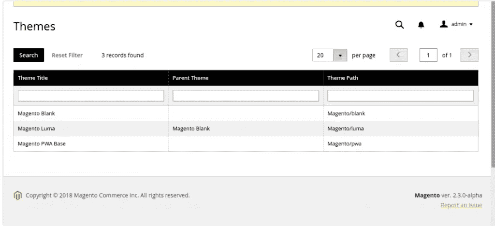

# 步骤 3 — Venia 主题安装

*   从 Magento 根目录下的[https://github.com/magento-research/pwa-studio/tree/master](https://github.com/magento-research/pwa-studio/tree/master)克隆库或下载 PWA studio 项目。

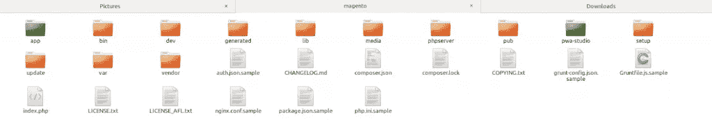

*   **符号链接创建** —现在，通过执行以下命令，在 Magento 2 安装中创建 PWA 模块和主题的符号链接

**ln-s/var/www/html/Magento/pwa-studio/packages/pwa-module app/code/Magento/**

**ln-s/var/www/html/Magento/pwa-studio/packages/venia-concept app/design/frontend/Magento/venia**

*   新创建的符号链接看起来像

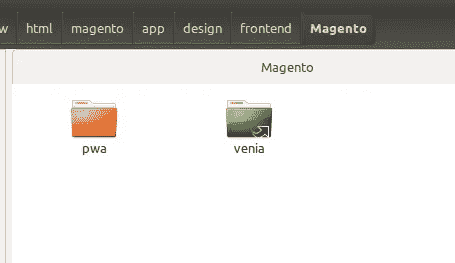

*   现在从 Magento 根目录执行升级模式的命令— php bin/magento setup:upgrade
*   导航至 **Magento 管理→内容→设计**

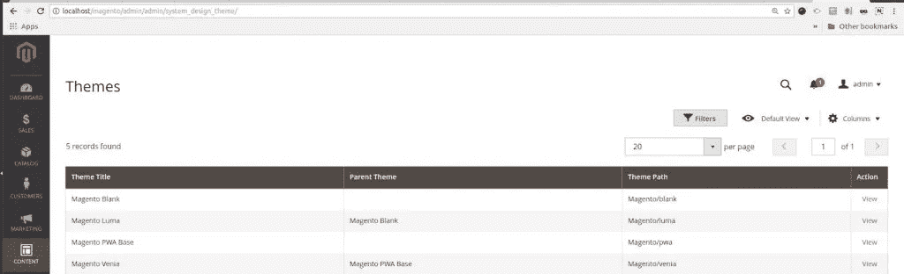

*   应用主题并转到前端。

# 步骤 4-找不到 Client.js

现在您会看到 client.js 没有加载

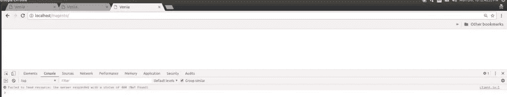

*   导航到 PWA Studio 项目的 Venia-concept 目录，将. env.dist 复制到一个新的。env 文件，并用 Magento 开发存储 cp .env.dist 的 URL 更新这些变量。包封/包围（动词 envelop 的简写）
*   现在转到 Magento 根目录，执行命令，然后转到 PWA Studio 目录

*   在安装 npm 时，您可能会遇到一些问题，因为有些软件包没有安装，因此无法使用–

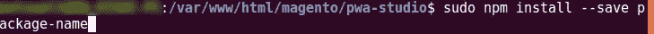

*   当您的命令正确执行后，转到 Magento _ root _ dir/pwa-studio/packages/venia-concept 并执行以下命令:

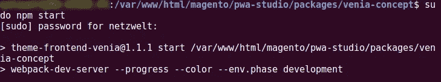

*   您可以看到以下内容

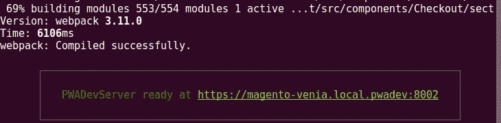

*   现在点击那个网址，你就可以得到你的 Venia 主题了

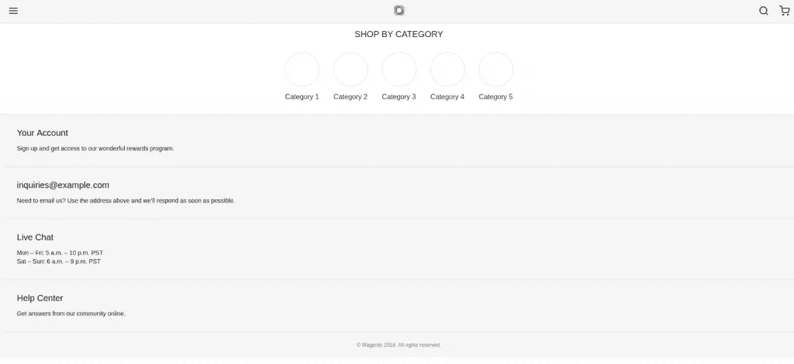

# PWA Magento 店面的快速浏览

*   **主页**

*   **分类页面/列表页面**

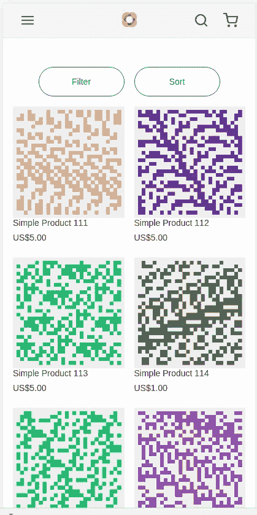

*   **产品详情页面**

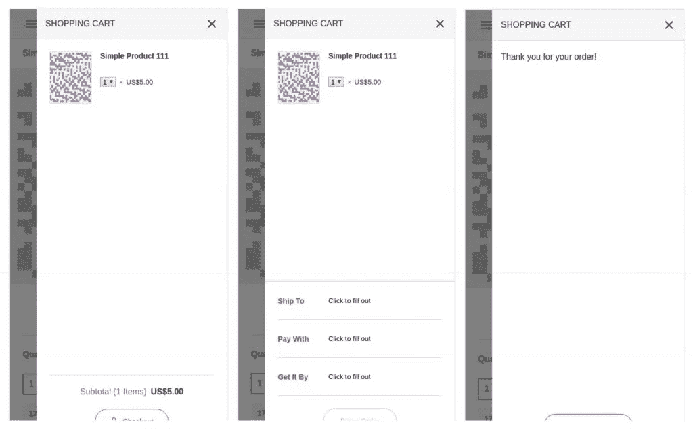

# 结论

Magento PWA Studio 给了开发者一个非常有用的工具包，他们可以用它来创建漂亮的 PWA 主题。

如果你正在寻找一个进步的解决方案，提供更好的工作流程，那么 Magento PWA Studio 是最好的解决方案。

你还有其他问题吗？[向我们的行业专家请求回电](https://www.vtnetzwelt.com/contact-us/)。

如需现场演示，请参考我们的[概念验证(POC)。](http://magedemo.vtnetzwelt.com:9090/)

博客最初于 2018 年 12 月 26 日发表于 [VT Netzwelt](https://www.vtnetzwelt.com) 。

原文链接—[Magento PWA Studio 入门](https://www.vtnetzwelt.com/ecommerce-blog/magento-development-blog/getting-started-magento-pwa-studio/)