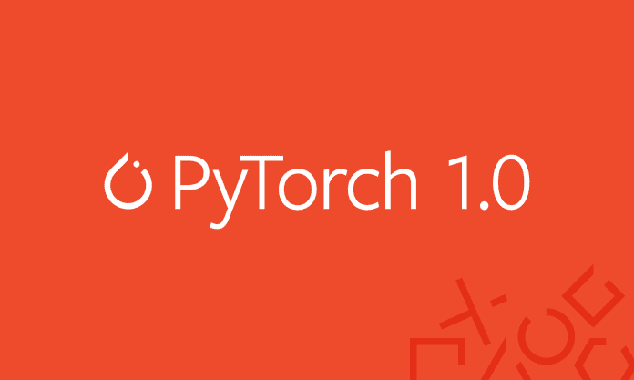
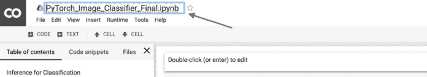
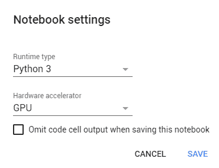
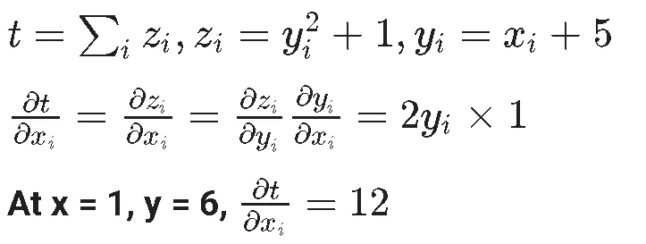

# 使用免费 GPU 在 Google Collab 中开始使用 Pytorch

> 原文：<https://medium.com/hackernoon/getting-started-with-pytorch-in-google-collab-with-free-gpu-61a5c70b86a>



Pytorch 是深度学习框架；基于 [Torch](https://en.wikipedia.org/wiki/Torch_%28machine_learning%29) 的一组函数和库，允许你进行为 Python 语言设计的高阶编程。Torch 是一个基于编程语言 [Lua](https://www.lua.org/) 的开源机器学习包。它主要由脸书的人工智能研究小组开发，优步的 *Pyro* 概率编程语言软件就是基于它开发的。

PyTorch 更“pythonic 化”，有更一致的 API。它还有本机的 ONNX 模型导出，可以用来加速推理。PyTorch 与 [numpy](https://github.com/wkentaro/pytorch-for-numpy-users) 共享许多命令，这有助于轻松学习框架。

PyTorch 的核心提供了两个主要特性:

*   n 维张量，类似于 Numpy，但可以在 GPU 上运行
*   用于建立和训练神经网络的自动微分

如果您使用的是 anaconda 发行版，可以通过在 anaconda 提示符下运行下面的命令来安装 Pytorch。

```
conda install pytorch-cpu torchvision-cpu -c pytorch
```

**文章的其余部分结构如下:**

*   **到底什么是 Colab？**
*   **在 Colab 中设置 GPU**
*   **Pytorch 张量**
*   **简单的张量运算**
*   Pytorch 到 Numpy 桥
*   **CUDA 支持**
*   **自动微分**
*   **结论**

如果你想跳过理论部分，直接进入代码，

[](https://github.com/Niranjankumar-c/DeepLearning-PadhAI/tree/master/DeepLearning_Materials/2_GettingStarted_With_Pytorch) [## niranjankumar-c/deep learning-PadhAI

### 来自 pad hai-Niranjankumar-c/deep learning-pad hai 的深度学习课程相关的所有代码文件

github.com](https://github.com/Niranjankumar-c/DeepLearning-PadhAI/tree/master/DeepLearning_Materials/2_GettingStarted_With_Pytorch) 

# Colab —合作实验室

[Google Colab](https://colab.research.google.com/notebooks/welcome.ipynb) 是机器学习教育和研究的研究工具。这是一个 Jupyter 笔记本电脑环境，不需要设置即可使用。Colab 提供由谷歌托管的免费 GPU 云服务，以鼓励机器学习领域的合作，而不用担心硬件要求。Colab 于 2017 年 10 月由谷歌向公众发布。


# Colab 入门

*   使用您的 Google 帐户登录
*   通过**文件- >新建 Python 3 笔记本或新建 Python 2 笔记本**创建一个新笔记本

你也可以通过 Google Drive 在 Colab 中创建一个笔记本

*   转到[谷歌驱动](http://drive.google.com/)
*   在驱动器中创建一个任意名称的文件夹来保存项目
*   通过**右键单击>更多>协作室**创建新笔记本


要重命名笔记本，只需点击笔记本顶部的文件名。



# 在 Colab 中设置 GPU

在 Colab 中，您将获得 12 小时的执行时间，但是如果您的空闲时间超过 60 分钟，会话将被断开。这意味着每 12 小时，我们分配的虚拟机上的磁盘、RAM、CPU 缓存和数据将被擦除。

要启用 GPU 硬件加速器，只需进入**运行时- >更改运行时类型- >硬件加速器- > GPU**



# Pytorch —张量

基于 Numpy 的运算没有优化到利用 GPU 来加速其数值计算。对于现代深度神经网络，GPU 通常会提供[50 倍或更大的加速比](https://github.com/jcjohnson/cnn-benchmarks)。所以，不幸的是，numpy 对于现代深度学习来说是不够的。Pytorch 在这里引入了张量的概念。Pytorch 张量在概念上等同于 n 维 numpy 数组。与 numpy 不同，PyTorch 张量可以利用 GPU 来加速它们的数值计算

让我们看看如何创建 Pytorch 张量。首先，我们将导入所需的库。记住 torch，numpy 和 matplotlib 是预装在 Colab 的虚拟机里的。

```
import torch import numpy 
import matplotlib.pyplot as plt
```

PyTorch 中的默认张量类型是定义为`**torch.FloatTensor**`的浮点张量。我们可以通过使用`torch`包中的内置函数来创建张量。

```
## creating a tensor of 3 rows and 2 columns consisting of ones 
>> x = torch.ones(3,2) 
>> print(x) tensor([[1., 1.], [1., 1.], [1., 1.]]) ## creating a tensor of 3 rows and 2 columns consisting of zeros 
>> x = torch.zeros(3,2) 
>> print(x) tensor([[0., 0.], [0., 0.], [0., 0.]])
```

通过随机初始化创建张量

```
To increase the reproducibility, we often set the random seed to a specific value first. 
>> torch.manual_seed(2) #generating tensor randomly 
>> x = torch.rand(3, 2) 
>> print(x) #generating tensor randomly from normal distribution 
>> x = torch.randn(3,3) 
>> print(x)
```

# 简单张量运算

# 张量的切片

你可以像切`ndarrays`一样切 PyTorch 张量

```
#create a tensor 
>> x = torch.tensor([[1, 2], [3, 4], [5, 6]]) 
>> print(x[:, 1]) # Every row, only the last column >> print(x[0, :]) # Every column in first row >> y = x[1, 1] # take the element in first row and first column and create a another tensor >> print(y)
```

# 重塑张量

## 将张量整形为不同的形状

```
>> x = torch.tensor([[1, 2], [3, 4], [5, 6]]) #(3 rows and 2 columns) 
>> y = x.view(2, 3) #reshaping to 2 rows and 3 columns
```

## 使用`-1`重塑张量

`-1`表示形状将从以前的维度推断出来。在下面的代码片段中`x.view(6,-1)`将产生一个形状为`6x1`的张量，因为我们已经将行的大小固定为 6，Pytorch 现在将推断列的最佳可能维度，这样它将能够容纳张量中存在的所有值。

```
>> x = torch.tensor([[1, 2], [3, 4], [5, 6]]) #(3 rows and 2 columns) 
>> y = x.view(6,-1) #y shape will be 6x1
```

# 数学运算

```
#Create two tensors 
>> x = torch.ones([3, 2]) 
>> y = torch.ones([3, 2]) #adding two tensors 
>> z = x + y #method 1 
>> z = torch.add(x,y) #method 2 
#subtracting two tensors 
>> z = x - y #method 1 
>> torch.sub(x,y) #method 2
```

## 就地操作

在 Pytorch 中，在张量上就地操作的所有操作都有一个`_`后缀。比如`add`是不在位版本，`add_`是在位版本。

```
>> y.add_(x) #tensor y added with x and result will be stored in y
```

# Pytorch 到 Numpy 桥

将 Pytorch 张量转换成 numpy ndarray 有时非常有用。通过在张量上使用`.numpy()`，我们可以很容易地将张量转换为 n 数组。

```
>> x = torch.linspace(0 , 1, steps = 5) #creating a tensor using linspace 
>> x_np = x.numpy() #convert tensor to numpy 
>> print(type(x), type(x_np)) 
<class 'torch.Tensor'> <class 'numpy.ndarray'>
```

要将 numpy ndarray 转换为 pytorch 张量，我们可以使用`.from_numpy()`将 ndarray 转换为张量。

```
>> a = np.random.randn(5) #generate a random numpy array 
>> a_pt = torch.from_numpy(a) #convert numpy array to a tensor 
>> print(type(a), type(a_pt)) 
<class 'numpy.ndarray'> <class 'torch.Tensor'>
```

在转换过程中，Pytorch tensor 和 numpy ndarray 将共享它们的底层内存位置，更改其中一个将会更改另一个。

# CUDA 支持

要检查机器上连接了多少支持 CUDA 的 GPU，您可以使用下面的代码片段。如果您在 Colab 中执行代码，您将得到 1，这意味着 Colab 虚拟机连接到一个 GPU。用于设置和运行 CUDA 操作。它会跟踪当前选择的 GPU。

```
>> print(torch.cuda.device_count()) 
1
```

如果您想获取连接到机器的 GPU 卡的名称:

```
>> print(torch.cuda.get_device_name(0)) 
Tesla T4
```

需要注意的重要一点是，我们可以将这个 CUDA 支持的 GPU 卡引用到一个变量，并使用这个变量进行任何 Pytorch 操作。您分配的所有 CUDA 张量都将在该设备上创建。选择的 GPU 设备可以用`[torch.cuda.device](https://pytorch.org/docs/stable/cuda.html#torch.cuda.device)`上下文管理器改变。

```
#Assign cuda GPU located at location '0' to a variable 
>> cuda0 = torch.device('cuda:0') #Performing the addition on GPU 
>> a = torch.ones(3, 2, device=cuda0) #creating a tensor 'a' on GPU >> b = torch.ones(3, 2, device=cuda0) #creating a tensor 'b' on GPU >> c = a + b 
>> print(c) 
tensor([[2., 2.], [2., 2.], [2., 2.]], device='cuda:0')
```

从上面的代码片段中可以看出，张量是在 GPU 上创建的，对这些张量的任何操作都将在 GPU 上完成。如果你想把结果转移到 CPU，你只需要做`.cpu()`

```
#moving the result to cpu 
>> c = c.cpu() 
>> print(c) 
tensor([[2., 2.], [2., 2.], [2., 2.]])
```

# 自动微分

在本节中，我们将讨论 Pytorch 中称为自动微分或`autograd`的重要包。`autograd`包使我们能够对张量上的所有操作执行自动微分或自动梯度计算。它是一个由运行定义的框架，这意味着您的反向传播是由您的代码如何运行来定义的。

让我们通过一个简单的例子来看看如何进行自动微分。首先，我们创建一个参数设置为`True`的张量，因为我们想要跟踪在这个张量上执行的所有操作。

```
#create a tensor with requires_grad = True 
>> x = torch.ones([3,2], requires_grad = True) 
>> print(x) 
tensor([[1., 1.], [1., 1.], [1., 1.]], requires_grad=True)
```

执行简单的张量加法运算。

```
>> y = x + 5 #tensor addition 
>> print(y) #check the result 
tensor([[6., 6.], [6., 6.], [6., 6.]], grad_fn=<AddBackward0>)
```

因为`y`是在`x`上操作的结果，所以它有一个`grad_fn`。对`y`执行更多操作，创建一个新张量`z`。

```
>> z = y*y + 1 
>> print(z) 
tensor([[37., 37.], [37., 37.], [37., 37.]], grad_fn=<AddBackward0>) >> t = torch.sum(z) #adding all the values in z 
>> print(t) 
tensor(222., grad_fn=<SumBackward0>)
```

## 反向传播

要执行反向传播，只需调用`t.backward()`

```
>> t.backward() 
#peform backpropagation but pytorch will not print any output.
```

打印渐变`d(t)/dx`。

```
>> print(x.grad) 
tensor([[12., 12.], [12., 12.], [12., 12.]])
```

`x.grad`会给出`t`相对于`x`的偏导数。如果你能理解我们如何得到一个所有值都等于 12 的张量，那么你就理解了自动微分。如果不是，不用担心，继续，当我们执行`t.backward()`时，我们正在计算`t`相对于`x`的偏导数。记住`t`是`z`的函数，而 T7 又是`x`的函数。

> **d(t)/dx = 2y * 1，x = 1，y = 6，其中 y = x + 5**



需要注意的重要一点是，导数的值是在我们初始化张量`x`的时候计算的。因为我们将`x`初始化为等于 1 的值，所以我们得到一个所有值都等于 12 的输出张量。

本文中讨论的全部代码都存在于 Kaggle 内核中。随意叉或者下载。**最棒的是，你可以直接在 Kaggle 内核中运行代码，无需担心安装包**。

[](https://www.kaggle.com/niranjankumarc/gettingstartedwithpytorch-gpu) [## gettingstartedwithpythorch _ GPU

### 使用来自非数据源的数据

www.kaggle.com](https://www.kaggle.com/niranjankumarc/gettingstartedwithpytorch-gpu) 

如果 Colab 是你的 jam，点击[这里](https://colab.research.google.com/github/Niranjankumar-c/DeepLearning-PadhAI/blob/master/DeepLearning_Materials/2_GettingStarted_With_Pytorch/PytorchIntro.ipynb)直接执行代码，弄脏你的手。

[](https://github.com/Niranjankumar-c/DeepLearning-PadhAI/tree/master/DeepLearning_Materials/2_GettingStarted_With_Pytorch) [## niranjankumar-c/deep learning-PadhAI

### 来自 pad hai-Niranjankumar-c/deep learning-pad hai 的深度学习课程相关的所有代码文件

github.com](https://github.com/Niranjankumar-c/DeepLearning-PadhAI/tree/master/DeepLearning_Materials/2_GettingStarted_With_Pytorch) 

# 结论

在这篇文章中，我们简要地看了 Pytorch & Google Colab，我们也看到了如何在 Colab 中启用 GPU 硬件加速器。然后，我们看到了如何在 Pytorch 中创建张量，并利用 CUDA 支持的 GPU 对这些张量执行一些基本操作。之后，我们讨论了 Pytorch `autograd`包，它通过一个简单的例子给了我们在张量上执行自动梯度计算的能力。如果你在执行上述代码时有任何问题或疑问，欢迎在下面的评论区提问，或者在引用这篇文章的 [LinkedIn](https://linkedin.com/in/niranjankumar-c/) 给我发消息。

# 了解更多信息

如果你想学习更多的数据科学，机器学习。查看来自 [Starttechacademy](https://courses.starttechacademy.com/full-site-access/?coupon=NKSTACAD) 的 Abhishek 和 Pukhraj 的[机器学习基础知识](https://courses.starttechacademy.com/full-site-access/?coupon=NKSTACAD)和[高级机器学习](https://courses.starttechacademy.com/full-site-access/?coupon=NKSTACAD)。这些课程的一个优点是它们同时用 Python 和 R 语言授课，所以这是你的选择。

*推荐阅读*

[](/datadriveninvestor/deep-learning-best-practices-activation-functions-weight-initialization-methods-part-1-c235ff976ed) [## 深度学习最佳实践:激活函数和权重初始化方法—第 1 部分

### 最佳激活函数和权重初始化方法可提高精确度

medium.com](/datadriveninvestor/deep-learning-best-practices-activation-functions-weight-initialization-methods-part-1-c235ff976ed) [](https://hackernoon.com/demystifying-different-variants-of-gradient-descent-optimization-algorithm-19ae9ba2e9bc) [## 揭秘梯度下降优化算法的不同变体

### 了解对梯度下降的不同改进，并使用 2D 等高线图比较它们的更新规则。

hackernoon.com](https://hackernoon.com/demystifying-different-variants-of-gradient-descent-optimization-algorithm-19ae9ba2e9bc) 

在我的下一篇文章中，我们将讨论如何使用 Pytorch (nn)实现前馈神经网络。功能性，nn。参数)。所以确保你在媒体上跟踪我，以便在它下降时得到通知。

直到那时和平:)

NK。

**作者简介**

[Niranjan Kumar](https://medium.com/u/3e4fb2985698?source=post_page-----61a5c70b86a--------------------------------) 是汇丰银行分析部门的零售风险分析师实习生。他对深度学习和人工智能充满热情。他是[人工智能](/tag/artificial-intelligence/top-writers)中[媒体](https://medium.com/u/504c7870fdb6?source=post_page-----61a5c70b86a--------------------------------)的顶尖作家之一。你可以在这里找到 Niranjan 的所有博客。你可以在 LinkedIn[LinkedIn](https://www.linkedin.com/in/niranjankumar-c/)、 [Twitter](https://twitter.com/Nkumar_283) 和 [GitHub](https://github.com/Niranjankumar-c) 上与 Niranjan 联系，了解他的最新博客文章。

**免责声明** —这篇文章中可能有一些相关资源的附属链接。你可以以尽可能低的价格购买捆绑包。如果你购买这门课程，我会收到一小笔佣金。

*原载于 2019 年 6 月 9 日*[*【https://www.marktechpost.com】*](https://www.marktechpost.com/2019/06/09/getting-started-with-pytorch-in-google-collab-with-free-gpu/)*。*