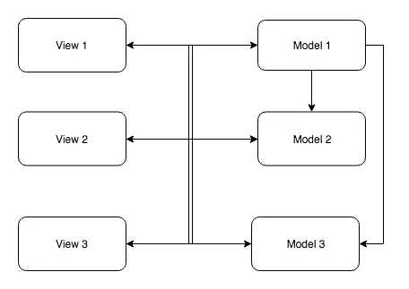
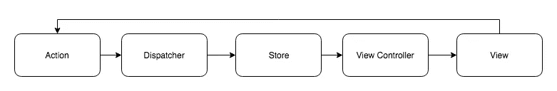
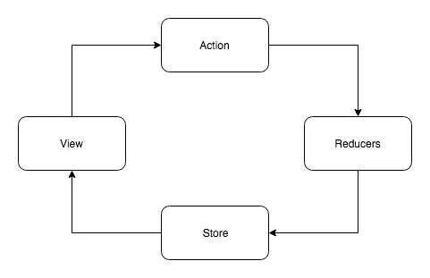

# Redux 入门

> 原文：<https://medium.com/hackernoon/getting-started-with-redux-aa37180dbe93>

Redux

我参与过几个有 Redux 的项目，我发现在刚入门的人中间有很多困惑。我的观点是，如果我们理解“redux 试图解决什么问题”和“redux 核心组件的职责”，生活会更容易。这篇文章是我试图解释这些事情的尝试。

# 问题是…

如今的 SPAs(单页应用程序)非常复杂，它们在前端维护大量的状态，例如:api 响应、缓存数据、UI 小部件的状态，比如 spinners 和进度条等..

通常我们有保存数据的模型和呈现数据的视图。一个视图可以更新一个或多个模型，一个模型可以更新另一个模型，基于这些模型的变化，视图得到更新。由于所有这些交互，很难弄清楚实际发生了什么以及数据是如何流动的。

View Model Problem

# 解决方案:单向数据流

人们认为既然问题的出现是因为数据的交叉流动，那就让数据单向流动吧。由于数据流只是一种方式，它很容易跟踪，状态管理变得更加可预测。脸书通过流动普及了这一思想。让我们来看看 Flux 的架构

Flux Architecture

好的，那边有很多新组件。让我们来详细了解一下其中的每一项

# 行动

动作描述了系统中发生的事情。让我们举一个例子:我们有一个 todo 应用程序，用户点击了一个特定 ToDo 项的切换按钮。因此相应的动作可能看起来像这样

动作通常包含类型和有效负载。类型指定它是哪种操作，数据包含与该操作相关的有效负载。动作通常是由所谓的**动作创建者创建的，**它只是一个将你的输入格式化为动作格式(类型和数据)的函数。这提供了一些解耦，因为视图现在不需要知道动作需要什么格式。视图只是调用动作创建者。动作创建者的示例

# 商店

Store 是存储应用程序状态的地方，除此之外，store in Flux 还存储存储更改逻辑。商店只能通过动作操作，不能直接改变。也可以有一个以上的通量储备。

# 分配器

Dispatcher 就像一个路由器，它将动作发送到适当的存储。

# 视图控制器

视图控制器订阅存储，并在存储发生变化时通知视图。

是的，这就是流动的全部。

# Redux..但是为什么呢？

丹·阿布拉莫夫创造 Redux 有两个主要原因

1.  热重装
2.  时间旅行调试

是的，Redux 主要是为了更好的开发工具而创建的。

# 变化

1.  在 Flux 中，Store 具有状态和状态改变逻辑。在 Redux 中，状态改变逻辑作为 Reducers 被分离出来。这样做是因为如果你想支持“热代码重载”，并且如果“状态改变逻辑”和“状态”都存在于相同的空间，那么它们都将被更新，但是对于“热代码重载”，我们只想更新“状态改变逻辑”而不干扰“状态”。
2.  在 Flux 中，Store 是可变的，而在 Redux 中，Store 是不可变的，每次更新都会创建一个新对象。这有助于“时间旅行调试”。
3.  没有单独的配送员，配送责任由商店承担。

Redux 架构看起来像

Redux Architecture

# 还原剂

归约器决定每个动作的状态如何改变，即状态改变逻辑。可以有一个以上的减速器。每个归约器都注册了它感兴趣的状态的一部分，并在该范围内操作。

我们前面讨论过的一个动作的缩减器的例子

如您所见，上面定义的 Reducer 负责 store 对象的“todos”部分。初始状态是应用程序初始化时的状态，您可以在此设置默认值。在函数体中，我们所做的就是找到被切换的 todo 项，并更改 completed 标志，将修改后的状态作为新对象返回。请务必注意，我们不是在编辑现有的状态对象，而是在创建一个新的状态对象。

这就是所有要重复的，现在让我们看一个端到端的例子。

我们在第 46-47 行调度两个动作，然后将它们发送给 reducer，reducer 更新状态，结果视图(在我们的例子中是 console.log)被通知存储更改，视图被更新。

通常你在 React 的设置中使用 Redux，我们会使用类似 [react-redux](https://github.com/reduxjs/react-redux) 的连接包。React-redux 帮助 React 组件连接到 redux 存储。React 和 Redux 是两个独立的东西，你可以把 Redux 和 Vue、Ember 或者其他任何视图框架一起使用。