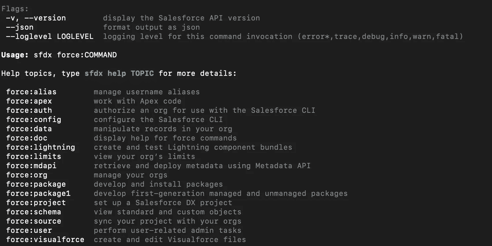

# Salesforce DX 入门

> 原文：<https://medium.com/hackernoon/getting-started-with-salesforce-dx-5e28e0d7d318>


[Credit](http://dazeworks.com/wp-content/uploads/2017/05/Salesforce-dx.jpg)

Salesforce DX 是新的开发环境，最终将取代基于 Eclipse 的 Salesforce EDI。最近，Salesforce 宣布他们将不再为 Salesforce EDI 发布任何新功能。虽然他们在 2019 年 10 月 12 日之前仍将支持它，但所有新功能都将针对 Salesforce DX 发布。

> **2019 年 10 月 12 日，我们将不再向 Force.com IDE**提供任何形式的支持或更新。

话虽如此，Salesforce DX 代表 Salesforce 开发者体验，只是跟随 Salesforce 为其平台选择的趋势。他们希望跟上最新的趋势和开发环境，而不是排外和非常孤立。以前，您必须在内置的开发人员控制台或 Salesforce EDI 之间进行选择。与其他解决方案相比，这两种方案都不理想，而且非常过时。是的，有第三方解决方案，如 Welkin Suite，利用了 Salesforce API，但我不相信这些解决方案真的 100%好于我的 JavaScript 开发环境。

Salesforce DX 利用了非常流行的开源编辑器 Visual Studio 代码，并专门为该平台发布了所有附加组件(截至目前)。因此，如果您想进行开发，需要使用 Visual Studio 代码进行 Salesforce 开发的两个附加组件。他们提供 APEX 语法支持和各种 API 集成来管理您的项目。

此外，Salesforce 希望确保您将开发工作与 Git，特别是 GitHub 集成在一起。这允许您跟踪代码中的任何更改，并将代码片段追溯到特定的时间点和开发人员。如果您熟悉 GitHub，您很可能熟悉分支和拉请求的概念，它们允许您在不影响主(主分支)代码的情况下同时开发各种功能。从那里，您可以在单独的实例上部署这些版本，并相应地测试它们。

通过允许开发人员利用临时组织，Salesforce 允许非常类似的行为。您已经熟悉了沙箱，沙箱用于开发和测试目的。Scratch Org 基本上是一个开发环境，允许开发人员轻松地推拉位于不同分支的代码。所以可以在发布测试前独立开发。此外，新发布的 Salesforce CLI 允许您管理这些临时组织并从终端登录。这使得管理您的凭据变得简单了 10 倍。一旦设置好了，您就可以在任何时间点推送和拉取代码以及登录，而无需记住您登录的具体组织。

我们真诚地相信，Salesforce DX 是 Salesforce 朝着正确方向迈出的辉煌一步，展示了 Salesforce 的智慧。

在开始使用 Salesforce DX 之前，您需要为您所在的组织启用开发中心。这在常规设置下非常友好，只需点击一个按钮就可以轻松启用。

在那里，您必须安装 Salesforce CLI。你可以通过软件包([点击这里](https://developer.salesforce.com/tools/sfdxcli))或者 npm ( [点击这里](https://developer.salesforce.com/docs/atlas.en-us.sfdx_setup.meta/sfdx_setup/sfdx_setup_install_cli.htm))来安装。对于 npm，请在终端中输入以下内容:

```
npm install sfdx-cli --global
```

现在您已经安装了 Salesforce CLI，您可以利用以下命令:



sfdx force — help shows you all available force commands

此外，您还可以在这里查找官方文档或运行:

```
sfdx force:doc:commands:list
```

在任何给定的时间，你可以很容易地添加`— help` 来获得一些关于可用选项的指导。尤其是在开始时，您会发现这特别有用，因为有太多的 CLI 命令。

从这里，您将创建一个新的文件夹来存储和管理您的所有源代码。

要开始，您必须维护您的 Salesforce 联系。我从我的生产环境开始，以获得初始状态和通过 Salesforce DX 进行实际开发所需的所有依赖关系。

```
sfdx force:auth:web:login --setalias my-hub-org --instanceurl url
```

在开始开发之前，将正确的源连接到您的 CLI 会将您带到下一步。

在设置中，创建一个新的包，并包含当前组织副本所需的所有依赖项和自定义字段。当您希望以后创建临时组织时，这是必需的，因为临时组织不包括您在系统中完成的所有定制。这也是与常规沙盒的第一个主要区别，常规沙盒通常包括您应用于 Salesforce 环境的所有自定义。

由于不包含任何定制，请确保在您的依赖项中也包含来自 App Exchange 的所有受管软件包。否则，您将会遇到错误，因为这些错误不会自动包含在内。

一旦你创建了你的包，释放它，下载全部内容并解压。这将允许您将其转换为 Salesforce DX 项目。

```
sfdx force:mdapi:retrieve -s -r ./mdapipkg -u [your_username] -p
unzip ./mdapipkg/unpackaged.zip -d ./mdapipkg/
```

现在您已经捆绑了所有自定义并将其导出，只需在 Salesforce CLI 中运行以下命令，它将被转换为 Salesforce DX 兼容项目，您可以使用该项目进行进一步开发。

```
sfdx force:mdapi:convert -r ./mdapipkg
```

我们叙叙旧吧。我们安装了 Salesforce CLI，连接到您首选的 Salesforce 组织，捆绑了所有定制，定义了依赖关系，并将其全部转换为 Salesforce DX 兼容项目。

相当酷——到目前为止，使用 Salesforce DX 似乎非常广泛，但我保证，一旦您完成此设置，它将变得容易得多，并且您将欣赏 Salesforce DX 的易用性(再次强调，如果您来自 JavasScript 开发领域，这在您看来仍然很疯狂:)

建立一个新的临时组织并上传您的完整项目。这将创建一个开发者沙箱。现在，您可以轻松地修改现有代码并添加新功能。此外，从现在开始，一切都与典型的 git 推/拉结构一起工作。

```
sfdx force:org:create -f project-scratch-def.json -a [ScratchOrgName]
```

要将您的 Salesforce DX 软件包推送至新创建的临时组织，您可以使用常规推送命令:

```
sfdx force:source:push -u [ScratchOrgName]
```

> 我陷入了困境，想知道为什么我最近的改变至少 30 分钟都没有进入 scratch org。

假设您遇到一个错误，您正在使用一个尚不存在的自定义字段，但您只是跳过了错误消息。除非您修改文件并再次推送，否则它不会再次向您显示错误信息。话虽如此，当您推进您的更改时，阅读所有错误消息(如果有)是非常重要的。很多时候，我很难弄清楚发生了什么，为什么我修改的文件没有上传到 org。

原因是在没有修改实际文件的情况下再次尝试推送时，出现了一个被忽略的错误。我认为这是当前版本的一个缺陷，希望将来他们会改进。

注册订阅我们的时事通讯！

[Syntx.io](https://www.syntx.io/?utm_source=Medium&utm_campaign=Getting_Started_Salesforce_DX) |构建更好的 React 解决方案|成功保证咨询