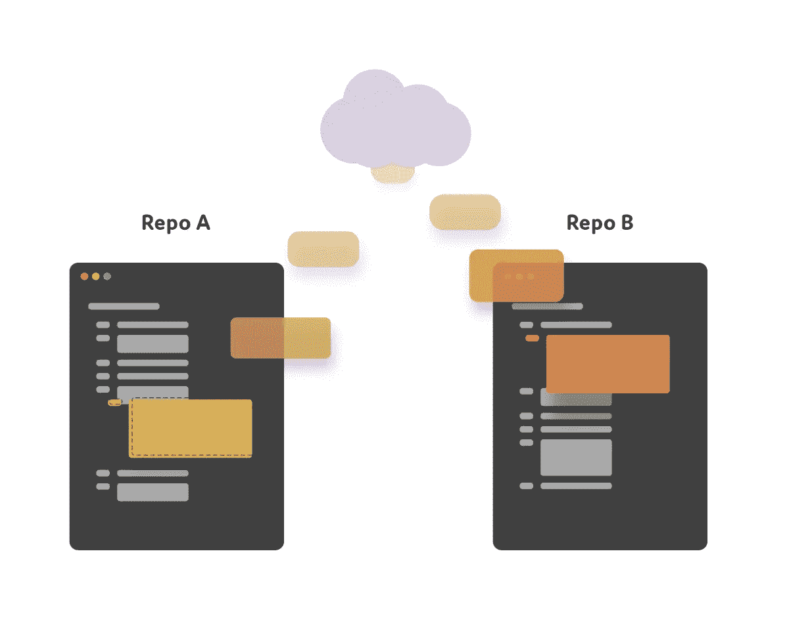

# Git 子模块💻

> 原文：<https://medium.com/hackernoon/git-submodules-91a52e6e8779>

.gitmodules

# git 中的子模块是什么？

Git 允许您在一个名为 ***子模块*** 的仓库中包含其他 Git 仓库。Git 允许您独立地提交、拉取和推送这些存储库。

# 它是如何工作的？

Submodules

比如我们有两个模块 A 和 B 都有不同的。git 文件，但现在的要求是将两者都添加到一个存储库中，但这是不可能的，如果我们创建一个存储库并将模块 A 推送到那里，那么我们就不能在同一个远程 URL 上推模块 B。

但是我们在 GitHub 中有**子模块**的概念，这意味着我们可以添加两个不同的库。父存储库中的 git 文件。

在父存储库中添加多个存储库

> git 子模块添加

您只能添加关于添加到主存储库中的**子模块**的信息。该信息描述了**子模块**指向哪个**提交**。这样，如果子模块的**库**更新，子模块的**代码**不会自动更新。这很好，因为您的代码可能无法与子模块的最新提交一起工作，这可以防止意外的行为。
添加远程网址后点击下面的命令。

> git 添加。
> git 提交-m“推送的子模块”

现在，当您开始在模块 A 上工作时，它将仅从该存储库推送提交，但它不会更新父存储库，主存储库仍会将指向**旧提交**。
我们不能像通常处理单个存储库那样，只获取最新的提交。那么，我们如何更新子模块的父库呢？只需点击下面的命令，用最新的提交更新主存储库，现在主存储库头将指向新的提交。

> git 子模块更新
> 
> git 子模块更新—远程

# 它有多大帮助？

**微服务**💯 🤔
是的，在微服务方面，我们可以在一个易于管理的主存储库中添加多个服务存储库，这非常有帮助。微服务在我们的行业中仍然很受欢迎，因为它们意味着很多好处。然而，当涉及到使用 GIT 提交变更时，使用这种架构可能会很烦人。为什么？原因很简单，在通常的方法中，每个微服务都应该放在一个单独的存储库中。因此，您不再需要执行一次典型的“GIT 序列”,而是在几个终端上完成几乎相同的工作。幸运的是，你可以避免这没什么大不了的。

我在 [GitHub](https://github.com/TheJSGirl/visitor-counter) 上为此创建了一个演示库。

感谢阅读🎉🎊我希望你喜欢这篇文章。不要忘记鼓掌并关注我即将发布的文章。