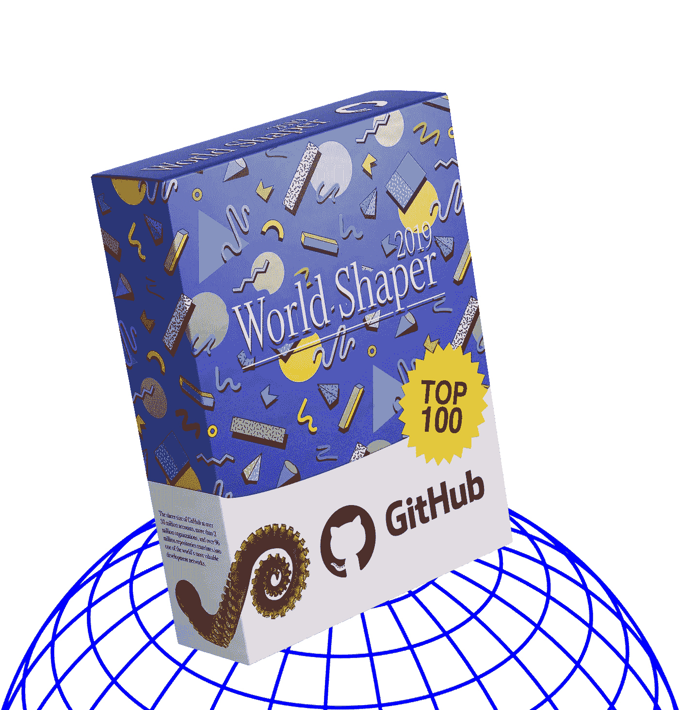

# GitHub 9600 万个仓库中最有价值的 100 个仓库

> 原文：<https://medium.com/hackernoon/githubs-top-100-most-valuable-repositories-out-of-96-million-bb48caa9eb0b>

## 是什么塑造了我们的科技世界

GitHub 不仅仅是一个有版本控制的代码托管服务——它还是一个巨大的开发者网络。

GitHub 拥有超过 3000 万个帐户、超过 200 万个组织和超过 9600 万个存储库，其庞大的规模转化为世界上最有价值的开发网络之一。

你如何量化这个网络的价值？有办法获得顶级的知识库吗？

在 U OS 这里，我们通过简化版的[我们的声誉算法](https://github.com/UOSnetwork/uos.docs/blob/master/yellow_paper/uos_yellow_paper.eng.pdf)运行 GitHub 网络，并产生了前 100 个最有价值的知识库。

结果是迷人的，因为它是折衷的方式，它确实感觉像一个很好的反映了我们的社会对技术的兴趣及其发展方向。

开源项目中有大的专有玩家——谷歌、苹果、微软、脸书，甚至百度。与此同时，还有一个中国的反审查工具。

有比特币做加密货币。

欧洲粒子物理研究所的大型强子对撞机有一个粒子探测器。

有游戏项目，如空间站 13 和大灾变:黑暗的未来和游戏引擎戈多。

有像 freeCodeCamp、Open edX、Oppia 和 Code.org 这样的教育项目。

有像 WordPress、Joomla 和 Flutter 这样的 web 和移动应用构建项目来发布你的内容。

有一些数据库可以存储你的网页内容，比如 Ceph 和 CockroachDB。

有一个搜索引擎可以浏览内容——elastic search。

或许不出所料，还有类似 cy dia compatibility manager for iOS 和任天堂 3DS 定制固件的越狱项目。

还有一个智能家居系统——家居助手。

总而言之，这确实是技术世界的一个伟大前景:我们学习，构建东西来传播我们独特的声音，我们使用加密，从我们硬件上的专有软件中挣脱出来，在业余时间我们在自动化的家中玩游戏。大公司将他们的项目开源。

在我继续列表之前，通过信誉算法运行 Octoverse 的结果也产生了每个 GitHub 贡献者的价值分数。所以，如果你有一个 GitHub 账号，并且很好奇，你可以在[https://u . community/GitHub](https://u.community/github)获取你的分数，并将其转换为通用便携信誉。

**100 强项目&仓库**

*在超过 9600 万个存储库中*

1.  **Google Kubernetes**
    *集装箱调度与管理*
    仓库:[https://github.com/kubernetes/kubernetes](https://github.com/kubernetes/kubernetes)
    网站:[https://kubernetes.io/](https://kubernetes.io/)
2.  **Apache Spark**
    *用于大规模数据处理的统一分析引擎*
    资源库:[https://github.com/apache/spark](https://github.com/apache/spark)
    网站:[http://spark.apache.org/](http://spark.apache.org/)
3.  **微软 Visual Studio 代码**
    *源代码编辑器*
    资源库:[https://github.com/Microsoft/vscode](https://github.com/Microsoft/vscode)
    网站:[https://code.visualstudio.com/](https://code.visualstudio.com/)
4.  **NixOS 包集合**
    *Nix 包管理器*
    库:[https://github.com/NixOS/nixpkgs](https://github.com/NixOS/nixpkgs)
    网站:【https://nixos.org】T42
5.  **锈**
    *编程语言*
    资源库:[https://github.com/rust-lang/rust](https://github.com/rust-lang/rust)
    网站:[https://www.rust-lang.org/](https://www.rust-lang.org/)
6.  **Firehol IP 列表**
    *Firehol 黑名单，一个防火墙构建者*
    资源库:[https://github.com/firehol/blocklist-ipsets](https://github.com/firehol/blocklist-ipsets)
    网站:[https://iplists.firehol.org/](https://iplists.firehol.org/)
7.  **Red Hat open shift**
    *一个针对持续应用开发和多租户部署优化的 Kubernetes 社区分发*
    资源库:[https://github.com/openshift/origin](https://github.com/openshift/origin)
    网站:[https://www.openshift.com/](https://www.openshift.com/)
8.  **Ansible**
    *一个部署自动化平台*
    仓库:[https://github.com/ansible/ansible](https://github.com/ansible/ansible)
    网站:[https://www.ansible.com/](https://www.ansible.com/)
9.  **automatic WordPress Calypso**
    *一个为 WordPress 提供 JavaScript 和 API 的前端*
    资源库:[https://github.com/Automattic/wp-calypso](https://github.com/Automattic/wp-calypso)
    网站:[https://developer.wordpress.com/calypso/](https://developer.wordpress.com/calypso/)
10.  微软。NET CoreFX
    *基础类库。网芯*
    资源库:[https://github.com/dotnet/corefx](https://github.com/dotnet/corefx)
    网站:[https://docs.microsoft.com/en-us/dotnet/core/](https://docs.microsoft.com/en-us/dotnet/core/)
11.  微软。净罗斯林
    *。NET 编译器*
    资源库:[https://github.com/dotnet/roslyn](https://github.com/dotnet/roslyn)
    网站:【https://docs.microsoft.com/en-us/dotnet/csharp/roslyn-sdk/】T42
12.  **Node.js**
    *一个基于 Chrome 的 V8 JavaScript 引擎*
    构建的 JavaScript 运行时库:[https://github.com/nodejs/node](https://github.com/nodejs/node)
    网站:[https://nodejs.org/en/](https://nodejs.org/en/)
13.  **TensorFlow**
    *谷歌的机器学习框架*
    知识库:[https://github.com/tensorflow/tensorflow](https://github.com/tensorflow/tensorflow)
    网站:[https://www.tensorflow.org/](https://www.tensorflow.org/)
14.  **freeCodeCamp**
    *代码学习平台*
    资源库:[https://github.com/freeCodeCamp/freeCodeCamp](https://github.com/freeCodeCamp/freeCodeCamp)
    网站:[https://www.freecodecamp.org/](https://www.freecodecamp.org/)
15.  **空间站 13**
    *一款回合制角色扮演游戏*
    储存库:[https://github.com/tgstation/tgstation](https://github.com/tgstation/tgstation)
    网站:[https://www.tgstation13.org/](https://www.tgstation13.org/)
16.  **苹果 Swift**
    *苹果的编程语言*
    资源库:[https://github.com/apple/swift](https://github.com/apple/swift)
    网站:[https://swift.org/](https://swift.org/)
17.  **elastic search**
    *某搜索引擎*
    知识库:[https://github.com/elastic/elasticsearch](https://github.com/elastic/elasticsearch)
    网站:[https://www.elastic.co/products/elasticsearch](https://www.elastic.co/products/elasticsearch)
18.  ***一个开放的框架来组装专门的容器系统*
    仓库:[https://github.com/moby/moby](https://github.com/moby/moby)
    网站:[https://mobyproject.org/](https://mobyproject.org/)**
19.  ****cocroach db**
    *一个云原生 SQL 数据库*
    仓库:[https://github.com/cockroachdb/cockroach](https://github.com/cockroachdb/cockroach)
    网站:[https://www.cockroachlabs.com/](https://www.cockroachlabs.com/)**
20.  ****Cydia 兼容性检查器**
    *cy dia 的兼容性检查器 iOS 越狱设备的包管理器*
    资源库:[https://github.com/jlippold/tweakCompatible](https://github.com/jlippold/tweakCompatible)
    网站:[https://jlippold.github.io/tweakCompatible/](https://jlippold.github.io/tweakCompatible/)**
21.  ****伺服**
    *网页浏览器引擎*
    资源库:[https://github.com/servo/servo](https://github.com/servo/servo)
    网站:[https://servo.org/](https://servo.org/)**
22.  ****Google Flutter**
    *Google 的移动应用 SDK 为 iOS 和 Android 创建接口*
    资源库:[https://github.com/flutter/flutter](https://github.com/flutter/flutter)
    网站:[https://flutter.dev/](https://flutter.dev/)**
23.  ****macOS 自制软件包管理器**
    *MAC OS 缺失软件包管理器的默认公式*
    资源库:[https://github.com/homebrew/homebrew-core](https://github.com/homebrew/homebrew-core)
    网站:[https://brew.sh/](https://brew.sh/)**
24.  ****家庭助手**
    *家庭自动化软件*
    资源库:[https://github.com/home-assistant/home-assistant](https://github.com/home-assistant/home-assistant)
    网站:[https://www.home-assistant.io/](https://www.home-assistant.io/)**
25.  **微软。NET CoreCLR
    *运行时为。网芯*
    资源库:[https://github.com/dotnet/coreclr](https://github.com/dotnet/coreclr)
    网站:[https://docs.microsoft.com/en-us/dotnet/core/](https://docs.microsoft.com/en-us/dotnet/core/)**
26.  ****CocoaPods 规格**
    *规格为 CocoaPods，有可可依赖管理器*
    仓库:[https://github.com/CocoaPods/Specs](https://github.com/CocoaPods/Specs)
    网站:[https://cocoapods.org/](https://cocoapods.org/)**
27.  ****Elastic Kibana**
    Elastic search
    知识库的分析和搜索仪表板:[https://github.com/elastic/kibana](https://github.com/elastic/kibana)
    网站:[https://www.elastic.co/products/kibana](https://www.elastic.co/products/kibana)**
28.  ****朱丽亚语言**
    *一种技术计算语言*
    资源库:[https://github.com/JuliaLang/julia](https://github.com/JuliaLang/julia)
    网站:[https://julialang.org/](https://julialang.org/)**
29.  ****微软 TypeScript**
    *编译成普通 JavaScript 的 JavaScript 超集*
    资源库:[https://github.com/Microsoft/TypeScript](https://github.com/Microsoft/TypeScript)
    网站:[https://www.typescriptlang.org/](https://www.typescriptlang.org/)**
30.  ****Joomla**
    *一个内容管理系统*
    仓库:[https://github.com/joomla/joomla-cms](https://github.com/joomla/joomla-cms)
    网站:[https://www.joomla.org/](https://www.joomla.org/)**
31.  ****definitely typed**
    *一个用于类型定义的知识库*
    知识库:[https://github.com/DefinitelyTyped/DefinitelyTyped](https://github.com/DefinitelyTyped/DefinitelyTyped)
    网站:[http://definitelytyped.org/](http://definitelytyped.org/)**
32.  ****家酿木桶**
    *用于管理作为二进制文件分发的 macOS 应用程序的 CLI 工作流*
    存储库:[https://github.com/Homebrew/homebrew-cask](https://github.com/Homebrew/homebrew-cask)
    网站:[https://brew.sh/](https://brew.sh/)**
33.  ****Ceph**
    *一个分布式对象、块和文件存储平台*
    仓库:[https://github.com/ceph/ceph](https://github.com/ceph/ceph)
    网站:[https://ceph.com/](https://ceph.com/)**
34.  ****Go**
    *编程语言*
    资源库:[https://github.com/golang/go](https://github.com/golang/go)
    网站:[https://golang.org/](https://golang.org/)**
35.  **AMP HTML Builder
    *一种为 Google AMP*
    建立页面的方式知识库:[https://github.com/ampproject/amphtml](https://github.com/ampproject/amphtml)
    网站:[https://amp.dev/](https://amp.dev/)**
36.  ****打开 edX**
    *某在线教育平台*
    资源库:[https://github.com/edx/edx-platform](https://github.com/edx/edx-platform)
    网站:[https://open.edx.org/](https://open.edx.org/)**
37.  ****熊猫**
    *一个用于 Python 的数据分析和操纵库*
    资源库:[https://github.com/pandas-dev/pandas](https://github.com/pandas-dev/pandas)
    网站:[https://pandas.pydata.org/](https://pandas.pydata.org/)**
38.  ****Istio**
    *一个管理微服务的平台*
    仓库:[https://github.com/istio/istio](https://github.com/istio/istio)
    网站:[https://istio.io/](https://istio.io/)**
39.  ****ManageIQ**
    *一个容器、虚拟机、网络和存储管理平台*
    仓库:[https://github.com/ManageIQ/manageiq](https://github.com/ManageIQ/manageiq)
    网站:【http://manageiq.org/】T42**
40.  ****Godot 引擎**
    *多平台 2D 和 3D 游戏引擎*
    资源库:[https://github.com/godotengine/godot](https://github.com/godotengine/godot)
    网站:[https://godotengine.org/](https://godotengine.org/)**
41.  ****Gentoo 资源库镜像**
    *一个 Gentoo ebuild 资源库镜像*
    资源库:[https://github.com/gentoo/gentoo](https://github.com/gentoo/gentoo)
    网站:[https://www.gentoo.org/](https://www.gentoo.org/)**
42.  ****Odoo**
    *一套基于 web 的开源商业应用*
    资源库:[https://github.com/odoo/odoo](https://github.com/odoo/odoo)
    网站:[https://www.odoo.com/](https://www.odoo.com/)**
43.  ****Azure 文档**
    *微软 Azure*
    文档库:[https://github.com/MicrosoftDocs/azure-docs](https://github.com/MicrosoftDocs/azure-docs)
    网站:[https://docs.microsoft.com/azure](https://docs.microsoft.com/azure)**
44.  ****Magento**
    *某电商平台*
    仓库:[https://github.com/magento/magento2](https://github.com/magento/magento2)
    网站:[https://magento.com/](https://magento.com/)**
45.  ****Saltstack****
46.  ****AdGuard 过滤器**
    *AdGuard 的广告拦截过滤器*
    资源库:[https://github.com/AdguardTeam/AdguardFilters](https://github.com/AdguardTeam/AdguardFilters)
    网站:【https://adguard.com/en/welcome.html】T42**
47.  ****Symfony**
    *一个 PHP 框架*
    资源库:[https://github.com/symfony/symfony](https://github.com/symfony/symfony)
    网站:[https://symfony.com/](https://symfony.com/)**
48.  ****大型强子对撞机 CMS 软件**
    *CERN 大型强子对撞机粒子探测器软件组件*
    资源库:[https://github.com/cms-sw/cmssw](https://github.com/cms-sw/cmssw)
    网站:[http://cms-sw.github.io/](http://cms-sw.github.io/)**
49.  ****红帽 open shift**
    *open shift 安装与配置管理*
    资源库:[https://github.com/openshift/openshift-ansible](https://github.com/openshift/openshift-ansible)
    网站:[https://www.openshift.com/](https://www.openshift.com/)**
50.  ****ownCloud**
    *个人云软件*
    资源库:[https://github.com/owncloud/core](https://github.com/owncloud/core)
    网站:[https://owncloud.org/](https://owncloud.org/)**
51.  ****gRPC**
    *远程过程调用(RPC)框架*
    资源库:[https://github.com/grpc/grpc](https://github.com/grpc/grpc)
    网站:[https://grpc.io/](https://grpc.io/)**
52.  ****Liferay**
    *某企业 web 平台*
    知识库:[https://github.com/brianchandotcom/liferay-portal](https://github.com/brianchandotcom/liferay-portal)
    网站:[https://www.liferay.com/](https://www.liferay.com/)**
53.  ****CommCare 总部**
    *一个移动数据收集平台*
    仓库:[https://github.com/dimagi/commcare-hq](https://github.com/dimagi/commcare-hq)
    网站:【https://www.commcarehq.org/】T42**
54.  ****WordPress Gutenberg**
    *WordPress*
    资源库的一个编辑器插件:[https://github.com/WordPress/gutenberg](https://github.com/WordPress/gutenberg)
    网站:[https://wordpress.org/gutenberg/](https://wordpress.org/gutenberg/)**
55.  ****PyTorch**
    *一个用于张量计算和深度神经网络的 Python 包*
    资源库:[https://github.com/pytorch/pytorch](https://github.com/pytorch/pytorch)
    网站:[https://pytorch.org/](https://pytorch.org/)**
56.  ****Kubernetes 测试基础设施**
    *Kubernetes 的测试基础设施库*
    库:[https://github.com/kubernetes/test-infra](https://github.com/kubernetes/test-infra)
    网站:[https://kubernetes.io/](https://kubernetes.io/)**
57.  ****key base**
    key base 客户端资源库 资源库:[https://github.com/keybase/client](https://github.com/keybase/client)网站:[https://keybase.io/](https://keybase.io/)**
58.  ****脸书 React**
    *一个用于构建用户界面的 JavaScript 库*
    资源库:[https://github.com/facebook/react](https://github.com/facebook/react)
    网站:[https://reactjs.org/](https://reactjs.org/)**
59.  ****Code.org**
    *代码学习资源*
    资源库:[https://github.com/code-dot-org/code-dot-org](https://github.com/code-dot-org/code-dot-org)
    网站:[https://code.org/](https://code.org/)**
60.  ****比特币核心**
    *比特币客户端软件*
    仓库:[https://github.com/bitcoin/bitcoin](https://github.com/bitcoin/bitcoin)
    网站:【https://bitcoincore.org/】T42**
61.  ****Arm Mbed OS**
    *物联网平台操作系统*
    资源库:[https://github.com/ARMmbed/mbed-os](https://github.com/ARMmbed/mbed-os)
    网站:[https://www.mbed.com](https://www.mbed.com/)**
62.  ****scikit-learn**
    *一个用于机器学习的 Python 模块*
    资源库:[https://github.com/scikit-learn/scikit-learn](https://github.com/scikit-learn/scikit-learn)
    网站:[https://scikit-learn.org](https://scikit-learn.org/)**
63.  ****Nextcloud**
    *一个自托管的生产力平台*
    仓库:[https://github.com/nextcloud/server](https://github.com/nextcloud/server)
    网站:[https://nextcloud.com/](https://nextcloud.com/)**
64.  ****掌舵人图表**
    *Kubernetes*
    申请精选清单资源库:[https://github.com/helm/charts](https://github.com/helm/charts)
    网站:[https://kubernetes.io/](https://kubernetes.io/)**
65.  ****Terraform**
    *一个基础设施管理工具*
    仓库:[https://github.com/hashicorp/terraform](https://github.com/hashicorp/terraform)
    网站:[https://www.terraform.io/](https://www.terraform.io/)**
66.  ****蚂蚁设计**
    *一种 UI 设计语言*
    知识库:[https://github.com/ant-design/ant-design](https://github.com/ant-design/ant-design)
    网站:[https://ant.design/](https://ant.design/)**
67.  ****Phalcon 框架文档**
    *一个 PHP 框架的文档*
    资源库:[https://github.com/phalcon/docs](https://github.com/phalcon/docs)
    网站:【https://docs.phalconphp.com】T42**
68.  ****大型强子对撞机 CMS 软件文档**
    *CERN 大型强子对撞机 CMS 软件文档*
    知识库:[https://github.com/cms-sw/cms-sw.github.io](https://github.com/cms-sw/cms-sw.github.io)
    网站:[http://cms-sw.github.io/](http://cms-sw.github.io/)**
69.  ****阿帕奇卡夫卡镜像**
    *阿帕奇卡夫卡镜像，分布式流媒体平台*
    资源库:[https://github.com/apache/kafka](https://github.com/apache/kafka)
    网站:[https://kafka.apache.org/](https://kafka.apache.org/)**
70.  ****电子**
    *一个使用 JavaScript、HTML 和 CSS 编写跨平台桌面应用的框架*
    资源库:[https://github.com/electron/electron](https://github.com/electron/electron)
    网站:[https://electronjs.org/](https://electronjs.org/)**
71.  ****泽法项目**
    *实时操作系统*
    资源库:[https://github.com/zephyrproject-rtos/zephyr](https://github.com/zephyrproject-rtos/zephyr)
    网站:[https://www.zephyrproject.org/](https://www.zephyrproject.org/)**
72.  ****网络平台测试项目**
    *一个跨浏览器的网络平台测试套件*
    仓库:[https://github.com/web-platform-tests/wpt](https://github.com/web-platform-tests/wpt)
    网站:[https://www.w3.org/](https://www.w3.org/)**
73.  ****马林固件**
    *基于 Arduino 平台的 RepRap 3D 打印机优化固件*
    资源库:[https://github.com/MarlinFirmware/Marlin](https://github.com/MarlinFirmware/Marlin)
    网站:[http://marlinfw.org/](http://marlinfw.org/)**
74.  ****Apache MXNet**
    *深度学习的一个库*
    资源库:[https://github.com/apache/incubator-mxnet](https://github.com/apache/incubator-mxnet)
    网站:【https://mxnet.apache.org/】T42**
75.  ****阿帕奇梁**
    *统一编程模型*
    资源库:[https://github.com/apache/beam](https://github.com/apache/beam)
    网站:[https://beam.apache.org/](https://beam.apache.org/)**
76.  ****浪子**
    *一个用于 iOS 和 Android 应用的构建和发布自动机*
    资源库:[https://github.com/fastlane/fastlane](https://github.com/fastlane/fastlane)
    网站:[https://fastlane.tools/](https://fastlane.tools/)**
77.  ****Kubernetes 网站和文档**
    *Kubernetes 网站和文档的存储库*
    存储库:[https://github.com/kubernetes/website](https://github.com/kubernetes/website)
    网站: [https://kubernetes.io](https://kubernetes.io/)**
78.  ****Ruby on Rails**
    一个 web 应用框架 仓库:[https://github.com/rails/rails](https://github.com/rails/rails)网站:[https://rubyonrails.org/](https://rubyonrails.org/)**
79.  ****祖利普**
    *团队聊天软件*
    资源库:[https://github.com/zulip/zulip](https://github.com/zulip/zulip)
    网站:[https://zulipchat.com/](https://zulipchat.com/)**
80.  ****Laravel**
    *一个 web 应用框架*
    资源库:[https://github.com/laravel/framework](https://github.com/laravel/framework)
    网站:[https://laravel.com/](https://laravel.com/)**
81.  ****百度 PaddlePaddle**
    *百度深度学习框架*
    知识库:[https://github.com/PaddlePaddle/Paddle](https://github.com/PaddlePaddle/Paddle)
    网站:【http://www.paddlepaddle.org/】T42**
82.  ****盖茨比**
    *一个 web 应用框架*
    资源库:[https://github.com/gatsbyjs/gatsby](https://github.com/gatsbyjs/gatsby)
    网站:[https://www.gatsbyjs.org/](https://www.gatsbyjs.org/)**
83.  ****Rust 板条箱注册表**
    *Rust 的社区包注册表*
    资源库:[https://github.com/rust-lang/crates.io-index](https://github.com/rust-lang/crates.io-index)
    网站:[https://crates.io/](https://crates.io/)**
84.  ****任天堂 3DS 定制固件**
    *3DS 定制固件全指南*
    资源库:[https://github.com/hacks-guide/Guide_3DS](https://github.com/hacks-guide/Guide_3DS)
    网站:[https://3ds.hacks.guide/](https://3ds.hacks.guide/)**
85.  ****TiDB**
    A NewSQL 数据库 资源库:[https://github.com/pingcap/tidb](https://github.com/pingcap/tidb)网站:[https://pingcap.com](https://pingcap.com/)**
86.  ****Angular CLI**
    *Angular 的 CLI 工具，一个 Google web 应用框架*
    资源库:[https://github.com/angular/angular-cli](https://github.com/angular/angular-cli)
    网站:[https://cli.angular.io/](https://cli.angular.io/)**
87.  ****地图。ME**
    *离线 OpenStreetMap maps 和 Android 地图*
    资源库:[https://github.com/mapsme/omim](https://github.com/mapsme/omim)
    网站:[https://maps.me/](https://maps.me/)**
88.  ****Eclipse Che**
    *一个用于 Eclipse*
    的云 IDE 资源库:[https://github.com/eclipse/che](https://github.com/eclipse/che)
    网站:【http://www.eclipse.org/che/】T42**
89.  ****勇者浏览器**
    *一款自带 BAT 加密货币的浏览器*
    资源库:[https://github.com/brave/browser-laptop](https://github.com/brave/browser-laptop)
    网站:[https://www.brave.com/](https://www.brave.com/)**
90.  ****东拼西凑**
    *一库学 Git*
    一库:[https://github.com/jlord/patchwork](https://github.com/jlord/patchwork)
    网站:[http://jlord.us/patchwork/](http://jlord.us/patchwork/)**
91.  ****Angular Material**
    *Component infra structure 和 Material Design Component for Angular，a Google web application framework*
    Repository:[https://github.com/angular/components](https://github.com/angular/components)
    网站:[https://material.angular.io/](https://material.angular.io/)**
92.  ****Python**
    编程语言 资源库:[https://github.com/python/cpython](https://github.com/python/cpython)
    网站:[https://www.python.org/](https://www.python.org/)**
93.  ****空间站 13**
    *一款回合制角色扮演游戏*
    资源库:[https://github.com/vgstation-coders/vgstation13](https://github.com/vgstation-coders/vgstation13)
    网站:[http://ss13.moe/](http://ss13.moe/)**
94.  ****大灾变:前方黑暗的日子**
    *一款回合制生存游戏*
    储存库:[https://github.com/CleverRaven/Cataclysm-DDA](https://github.com/CleverRaven/Cataclysm-DDA)
    网站:[http://cataclysmdda.org/](http://cataclysmdda.org/)**
95.  ****Material-UI**
    *React 实现谷歌材质设计的组件*
    资源库:[https://github.com/mui-org/material-ui](https://github.com/mui-org/material-ui)
    网站:【https://material-ui.com/】T42**
96.  ****Ionic**
    *一个渐进式的 Web Apps 开发框架*
    资源库:[https://github.com/ionic-team/ionic](https://github.com/ionic-team/ionic)
    网站:[https://ionicframework.com/](https://ionicframework.com/)**
97.  ****Oppia**
    *协作构建互动课程的工具*
    资源库:[https://github.com/oppia/oppia](https://github.com/oppia/oppia)
    网站:[https://www.oppia.org](https://www.oppia.org/)**
98.  ****Alluxio**
    *一个虚拟分布式存储系统*
    仓库:[https://github.com/Alluxio/alluxio](https://github.com/Alluxio/alluxio)
    网站:[https://www.alluxio.io/](https://www.alluxio.io/)**
99.  ****XX 网**
    *中文网页代理及反审查工具*
    资源库:[https://github.com/XX-net/XX-Net](https://github.com/XX-net/XX-Net)
    网站:无**
100.  ****微软。NET CLI**
    *的一个 CLI 工具。网*
    资源库:[https://github.com/dotnet/cli](https://github.com/dotnet/cli)
    网站:[https://docs.microsoft.com/en-us/dotnet/core/tools/](https://docs.microsoft.com/en-us/dotnet/core/tools/)**

**[1]简化版的计算说明在 [U OS 网络 GitHub 库](https://github.com/UOSnetwork/uos.docs/blob/master/GitHubUserRepoScoring.pdf)里。**