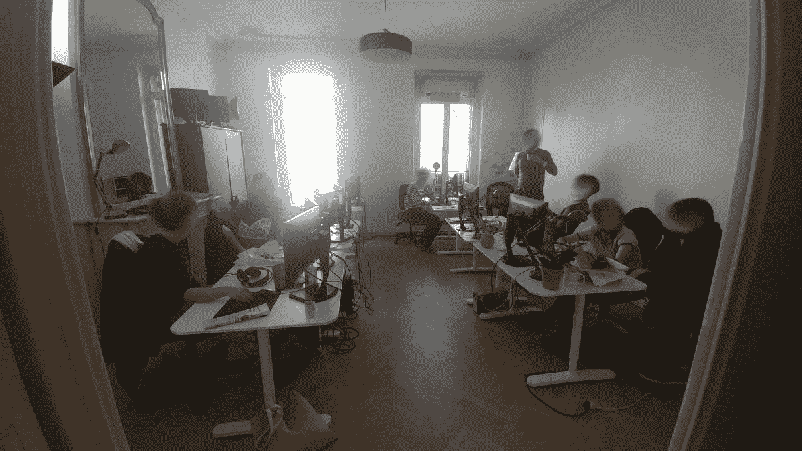

# 试试 1 天短跑吧！我做了，这是我的反馈

> 原文：<https://medium.com/hackernoon/give-1-day-sprints-a-try-i-have-and-this-is-my-feedback-264bb7889d5c>

## 你的团队会变得更棒

*Cet article est*[*également dispén Fran is*](https://jp-lambert.me/testez-le-sprint-de-1-jour-retour-dexpérience-c612cf5ba4fd)*。*

我最近促成了一个*一日冲刺*。这有什么意义？教他们如何一起工作，在同一时间，从开始到结束做同一件事:

*   一起设计积压产品项目，并在最后一刻
*   在同一时间一起处理同一个产品待办事项
*   将整个团队的努力推向生产，特别是关于手动非回归测试部分

最大的困难在于组成团队的技能的多样性:每个成员都有自己的专业领域，并自然地被限制在影响其专业领域的任务上。

以下是我这一天的反馈。

这一天以汇报会议结束，在此期间，我们记下了大部分学习内容。

*TL；博士:太棒了！*

# 提醒目标和规则

所有团队成员到达后，分享糕点*(如果没有一些著名的*羊角面包*，我们法国人就不能在一天的早些时候开始一个正式的会议)*，这一天以一个 Q &会议开始，随后是提醒一天冲刺练习的*为什么*和*如何*。为什么这么做？进行 1 天短跑的想法来自哪里？

> 选一个题目，一个也只有一个。这是今天唯一要做的事。一切都要做:从创意，从最初的设计元素，直到投入生产。从开始，从*真正的*开始，到结束，*真正的*结束。

# 选择主题

开始了。

一天终于真正从定义当天的主题开始了。

团队在产品待办事项中挖掘一点点，以找到一个好的候选人。

团队最终找到了合适的东西:一些小东西，同时仍然给用户带来价值。

团队开始讨论变更的预期行为。现在看来，要做的事情比乍看起来要多。

作为一名辅导员，我敦促他们尽可能缩小范围，在一天内完成所有工作。我还提醒他们，我们的目标是走到苦尽甘来，也就是投产或至少准备投产。乐观是理所当然的，但我怀疑车队是否同意我的观点。团队拆分待办事项，以缩小一天的工作范围。

这一天将在下午 5 点结束，以便留出足够的时间进行情况汇报。团队的目标是在下午 4 点前结束开发，这样他们就有足够的时间为当天的发布做好充分准备。

# 设计

没有产品化，团队就开始设计新的特性。有哪些用例？哪种行为是意料之中的？哪个软件架构？

奇迹发生了。以世界上最自然的方式，整个团队一起设计新功能。

> *房间里充满了活力，讨论声响彻整个房间。*

没有筒仓，每个人都参与进来，整个团队一起设计新功能。

## “我们来估算一下！”

在离开会议室回到团队的开放空间并开始开发之前，团队抽取*计划扑克*套来估计当天的主题。我问他们为什么要估计。他们的回答听起来很粗略。这闻起来像是*货物崇拜*，习惯被固定在惯例中练习了太久，现在却没有真正理解背后的原因。

在短暂的交谈后，团队得出结论，估计对这一天没什么用。整个房间都能感觉到轻松。很明显，每个人都习惯于估算，但这并不能让团队的活动变得愉快。

## 花费的时间

最后，1 天冲刺的 20%将花在开发的设计部分。这段时间是完全合理和正常的。最大的不同是，今天这个时间是在工作前使用的，而通常是分散在一次或几次之前的冲刺中。

顺便说一下，到今天结束的时候，20%可能还不够。花更多的时间将是明智的:

*   为了全面界定今天的主题范围，
*   要真正清楚什么是一天话题的一部分，什么不是，
*   并把当天的话题分成更小的范围。

# 发展

团队开始工作。空气中有某种东西。我们看到*前端*和*后端*开发人员就如何定义和使用 API 进行了同步讨论。他们去找产品负责人澄清范围的细节。一些开发人员*将*结对编程，甚至抓住这个机会尝试 *TDD* ，或者*测试驱动开发*。

> 办公室里显然有事发生。

## 日常的混乱错误

下午 3 点，压力越来越大。产品负责人花在团队房间里的时间越来越多。做一次*每日例行检查*似乎是很自然的——相当于评估形势。

目前，对于车队来说，进球并没有受到威胁。然而，团队有点遭受这种日常混乱，因为这种临时会议并不是团队主动的。有些人觉得他们在浪费时间，在这种情况下，有些时间是非常宝贵的。

为什么会发生这种日常混乱？出于错误的原因。这并不是开发团队的首创，而是产品所有者和利益相关者的，他们担心事情的进展，害怕团队会“失败”这一天的冲刺。

有趣的是，尽管缺乏赌注，经典的压力模式还是会发生(这只是一天的发展)。这种练习使它们易于观察和分析。

# 准备发布

Tick-tock, tick-tock…

下午 4 点的限制被打破了，面对下午 5 点冲刺的结束有如此多的紧张。谁是罪魁祸首？构建服务器和脚本运行时间太长。我被告知*“我们要求比平常更多的构建，我们都在同时工作。”*

同时准备手工非回归测试计划。第一次，整个团队将参与执行测试。

我宣布只剩下 10 分钟了。压力是无与伦比的…

# 冲刺结束

现在是下午 5 点:冲刺阶段结束了。结果是明确的:团队仍然在等待发布候选在*阶段*环境中部署，所以测试阶段甚至不能开始。该团队认为他们离目标只有一步之遥，因此非常愤怒…

然后一些团队成员宣布他们已经开始在本地构建上进行测试，并且他们发现了至少一个回归。团队实际上离目标比他们最初想的要远得多！

# 汇报和学习

然后我主持了一个快速回顾:是什么阻碍了团队成功完成当天的主题，最重要的是团队学到了什么？

*   在开始的时候，在早上，每个人都很自然地参与讨论，定义范围，定义用例，谈论架构，等等。一起，而不是试图在之前的冲刺中准备东西。
*   白天，一些开发人员第一次真正尝试了结对编程和 TDD。
*   明面上显然需要一些爱。一天结束时，团队的工具需要 30 分钟才能运行。可能有人会说，这只是因为 1 天冲刺的特殊情况，通常它是次要的。但也许明天他们将不得不快速修复生产中的一个关键错误，在这种情况下，30 分钟的延迟将是一个真正的问题…
*   有很多技术债务，进行一天的冲刺是一个完美的方式来看看它如何减缓团队的速度，同时危及其可预测性:早上按时成功完成当天的主题似乎很容易。
*   关于如何指定预期行为的大量反馈。特别是，我们是否应该管理错误案例？我们应该将其整合到*DoD*(*Done*的定义)中，还是在*用户故事*中解释？因此，在早上花 20%的时间准备这个话题似乎还不够。
*   在 1 天冲刺中工作并不一定会更慢！与团队的通常速度相比，快速计算清楚地表明团队的交付能力与团队的通常速度非常相似。
*   错误处理拉另一个字符串。错误管理开始只是一个纯粹的前端问题，但是团队最终讨论了 T2 后端需要如何很好地管理它，使它标准化，并拥有既有意义又有用的错误代码。最后，重要的是要认识到，这种问题与*后端*和*前端*同样重要。

> 这绝对是一次很棒的经历，一次真正的团队建设活动，也是一座学习的金矿。

*   这项练习暴露了该队的所有问题。它表明，在以前的冲刺阶段，没有必要在上游准备话题。最后，它简单地说明了合作是可能的。

**我强烈推荐 1 天短跑！**

# 资料来源和进一步阅读

## 约翰·卡特勒:为什么一天短跑是个好主意

 [## 一天冲刺

### 进行对话。去做吧。复习。回家吧

hackernoon.com](https://hackernoon.com/one-day-sprints-1ce1f53a08b2) 

## 罗恩·杰弗里斯(Ron Jeffries):冲刺的长度必须缩短到团队能够成功交付价值的程度

 [## 小题目:完成，冲刺长度

### 这就是 RonJeffries.com，新文章、XProgramming、SameElephant，甚至可能还有一些新项目的组合…

ronjeffries.com](https://ronjeffries.com/articles/017-02ff/small-topics/) 

# 喜欢这篇文章吗？秀出来！

*请* ***鼓掌*** 👏****分享*** *文章！因为有你，我才全身心地投入写作。**

*****关注*** *我的* [***我的博客***](https://jp-lambert.me/) *当我发布新文章时通知我！***

***太感谢了！***