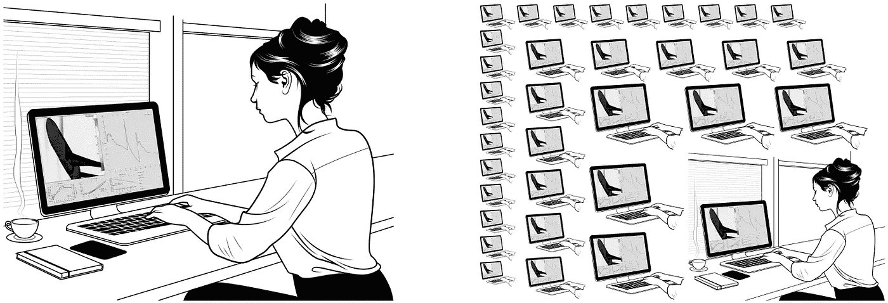
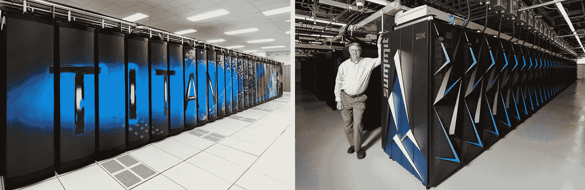

# 给工程师一个助手

> 原文：<https://medium.com/hackernoon/give-engineers-an-assistant-6a23bbd80dc8>

Left: images from the 1977 NASA SP-413 “[Space Settlements — A Design Study](https://ntrs.nasa.gov/search.jsp?R=19770014162&hterms=NASA+SP-413+Space+Settlements&qs=N%3D0%26Ntk%3DAll%26Ntx%3Dmode%2Bmatchallany%26Ntt%3DNASA%2BSP-413%2B%2BSpace%2BSettlements),” Right: Isaac Asimov (Photo: [Toronto Star](https://www.thestar.com/news/world/2018/12/27/35-years-ago-isaac-asimov-was-asked-by-the-star-to-predict-the-world-of-2019-here-is-what-he-wrote.html))

## 最大限度地获取最佳方法和工具对我们所有人都有好处

在 1977 年的年，美国国家航空航天局的报告[太空定居点——一项设计研究](https://ntrs.nasa.gov/search.jsp?R=19770014162&hterms=NASA+SP-413+Space+Settlements&qs=N%3D0%26Ntk%3DAll%26Ntx%3Dmode%2Bmatchallany%26Ntt%3DNASA%2BSP-413%2B%2BSpace%2BSettlements)公布了一个未来的宏伟愿景，其中许多成就将包括围绕地球运行的空间站，致力于传输丰富的集中太阳能。报告指出:“发电站被放置在环绕地球的轨道上，向地球输送丰富而宝贵的电能。这些发电站的经济价值将大大证明殖民地的存在和更多殖民地的建设。”三十五年前，著名作家和未来学家艾萨克·阿西莫夫在《多伦多星报》上写下了对 2019 年的[预测。其中一人重复了 1977 年美国国家航空航天局的报告，称“地球能源的主要部分将来自太阳…能源对所有人来说都是如此必要，只有各国保持和平并共同努力，战争才会变得完全不可想象。”多年来，这些作者和其他许多人一起预测了一个光明的未来。虽然自 70 年代和 80 年代以来已经取得了许多进步，太阳能已经成为世界上一种实用而重要的能源，但我们还远远没有实现这些目标。相反，今天我们仍然在使用化石燃料，许多人预测这些燃料现在应该已经过时了。事实上，我们仍在补贴化石燃料，到 2050 年，美国将额外支付 170 亿桶石油的钻探费用，足以排放超过 60 亿吨二氧化碳。那么，这些三四十年前的作者是不是有妄想症？哪里出了问题？](https://www.thestar.com/news/world/2018/12/27/35-years-ago-isaac-asimov-was-asked-by-the-star-to-predict-the-world-of-2019-here-is-what-he-wrote.html)

> 美国在超级计算或高性能计算方面处于世界领先地位，但几乎没有人使用它。

我们不再使用付费电话和音像店，因为替代产品好得多，化石燃料能源也会如此。唯一的问题是我们多快能到达那里。从桥梁到飞机，再到互联网，工程师们设计了所有的东西，他们取得的每一项进步都让我们的生活变得更好，促进了经济增长。无论你最关心的是呼吸干净的空气、[的未来气候和海平面上升](https://www.ipcc.ch/sr15/chapter/summary-for-policy-makers/)，还是如果你主要是[关心经济增长](https://www.ucsusa.org/clean-energy/renewable-energy/public-benefits-of-renewable-power#bf-toc-3)，拥有丰富的可再生能源将使我们所有人受益。如果工程师加快他们实现新技术壮举的步伐，我们所有人都会受益。

# 多学科发明家

在列奥纳多·达·芬奇的众多成就中，下列发明被认为已经进入了普遍的实际应用:支柱桥、自动化的[线轴](https://en.wikipedia.org/wiki/Bobbin)绕线机、[轧钢机](https://en.wikipedia.org/wiki/Rolling_mill)、测试钢丝[抗拉强度的机器](https://en.wikipedia.org/wiki/Tensile_strength)和[透镜](https://en.wikipedia.org/wiki/Lens_(optics))-研磨机。以发展交流电而闻名的尼古拉·特斯拉，在无线通讯、激光、x 光、雷达、照明和机器人方面也取得了进步。他们是多学科发明家中最多产的两个，虽然许多人认为他们是异常的，但想想这个问题:怎样才能让大部分工程师大幅提高他们的发明能力？

Left: [Hitachi SR2201](https://en.wikipedia.org/wiki/Hitachi_SR2201) Supercomputer — 600 GFLOPS, Right: [iPhone X](https://appleinsider.com/articles/17/09/23/inside-iphone-8-apples-a11-bionic-introduces-5-new-custom-silicon-engines) — 600GFLOPS

# 现在我们可以使用超级计算机了

[超级计算机](https://en.wikipedia.org/wiki/Supercomputer)是与通用计算机相比表现出高水平性能的计算机——而且这种性能(根据【TOP500 强排名)几十年来一直在增长。一个常见的性能指标是每秒钟的[浮点](https://en.wikipedia.org/wiki/Floating-point)运算( [FLOPS](https://en.wikipedia.org/wiki/FLOPS) )，用最基本的术语来说，这意味着一秒钟内可以执行的在科学和工程中有用的数学运算的数量。二十年前，像 Hitachi SR2201 这样的世界顶级超级计算机的性能是数千亿次浮点运算(数千亿次浮点运算)，而今天的 iPhones 正在报告这种性能。虽然二十年前拥有这种计算能力的少数研究人员会告诉你他们不需要自己的超级计算机，但今天全球数亿用户表明他们有各种各样的使用案例。现代超级计算机提供的性能在 PetaFLOPS 范围内，这是计算能力从 GFLOPS 到 PFLOPS 增加一千倍的两个因素。橡树岭领先计算设施( [OLCF](https://www.olcf.ornl.gov/) )因在推进超级计算方面处于世界领先地位而闻名，它是关键科学研究和技术进步的温床。2012 年 OLCF 的[泰坦超级计算机](https://www.olcf.ornl.gov/olcf-resources/compute-systems/titan/)上线，峰值性能为 27 PFLOPS。当 OLCF 继续用他们的新 [Summit](https://www.olcf.ornl.gov/olcf-resources/compute-systems/summit/) 系统绘制向 Exascale 计算的路线时，Petascale 高性能计算( [HPC](https://hackernoon.com/tagged/hpc) )现在对消费者可用，他们可以在像 [Google Cloud](https://cloud.google.com/) 、 [Amazon Web Services](https://aws.amazon.com/) 、 [IBM Cloud](https://www.ibm.com/cloud/) 和 [Microsoft Azure](https://azure.microsoft.com/en-us/) 这样的公司提供的云系统上租用时间。像 [Rescale](https://www.rescale.com/) 这样的新提供商甚至提供解决方案，让工程师能够在这些云平台上访问模拟软件。

Left: Computer Aided Engineering (CAE) with a desktop, Right: CAE with High Performance Computing (HPC)

# 在工程中使用高性能计算的优势

一个小的工程师团队将进行概念和系统开发，但要成功完成一个项目并将一项新发明推向市场，必须涵盖许多专业领域。例子包括结构设计和分析；热量；流体；振动；电气；和许多其他人。人类已经开发了做所有这些事情的知识，但是小团队不能花费数年时间去接受一百或一千项技能的培训。拥有大量预算的公司能够负担最好的工具并雇佣专家。这已经是 10 倍的优势了。这些公司还将在 HPC 上部署它们，以获得另一个 10 倍的优势，因此大公司和小公司之间的工程效率可能会有 100 倍的差异。美国在超级计算或高性能计算方面处于世界领先地位，但几乎没有人使用它。[只有 8%的设计和制造新产品的中小型企业(SME)一直在使用 HPC](http://www2.itif.org/2016-high-performance-computing.pdf) ，原因是它太复杂了！

> 更广泛的采用仍然存在障碍，尤其是对于中小型制造和工程公司

# 专业知识——阻碍我们前进的障碍

工程软件公司为专业工程师设计了一千多种不同的工具，当工程师能够利用这些工具时，他们可以获得新的设计、分析、制造和效率选项，从而从根本上提高公司的竞争力。当我们采访许多这种计算机辅助工程(CAE)工具的供应商时，他们告诉我们，他们可能在全球范围内拥有 200 或 1000 个客户。有成千上万的公司应该使用这些工具，当被问及为什么他们没有多 100 倍的客户时，一致的回答是 1)这些工具太难使用，2)它们太贵。我们不能浪费时间，因为最好的工具太复杂而无法使用。最近，许多组织已经认识到工程中的专业知识障碍。能源部提出了对 CAE 的担忧，称[“计算科学已经成为科学的第三大支柱…尽管潜力巨大…高性能计算尚未得到充分利用…广泛采用仍然存在障碍，特别是对于中小型制造和工程公司。”](https://www.sbir.gov/sbirsearch/detail/1308577)美国宇航局设定了 2030 年的目标，并表示这个问题的解决方案必须[“最大限度地减少用户干预……单个工程师/科学家必须能够在时间关键的时期(例如 24 小时)构思、创建、分析和解释相关模拟的大型集合……完全自动化是必不可少的。”](https://ntrs.nasa.gov/archive/nasa/casi.ntrs.nasa.gov/20140003093.pdf)

Left: OLCF’s [Titan Cray XK7](https://www.olcf.ornl.gov/olcf-resources/compute-systems/titan/), Right: OLCF’s Program Director [Buddy Bland](https://www.olcf.ornl.gov/2018/06/08/faces-of-summit-succeeding-by-leading/) with [Summit IBM AC922](https://www.olcf.ornl.gov/olcf-resources/compute-systems/summit/)

不仅仅是 CAE 需要变得更加容易获取:工业部门消耗了美国三分之一的能源，然而他们在实施能源效率措施方面做得最少。[最新的 IPCC 报告明确呼吁节约能源。我们还远未实现 100%的可再生能源，而且需求还在持续增长，因此最大限度地提高效率势在必行。如今，对制造工厂进行能源审计是通过雇佣外部承包商来完成的。该工厂的员工中没有人负责能效工作，他们没有时间或专业知识来完成这项工作，他们的主要关注点是按时、按预算、高质量地生产产品。美国能源部最近确认了解决能源效率专业知识障碍的重要性，](https://www.ipcc.ch/sr15/chapter/summary-for-policy-makers/)[发现四分之三的雇主报告难以雇佣合格的能源效率工人。](https://www.energy.gov/sites/prod/files/2017/01/f34/2017%20US%20Energy%20and%20Jobs%20Report_0.pdf)加州能源委员会最近[证实了这些担忧](https://www.energy.ca.gov/renewables/tracking_progress/documents/energy_efficiency.pdf)。如果解决了这一技术障碍，温室气体的排放水平将会大大降低，而能源效率行业预计将会是一项价值[万亿美元的事业](https://www.mckinsey.com/~/media/mckinsey/dotcom/client_service/Sustainability/PDFs/A_Compelling_Global_Resource.ashx)。

*MSBAI is currently raising capital. Learn more about our offering and invest* [*here*](https://www.startengine.com/msbai)*.*

# 解决方案:工程人工智能助手

今天，云高性能计算(HPC)已经变得足够强大和经济，人工智能(AI)也变得足够成熟，我们可以解决许多公司在使用最好的工程工具并在云 HPC 上运行它们的能力方面存在的差距。[跨多个学科的人工智能助手将出现爆炸式增长](https://www.cbinsights.com/research/expert-automation-augmentation-software-eaas/)，采用人工智能的公司将在生产率方面获得巨大优势。

GURU prototype autonomously running CAE on HPC

这就是为什么 MSBAI 开始开发 GURU——终极工程 AI 助手。就像钢铁侠电影里的 J.A.R.V.I.S。GURU 通过将专业能力作为服务交付，解决了工程领域普遍存在的专业知识壁垒问题。我们利用现代高性能计算(HPC)和人工智能(AI)来做到这一点。

GURU 运行从用户设备到服务、HPC 和“代理社会”的客户端-服务器连接，该“代理社会”包含执行单个任务的代理库。端到端的工程工作流是通过运行一系列协同工作的代理来完成的。

> 大师— *终极工程人工智能助手*

每个个体代理都代表了一个基于“符号”规则的系统(其中包含了已知的最佳实践、物理和数学)和一个基于“几何”机器学习的系统的混合体，当做出特定问题的选择时，就会调用该系统。

GURU 平台通过我们开发的自动化规则摄取和选择/构建/精炼机器学习模型的方法，使定制代理能够在具有稀疏数据集的实际时间框架内构建。GURU 在您、工程师、您的帐户和它将用来运行您的工程任务的计算机系统之间充当一个门户。GURU 应用程序在您的设备上本地运行，如果您愿意，您可以使用 GURU 门户网站。我们集成了语音控制功能和点击控制功能。有些人更喜欢这两个不同选项中的一个，有些人发现语音功能在移动中最方便，会使用点击来完成更详细的工作。在您的设备上运行的应用程序或门户是轻量级的，主要用于与 GURU 服务和将运行您的作业的云 HPC 系统进行通信。

为了实现这一目标，MSBAI 正在以最民主的方式获得资本——从粉丝、未来客户和普通大众那里。

*MSBAI 目前正在筹集资金。点击* *了解更多关于我们的产品和投资* [*。*](https://www.startengine.com/msbai)