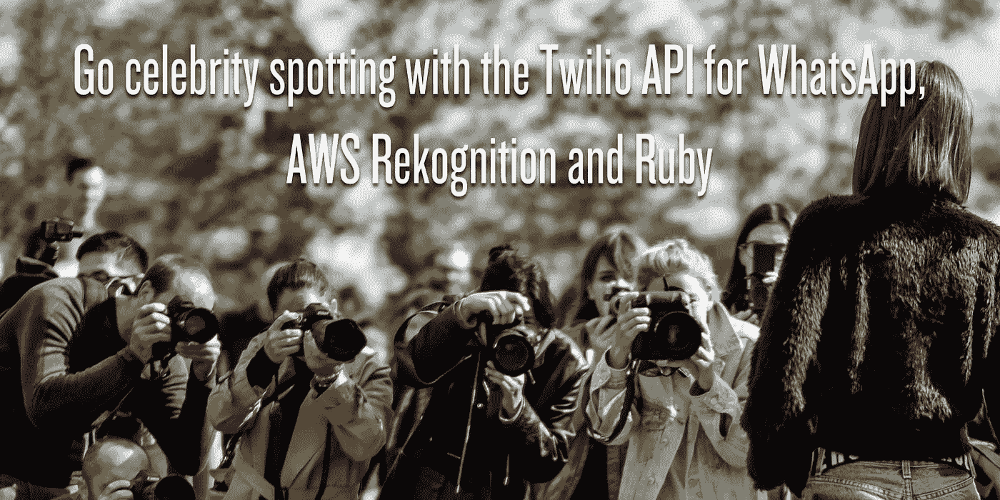
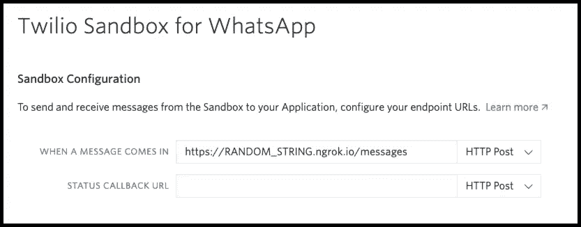
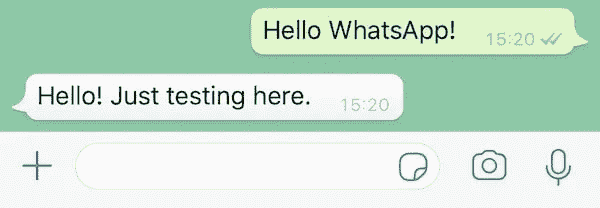
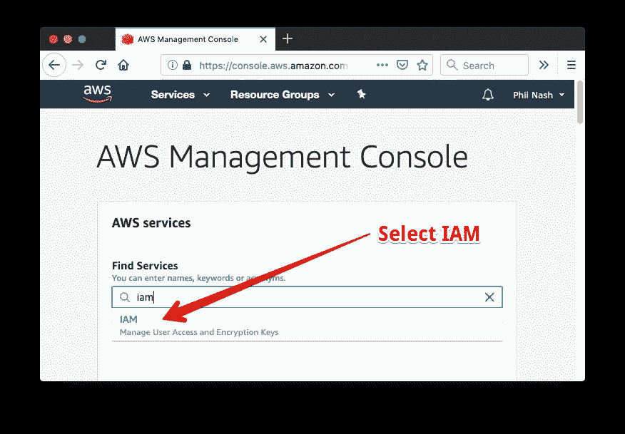
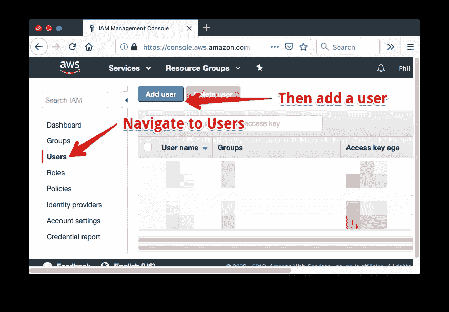
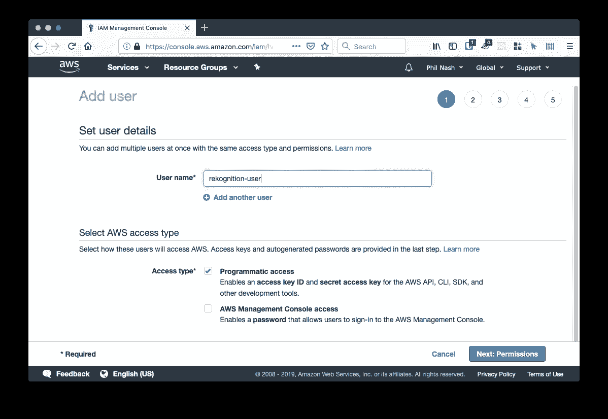
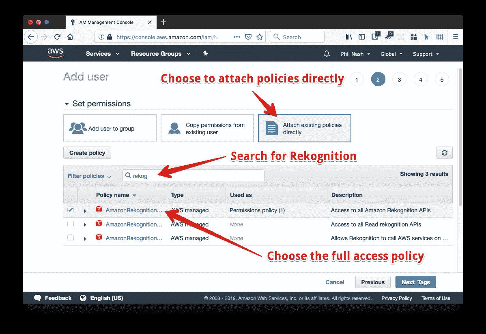
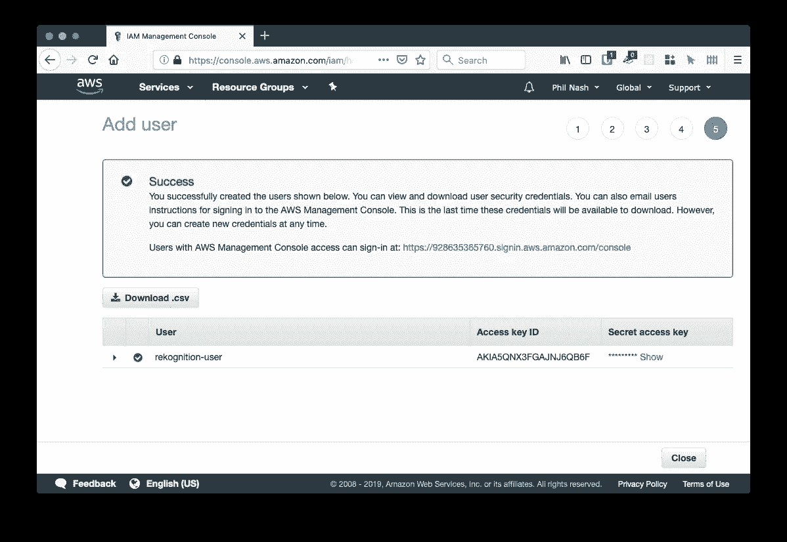
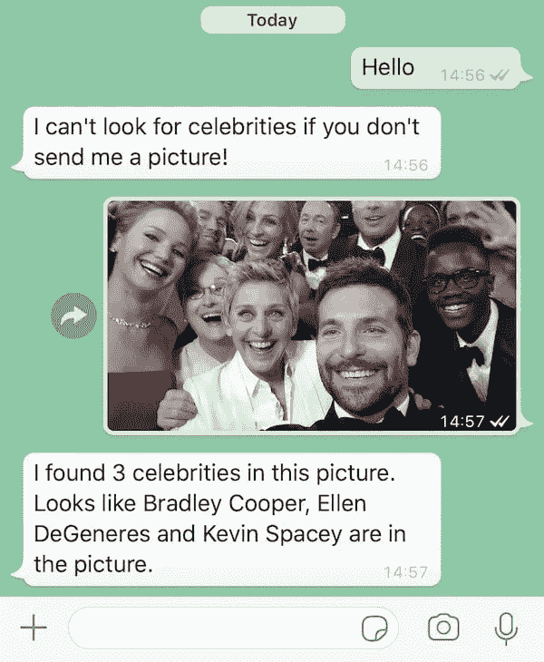

# 使用 WhatsApp、AWS Rekognition 和 Ruby 的 Twilio API 寻找名人

> 原文：<https://medium.com/hackernoon/go-celebrity-spotting-made-easy-with-the-twilio-api-for-whatsapp-aws-rekognition-and-ruby-48909dc14f52>



你知道你可以使用 WhatsApp 的[Twilio API](https://www.twilio.com/whatsapp)发送和接收媒体吗？当我发现我想用它做些有趣的事情时，为什么不把它和 [AWS 认知](https://aws.amazon.com/rekognition/)结合起来，看看我看起来是否像任何名人？

在这篇文章结束时，你将知道如何构建一个应用程序，让你向 WhatsApp 号码发送图像，下载图像，用 AWS Rekognition API 分析图像，并回复说照片中是否有名人。

# 你需要什么

要构建这个应用程序，您需要一些东西:

*   一个 Twilio 账户，[在这里注册一个免费账户](https://www.twilio.com/try-twilio)
*   [AWS 账户](https://aws.amazon.com/)
*   [安装红宝石](https://www.ruby-lang.org/en/downloads/)和[捆扎机](https://bundler.io/)
*   [ngrok](https://ngrok.com/) 帮助我们[测试我们的 webhooks](https://www.twilio.com/blog/2015/09/6-awesome-reasons-to-use-ngrok-when-testing-webhooks.html)

明白了吗？那我们开始吧。

# 应用基础

当 Twilio 收到 WhatsApp 消息时，它会向我们提供的 URL 发送一个 HTTP 请求，一个 [webhook](https://www.twilio.com/docs/glossary/what-is-a-webhook) 。我们需要构建一个应用程序来接收这些 webhooks，使用 AWS Rekognition 服务处理图像，然后在对 Twilio 的响应中发送一条消息。

为自己创建一个构建应用程序的目录，并使用 bundler 初始化一个新的`Gemfile`:

```
mkdir celebrity-spotting
cd celebrity-spotting
bundle init
```

打开`Gemfile`并添加我们将用于该应用程序的宝石:

```
# frozen_string_literal: true

source "https://rubygems.org"

gem "sinatra", require: "sinatra/base"
gem "aws-sdk"
gem "envyable"
gem "down"
gem "twilio-ruby"
```

我们将使用 [Sinatra](http://sinatrarb.com/) 作为 web 框架来接收来自 Twilio 的 webhooks。我们将需要 [AWS SDK](https://github.com/aws/aws-sdk-ruby) 来与 Rekognition 服务进行通信。[envable](https://github.com/philnash/envyable)是[在开发](https://www.twilio.com/blog/2015/02/managing-development-environment-variables-across-multiple-ruby-applications.html)的环境变量中存储我们的凭证。 [Down](https://github.com/janko/down) 是一块宝石，使[真正容易下载文件](https://www.twilio.com/blog/download-image-files-ruby)。并且 [twilio-ruby](https://www.twilio.com/docs/libraries/ruby) gem 将用于生成 [TwiML](https://www.twilio.com/docs/sms/twiml) 以便我们可以在响应中向 twilio 发回信息。

运行`bundle install`来安装 gems，然后创建这个应用程序需要的其他文件:`app.rb`、`config.ru`和`config/env.yml`。准备工作已经完成，让我们开始构建应用程序。

# 构建应用程序

我们将使用`config.ru`来加载和运行应用程序。将以下代码添加到`config.ru`:

```
require "bundler"
Bundler.require

Envyable.load("./config/env.yml") unless ENV["RACK_ENV"] == "production"

require "./app.rb"

run CelebritySpotting
```

这需要在`Gemfile`中定义的所有依赖项，使用`Envyable`将我们的配置加载到环境中，然后加载并运行应用程序。接下来，让我们创建`CelebritySpotting`应用程序。

打开`app.rb`并创建一个新类:

```
class CelebritySpotting < Sinatra::Base

end
```

我们需要一个可以作为我们的 webhook URL 提供的端点路径。默认情况下，Twilio 发出一个`POST`请求，因此我们的端点将响应`POST`请求:

```
class CelebritySpotting < Sinatra::Base
  post "/messages" do

  end
end
```

我们将返回 TwiML，所以我们将创建一个新的`Twilio::TwiML::MessagingResponse`并将内容类型头设置为`application/xml`:

```
class CelebritySpotting < Sinatra::Base
  post "/messages" do
    content_type "application/xml"
    twiml = Twilio::TwiML::MessagingResponse.new
  end
end
```

为了确保目前为止这是可行的，让我们添加一条消息，将 TwiML 作为 XML 返回并测试它:

```
class CelebritySpotting < Sinatra::Base
  post "/messages" do
    content_type "application/xml"
    twiml = Twilio::TwiML::MessagingResponse.new
    twiml.message body: "Hello! Just testing here."
    twiml.to_xml
  end
end
```

在命令行上使用以下命令启动应用程序:

```
bundle exec rackup
```

应用程序将于`http://localhost:9292`开始。没有接口，所以我们可以使用`curl`来测试它，看看它是否正常工作。

```
$ curl -d "" http://localhost:9292/messages
<?xml version="1.0" encoding="UTF-8"?>
<Response>
<Message>Hello! Just testing here.</Message>
</Response>
```

我们可以看到消息在 TwiML 中被返回，所以让我们把它连接到 WhatsApp 的 Twilio API。

# 连接到 WhatsApp 的 Twilio API

[Twilio 提供了一个沙箱](https://www.twilio.com/docs/sms/whatsapp/api#twilio-sandbox-for-whatsapp)来测试您的 WhatsApp 集成，而无需等待 Twilio 编号被 WhatsApp 批准。登录你的 Twilio 控制台，按照说明设置你的 WhatsApp 沙盒。

设置好之后，你需要定义一个 webhook URL，这样你就可以配置你的 WhatsApp 沙盒号了。

我们的应用程序目前在我们自己的机器上运行，所以我们需要从公共互联网上下载，这就是 ngrok 的用武之地。通过运行以下命令启动 ngrok:

```
ngrok http 9292
```

执行这个命令会给你一个类似于`https://RANDOM_STRING.ngrok.io`的公共 URL。获取那个 ngrok URL，添加`/messages`路径，并将其输入到 WhatsApp 沙盒设置中，作为当有消息从 WhatsApp 传来时调用的 URL。



保存 WhatsApp 沙盒的设置，并向沙盒号码发送消息。你应该会收到你的测试信息。



我们有 WhatsApp 连接，我们可以来回发送消息。这为使用包含的图像并使用 AWS Rekognition 对其进行分析奠定了基础。

# 接收和下载图像

之前我们在申请中加入了`Down`宝石。我们将使用它来下载发送到我们的 WhatsApp 号码的图像。

回到`app.rb`,我们将测试我们收到的消息是否有图片，如果有，下载第一张图片。

Twilio 在 webhook 请求的主体中发送我们需要的所有信息。我们将寻找`NumMedia`参数来判断是否有任何媒体。如果有，图像 URL 将在`MediaUrl0`参数中。

有了`MediaUrl0`参数，我们可以使用`Down`来下载图像。当你用 Down 下载图片时，它会给你一个`[Tempfile](http://ruby-doc.org/stdlib-2.6.2/libdoc/tempfile/rdoc/Tempfile.html)`。我们可以读取该文件或其各种属性。

一旦我们完成了 tempfile，我们应该关闭它并用`close!`方法解除它的链接，这样它就不会挂在操作系统上了。我们还需要处理没有图像被发送的情况，为此我们可以回复一条请求图片的消息。

删除测试消息并添加以下代码:

```
post "/messages" do
    content_type = "text/xml"
    twiml = Twilio::TwiML::MessagingResponse.new
    if params["NumMedia"].to_i > 0
      tempfile = Down.download(params["MediaUrl0"])
      begin
        twiml.message body: "Thanks for the image! It's #{tempfile.size} bytes large."
      ensure
        tempfile.close!
      end
    else
      twiml.message body: "I can't look for celebrities if you don't send me a picture!"
    end
    twiml.to_xml
  end
```

重启你的应用程序，给自己多发送几条带图片和不带图片的测试消息，确保结果如你所愿。

现在是时候开始在图片中搜索名人了，是时候深入研究 AWS Rekognition 了。

# AWS 识别

在我们对 AWS 进行任何 API 调用之前，我们需要获得一个访问密钥和密码。在您的 [AWS 控制台](https://console.aws.amazon.com/)中，使用`AmazonRekognitionFullAccess`策略创建一个用户。

有许多方法可以在 AWS 中创建用户并授予他们权限。下面是一种可以让您访问 Rekognition 服务的 API 用户的方法。

从 [AWS 控制台主页](https://console.aws.amazon.com/console/home)开始，在“查找服务”框中搜索并选择 IAM。



在 IAM 部分，单击左侧导航栏中的“用户”菜单，然后单击“添加用户”按钮。



给你的用户一个名字，选中“编程访问”框，然后点击“下一步:权限”。



选择“直接附加现有策略”，您将看到一个策略表。搜索“重新确认”的策略。您将看到三个策略，选择`AmazonRekognitionFullAccess`策略，描述为“访问所有 Amazon Rekognition APIs”。



现在单击“下一步”,直到看到成功消息。



在成功页面上，您将看到您的“访问密钥 ID”和“秘密访问密钥”，将它们保存在`config/env.yml`中，以及一个 AWS 区域，其中 Rekognition 可用，如“us-east-1”。如果您想了解关于此过程的更多信息，请查阅关于 Rekognition 的认证和访问控制的[文档。](https://docs.aws.amazon.com/rekognition/latest/dg/authentication-and-access-control.html)

```
AWS_ACCESS_KEY_ID: YOUR_KEY_ID
AWS_SECRET_ACCESS_KEY: YOUR_SECRET_KEY
AWS_REGION: us-east-1
```

现在，为了在我们的照片中找出名人，我们需要创建一个客户端来使用 AWS API，并将图像发送到[名人识别端点](https://docs.aws.amazon.com/rekognition/latest/dg/celebrities-procedure-image.html)。在`begin`块中添加以下代码:

```
 begin  
        client = Aws::Rekognition::Client.new
        response = client.recognize_celebrities image: { bytes: tempfile.read }
      ensure
        tempfile.close!
      end
```

Ruby AWS SDK 自动从环境中获取您的凭证。然后，我们读取下载的图像，并将其作为字节发送给客户端的`recognize_celebrities`方法。

`response`将会有关于被检测到的面孔的所有细节，以及他们是否可能是名人。然后，你可以按照自己喜欢的方式做出回应。我选择报告照片中的名人，如果有，如果没有，报告检测到多少张脸:

```
 if response.celebrity_faces.any?
          if response.celebrity_faces.count == 1
            celebrity = response.celebrity_faces.first
            twiml.message body: "Ooh, I am #{celebrity.match_confidence}% confident this looks like #{celebrity.name}."
          else
            twiml.message body: "I found #{response.celebrity_faces.count} celebrities in this picture. Looks like #{to_sentence(response.celebrity_faces.map { |face| face.name }) } are in the picture."
          end
        else
          case response.unrecognized_faces.count
          when 0
            twiml.message body: "I couldn't find any faces in that picture. Maybe try another pic?"
          when 1
            twiml.message body: "I found 1 face in that picture, but it didn't look like any celebrity I'm afraid."
          else
            twiml.message body: "I found #{response.unrecognized_faces.count} faces in that picture, but none of them look like celebrities."
          end
        end
```

我还在这里添加了一个简短的 helper 函数，将一列名字转换成一个可读的句子:

```
def to_sentence(array)
  return array.to_s if array.length <= 1
  "#{array[0..-2].join(", ")} and #{array[-1]}"
end
```

再次重启你的应用程序，并向 WhatsApp 号码发送一张图片。事实证明，我看起来不像任何名人，无法从 Rekognition 获得匹配，所以我想我也可以尝试与一些名人匹配。我给自己发了几张名人照片，[就像这张](https://twitter.com/theellenshow/status/440322224407314432?lang=en)，看看效果。



*There’s a few more than that Rekognition!*

# WhatsApp、图片、AWS 和名人

在这篇文章中，我们看到了如何使用 WhatsApp 的 Twilio API 接收发送到 WhatsApp 号码的图像，使用`[Down](https://github.com/janko/down)`下载图像，然后使用 [AWS Rekognition](https://aws.amazon.com/rekognition/) 在图像中搜索名人。你可以在这个 [GitHub repo](https://github.com/philnash/celebrity-spotting) 中看到这个帖子的所有代码。

不过这只是开始，Rekognition 给了你一堆分析图像的工具，包括识别[物体和场景](https://docs.aws.amazon.com/rekognition/latest/dg/labels.html)、[文本](https://docs.aws.amazon.com/rekognition/latest/dg/text-detection.html)，甚至[裸体或暗示内容](https://docs.aws.amazon.com/rekognition/latest/dg/moderation.html)。

这是一个小的 Sinatra 应用程序，但是你也可以在 Rails 中实现它。下载图像和使用 Rekognition APIs 需要相当长的时间，所以您可能希望用 ActiveJob 延迟这些 API 调用，而用 REST API 响应[。值得考虑的是响应时间，因为](https://www.twilio.com/docs/sms/whatsapp/api?code-sample=code-send-a-message-with-whatsapp&code-language=Ruby&code-sdk-version=default) [Twilio webhooks 在超时](https://www.twilio.com/docs/api/errors/11200)之前只会等待 15 秒。

你用图像分析做了什么很酷的东西吗？我很乐意在评论中或在 Twitter 上听到你的形象问题。

*最初发表于*[*www.twilio.com*](https://www.twilio.com/blog/celebrity-spotting-twilio-api-whatsapp-aws-rekognition-ruby)*。*