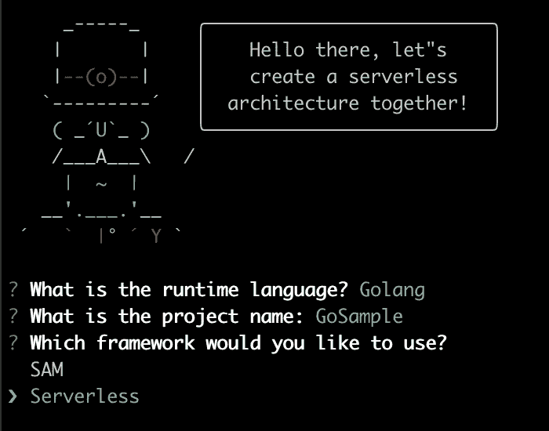
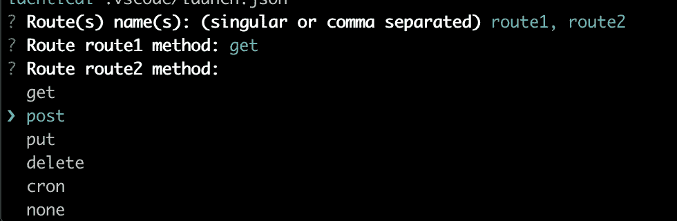
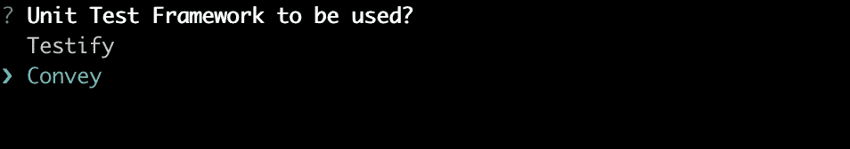
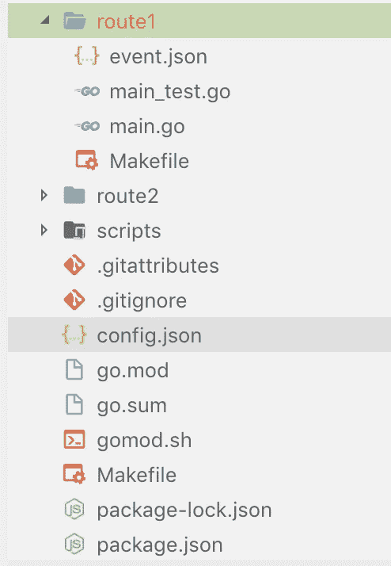
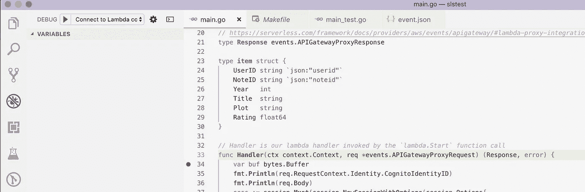

# Go +无服务器离线，Wait Go！是的，它确实被简化了

> 原文：<https://medium.com/hackernoon/go-serverless-offline-wait-go-yes-it-is-really-simplified-1dea663b97d5>


Complicated? Not Anymore!

B ack 在 2018 年，当 AWS 宣布支持 lambda 时，每个人都为这一重大宣布感到兴奋，后来这种支持部分来自不同的框架。然而，随着我们今天拥有的各种框架，如 Serverless、AWS SAM、Apex，甚至是 Terraform 和 CloudFormation 等工具，记住所有这些命令变得非常困难，并且很难切换和迁移到不同的框架。

我一直在市场上寻找一种解决方案，将所有这些框架包装在一个简单而强大的解决方案中，该解决方案统一了调用 lambda 函数或部署到 AWS 的所有命令，而无需记住特定的框架相关命令。不幸的是，每次我切换到使用或尝试不同的框架时，我都会在他们的网站上阅读大量的文档，并使用不同的插件来实现我所寻找的东西。这简直是浪费时间。

**，**因此，我想到了一个主意，将所有这些框架包装在一个简单的解决方案中，该方案根据您愿意使用的框架的选择来生成模板。不仅如此，它还允许您从一个框架切换到另一个框架，例如，如果您选择了无服务器(SLS ),您可以切换到 AWS SAM。

# 先决条件

*   安装[节点](https://nodejs.org/en/download/)
*   安装 [Go](https://golang.org/dl/)
*   安装 Make [ [Mac](https://stackoverflow.com/questions/10265742/how-to-install-make-and-gcc-on-a-mac) ， [Windows](http://gnuwin32.sourceforge.net/packages/make.htm) ， [Ubuntu](https://www.cyberciti.biz/faq/howto-installing-gnu-c-compiler-development-environment-on-ubuntu/)
*   安装 Yeoman，又名 yo，运行以下命令

*$ npm 安装-g 哟*

# 我们走吧

若要创建新服务，请运行以下命令。这应该会问你一些问题，比如语言、单元测试框架、路径及其类型。

```
*$ yo sls*
```

如下面的屏幕截图所示，您可以选择 SAM 或无服务器来管理部署。我计划增加更多的选项，如顶点，地形和云形成。



一旦你按下回车键，这将生成一堆脚本，简化大量繁重的工作，如本地调用、网络管理、调试..等等。

现在，指定您需要添加到服务中的路由，以及您想要用来触发生成底层 lambda 的方法的类型。



最后，指定要在单元测试中使用的框架



如下图截图所示，这是我们搭建的。正如你所看到的，每条*路径*都有自己的目录，在这个目录下会有一个 *lambda* 函数处理程序、简单的测试用例、 *Makefile* 和 *event.json* ，这些都符合你之前选择的路径类型。例如，如果您指定“ *get* ”作为路由类型，这将从 APIGateway 生成 get 类型的事件。此外，生成的项目支持 *GO111MODULES* ，并且捆绑了 *go.mod* 和构建脚本。

最后需要注意的是，route 文件夹下的 *Makefile* 对应的是那个具体的 route，根目录下的 *Makefile* 是针对整个项目的。



# 测试完毕

为了开始测试我们刚刚创建的东西，让我们通过简单地运行

```
*$ make*
```

生成的模板附带了简单的 route func 及其测试用例来运行测试

```
*$ make test*
```

如果我想构建这个项目并调用一个特定的函数，您需要运行下面的代码，来调用在“route1”目录下定义的 lambda 函数，并在同一目录下定义附加的 event.json。

```
*$ make local-invoke func=route1*
```

如果您需要尝试不同的 *event.json* 文件，您可以通过使用以下示例来传递它:

```
*$ make local-invoke func=route1 event=/path/to/event.json*
```

如果您想作为本地 API 运行，请使用以下命令在端口 3000 上启动本地 API

```
*$ make local-api*
```

# 排除故障

大约一年前，当我用 Go 启动 Serverless 时，我发现在本地调试它有很多困难，我必须配置端口并安装 linux 的 *dlv，然后将其移植或安装到一个容器中，然后从 VS 代码附加一个会话。通过一个简单的命令，现在比你想象的要简单。*

```
*$ make debug func=route1*
```

它现在正在侦听端口 8997，等待调试会话的连接。这个项目已经配置好了一切，可以开始工作了。在 VS 代码中打开项目目录，在您的函数中放置一个断点，并转到左侧的*调试*选项卡，然后单击开始调试，如下所示。



# Docker 网络

如果你正在运行一个特定 docker 网络中的 docker 容器，并且你需要你的 lambda 来连接这个容器；例如，如果您在 docker-compose 堆栈中本地运行 DynamoDB，那么它的容器将在一个 *XX* 网络中运行，因此您需要在同一个网络中运行您的 lambda，调用您的函数时只需传递网络参数，如下所示。

```
*$ make local-invoke func=route1 network=XX*
```

# 按指定路线发送

这些标准框架都没有提供任何在创建服务后在服务下添加新路由的方法，这可以通过运行以下命令轻松完成，它会询问您一些简单的问题，如路由类型和要使用的测试框架。

```
*$ yo sls:route*
```

# 部署

确保在 *~/中定义了自己的 AWS 键。*默认*配置文件下的 AWS/凭证*。要部署服务，请运行以下命令。它将根据所选择的框架，使用 serverless.yml 或 template.yml 中定义的所需资源来部署您的服务。

```
*$ make deploy*
```

部署服务后，您可以选择通过运行以下命令来销毁整个堆栈:

```
*$ make undeploy*
```

运行上面的命令将部署并销毁整个服务。但是，在某些情况下，您可能只想部署一个刚刚修改过的函数。如果是这样，通过执行以下命令，将工作目录更改为该路由并仅部署该路由:

```
*$ cd route1
$ make deploy*
```

# 结构

如果你用*无服务器*框架创建了你的项目，你仍然可以在任何时候切换到使用 *AWS SAM* 。以下命令将根据定义的 *serverless.yml.* 为 SAM 生成 *template.yml*

```
*$ make sam*
```

如果您只是想尝试使用 *SAM 调用一个函数，*运行以下命令，该命令接受*事件*和*网络*作为参数，方式与前面使用*本地调用*描述的方式相同

```
*$ make sam-invoke func=route1*
```

最后，这个项目仍在进行中。目前它支持 Go、C#、Python 和 Java，然而，将来会支持不同的特性、框架和语言。

## 如果你喜欢这篇文章，最好是[星，叉，和/或贡献。](http://github.com/msolimans/generator-sls)