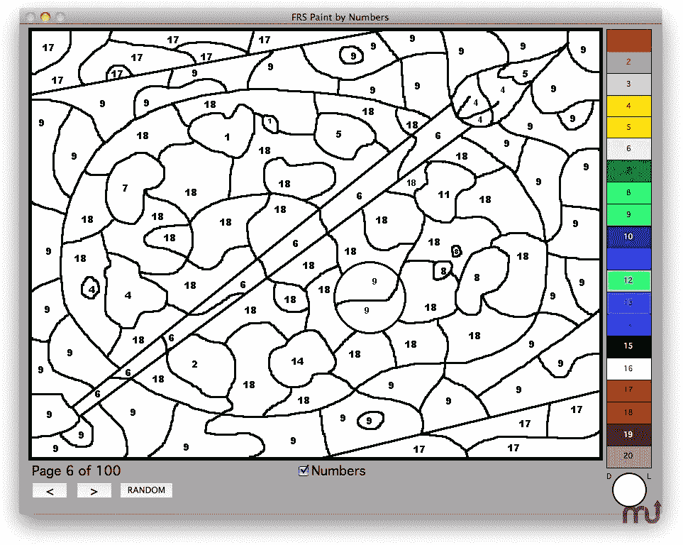

# “走向敏捷”

> 原文：<https://medium.com/hackernoon/going-agile-c9fcce6cb65>

我最近坐飞机，结果坐在一家中型公司的 CEO 旁边。在飞行的大部分时间里，他都在忙着回复邮件，但最后还是停下来喝了一杯。他显然是一位经验丰富的领导人；我立刻有了“这个人可以建立联盟并激励人们”的感觉。我们聊了起来，提到了“我们做了什么”，很快话题就转到了“产品”和“敏捷”上。

我立即感到震惊的是，他对现代产品开发的理解有多少缺失。再说一次，我们在这里谈论的是一位*非常*聪明、热情、脚踏实地的高管，他极度致力于他的团队/公司的成功。

毫无疑问，他的第一个困惑是敏捷。显然，他们已经“走上了敏捷之路”(使用一家咨询公司)，他所说的“他们”指的是他的开发团队、他们的经理以及他们经理的经理。我没有发现他们在资金投入、产品开发和设计方面有任何改变。我感觉到他就是这样被说服的——他们软件开发方法的一个银弹变化，可以弥补“速度慢”和“无法完成重要的事情”。这是一个善意的首席执行官在不完全信息下做他的工作。不喜欢什么？更快。敏捷！规模化！

有四件事最突出的是*缺少*(不仅仅是在他的理解中，而是在他的工程领导的理解中):

1.  与*外部*用户/客户有直接联系的团队
2.  真正的跨职能团队(包括设计师、营销、数据科学等。不仅仅是开发人员)*拥有*一个产品…不是一个主要瀑布过程中的敏捷“构建”阶段。产品而不是项目。一起开始。一起工作。
3.  作为团队的一部分进行产品管理…而不是在团队之外将需求传递给产品所有者。
4.  设计参与问题/解决方案探索的深度，以及促进团队的设计方法(#2 扩展)

然而，退一步说，他确实得到了一些！还有好的部分…

1.  自组织团队通过频繁集成降低风险
2.  “检查并适应”和持续改进的理念
3.  有些人认为管理层的角色发生了变化(但缺乏细节)

*(这些事情中的许多早于敏捷，但这超出了本文的范围)*

我毫不怀疑内部有人试图解释他们所做的是“不够的”，但我猜测他们缺乏一个共享的词汇。此外，我知道(因为他告诉我)在“开发人员”和公司的设计和产品之间存在敌意。设计被告知他们必须“改变以适应新的做事方式”，但是没有被积极地咨询来塑造和“设计”过程。产品被认为是“老派”。我猜测试人员和运营团队也是如此，但我没有验证这一点。

我在这里的观点是，即使有最好的意图，也很容易简单地将你现有的心智模式移植到一些新的方式上。在这位首席执行官的案例中，他非常关心授权给他的团队。这表明…他真的在乎。但他对这如何体现在产品开发中的理解很薄弱。他的工程领导也是如此。他们的目标是以某种方式与企业“达成协议”(用他的话来说)，从而变得更主动、更…敏捷！

这些都不是——敏捷、“产品思维”、设计思维、DevOps、LeanUX 等等。—不做或至少不直接观察就意味着任何事情。据我所知，没有一个成功的团队是完全从一个传统中汲取营养的。这对于那些把 X 当做一切的人来说并不方便，但这是事实。所有这些标签都在某种程度上被用来销售东西，但事情就是这样。

建议？如果你正在考虑某种转变/改变，一定要真正走出去，和跨部门的团队坐在一起。深入。听故事。超越顾问 X 或 Y 所说的(或你朋友所说的)。弄清楚到底发生了什么。

