# 谷歌+加密货币

> 原文：<https://medium.com/hackernoon/google-cryptocurrencies-1017dc0c9795>

## 2019 年谁获得谷歌的加密相关有机流量？

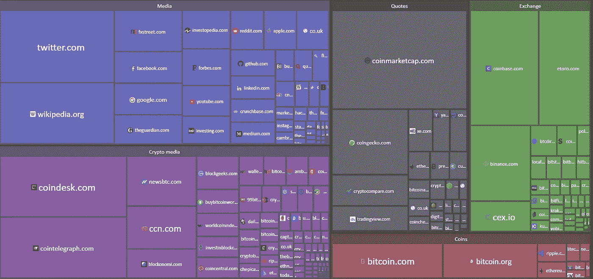

Welcome to the InfoField!

# 序言

加密业务的竞争非常激烈，以至于加密公司/初创公司忽略了实现他们的目标。很多情况下，这种失望是因为无力提升网站排名和获得最甜蜜的有机流量。针对 cryptoprojects 的搜索引擎优化是一个毋庸置疑的要求，尤其是在竞争激烈的情况下。由于许多网络爬虫和社交网络猛犸象禁止网络上的加密技术的发展，在这个竞争激烈的领域做 SEO 变得很麻烦。

> Google.Facebook.Twitter。他们都在 2018 年禁止了他们网络上的加密广告。

# 现在已经快 2019 年年中了，谁获得了谷歌的有机流量？

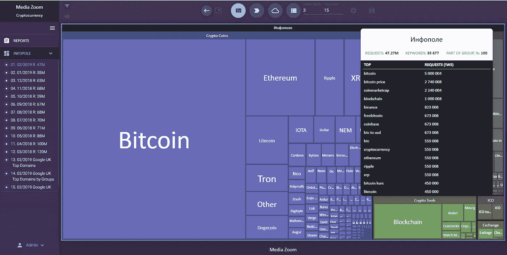

This is how Google organic traffic treemap looks like

> 加密货币[信息字段](https://ifield.mediazoom.net/infopole/6f304ff607f54eb7b30e0e6ce649e2d6/84b7496b93d74b9d88942d40e95958c3)包括:
> 
> 4727 万次搜索查询
> 
> 35677 个关键词

# 结论包#1:

> -比特币、以太坊、Ripple —(它们的关键词组合)获得了 65.5%的有机搜索。它们的位置与大写相匹配。
> 
> - Litecoin (LTC)排在第 5 位，却获得了整个搜索需求的第 4 位。
> 
> - EOS 按 CAP 排名第 6，但搜索需求可以忽略不计。
> 
> 最后一个:
> 
> 缺乏搜索需求=缺乏品牌认知度！

# 第一部分。方法和工具。什么是信息域？

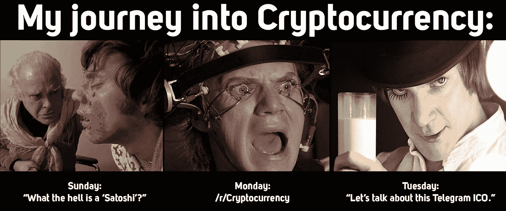

Typical Cryptocurrency Journey looks like this indeed. LOL

人们如何搜索信息？特别是，如果他们对此一无所知，或者只是从他们的同事那里听说了一些新的事情，例如？我敢说，有 95%的可能性，他们会继续谷歌挖掘一些数据。他们会在搜索栏中输入什么？哪些网站会出现(*，为什么？*)在 Google 排名页面(*至少前 20 名*)？他们会登陆哪些网站？哪篇文章会出现在指定的网站上？总的来说，这有点像成熟的客户之旅…

作为一个 CJM *(客户旅程图)*，一个拥有各种类型数据可视化的搜索流量图，在以前是相当少见的。这种可视化地图将成为一种非常有代表性的分析工具，可以作为决策支持系统。

> 例如，营销策略师需要考虑他们相对于竞争对手在网络中的位置，了解他们当前内容策略的优势和劣势，调整和修改它，并决定 26 篇文章的位置。
> 
> 地图显示，关于这个主题的内容不够多，既不好也不坏。所以决定放置 26 篇具有最佳语义的文章。

让我们假设谷歌 SERP 的前 3 名获得 55%的流量

> 为了构建关于任何主题(或小众)的搜索查询的地图，需要收集具有频率的语义查询核心。

然后，在获得语义核心后，我们将对它们进行建模和聚类，然后我们将它们分成组，将品牌需求与非品牌需求分开，按用途和含义分组，最后清除无关的关键字。

最后阶段是构建 [**信息域**](https://ifield.mediazoom.net/infopole/6f304ff607f54eb7b30e0e6ce649e2d6/84b7496b93d74b9d88942d40e95958c3) **。**

## [InfoField 是什么鬼？](https://ifield.mediazoom.net/infopole/6f304ff607f54eb7b30e0e6ce649e2d6/84b7496b93d74b9d88942d40e95958c3)

链接是[这里的](https://ifield.mediazoom.net/infopole/6f304ff607f54eb7b30e0e6ce649e2d6/84b7496b93d74b9d88942d40e95958c3)

InfoField 是一个研究搜索需求的分析工具，基于用户旅程地图(我甚至会说是旅程航程)。

**InfoField 的目的是:**
**1。*降低 CPL.*** 每销售线索成本。我们爱你，有机交通！努夫说。

***2。优化广告预算***

> *注:*
> 例如，在 RTB 平台上购买广告时，您可以通过仅在与广告产品最相关的内容单元中显示广告库存来优化预算。

***3。以最容易理解和描述的形式可视化搜索需求数据。***

***4。通过内容营销增加用户互动数量***

> 注意:
> 
> InfoField 允许突出显示弱的或损坏的内容单元。这些内容单元可能由糟糕的语义组成，或者它们可能是坏的，因此它们获得的有机流量比潜在的要少。

**5。*为在 RTB 平台上购买广告和内容营销制定一份可立即执行的媒体计划。***

> 示例:
> 
> сclient 需要在整合到 Google AdSense 的信息网站上推广一种治疗喉咙痛的药物。反问句:为什么在关于泌尿生殖系统疾病的文章中出现咽喉痛药的广告词？！？！
> 
> 相反，生殖器疱疹药物的广告如果出现在一篇关于治疗咽喉痛的文章中，就不太可能有效。

***6。付费搜索活动。语义核心完成后，最后一步是建立一个活动。***

> 可管理的指标(当然可以改进):
> -增加品牌搜索查询
> -增加网站流量
> -通过分类请求出现在前 20 名搜索引擎结果页面中的 N 个页面。

# 2.让我们开始谷歌搜索吧！

整个语义核心分为以下几组:

## 1.加密硬币

这个集群与比特币、以太坊、Ripple、Tron 等精确币有关。

该集群拥有 70%的整体语义，包括:

关键词: 22 426

**请求:** 33，23M

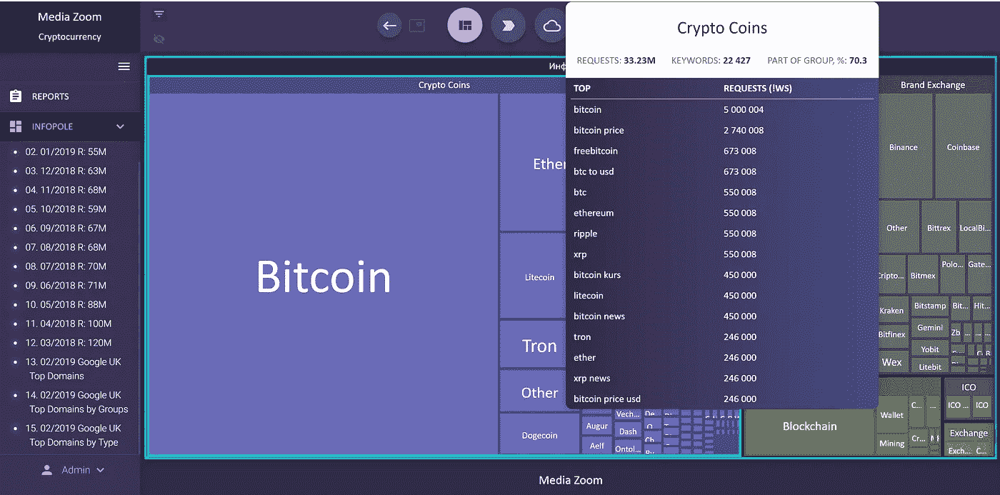

Some visuals on clusterized semantics (Treemap)

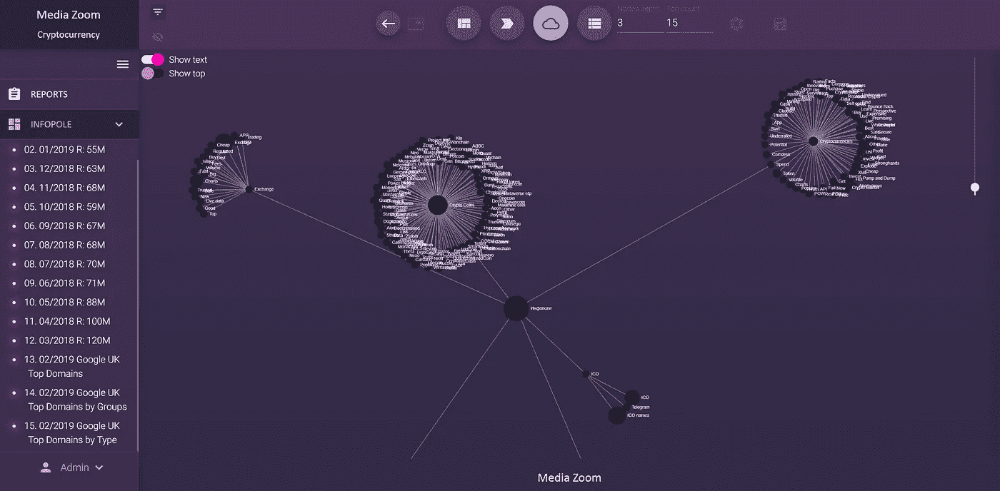

Spheres

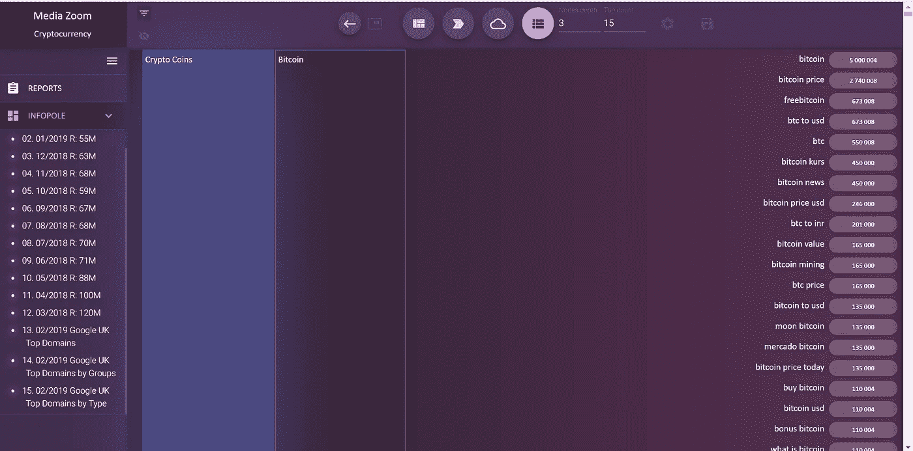

Just a table view

# 所以，让我们看看里面有什么！

# 比特币(BTC)

 [## 比特币——开源 P2P 货币

### 比特币是一种创新的支付网络，也是一种新的货币。找到您需要知道的一切，并开始…

bitcoin.org](https://bitcoin.org/) 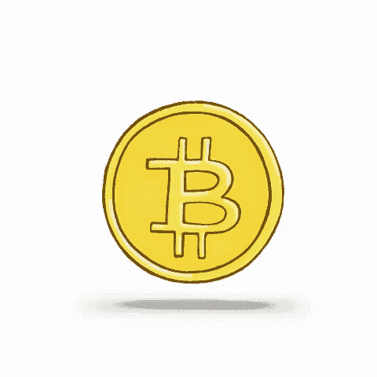

所有密码的爷爷是这里的国王。毫不奇怪，加密货币#1 拥有这个集群的大部分搜索需求。通常，确切地说，比特币是通往区块链科技和加密货币世界的大门。

在过去三年里，产生了大量与比特币相关的内容。

数字会说话:

**请求:**19.69 米

**关键词:** 10 527

**组的一部分，%:** 59.3

下表列出了最受欢迎的关键词及其出现频率:

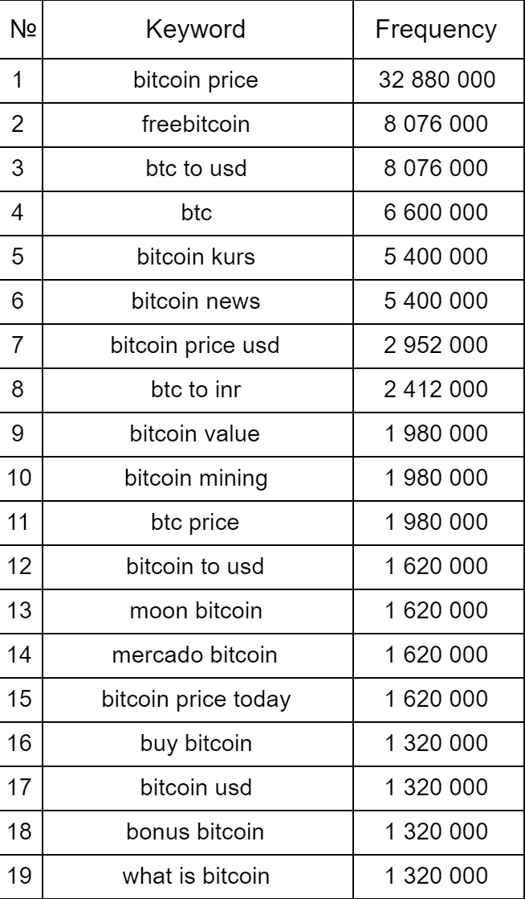

Google outputs very approximated keyword frequency numbers! That’s why see the same numbers in this table. Got nothing to do with that.

***有趣的事实#1:***

关键词“BTC 到印度卢比”出现的频率很高，这让我们知道*对印度很感兴趣。* Google Trends 的说法也一样！

***有趣的事实#2:***

大多数关键字组合包含像“价格”、“价值”、“价格美元”这样的词

**大部分人对 BTC 价格(** *或者可能买了 20k，lol* **)**

# 以太坊

 [## 以太坊

### 以太坊是一个全球性的、分散的资金和新型应用平台。在以太坊上，你可以写代码…

www.ethereum.org](https://www.ethereum.org/) 

不出所料， **ETH 在该集群中排名第二**。

Niiice, nice, very nice!

Vitalik Buterin 的创意，这是一个分散的“谁需要每天有 400 个活跃用户的东西”应用程序的平台(让我们来猜猜:不再需要还是还不需要？)，以及“scammy”代币，在 1930 个关键词上寻找**288 万次请求，占群体的 8.7%。**

*数字:*

**要求:**2.88 米

**关键词:** 1 930 年

**部分组，%:** 8.7

穷人仍然盯着价格，但他们也寻找以太坊工具，如[以太扫描](https://etherscan.io/)或[我的以太钱包](https://www.myetherwallet.com/)。

# 瑞波(XRP)

 [## Ripple —全球汇款的顺畅体验| Ripple

### Ripple 通过 RippleNet 连接银行、支付提供商、数字资产交易所和企业，提供一个…

ripple.com](https://ripple.com/) 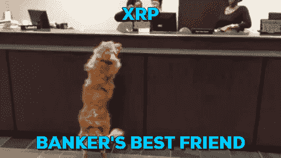

XRP 就是 XRP，对此我无话可说。我知道很多人以每 1 XRP 币 3.5 美元的价格买了这个。可怜的家伙们…

*数字:*

**要求:** 2.3M

**关键词:** ~800

**组的一部分，%:** 7

# 黎明的女神

 [## eosio |区块链软件架构

### 最强大的分布式应用基础设施

eos.io](https://eos.io/) 

EOS。这是最成功的 ICO 之一(EVAH！！！).Buuuut，在搜索需求的情况下，EOS 就不那么成功了。尽管它被 CAP 列为第六名，但它只获得了 0.7%的搜索需求。

请求: 232.78K

**关键词:** 423

**组的一部分，%:** 0.7

其他集群*(不太重要的集群)*:

**3。品牌交流。**

**4。密码工具。**加密钱包、区块链探索者、分析工具和平台、数据提供商等。这里有更多的科技产品。

**5。ICO。**与 ICOs 有关的一切。列表，评论网站，和另一个骗局的东西(开玩笑…还是不？)

**6。交换器。**一些小型交易所和既不是交易所也不是新闻网站的一切。

# 第二部分。所有与加密相关的搜索流量都去了哪里？

所以，第一部分是“开胃菜”，我们对搜索需求进行了研究，并回答了这个问题:“人们搜索什么？”。现在，在我看来，有必要知道:

> 这种搜索需要土地在哪里？
> 
> 哪个网站吸收了这种搜索需求？
> 
> 整个网站还是只是一段内容？

让我们看看谁是媒体、加密媒体、交易所和报价的王者。

## 引用

如果有人在寻找价格、报价和其他定量资料

## # [1。coinmarketcap.com](https://coinmarketcap.com/)

**能见度:** 3，08M，**关键词:** 11 357， **%部分组:9** %

> **这些页面获得最多的搜索需求:**
> 
> -https://coinmarketcap . com/currences/bit coin/
> 
> **知名度:** 920 352 **关键词:** 863
> 
> ——[https://coinmarketcap.com/converter/btc/usd/](https://coinmarketcap.com/converter/btc/usd/)
> 
> **知名度:** 100 521 **关键词:** 102
> 
> ——[https://coinmarketcap.com/currencies/bitcoin-cash/](https://coinmarketcap.com/currencies/bitcoin-cash/)
> 
> **知名度:** 16 455 **关键词:** 148

> 结论:
> 
> Coinmarketcap 是王者，我已经说过了。如果有推广加密相关项目的需要——coinmarketcap 是购买广告的必备资源。
> 
> [这里的](https://docs.google.com/forms/d/e/1FAIpQLSc6ODdnuzoPUe1PxDwGxq0HK9GSEkyzIQQgrVa1k_dxqDdlqQ/viewform)是请求广告报价的 Google 表单。根据我的经验，CMC 提供地理定位和一些其他优化工具。

## [#2。coingecko.com](https://www.coingecko.com/en)

**能见度:** 1，15M，**关键词:** 9 360， **%部分群体:** 3，4%

加密货币报价、分析和其他量化的东西。

广告可在此预订:

 [## 预订活动| CoinGecko 自助广告

### 编辑描述

selfserve.coingecko.com](https://selfserve.coingecko.com/) 

Coingecko 提供了非常酷的广告活动管理器，所以可以随意使用它进行推广。我只发现了横幅式广告清单，但我很肯定他们可以提供其他东西。

> 附言
> 
> 这个手机应用相当不错。

## [#3。cryptocompare.com](https://www.cryptocompare.com/)

**知名度:** 550K，**关键词:** 7 759， **%部分群体:** 1，6%

该网站提供了大量关于采矿设备的信息+一些报价

广告清单可在此处找到:

[https://www.cryptocompare.com/advertise/](https://www.cryptocompare.com/advertise/)

## [#4。tradingview.com](https://www.tradingview.com/)

**能见度:** 444K，**关键词:** 4691， **%部分分组:** 1，3%

我最喜欢的网站之一。看看人们是如何画出一些疯狂的技术分析图，并试图用这些图预测价格的。太搞笑了。

> 你知道技术分析(TA)是骗局吗？确实是！
> 
> 男生通常对他们所做的事情的批评非常激烈。与其说是常识，不如说是崇拜。

广告可以在这里找到:

[https://www.tradingview.com/advertising-info/](https://www.tradingview.com/advertising-info/)

*酷故事:*

有一个叫 DianKemala 的 tradingview.com 用户。在密码泵和所有这些信号的东西，她骗人们加入私人交易俱乐部。信号的钱，废话！

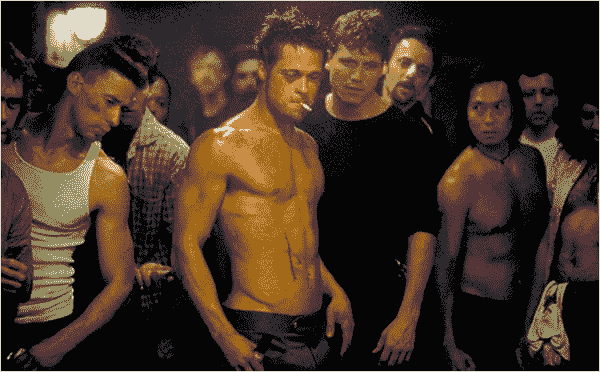

And, of course, there was no club

看看这些评论:

 [## BTCUSD 目标为 4500 到 5000 点

### 我们今天有一个很好的价格行动，在我们之前的分析中表现良好。正如我们所见，斐波那契…

www.tradingview.com](https://www.tradingview.com/chart/BTCUSD/6ljhvtur-BTCUSD-target-at-4500-to-5000/)  [## ETHUSD 更新:为克拉肯:ETHUSD 由 DianKemala

### 在之前的分析中，我们成功地在 210 美元买入，同时出现了熊市交替鲨鱼形态，恭喜^_^今天我们发现了一个新的…

www.tradingview.com](https://www.tradingview.com/chart/ETHUSD/QdCa1Zus-ETHUSD-update/) 

请小心骗局！

## 交换

交易所及其品牌名称。这里很简单。

## #1.coinbase.com

**要求:** 1，82M，**关键词:** 6285，**部分组，%:** 5，5

## [#2。etoro.com](https://www.etoro.com/)

**请求:** 1，37M，**关键词:** 2085，**部分组，%:** 4，1

## [#3。binance.com](https://www.binance.com/)

**请求:** 1，05M，**关键词:** 3365，**部分组，%:** 3，2

## [#4。cex.io](https://cex.io/)

**请求:** 417，55K，**关键字:** 2307，**部分组，%:** 1，3

> 有趣的事实是，etoro.com 比币安用更少的关键词得到了更多的关注。差不多多了 30%。

币安，去找些搜索引擎优化吧！

**加密媒体**

关于加密货币和区块链理工大学的媒体。这里没有火箭科学，只有密码。

## [#1。coindesk.com](https://www.coindesk.com/)

**请求:** 1，83M，**关键词:** 10370，**部分组，%:** 4，3

最显眼的文章:

 [## 比特币价格指数——实时比特币价格图表

### 使用世界顶级加密货币交易所的平均值获得最准确的 BTC 价格，并将硬币与…

www.coindesk.com](https://www.coindesk.com/price/bitcoin) 

**知名度:** 883 913 **关键词:** 1217

 [## 以太坊价格指数—实时以太坊(ETH)价格图表

### 使用世界顶级加密货币交易所的平均值获得最准确的 ETH 价格，并将硬币与…

www.coindesk.com](https://www.coindesk.com/price/ethereum) 

**能见度:** 106 485 **关键词:** 313

广告定价可以在[这里](https://www.coindesk.com/advertising)找到

## [#2。cointelegraph.com](https://cointelegraph.com/)

**请求:** 1，83M，**关键词:** 9342，**部分组，%:** 4，3

吨的广告库存可以在[这里](https://cointelegraph.com/advertise-with-bitcoins)找到

最显眼的文章:

 [## 比特币最新消息| Cointelegraph

### 阅读关于比特币的最新消息，了解关于最受欢迎的加密货币的更多信息。最近的事件，价格…

cointelegraph.com](https://cointelegraph.com/tags/bitcoin) 

**知名度:** 352 177 **关键词:** 52

 [## 比特币(BTC)价格指数|＄8，185 |图表、历史|货币电讯报

### 目前比特币价格为 8185 美元。р实时显示 1 比特币(BTC)对美元(美元)的汇率。图表、指数、比特币…

cointelegraph.com](https://cointelegraph.com/bitcoin-price-index) 

**知名度:** 146 180 **关键词:** 621

## [#3。newsbtc.com](https://www.newsbtc.com/)

媒体工具包可以在[这里](https://www.newsbtc.com/advertising/)找到

最显眼的文章:

 [## 接受比特币的大日子:数十亿美元的零售商欢迎加密

### 许多比特币的批评者经常认为，它偶尔四五位数的价格点是完全不合理的，因为…

www.newsbtc.com](https://www.newsbtc.com/2019/03/19/bitcoin-crypto-acceptance/) 

**知名度:** 259 001 **关键词:** 6

 [## IBM World Wire 放松银行，看好 Ripple (XRP)

### 涟漪价格持平恒星-IBM 的合作伙伴关系和推出世界有线看涨交易量必须飙升至 60 以上…

www.newsbtc.com](https://www.newsbtc.com/2019/03/20/ibm-world-wire-loosen-banks-bullish-for-ripple-xrp/) 

**知名度:** 104 686 **关键词:** 15

## 媒体

是的，上等的。

## [#1。https://www.fxstreet.com](https://www.fxstreet.com/)

最显眼的文章:

 [## 比特币技术分析— FXStreet

### 查看我们更新的比特币技术分析，包括实时更新、新闻和最新经济事件，来自…

www.fxstreet.com](https://www.fxstreet.com/cryptocurrencies/bitcoin) 

**知名度:** 229 912 **关键词:** 53

 [## 比特币概述:一旦 4000 美元被清算，6000 美元成为可能——Tone Vays

### BTC/美元在再次试图突破 4000 美元后锁定在一个区间内，Vays 预计在此之前将向 6000 美元移动…

www.fxstreet.com](https://www.fxstreet.com/cryptocurrencies/news/bitcoin-overview-6-000-becomes-a-possibility-once-4-000-is-cleared-tone-vays-201903200609) 

**知名度:** 82 964 **关键词:** 6

## [#2。theguardian.com](http://theguardian.com)

最显眼的文章:

 [## 比特币|科技|卫报

### 比特币之类的东西很可能一文不值——但有一天它们可能会变得有价值

www.theguardian.com](https://www.theguardian.com/technology/bitcoin) 

**能见度:** 375 868

**关键词:** 21

 [## 区块链提供炒作还是希望？

### 对于许多科技业内人士来说，比特币最令人兴奋的是让它发挥作用的东西:区块链。什么…

www.theguardian.com](https://www.theguardian.com/technology/2018/mar/10/blockchain-music-imogen-heap-provenance-finance-voting-amir-taaki) 

能见度:44 950

**关键词:** 2

 [## 比特币和加密货币——数字货币对我们的未来意味着什么

### 比特币等数字货币引发了金融狂潮。亚历克斯·赫恩解释了它们是什么，以及这是否…

www.theguardian.com](https://www.theguardian.com/technology/2018/jan/29/cryptocurrencies-bitcoin-blockchain-what-they-really-mean-for-our-future) 

**能见度:** 33 165

**关键词:** 14

# 第三部分。结尾部分

如果您想让您的加密相关内容可见，请确保使用:

1.  *SMM*

*   使用 Twitter

能见度:1.95 米

**关键词:** 7 369

**部分群体:**6.5%

很难给出一个确切的例子来说明哪个 twitter 获得了搜索流量，但是相信我——Twitter 对于加密来说是很棒的。

*   使用脸书

最近的新闻——Facebook 已经解禁了加密广告，但是唯一的信息+教育。直接广告仍然被禁止。

*2。SEO +内容营销*

做搜索引擎优化是非常重要的加密项目。花些时间(*和金钱*)做出有好语义的好内容。

*3。公关*

在顶级媒体上购买一些 PR——包括特定加密和经典加密。他们现在获得了大量的有机流量

# 第四部分。那哈克农呢？

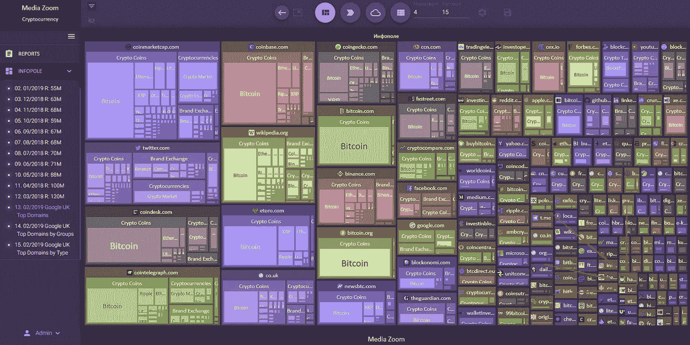

There it is!

# 嗯……那 HackerNoon 的度量呢？

概述:

**能见度:** 46，07K **关键词:** 2154，**部分组，%: 0，1**

***URL，获取糖果(我指的是有机流量):***

**#1**

 [## BitMEX 杠杆交易快速入门指南

### 2019 年 3 月 31 日消息:AntiLiquidation.com 是一个 BitMEX 反清算工具&头寸计算器。这个免费工具将…

hackernoon.com](https://hackernoon.com/a-quick-starter-guide-to-using-leveraged-trading-at-bitmex-5383de4cb320) 

**知名度:12 417 关键词:** 14

**#2**

 [## 加密货币-黑客正午

### 在黑客正午阅读关于加密货币的文章。黑客如何开始他们的下午？

hackernoon.com](https://hackernoon.com/tagged/cryptocurrency) 

**知名度:2 750 关键词:** 1

**#3**

 [## 以太坊硬叉更新君士坦丁堡是怎么回事？

### 这对我意味着什么？

hackernoon.com](https://hackernoon.com/what-is-going-on-with-the-ethereum-hard-fork-update-constantinople-f453af698c0c) 

**知名度:1 863 关键词:** 6

# 结论:

所有必要的信息都已经在文章里了。所以试着回答这个问题:

> hackernoon 如何提高自己在谷歌的知名度？
> 
> *提示:语义核心+内容关键词+关键词频率

我知道答案。你知道吗？大家来对比一下评论区的回答吧！

**亲爱的读者！**

请随意按下**按钮！**

> 提示:一篇文章最多可以有 50 个掌声。

非常感谢阅读和鼓掌！

亚历克斯