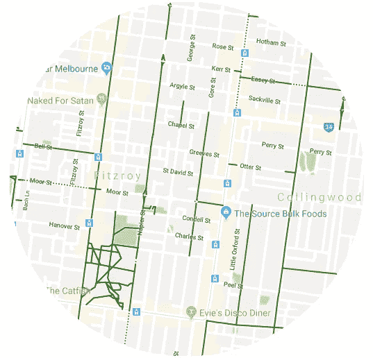

# 谷歌地图对骑自行车的人来说很糟糕

> 原文：<https://medium.com/hackernoon/google-maps-sucks-for-cyclists-bb05b1bcb2c0>

## 但不需要一直这样。

别误会，我喜欢谷歌地图。这是一项近乎奇迹的服务，它给了我极好的驾驶方向、公共交通时刻表和步行路线。世界各地。免费的。

然而，当我试图得到骑自行车到穿过城镇的一个短距离商店的方向时，我遇到了一些问题。我插上耳机，放下手机，很快就被指引左转到一条四车道的高速公路上。

Never mind that Maps’ network of cycle lanes are a disjointed nightmare

问题的根源在于,**地图将骑自行车的人视为多了几条道路的汽车，而不是一种独特的交通方式。“地图”忽略的主要区别是:**

1.  骑自行车的人往往对他们选择的道路更加挑剔，在交通和速度方面坚持自己的舒适区。给所有骑手相同的路线忽略了这一点。(例如,“地图”将[市内自行车事故最多的路段](https://www.theage.com.au/national/victoria/melbournes-worst-streets-for-bike-crashes-20160226-gn4sox.html)显示为“自行车友好路线”,因为它有标记的自行车道)
2.  除非你把手机放在车把上，否则你无法在屏幕上看到路线概览。这使得骑手无法衡量他们在整个路线上的进展，导致许多人靠边停车，以确保他们在正确的轨道上。

最后一个问题是，我采访过的少数骑自行车的人(和我自己)已经知道如何在他们的城市里走动。如果要求他们向任何方向骑行，他们可以安全地使用他们发现的道路、自行车道和捷径，利用侧街，继续通过死胡同，穿越电车线——所有这些行动地图可能永远不会建议或知道是可能的。他们根本不需要路线指引。他们只需要地图告诉他们**往哪个方向骑，什么时候停下来。**

解决方案:只需给出这些信息！如果用户愿意戴着耳机乘车，可以使用简单的基于语音的界面，并且屏幕上的界面可以提供指向目的地的箭头，如果用户将电话放在视线范围内，就可以一目了然。

现在，我可以祈祷地图团队中的某个人读到了这一点，同意并内置了这些可以说非常简单的功能。我不喜欢这种情况发生的几率，我也不想花 200 美元买一个硬件解决方案，因为我的手机已经具备了所有必要的功能。

所以我开发了这个*公认低于平均水平的*应用。

Live cycling demo

如上所述，一旦用户输入目的地，该应用程序将开始提供方向:口头指示如何改变他们当前的路线以及他们要骑多远，同时屏幕上有一个箭头指向目的地。

## 细节

该应用程序是用 Swift 编写的，使用内置的位置、地理编码和文本到语音转换服务。在这一阶段，给出的方向是不明确的，不包含道路布局的知识。这隐含地假设用户正在一个基本上不间断的街道网络中导航，没有需要他们采取迂回路线的大障碍。

Water hazards are not accounted for

虽然指示是愚蠢的，但口头指示的时间被调整，以平衡提供令人放心的更新频率和不超级烦人。当用户接近目的地时，以及当他们的航向偏离他们接收到的最后一个指令时，指令的频率增加。这旨在保持指令的被动，允许用户在应用程序提供帮助的同时骑行自己的路线。

如果反馈是积极的，则有可能使用来自 [Strava](https://www.strava.com/heatmap#11.05/144.85966/-37.85008/hot/all) 或其他服务的历史数据，将用户带到期望的大致方向的道路建议纳入其中。

如果你想尝试一下这种导航方式，代码可以在这里[下载](https://github.com/Gholtes/cyclingNavigationApp)并使用 Xcode 安装。

如果你正在读这篇文章，为你坚持到最后而欢呼吧！我希望你有美好的一天！👍