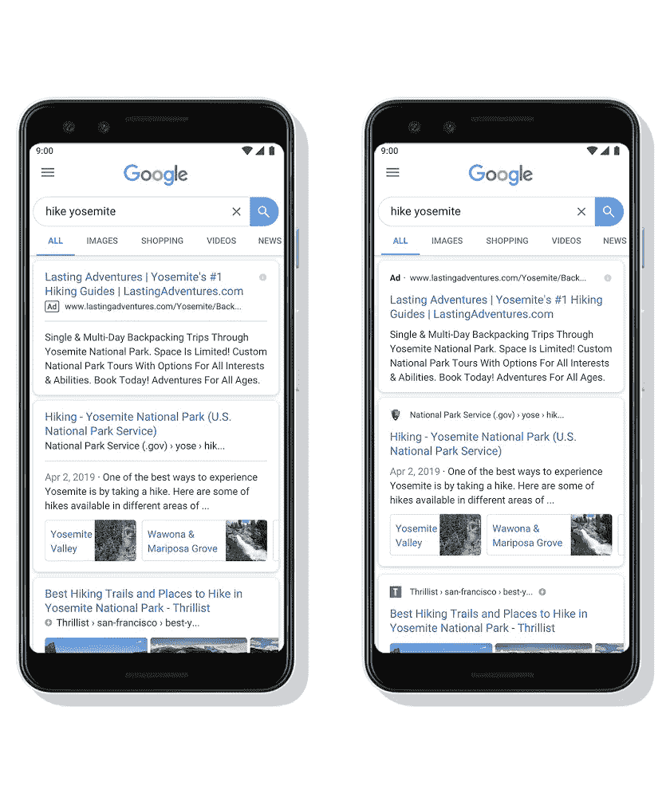
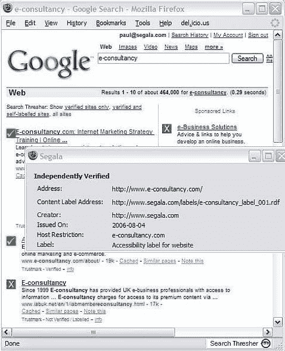

# 谷歌移动搜索结果的新外观可能会吸引人们去钓鱼

> 原文：<https://medium.com/hackernoon/googles-new-look-for-mobile-search-results-will-likely-attract-people-to-phishing-scams-85bc9c0802c9>

今天，谷歌发布了移动搜索结果页面的视觉更新，通过在搜索结果中显示一个图标来“更好地引导你浏览网上可用的信息”。你可以在 TechCrunch 上阅读更多关于 T2 的信息。

如今，威胁者比以往任何时候都更多地使用免费自动颁发的 DV 证书来欺骗用户相信他们的假冒网站。每个人都被训练在寻找网站信任相关信息时寻找浏览器挂锁。90%的新钓鱼网站显示挂锁，而 43%的恶意软件网站显示锁。因此，曾经是一个可靠的信任指标，已经变成了欺诈，数据泄露和其他形式的伤害的陷阱。

威胁者会竭尽所能，诱骗人们相信他们的网络钓鱼诈骗，尤其是免费且简单的网络钓鱼诈骗。

# 我称之为

我预测，我们很快就会看到网络钓鱼欺诈使用搜索结果中的 favicon 来吸引人们对他们网站的注意，而不是真正的网站——大公司不太可能很快采用这一新功能，所以坏人有时间进入。

我对浏览器和搜索引擎中的视觉指示器以及人们对它们的反应有 15 年的经验。我的 R&D 始于 2004 年，当时我参与创建了 URL 分类和内容标签的 W3C 标准。下面是我的第一家公司在 2006 年开发的一个浏览器插件——被 W3C 正式认可为语义网的最佳实现之一。

在 MetaCert，我们提供新的绿色信任盾，让您始终知道哪些链接可以安全打开，哪些网站和其他互联网地址可以信任。

我的观点是，当人们看到某种视觉指示器时，他们通常会感到更安全。你可以在你网站的页脚放一个泰迪熊的图标，有些人会觉得这代表了某种信任。想象一下 Dropbox favicon 被谷歌搜索结果中的网络钓鱼诈骗所利用——当然，许多人会立即认为这是合法的。然后当他们看到免费的 SSL 证书显示浏览器挂锁？一定是真的。🤦‍♂️

时钟现在开始…⏳

就我个人而言，我希望看到谷歌停止玩弄别人的内容，只显示搜索结果。如果他们想增加真正的价值，提供更多有意义的信息怎么样——这里有一些例子；哪些网站对儿童是安全的？哪些网站使用加密？哪些网站符合隐私最佳实践？哪些网站提供免费内容？哪些网站已经验证了身份？