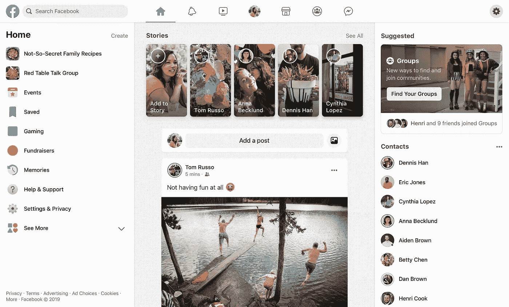
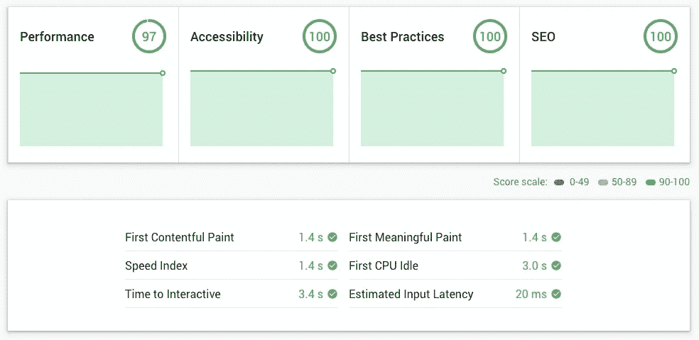
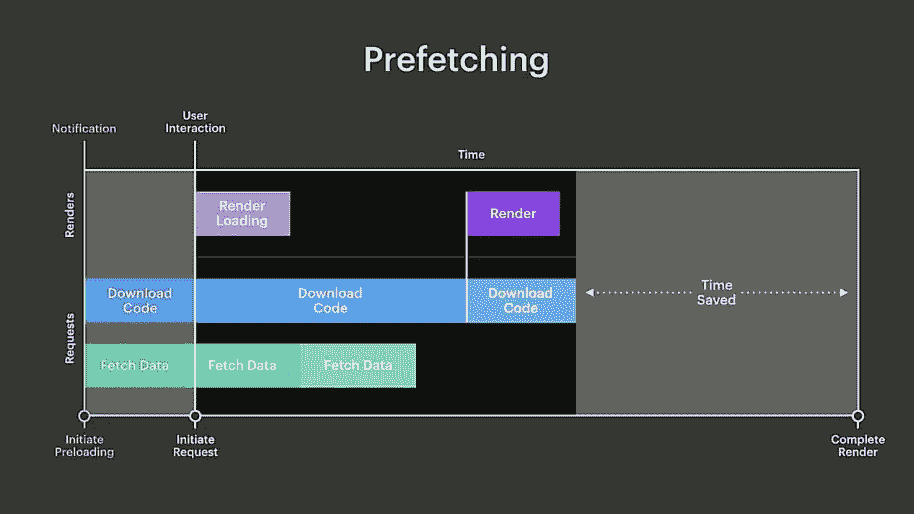
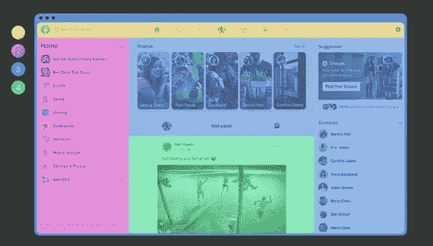
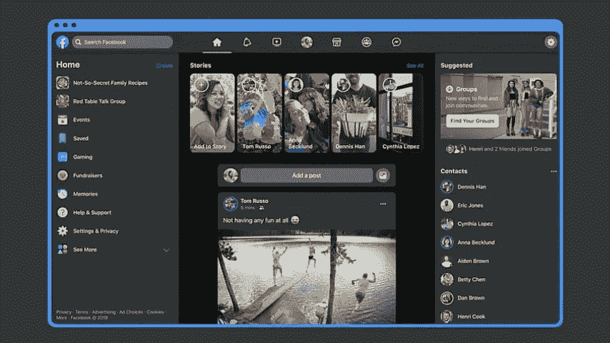

# GraphQL 和 Relay:它们是什么，为什么重要？

> 原文：<https://medium.com/hackernoon/graphql-and-relay-what-are-they-and-why-do-they-matter-d8dfcc3ce2ac>


Photo by [Alex Haney](https://unsplash.com/@alexhaney?utm_source=medium&utm_medium=referral) on [Unsplash](https://unsplash.com?utm_source=medium&utm_medium=referral)

在 F8 的活动上，脸书宣布对脸书应用程序进行全面改造。新的应用程序不仅仅是重新设计，它采用了最新的技术，并为可扩展性而构建，以提供更好的用户体验。

[脸书](https://hackernoon.com/tagged/facebook)拥有**超过 20 亿月活跃用户**。想想看:20 亿😳。但是，脸书也有问题——除了隐私和错误信息。事实上，当前的脸书是建立在传统基础设施之上的。我们不得不承认，在 UI 方面，以及关于网站如何构建方面，这有点麻烦。例如，即将过时的脸书主页有一个 2.4 Mb 的未压缩 CSS 文件。如果你想要比较的东西，这有点像一个糟糕的 Wordpress 主题🙈

# React、GraphQL 和 Relay 的全新开始

脸书需要一个新的开始，以摆脱遗留的基础设施。这就是他们开始研究 React、GraphQL 和 Relay 等技术的原因。



在 F8 2019 上展示的全新脸书设计由**一个由 React、GraphQL 和 Relay** 支持的单一网页应用组成。在撰写本文时，React 在 Github 上有 [128，393 颗星。所以它有一个巨大的社区，许多网站都是用这种技术建立的。我不会在这里做太多评论，因为 F8 大会上的重大声明主要是关于 GraphQL 和 Relay……它们与 React 一起使用来简化数据获取。例如，当你(用户)打开脸书主页并加载你的时间线时，就会发生数据抓取。但是 GraphQL 和 Relay 是什么呢？](https://github.com/facebook/react)

# GraphQL 是什么？

**GraphQL 是一种声明式查询语言，用于在服务器上请求数据。**如何在后端存储数据并为所有服务器数据提供统一的类型安全层是不可知的。随着时间的推移，它可以被多个客户端轻松查询。

GraphQL 用于为新款 Facebook.com 提供动力。你想知道为什么我的网站加载这么快吗？因为**我用盖茨比**。经过 [@endiliey](https://twitter.com/endiliey/status/1125238983007432709) 在 Twitter 上的澄清，看起来 Gatsby 只在构建时使用 GraphQL。所以 **GraphQL 充当数据管理层**。这个网站之所以快，是因为它在幕后做了[各种优化](https://www.gatsbyjs.org/docs/behind-the-scenes/)比如预取、待定导航、图片优化等等。

顺便说一下，如果你想测试一个网站的性能，你可以使用 [web.dev](https://web.dev/measure) 来完成。很棒(而且免费！)工具由 [Google](https://hackernoon.com/tagged/google) 提供。这是我最新的审计报告:



好了，现在回到 GraphQL。下面是一个包含在我的博客文章页面末尾的语法示例:

```
export const pageQuery = graphql`
  query BlogPostBySlug($slug: String!) {
    site {
      siteMetadata {
        title
        author
      }
    }
    markdownRemark(fields: { slug: { eq: $slug } }) {
      id
      html
      timeToRead
      frontmatter {
        title
        date(formatString: "MMMM DD, YYYY")
        spoiler
      }
      fields {
        slug
        langKey
      }
    }
  }
```

GraphQL 本质上是你的 API 的查询语言。GraphQL“为您的 API 中的数据提供了完整且可理解的描述，**让客户能够准确地要求他们需要的东西，仅此而已**，使 API 更容易随着时间的推移而发展，并支持强大的开发工具(…)而典型的 REST APIs 需要从多个 URL 加载，**graph QL API 在一个请求中获得您的应用程序需要的所有数据**。使用 GraphQL 的应用程序即使在移动网络连接缓慢的情况下也能很快运行。”而接力呢？

# 什么是接力？

Relay 是浏览器中用于获取 GraphQL 数据的 JavaScript 客户端。Relay 是由脸书开发的 JavaScript 框架，用于在 React 应用程序中管理和获取数据。为了支持像脸书这样的复杂应用程序，它在构建时考虑了可扩展性。GraphQL 和 Relay 的最终目标是交付即时 UI 响应交互。

**一个脸书页面包含几个元素和 React 组件，它们有不同的数据需求。GraphQL 允许在一个顶级查询中列出生成页面所需的所有数据。因此，我们通过在一次往返中查询我们需要的数据来避免网络发送多个请求。**

但是如果我们想在几个页面中使用一个组件(例如脸书邮报)呢？我们需要确保组件出现的所有页面上的查询都得到了更新，否则我们最终可能会获取过多或不足的数据。这是一个可持续发展的问题，这就是接力的用武之地。**有了继电器，组件和它们的数据要求不再分离。**组件的数据需求在组件内部声明。**这意味着组件声明它们需要的数据。**

以下是脸书邮报组件的一个示例:

```
function Post(props) { const data = useFragment(graphql`
		fragment Post_fragment on Post {
			title
			body
		}
	`); return (
		<Title>{data.title}</Title>
		<Body bodu={data.body} />
	);
}
```

Relay 有助于确保组件在呈现时拥有所需的数据。因此，我们知道任何给定页面需要什么数据，即使数据需求会随着时间而变化。**在新脸书，接力赛随处可见。**

# 使用 GraphQL 和 Relay 预取和并行化工作

使用**传统抓取**，我们:

1.  下载代码
2.  提取数据时呈现代码
3.  呈现最终内容

**GraphQL 和 Relay 允许并行化预取工作**，这允许更快的加载时间。基本上，我们:

1.  下载代码，同时获取数据
2.  呈现最终内容



# 带中继的延迟查询

**中继也允许延期查询**。这对于呈现像脸书新闻提要这样的页面特别有用，在那里您可以找到一长串帖子，**因为您需要定义优先级，以便将一些数据定义为我们需要的最关键的数据。**

下面是一个使用中继的延迟查询的示例:

```
fragment HomepageData on User {
	name // Most critical data
	first_post { ... } // Most critical data ...AdditionalData @defer // Less critical data}
```

通过这样做，**服务器可以在单独的有效载荷中尽可能快地传递数据，而不需要完成整个查询。因此，希望能够更快地显示内容。**

# 利用数据驱动的代码分割来调度数据的传递

有许多类型的脸书职位。它们主要包含文本、图片、视频等等。组件需要知道何时呈现帖子的哪个变体。一般来说，我们倾向于下载最终不会用到的不必要信息。这对最终用户来说是浪费时间……(对脸书来说也是浪费金钱🙊 ).

为了避免预先下载所有资源，需要一种策略，以便仅在需要时下载资源。

**使用传统的惰性抓取，您下载初始资源，然后在单独的请求中下载所需的额外资源。但是这会极大地损害页面加载性能，从而影响整体用户体验。**

例如，如果我们使用惰性抓取，脸书时间轴上的第一个帖子应该是一个视频，那么渲染视频所需的额外资源将在最后加载。

由于对匹配类型的查询，GraphQL 有助于下载所需的*精确的*资源。如何？通过模拟用户界面的不同变化和描述文章的类型。

以下是匹配类型的查询示例:

```
... on Post { ... on PhotoPost {
		photo_data // Request photo data if the post is a photo post
	} ... on VideoPost {
		video_data // Request video data if the post is a video post
	} ... on SongPost {
		song_data // Request song data if the post is a song post
	}}
```

但是这里有一个问题，因为我们仍然需要等待开始渲染的时刻，然后才能获取额外的代码来加载我们示例中的照片、视频或歌曲…咄！这就是接力赛的用武之地。

**Relay 增加了数据驱动的代码拆分。这意味着我们可以指定需要哪个组件代码来呈现与特定类型匹配的数据。**下面是一个例子:

```
... on Post { ... on PhotoPost {
		@module('PhotoComponent.js') // Download the photo component code if the post is a photo
		photo_data // Request photo data if the post is a photo
	} ... on VideoPost {
		@module('VideoComponent.js') // Download the video component code if the post is a video
		video_data // Request video data if the post is a video
	} ... on SongPost {
		@module('SongComponent.js') // Download the song component code if the post is a song
		song_data // Request song data if the post is a song
	}}
```

因此，我们可以更快地呈现数据。让我们来看看 A/B 实验中代码拆分的另一个例子:

这是做 A/B 实验的老方法:

```
function MyComponent(props) {
	...
	if (InExperiment('AB')) // We determine that we are doing an A/B experiment in the middle of the code
		import('Feature'); 
	...
}
```

这是做 A/B 实验的新方法:

```
const Feature = importCond('AB', 'Feature'); // We do a quick check at the beginning of the request to see what the user needs
function MyComponent(props) {
	...
	if (Feature)
		Feature.use();
	...
}
```

# 中继本地缓存

**Relay 还保存了我们目前获取的数据的本地内存缓存。**因此，当我们需要从服务器获取数据时，如果我们有已经存储在本地的数据，我们可以重用它，以便在用户执行操作和呈现页面时立即向用户提供反馈。随着从服务器获取的数据越来越多，我们可以显示更多的内容。

# 服务器端渲染

为了更快地加载页面，脸书正在服务器端尝试各种优化。为了检测代码大小改进的机会，对每个页面的代码大小进行分析。关于这个话题，脸书展示了一款名为 JS Graph Explorer 的工具。我理解在扩展时拥有这样一个工具的重要性，但是现在我对 GraphQL 和 Relay 更感兴趣🙃。

# CSS 和原子样式表

旧脸书网站发送了太多的 CSS。这些年来，它变得非常沉重。记住，主页的未压缩大小为 2.4 Mb🙈。

这就是 CSS 在大多数网站和老脸书上的样子:

```
<Component1 *classNames*=".class1"/>
<Component1 *classNames*=".class2"/>.class1 {
	background-color: var(--fds-active-icon);
	cursor: default;
	margin-left: 0px;
}
.class2 {
	background-color: var(--fds-gray-25);
	cursor: default;
justify-self: flex-start;
	margin-left: 0px;
}
```

**上面代码片段中的问题是规则在样式表中重复，这意味着浪费字节。相反，新的脸书将生成原子样式表，这意味着每个规则将只定义一次。**下面是一个例子:

```
<Component1 *classNames*=".classA .classC .classD"/>
<Component1 *classNames*=".classA .classB .classD .classE"/>.classA { cursor: default; }
.classB { background-color: var(--fds-active-icon); }
.classC { background-color: var(--fds-gray-25); }
.classD { margin-left: 0px; }
.classE { justify-self: flex-start; }
```

因此，**无论我们在一个网站上有多少组件和样式表，CSS 的数量都会稳定在某个水平**。

# 新的反应暂停组件改善了载入体验

最佳实践是按照我们阅读的顺序**加载内容:从上到下，从左到右。**



**从历史上看，很难在加载内容的同时遵循这一最佳实践，但名为 React Suspense 的新 React 组件将有助于做到这一点**。

假设我们有一个帖子，我们将它包装在 React 悬念边界中，就像这样…

```
<React.Suspense
fallback={<MyPlaceholder />}> // Loading state
	<Post> // Full content
		<Header />
		<Body />
		<Reactions />
		<Comments />
	</Post>
</React.Suspense>
```

…如果我们显示加载状态或全部内容，那么 **React 可以协调。悬念边界的工作方式类似于 JavaScript 的 try-catch:**

1.  React 将尝试呈现内容。
2.  如果帖子中的某个组件尚未加载(例如带有图像的正文)…
3.  …然后用户将看到占位符的加载状态。
4.  然后，当内容准备好时，加载状态被最终内容替换。

**React boundaries 简化了代码的加载方式。好的一面是…它们可以嵌套🔥因此，我们可以创建我们正在寻找的自上而下和自下而上的体验。**


# CSS 变量

它们可以用于主题化…尤其是黑暗模式😈



下面是一个 CSS 变量的例子:

```
--white: #FFFFFF;
color: var(--white);
```

# 结论

伟大的用户体验(UX)始于伟大的开发者体验(DX)。像脸书、谷歌和 Salesforce 这样的公司对此非常了解，他们分享了很多他们的研究工作和最佳实践。像 React、GraphQL 和 Relay 这样的技术每个人都可以使用，这就是我在这里写这些技术的原因。时间会证明一切，但我认为这些技术有一个巨大的社区，并将在未来为许多网站提供动力。他们有很强的优势。我已经在使用 React 和 GraphQL 了，但我真的很有兴趣了解更多关于 Relay 的知识，并希望通过在我的网站上实现它来获得更多经验，因为它将在内容方面有所增长。如果你想深入了解，我在下面提供了链接。

如果你想要更多这样的故事，请查看[我的博客](https://pierrerognion.com/)。

# 来源和链接

*   脸书中继:[中继一个 JavaScript 框架，用于构建数据驱动的 React 应用](https://facebook.github.io/relay/)
*   脸书接力(Github): [脸书/接力](https://github.com/facebook/relay/graphs/contributors)
*   关于脸书新设计的文章:[脸书正在围绕人们实际上喜欢使用的两个部分重新设计其核心应用](https://www.theverge.com/2019/4/30/18523265/facebook-events-groups-redesign-news-feed-features-f8-2019)
*   视频:[12 分钟后 F8 2019 主题演讲](https://www.youtube.com/watch?v=UtxPdezclYw)
*   F8 2019 视频——构建新的 Facebook.com: [开发者的脸书——用 React、GraphQL 和 Relay 构建新的 facebook.com](https://developers.facebook.com/videos/2019/building-the-new-facebookcom-with-react-graphql-and-relay/)