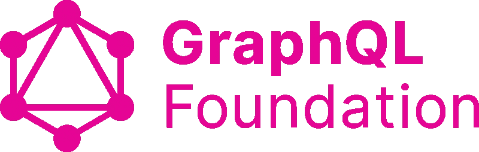
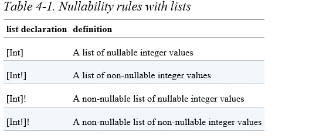
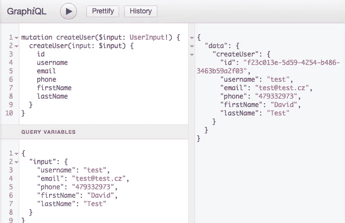

# 十分钟后 GraphQL。我希望有人在我开始的时候告诉我

> 原文：<https://medium.com/hackernoon/graphql-in-10-minutes-thing-i-wish-someone-told-me-when-i-started-12a598e40001>



**首先，相对于休息服务的优势**

想象一下，你有一个管理人员列表的 web 应用程序。他们每个人都有几个朋友。这就变成了一个“图”,这是一个 CS 数据结构术语，用于描述通过定向或不定向关系链接在一起的项目。

如果是为了 REST API 设计，我可能不得不写一些类似于`get-people-by-id`、`get-people-friends-count-by-id`和`get-people-friends-details-by-id`的东西

如果你想得到所有的数据，你要么必须进行 3 次调用来得到上述所有的信息，要么你在服务器端把这 3 件事结合起来，然后不管用户要求什么都返回。这就是所谓的`**over fetching**` 和`**under fetching**`

GraphQL 解决方案看起来更加优雅。
对于这种情况，我们只需要人的基本信息，没有任何细节

```
query {
  People(id: 123){
    name
    age
  }
}
```

对于这种情况，我们需要更多信息

```
query {
  People(id: 123){
    name
    age
    friendsCount
    friends{
      name
      age
    }
  }
}
```

更好的是，我们可以深入到朋友关系的循环洞里

```
query {
  People(id: 123){
    name
    age
    friendsCount
    friends{
      name
      age
      friends{
        name
        age
      }
    }
  }
}
```

**GraphQL 基本构建模块:类型、查询、变异和订阅**

类型就像我们人类语言中的物体或名词。在上面的例子中，People 只是一个类型，它应该是这样的:(！意味着它是必需的)

```
type People {
  id: ID!
  name: String!
  age: Int
  friendsCount: Int
  friends: [People]
}
```

要描述一个列表，可以像 javascript 一样使用[]语法。以下是更多细节



**查询**的例子如上一段所示，这就像一种使用描述方式的查询语言。

**突变**是根据类型更新/更改/删除/添加数据

```
mutation {     
   addPeople(name: "John Doe" age:21) {
         id
         age
         name
  }
}
```

**订阅就像消息系统中的发布/订阅方式。在大多数流行的 GraphQL 服务器实现中，它们是使用 WebSocket 和一些支持发布/订阅的解决方案来实现的，如 Redis 等
我们可以使用 GraphQL 订阅来构建一个聊天应用程序，而无需知道它是如何使用 Websockets 实现的，非常简洁。**

以下要点很容易被忽视，但却非常重要

1.  类型、查询、变异和订阅是在模式中定义的，就像数据库的创建模式脚本一样。
    都是以单词`**开头的类型**

```
type Subscription {
  messageAdded(channelId: ID!): Message
}
type query{
  allPeople: [People]
}
type mutation{
  addPeople(name:String! age:Int): People
}
```

2.在你的 app 客户端或者 GraphQL 或者 GraphQL Playground 等客户端工具中，使用查询、变异、订阅等命令。

简而言之，首先使用`type query` `type mutation`和`type subscription`定义它们，然后在客户端使用它们

不要像我以前一样被他们的客户端用法语法和模式定义语法弄糊涂了:)

```
subscription {
  messageAdded(channelId: 1) {
    id
    text
  }
}
```

3.查询、变异和订阅都可以带参数。看起来是这样的

```
query getPhotos($filter:PhotoFilter $page:DataPage $sort:DataSort) 
{
   allPhotos(filter:$filter paging:$page sorting:$sort){ ... }
}
```


Wearing double socks

当我开始的时候，我认为那些 addPeople(name:String age:Int)的东西是参数，为什么我们需要那些$xxx 的东西。
不就像男人穿双袜子一样吗？

实际上那些美元..类似上面的 getPhotos 命令是针对**客户端**的，allPhotos 命令是针对**服务器**的。这确实有助于我理解语法，希望它对你也有意义。所有照片(…)将被发送到服务器，以便它可以解析答案并发回结果。
在客户端(App 客户端代码或 GraphiQL 工具)，您可以提供如下参数(输入变量)

> 注意，您可以在工具的左下角为上面的突变语句中的$input 变量提供变量。那个用户输入！是一个**输入类型**，只是另一个用于输入变量定义的类型



4.上面列出的所有参数和类型元素，如 id、用户名、电子邮件、电话，都由空格或新行分隔，而不是逗号。

注意下面的查询/突变语句，是空格，不是逗号

```
allPhotos(filter:$filter paging:$page sorting:$sort)
```

这很容易被忽略，尤其是上面显示的变量部分使用逗号来分隔各个变量

5.列出一种类型的所有条目，如 id、用户名、电子邮件、电话，可能会很乏味，尤其是如果你必须一次又一次地指定它们。于是就有了一个方便的东西叫做**片段**

```
fragment userDetails on User {
   id
   username
   email
   phone
   ...
   ...
}
```

然后，无论何时我们需要获取用户，我们都可以使用这个片段

```
getUser(id: 123){
  ...userDetails
}
```

这很像 Javascript ES6 …操作符

6.其他有趣的类型。

**联合类型**只是不同类型的组合
如果我们有两种类型，如学习小组和锻炼，我们可以将它们联合起来

```
union AgendaItem = StudyGroup | Workout
```

然后当我们查询这个新类型时，我们可以使用特殊的语法来动态获取相关的属性。

```
query schedule {
 agenda {
   …on Workout {
     name
     reps
   }
   …on StudyGroup {
     name
     subject
     students
   }
 }
}
```

**接口**。这就像片段，但片段是用于*查询和突变*，接口是用于*类型*定义*定义*。它只是从不同类型中提取公共字段，这样所有这些类型就可以共享公共属性

```
interface AgendaItem {
 name: String!
 start: DateTime!
 end: DateTime!
}type StudyGroup implements AgendaItem {
 name: String!
 start: DateTime!
 end: DateTime!
 participants: [User!]!
 topic: String!
}type Workout implements AgendaItem {
 name: String!
 start: DateTime!
 end: DateTime!
 reps: Int!
}
```

GraphQL 有很多术语和概念，所以下面是我的快速参考，我希望在开始时就知道它们。

为了让 GraphQL 服务器工作，我们需要提供**模式**和**解析器**

模式就是我们上面谈到的所有类型、查询、变异和订阅。高级类型有**枚举**、**标量**、**列表、联合、片段和接口**

解析器是为查询和突变检索数据的实现函数

对于客户端，使用`query`、`mutation`和`subscription`和
进行服务器端模式定义，使用`type query`、`type mutation`和`type subscription`

这些也可以把**变量**作为输入，所以你可以把变量组合在一起创建 **InputType** 它只是变量集合定义
参考上面的 GraphiQL 截图，那个 UserInput！是自定义输入类型

下面是一个使用 App 客户端代码进行类似 GraphiQL 示例的变异调用的示例

> 注意突变语句和变量是分开发送的，就像上面的 GraphiQL 示例一样。

```
import { request } from 'graphql-request'var url = '[http://localhost:4000/graphql'](http://localhost:4000/graphql')var mutation = `
    mutation populate($count: Int!) {
        addFakeUsers(count:$count) {
            id
            name
        }
    }
`var variables = { count: 3 }request(url, mutation, variables)
    .then(console.log)
    .catch(console.error)
```

我花了相当长的时间才理解了这么多术语，并理解了服务器定义和客户机请求语法之间的细微差别。

希望这些对你有所帮助，并随着时间的推移用它来更新基础知识。欢呼和掌声:)