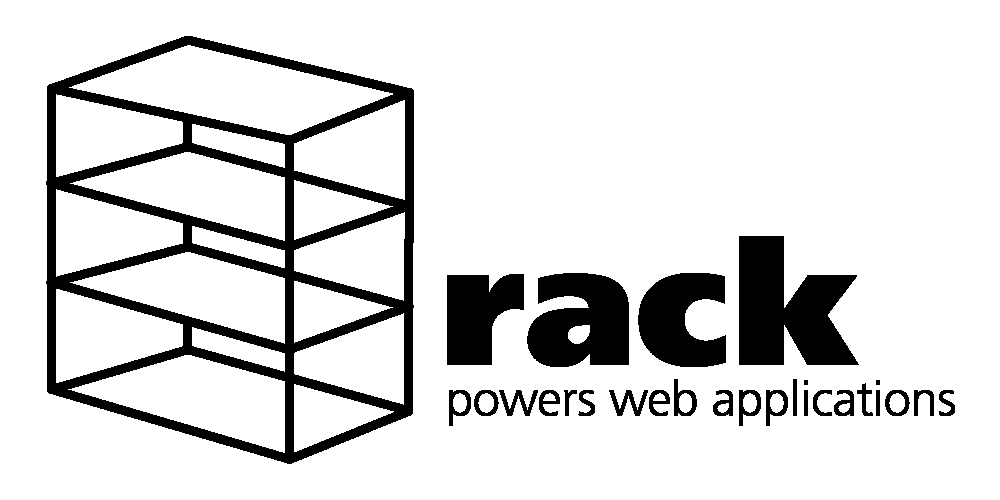

# Rack 上的 GraphQL——用 Ruby 编写模块化的 graph QL 服务器

> 原文：<https://medium.com/hackernoon/graphql-on-rack-writing-a-modular-graphql-server-in-ruby-5a4e02d5472c>

## 在本文中，我将展示通过重用开源的 GraphQL gem 和 Rack(一个模块化的 Ruby web 服务器接口),在 Ruby 中从头开始组装一个生产就绪的 GraphQL 服务器所需的部分。



# 为什么是 Rack？

在 Ruby-land， [Rack](http://rack.github.io/) 可以比作 Node.js 的优秀 [express](https://expressjs.com/) web 服务器。然而，它的方法有点不同。虽然 Express 是一个完整的 web 服务器，但 Rack 只为您提供构建自己的组件。因为大多数 Ruby web 服务器都是在机架上构建的，所以我们可以用它们来支持我们的 GraphQL 服务器。

## 机架应用

在 Rack 中，像大多数 web 服务器一样，您处理 web 请求和响应。请求是来自 web 浏览器的信息(URL、用户代理、cookies、参数)，响应是 web 服务器发送回浏览器的信息(状态、标题、HTML、JSON)。

最简单的 Rack 应用程序只是接收一个请求并返回一个响应。

```
app = Proc.new do |env|   ['200', {'Content-Type' => 'text/html'}, ['Hello World']]end
```

Proc 定义了一个新的代码块，当服务器接收到一个请求并将其信息包装在 *env* 参数中时执行。该块返回一个包含 3 项的数组:HTTP 状态代码、响应头和响应体。

Rack 提供了多种运行应用程序的方式。它提供了一个名为 **rackup** 的基本开发服务器，但是因为 Rack 是模块化的，所以你可以用任何实现 Rack 接口的生产就绪的 Ruby web 服务器来替换运行时，比如 [Thin](https://github.com/macournoyer/thin) 。

```
gem install thin
thin start
```

对，就是这么简单！

# 构建服务器

基于上面提到的概念，让我们构建服务器的框架。

```
require 'rack'class GraphQLServer
  def initialize(schema:, context: {})
    [@schema](http://twitter.com/schema) = schema
    [@context](http://twitter.com/context) = context
  end def response(status: 200, response)
    [
      200, 
      {
        'Content-Type' => 'application/json', 
        'Content-Length' => response.bytesize.to_s
      }, 
      [response]
    ]
  end def call(env)
    request = Rack::Request.new(env)
    response(200, "")
  end
end
```

*initialize* 方法将 GraphQL 模式作为参数和上下文对象，我们将在运行时将它传递给模式解析器。看看 [GraphQL gem](http://graphql-ruby.org/) 了解更多关于如何构建模式的信息。在本文结尾，我还提供了一个例子。

Rack 为每个请求调用了 *call* 方法，但是现在它没有做太多事情。

我决定以自己的方法提取*响应*，以简化我们将在下面讨论的*调用*方法。

## 提取有效载荷

GraphQL HTTP 协议可以使用 GET 和 POST 请求类型传递有效负载。当使用 GET 时，有效负载位于请求参数中，当使用 POST 时，它位于请求体中。

我们添加了一个条件来根据请求类型提取有效负载，如下所示:

```
def call(env)
  request = Rack::Request.new(env) **payload = if request.get?
    request.params
  elsif request.post?
    body = request.body.read
    JSON.parse(body)
  end**

  response(200, "")
end
```

## 处理 GraphQL 请求

在 [GraphQL HTTP 协议](https://graphql.org/learn/serving-over-http/)中，一个请求由 3 个对象组成:查询、它的变量和操作名。由于我们已经解析了有效负载和模式(来自构造函数)，我们只需将这些参数传递给 [schema.execute](http://graphql-ruby.org/api-doc/1.8.13/GraphQL/Schema.html#execute-instance_method) 方法。

```
def call(env)
  request = Rack::Request.new(env) payload = if request.get?
    request.params
  elsif request.post?
    body = request.body.read
    JSON.parse(body)
  end **result =** [**@schema**](http://twitter.com/schema)**.execute(
    payload['query'], 
    variables: payload['variables'],
    operation_name: payload['operationName'],
    context:** [**@context**](http://twitter.com/context)**, 
  ).to_json**

  response(200, **result**)
end
```

就是这样！现在，您在 Ruby 中拥有了一个符合规范的 GraphQL 服务器。

# 使用新的 GraphQL 服务器

您可以将 Rack server 与 GraphQL gem 构建的任何模式一起使用，并与您最喜欢的 Ruby web 服务器一起提供服务。

```
require 'graphql'type_def = <<-GRAPHQL
  type Query {
    hello: String
  }
GRAPHQLresolver = {
  "Query" => { 
    "hello" => Proc.new { "world" }
  }
}schema = GraphQL::Schema.from_definition(
  type_def, 
  default_resolve: resolver
)**run GraphQLServer.new(schema: schema)**
```

我还没有介绍过 *run* 指令，但是它只是允许 Rack 使用你的服务器来处理所有传入的请求。

# 下一步是什么？

这是一个非常简单和天真的实现，但它可以与任何符合规范的 GraphQL 客户端(如 Apollo)一起工作。然而，如果你想要更多的灵活性和一些错误处理，你可以使用我的开源 graph QL-server gem，本文就是基于它的。

如果你喜欢这类东西，请在 Medium 和 [Twitter @betaflag](https://twitter.com/betaflag) 上关注我。