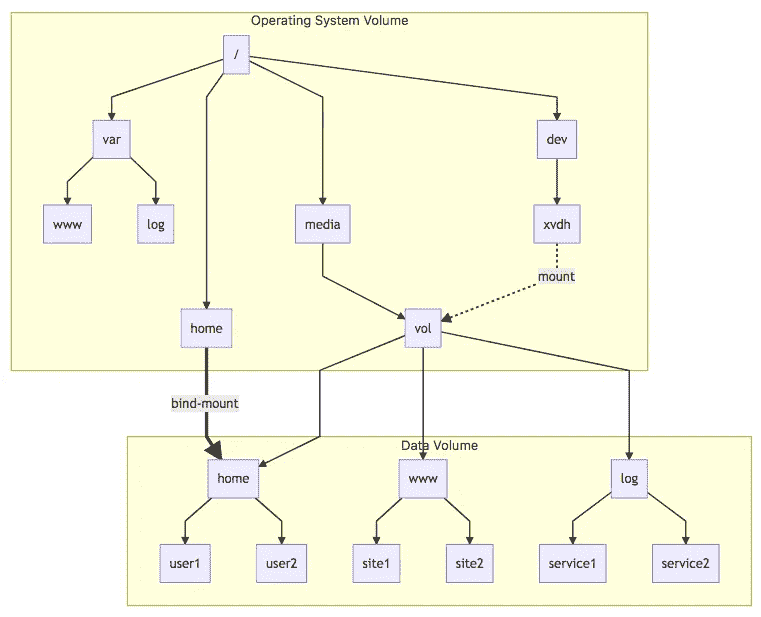
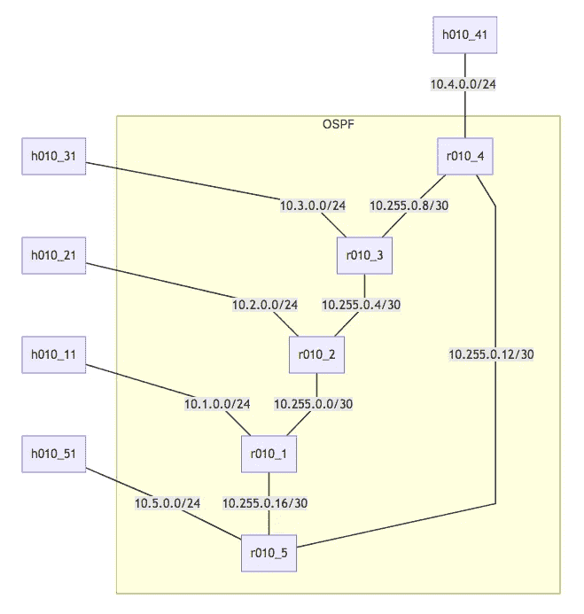
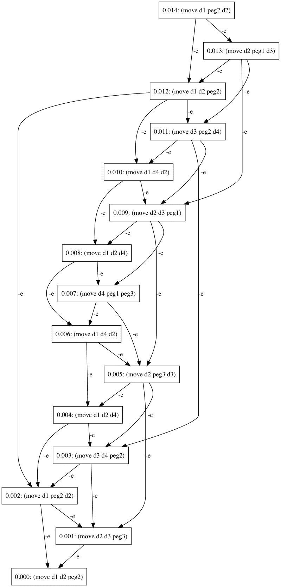
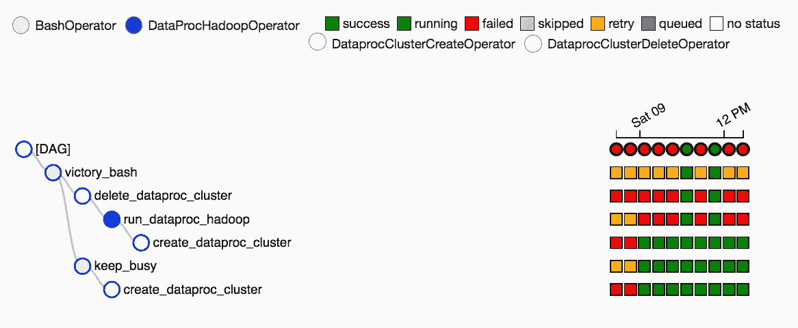

# 工作中的图表。在学校。在其他地方也是如此。

> 原文：<https://medium.com/hackernoon/graphs-at-work-at-school-and-in-other-places-too-9936493dec51>

我的另一半在附近的一所学校为[国际学士学位](https://en.wikipedia.org/wiki/International_Baccalaureate) (IB)项目教授[进一步的数学](https://en.wikipedia.org/wiki/Further_Mathematics)。我之前和他们的数学俱乐部有过一次接触，主题是“工作中的数学”。当时，*的工作*集中在 Scrum 的大规模推广上，所以我触及了斐波那契数(用于[工作量估算](https://www.scrum-institute.org/Effort_Estimations_Planning_Poker.php))并触及了排队论的表面，特别是 [M/M/1 队列，以建模工作队列中的服务时间。](https://en.wikipedia.org/wiki/M/M/1_queue)

快进到一个月前，进一步的数学课完成了一个健康的图论入门，包括 Dijkstra 的算法和旅行推销员问题。学生们记得“工作中的数学”课程，并要求续写“工作中的图表”。根据家里的谈话，我完全预料到聪明的坏孩子会在那个班里游荡，所以这一定会很有趣——除了令人耳目一新的风景变化。我将类似代码的内容发布到了 Gitlab，包括一个有意义的 CD 管道。

为了暖场和评估观众，我首先介绍了树的一般用法，特别是文件系统树的用法。从增加 IaaS 数据量到访问 Kubernetes 中的秘密，这是 IT 和软件人员整天爬上爬下的那种树。你必须把它交给数学界的人:他们喜欢清晰的概念和明确的定义——你可以看出他们已经做了一段时间了。正如维基百科所说，

> 树是一个无向图，它满足以下任一等价条件:
> 
> *- G* 是[连接的](https://en.wikipedia.org/wiki/Connected_graph)和[非循环的](https://en.wikipedia.org/wiki/Cycle_(graph_theory))(不含循环)。
> 
> *- G* 是非循环的，如果[边](https://en.wikipedia.org/wiki/Edge_(graph_theory))加到 *G* 上，就形成一个简单的循环。
> 
> *- G* 连接，但是如果从 *G* 移除任何一个单边，就会变成[断开](https://en.wikipedia.org/wiki/Connectivity_(graph_theory)#Connected_graph)。
> 
> *- G* 连通且 3 顶点[完全图](https://en.wikipedia.org/wiki/Complete_graph) *K* 3 不是 *G* 的[次图](https://en.wikipedia.org/wiki/Minor_(graph_theory))。
> 
> -*G*中的任意两个顶点可以通过唯一的[简单路径](https://en.wikipedia.org/wiki/Path_(graph_theory))连接。

Unix 文件系统是树的一个非常学术的例子，一个更完整的系统(比如整个云)可以被看作是一个[森林](https://en.wikipedia.org/wiki/Tree_(graph_theory)#Forest)，其中挂载操作允许用户将树缝合在一起。绑定挂载操作让树的一部分在方便的地方被透明地镜像。

我们设想一个数据卷作为服务在云提供商上提供，包含`home`、`www`和`log`目录。连接到卷的虚拟机的操作系统会将其识别为`/dev`下的设备，例如 AWS EC2 上的`/dev/xvdh` 。根据 [FHS](https://en.wikipedia.org/wiki/Filesystem_Hierarchy_Standard) ，数据卷将安装在`/media/vol`下。通过绑定挂载子树`home`、`www`、`log`，可以将它们放回文件系统树中我们期望的位置，如下图所示。



Filesystem mounting and bind-mounting

得到的图仍然是一棵树，因为`home`可以在`/`和`/media/vol`下分别访问*。然而，在`/home`下与文件和子目录交互的效果与在`/media/vol/home`下与它们交互的效果完全相同。这种模型的价值在于，运行在这棵树上的软件不需要(也不想)知道树的所有部分来自哪里。只是它所依赖的文件和目录会在那里，总是在右边的位置。*

同样的论点也适用于集装箱化的世界。一个容器把它的(通常是[命名空间](https://en.wikipedia.org/wiki/Linux_namespaces))文件系统看作一棵树，它总是有正确的结构，不管容器实际运行在哪里。Kubernetes 等容器编排服务负责在树中挂载数据[卷](https://kubernetes.io/docs/concepts/storage/volumes/)。当前的最佳实践是使用相同的机制在容器中注入[秘密](https://kubernetes.io/docs/concepts/configuration/secret/)，使用文件系统——知道 Kubernetes 处理这些“秘密”对象本身，而不是常规的数据卷。

然后[我继续](https://gitlab.com/graphs4IB/web-search)谷歌 20 岁的网页排名算法，和[他们现在著名的](http://ilpubs.stanford.edu/422/1/1999-66.pdf)

> 为了测量网页的相对重要性，我们提出了 PageRank，这是一种基于网页的图来计算每个网页的排名的方法。

不可否认，根据链接到网页的页面排名来对网页进行排名的概念非常优雅。而且相当强大，因为这个简单的等式解释了我们所知道的网络。

论文首先将 *N_u* 定义为一个网页的链接数 *u* 。网络的图被捕获在一个方阵 *A* 中，其中 *A* 距离各种邻接矩阵不远(如果从 *u* 到 *v* 有一条边，则 *A_{u，v}=1/N_u* )。PageRank 保存在 *R* 中，这是网页排名的向量。 *c* 是归一化因子，所以所有网页的总排名是不变的。PageRank 发明人证明了 *R* 是 *A* 的一个特征向量，特征值 c: *R=cAR* 。如果我们想在这里注入一点物理学:我们可以将 PageRank 视为描述网页振动模式的向量，将 *1/c* 视为其*能量*水平。

尽管可能有一些额外的算法来调整谷歌搜索中的这些等式，但我们还是花了一些时间来思考这种算法会青睐哪种页面。如何最好地描述这些首页？它们是最重要的页面吗？还是最… *真实*的页面？或者这只是某种选美比赛，获胜者是最受欢迎的页面，只要能引起人们的共鸣，不管这些页面是因为准确而受欢迎，还是因为更有问题，因为它们是关注的中心，出于我们可以想象的最好或最坏的原因？

换个方式，在 IP 堆栈中变得更低，我[介绍了](https://gitlab.com/graphs4IB/ospf)通常用于 IP 网络的图，特别是在 OSPF。随着 Linux 内核中[命名空间](https://en.wikipedia.org/wiki/Linux_namespaces#Network_(net))的出现，有可能在单个主机中运行大量独立的路由表，从而使模拟相对复杂的网络行为变得容易。我从 Edwin Cordeiro 那里借来了[非常好的作品](https://github.com/edwinsc/mininet_ospf_bgp)，并为 Ubuntu (18.04 LTS)和 Mininet 的最新版本修复了它。



OSPF Network

单个 VM 可以模拟一个像样的网络，有几个主机 *(h010_*)* 和路由器 *(r010_*)* ，内存和 CPU 占用非常有限。对于有限的投资，我们可以先进入链接状态广告和最短路径(即众所周知的 Dijkstra)的勇敢世界。

我们可以在随机路由器中连接到 Zebra 守护进程，并从研究直连主机的路由工作方式开始。

```
$ **sudo nsenter -n -t $(cat /tmp/zebra-r010_1.pid) telnet localhost zebra**
Trying 127.0.0.1...
Connected to localhost.
Escape character is '^]'.Hello, this is Quagga (version 1.2.4).
Copyright 1996-2005 Kunihiro Ishiguro, et al.User Access VerificationPassword:
r010_1> **enable**
Password:
r010_1# **show ip route connected**
Codes: K - kernel route, C - connected, S - static, R - RIP,
       O - OSPF, I - IS-IS, B - BGP, P - PIM, A - Babel, N - NHRP,
       > - selected route, * - FIB routeC>* 10.0.0.0/30 is directly connected, r010_1-eth4
C>* 10.0.0.4/30 is directly connected, r010_1-eth5
C>* 10.1.0.0/24 is directly connected, r010_1-eth3
C>* 10.10.0.1/32 is directly connected, lo
C>* 10.255.0.0/30 is directly connected, r010_1-eth1
C>* 10.255.0.16/30 is directly connected, r010_1-eth2
C>* 127.0.0.0/8 is directly connected, lo
r010_1#
```

OSPF 允许每台路由器知道如何到达每个通告的网络，即计算到达远程网络应该使用的下一台路由器。在下面的例子中，`r010_1`从 OSPF 得知，它应该通过其`eth1`接口经由其邻居`10.255.0.2`向`10.2.0.0/24`(`r010_2`之后的网络)发送数据包。

```
r010_1# **show ip route ospf**
Codes: K - kernel route, C - connected, S - static, R - RIP,
       O - OSPF, I - IS-IS, B - BGP, P - PIM, A - Babel, N - NHRP,
       > - selected route, * - FIB routeO>* 10.2.0.0/24 [110/20] via 10.255.0.2, r010_1-eth1, 00:44:36
O>* 10.3.0.0/24 [110/20] via 10.255.0.2, r010_1-eth1, 00:44:36
O>* 10.4.0.0/24 [110/20] via 10.255.0.17, r010_1-eth2, 00:44:36
O>* 10.5.0.0/24 [110/20] via 10.255.0.17, r010_1-eth2, 00:44:41
O   10.10.0.1/32 [110/0] is directly connected, lo, 00:45:27
O>* 10.10.0.2/32 [110/10] via 10.255.0.2, r010_1-eth1, 00:44:37
O>* 10.10.0.3/32 [110/20] via 10.255.0.2, r010_1-eth1, 00:44:37
O>* 10.10.0.4/32 [110/20] via 10.255.0.17, r010_1-eth2, 00:44:37
O>* 10.10.0.5/32 [110/10] via 10.255.0.17, r010_1-eth2, 00:44:42
O   10.255.0.0/30 [110/10] is directly connected, r010_1-eth1, 00:44:47
O>* 10.255.0.4/30 [110/20] via 10.255.0.2, r010_1-eth1, 00:44:37
O>* 10.255.0.8/30 [110/30] via 10.255.0.2, r010_1-eth1, 00:44:37
  *                        via 10.255.0.17, r010_1-eth2, 00:44:37
O>* 10.255.0.12/30 [110/20] via 10.255.0.17, r010_1-eth2, 00:44:42
O   10.255.0.16/30 [110/10] is directly connected, r010_1-eth2, 00:44:42
```

我们最终获得了端到端的连接，这是 IP 网络的一个永远不会被高估的关键属性。是的，IPv4 NAT，我针对你。然后，我们可以检查网络中的端到端路径:

```
mininet> **h010_51 traceroute h010_31**
traceroute to 10.3.0.2 (10.3.0.2), 30 hops max, 60 byte packets
 1  10.5.0.1 (10.5.0.1)  0.060 ms  0.005 ms  0.004 ms
 2  10.255.0.13 (10.255.0.13)  0.015 ms  0.005 ms  0.005 ms
 3  10.255.0.9 (10.255.0.9)  0.017 ms  0.007 ms  0.006 ms
 4  10.3.0.2 (10.3.0.2)  0.024 ms  0.008 ms  0.007 ms
```

欢迎来到神奇的分布式系统，在分布式系统中，节点最终会就它们应该如何单独行动达成共识，以便整个系统执行所需的端到端路由功能。

虽然 Dijkstra 的算法允许在有限的搜索空间中找到最短的路径，但我还是忍不住引入了 AI 规划中的[搜索计划](https://gitlab.com/graphs4IB/ai-planning)的问题。[。域名](http://planning.domains/) [互联网 TLD](https://en.wikipedia.org/wiki/Top-level_domain) (嘿，另一种极其重要的树)包含了一组用于规划域名的工具。它非常好的在线编辑器让我们可以导入汉诺塔域，其中包含一个单独的动作:

```
(define (domain hanoi)
 (:requirements :strips)
 (:predicates (clear ?x)
              (on ?x ?y)
              (smaller ?x ?y)) (:action move
  :parameters (?disc ?from ?to)
  :precondition (and
        (smaller ?to ?disc) 
        (on ?disc ?from) 
        (clear ?disc) 
        (clear ?to))
  :effect (and
        (clear ?from) 
        (on ?disc ?to) 
        (not (on ?disc ?from)) 
        (not (clear ?to)))
 )
)
```

这个领域是用一种基于 LISP 的语言来表达的，这种语言叫做 PDDL(规划领域定义语言)。

领域告诉我们，我们操作的对象可以是`clear`(它们上面没有对象)，它们可以被放置在另一个的上面`on`，并且它们通过`smaller`关系排序。

这个领域允许我们的世界通过移动圆盘而被改变，从一个位置到另一个位置。有四种情况允许`move`一个`disc`在一个对象上面`from`在另一个对象上面`to`:

*   `disc` 需要比被移动的对象`to`大`smaller`
*   `disc` 需要是当前`on`它正在移动的对象`from`
*   `disc`需要是任意对象的当前`clear`
*   它正在移动的对象`to`当前也需要是`clear`


Solution to the tower of Hanoi problem with 4 discs (animation from [Wolfram MathWorld)](http://mathworld.wolfram.com/TowerofHanoi.html)

移动那个`disc`有四种效果:

*   我们正在移动的光盘`from`现在是`clear`
*   `disc`现在位于我们正在移动的`to`圆盘的`on`顶部
*   `disc`不再位于我们正在移动的`from`盘的`on`顶部
*   我们正在移动的光盘`to`不再是`clear`

问题定义列出了我们世界中的所有物体，以及它们各自的大小和位置。例如，对于四张光盘:

```
(define (problem hanoi-4)
 (:domain hanoi)
 (:objects peg1 peg2 peg3 d1 d2 d3 d4 )
 (:init
  (smaller peg1 d1)
  (smaller peg1 d2)
  (smaller peg1 d3)
  (smaller peg1 d4)
  (smaller peg2 d1)
  (smaller peg2 d2)
  (smaller peg2 d3)
  (smaller peg2 d4)
  (smaller peg3 d1)
  (smaller peg3 d2)
  (smaller peg3 d3)
  (smaller peg3 d4)
  (smaller d1 d1)
  (smaller d2 d1)
  (smaller d3 d1)
  (smaller d4 d1)
  (smaller d2 d2)
  (smaller d3 d2)
  (smaller d4 d2)
  (smaller d3 d3)
  (smaller d4 d3)
  (clear peg2)
  (clear peg3)
  (clear d1)
  (on d4 peg1)
  (on d3 d4)
  (on d2 d3)
  (on d1 d2)
 )
 (:goal
  (and 
   (on d4 peg3)
   (on d3 d4)
   (on d2 d3)
   (on d1 d2)
  )
 )
)
```

我们的四圆盘问题从定义三个钉子和四个圆盘开始，它们都是对象。

然后，它继续定义世界的初始状态。栓钉进入的顺序与圆盘相同:每个圆盘都比所有栓钉小。那么`d1`比它本身包含的所有圆盘都小；`d2`比自身小，`d3`和`d4`，`d3`。`peg2`和`peg3`清零，同时`d4`在`peg1`上，`d3`在`d4`上，`d2`在`d3`上，`d1`在`d2`上。

目标状态是`peg3`上有`d4`，在`d4`上有`d3`，在`d3`上有`d2`，在`d2`上有`d1`。我们可以让计划者计算计划，也就是将我们从初始状态带到目标状态的一系列行动。

```
(move d1 d2 peg2)
(move d2 d3 peg3)
(move d1 peg2 d2)
(move d3 d4 peg2)
(move d1 d2 d4)
(move d2 peg3 d3)
(move d1 d4 d2)
(move d4 peg1 peg3)
(move d1 d2 d4)
(move d2 d3 peg1)
(move d1 d4 d2)
(move d3 peg2 d4)
(move d1 d2 peg2)
(move d2 peg1 d3)
(move d1 peg2 d2)
```

计划员邀请我们将圆盘`d1`从`d2`的顶部移动到`peg2`的顶部。然后，我们应该将圆盘`d2`从`d3`移动到`peg3`，等等。

这项技术的强大之处在于，如果在计划执行过程中的某个时候出现了问题，并且我们处于初始状态和目标状态之间，它能够重新计划。计划者可以根据新的世界初始状态进行推理，保持之前的目标，并设计一个新的计划让我们达到目标。

[通过使用自定义规划器](https://gitlab.com/graphs4IB/ai-planning#development-environment)，我们可以让规划器向我们显示它在寻找解决方案时考虑的搜索空间的图形。所考虑的行动之间的联系称为因果联系。这个计划，也就是将我们从世界的初始状态带到目标状态的一系列行动，可以毫不含糊地从一系列因果联系中推导出来。



Search space

我们特别注意到，这个规划器从目标状态开始，回溯到初始状态。

除了这个玩具例子之外，人工智能规划还被用来解决更困难的现实世界规划问题，这些问题的领域表示可以包括函数(浮点数)，要求规划者理解时间，甚至是函数连续变化的原因。当搜索状态变大时，将其可视化为图表有助于找到规划者在搜索中努力前进的潜在平台。这些平台可以通过调整规划者使用的试探法或领域定义来消除。

为了冷静一下，我们[用分析工作流中使用的有向无环图(DAG)完成了](https://gitlab.com/graphs4IB/airflow-examples)。Apache Airflow，或其谷歌管理版本 Cloud Composer，允许[以编程方式创作、安排和监控工作流](https://cwiki.apache.org/confluence/display/AIRFLOW/Airflow+Home)。Google 的 [quickstart](https://cloud.google.com/composer/docs/quickstart) 示例显示了一个非常线性的图(创建一个 Dataproc 集群，运行一个 Hadoop 作业，删除 Dataproc 集群)，所以我们稍微扩展了一下:

```
create_dataproc_cluster >> run_dataproc_hadoop >> delete_dataproc_cluster >> victory_bash
create_dataproc_cluster >> keep_busy >> victory_bash
```

在相当大的程度上，我们在这里手动指定为气流输入的图表可以与我们之前看到的人工智能规划器的输出进行比较。在我们的气流用例中，开发人员阐明计划，气流执行计划。在机器人术语中，气流充当*控制器*，即执行一些智能创建的解决问题的计划。在我们之前看到的 AI 规划用例中，(人类)领域建模师定义了个体行动(通过它们的先决条件和效果)、世界的初始状态及其目标状态，AI *规划者*搜索计划。参见加州大学埃迪堡分校 Gerhard Wickler 的[自动规划](https://courses.csail.mit.edu/6.034s/handouts/spring12/Planning.pdf)的幻灯片 12，了解这两个部分在机器人架构中的位置。

回到我们的(机器人)*控制器* : Airflow 将绘制图形并遍历执行，指定每个节点的执行状态。


DAG for our simple workflow

为了能够显示执行状态，一次又一次地运行，Airflow 将 DAG 分解成一棵树，从最后一个操作符开始向后移动:



Tree representation

气流也可以用甘特图来表示单次运行的执行情况。甘特图表示提供了识别关键路径的能力，即，如果任务更短，将减少运行的总持续时间。


Gantt Chart Representation

成熟的甘特图通常也会指定任务之间的限制。在气流的情况下，它们相对简单，具有执行时间和前面操作符的成功方面的约束。在机器人中，它们可以包括不变量、故障条件，一直到操作约束，如超时、任务开始或结束之间的最小或最大时间。

我们到达了快速浏览图表的终点。数学非常简单，但是希望学生们能够相信图形是不可或缺的工具，无论是在计算机科学领域还是在软件工程或信息技术领域。