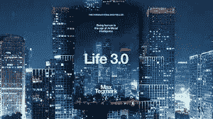

# 天哪！量子计算的疯狂科学家

> 原文：<https://medium.com/hackernoon/great-scott-the-mad-scientists-of-quantum-computing-e726e08c999c>

## 电影导演戴维·克罗南伯格有句名言:“每个人都是疯狂的科学家，生活就是他们的实验室。”虽然这可能有点夸张，但在未来几年里，肯定会有一些独特的想法不可逆转地改变我们的生活

# 量子霸权

如果 Morimoto nori shige 是一个可靠的来源，量子计算机将继续存在。就在最近，IBM 的全球副总裁表示，他的公司将在未来五年内拥有全功能商用量子计算机。这是一个人的豪言壮语，他显然认为，一旦 IBM 达到了被称为“量子优势”的性能水平，这种情况就会发生。简而言之，这是量子机器在特定领域能够比世界上最好的超级计算机表现更好的时候。

这些都是豪言壮语和伟大的承诺，然而如果它们实现了，它们将以我们认为不可能想象的方式改变我们的世界。

量子优势在上下文中类似于人工智能理论中的[奇点](https://en.wikipedia.org/wiki/Technological_singularity)。这一分水岭时刻——无论它是否到来——可能是好的，也可能是坏的。“量子优势”这个词本身同时意味着进步和屠杀。

请想一想，如果你愿意的话，有一天，量子计算机会超越我们所建造的最先进的超级计算机，并由此控制它们如何为我们做什么。帮助人类发展和解决我们存在的一些难题，以及我们在这个世界上是如何存在的，在自科学时代开始以来一直困扰我们的智力学科领域帮助我们——量子引力和粒子物理学、虫洞、黑洞、反物质，以及最后——无论如何与量子计算机如此相关——量子纠缠。

> 在不到十年的时间里，量子计算机将开始超越日常计算机，导致人工智能的突破，新药物的发现等等……量子计算机提供的非常快速的计算能力有可能扰乱传统业务，并挑战我们的网络安全。**企业需要为量子未来做好准备，因为它即将到来**
> 
> 物理学家杰里米·奥布莱恩

# 越狱

说需要量子计算机才能完全理解量子纠缠是一个很容易做出的假设，尽管这就像问谁剪了理发师的头发。或者先有鸡还是先有蛋？根据你向谁提问，你总会得到不同的答案。不过，有一点是肯定的，即我们创造的东西有可能超出我们的理解，当量子处理器中量子位功率的指数增长变得超出人类的处理能力时，就会引发一场“爆发”。

Breakout 是一个 AI 理论，在瑞典裔美国物理学家兼宇宙学家 Max Tegmark 的畅销书 [*Life 3.0* : *成为人工智能时代的人类*第四章*智能爆炸中有一些详细的描述？*](https://www.theguardian.com/books/2017/sep/22/life-30-max-tegmark-review) ，当人工智能变得对其创造者来说过于强大并取得控制权时。泰格马克讨论了这方面的许多场景，其中大多数都充满了厄运，尽管我觉得有趣的是泰格马克的预测如何与森本的量子优势并存。唯一的区别是从纯人工智能到量子计算机的转变。然而，如果量子计算机变得如此强大，它们不会拥有人工智能吗？或者更复杂的是，它们的核心是人工通用智能(AGI)，即可以执行任何人类都可以执行的智能操作的智能。

Max Tegmark’s book, a must read

如果在 IBM Q System One 量子计算机上工作的疯狂科学家以及科技领域的任何其他人，如微软或谷歌，认为人工智能的方向掌握在他们手中，那些有着大大脑和对我们人类未来更大野心的人，难道他们不应该小心自己在做什么吗？所有这一切的风险，无论如何，是利己主义会阻碍利他主义的意图。

> 量子计算将回答关于宇宙起源的基本问题。
> 
> *—微软*

# 五十量子位目标

IBM 在量子计算机领域的进展令人印象深刻，他们声称迄今为止已经达到了 20 个量子位，而从该公司设计的一种称为“量子体积”的度量标准来看，考虑到总量子位的数量，同时检查系统的错误率，实际上达到了 16 个量子位。

Source: qoq.phys.strath.ac.uk

IBM 对这种公制系统的分析推翻了摩尔定律的理论:他们推断他们的量子计算机的能力每 12 个月翻一番，而不是像摩尔定律那样每 18 个月到两年翻一番。如果 IBM 的宣言是真的，它将带领我们进入一个新的技术发展时代。

> “敬那些疯狂的人，不合群的人，反叛者，麻烦制造者，在**方孔**里的**圆钉**……那些看待事物与众不同的人——他们不喜欢规则……你可以引用他们的话，不同意他们的观点，赞美或诋毁他们，但你唯一不能做的是忽略他们，因为他们改变了事情……”
> 
> —史蒂夫·乔布斯

为了实现量子优势，无数计算机科学家和量子物理学家表示，必须达到 50 量子位的大关。Morimoto 继续指出，根据他的公司目前的工作，用不了多久，IBM 就会拥有一台比地球上任何超级计算机都更强大的量子计算机。一旦做到这一点，商业化进程就可以真正开始了。

从 Stephen Wiesner 在共轭编码方面的最初理论到 Nike Dattani 在量子主方程方面的开创性工作，这些量子世界的 Emmett Browns 博士和其他几十人将以这样或那样的方式改变我们的世界，从而影响后代如何生活和理解他们周围的世界。

假设 IBM 的意图是积极的，他们并不主张一个失去控制的真实世界的企业天网，那么让我们假设 Morimoto nori shige 是我们认为的那个人，他和他的企业员工正在寻求实现的目标将把我们置于一个推动人类在宇宙中走向未来的位置的位置。