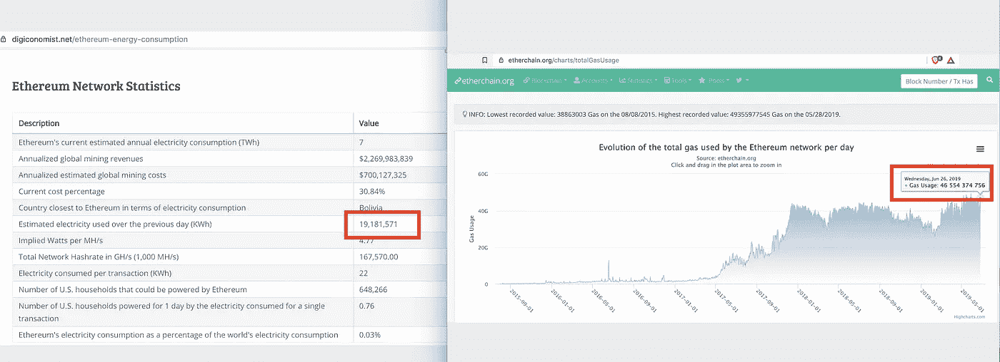

# 绿色智能合同:区块链能耗不仅仅是共识

> 原文：<https://medium.com/hackernoon/green-smart-contracts-theres-more-to-blockchain-energy-consumption-than-consensus-898fb23eea75>

## 1000 万人在以太坊上点一份假想的薯条，需要的能量足以为 567 万个美国家庭供电一天。

Credit: [Wikimedia](https://commons.wikimedia.org/wiki/File:Street_in_Shadyside_Pittsburgh_PA.jpg)

对区块链技术的一个众所周知的批评是，它消耗了太多的能源。一旦人们听说一笔比特币交易消耗的能源相当于美国 18 个家庭 24 小时的用电，或者以太坊网络每年的能源消耗超过了整个玻利维亚，他们就会关掉它。理应如此。

对于那些决定开始提问的人，周围有人会很快提供一个简单的纠正:市场领导者比特币和以太坊所使用的浪费的工作共识机制证明不是区块链科技的固有属性。事实上，自 2013 年以来，已经有安全的[绿色共识](/altcoin-magazine/bitcoin-be-dammed-the-energy-is-dirty-1a2e148f0e73)机制在公共区块链上运作，比如利益证明。

然后关于能源浪费的对话就结束了。

然而，以太坊，以及几乎所有其他使用智能合约的主流区块链公共场所，都面临着另一个与能源相关的定时炸弹:智能合约是巨大的能源消耗者。

有多大？嗯，1000 万人在以太坊上点一份假想的薯条，需要的能量足以为 567 万个美国家庭供电一天。

不需要这样，但是为了有机会解决这个问题，围绕智能合同框架的对话需要更多的细微差别。

## **罪魁祸首:有状态契约执行**

从高层次来看，问题在于如何执行智能合同。目前的市场标准是由以太坊在 2015 年制定的，我称之为“有状态契约执行”

**有状态执行**意味着网络上的每一个节点或计算机单独执行每一个契约或程序，并将它们的结果与其他的进行比较。假设超过 50%的网络达到相同的结果，则该变化被写在区块链上。

这种纯粹主义的设计对早期的区块链项目很有意义。信任分布式账本的最简单方法是了解影响写入区块链的底层数据的每个智能合约的计算都由其他所有人执行和验证。如果我们都做同样的工作，很难作弊。

虽然这最大化了对程序将按预期运行的信任，但这意味着网络只和它最慢的节点一样快，因为每个节点在同意改变之前都需要做自己的工作。除了速度，这直接转化为能源消耗。每个节点必须执行完整的智能合同程序，而不仅仅是处理简单的交易。

换句话说，不是简单地通过声明“接受”或“拒绝”来验证事务，节点必须运行“如果这样，那么那样”逻辑的流程图，以便决定是“接受”还是“拒绝”变更。

## **交易和智能合同的能源成本**

根据[数字经济学家](https://digiconomist.net/ethereum-energy-consumption)的估计，以太坊网络上的一次正常交易需要 22 千瓦时的电力。作为参考，来自美国[能源信息管理局](https://www.eia.gov/tools/faqs/faq.php?id=97&t=3;)的数据显示，2017 年，在一个 30 天的月份中，美国家庭平均每天消耗 28.9 千瓦时的电力。

以太坊网络上的智能合同使用天然气计量，这是各种计算的标准费用。如果你对气体的概念不熟悉，在这里阅读更多的和[在这里](https://www.sitepoint.com/ethereum-transaction-costs/)。

在寻求公众[意见](https://twitter.com/CryptoDemetrius/status/1144357399744196609)并直接从 Digiconomist 获得[反馈](https://twitter.com/DigiEconomist/status/1144329307906555912)后，决定将天然气转换为能源消耗的最准确方法是查看前一天网络消耗的总能源，并将其与同期消耗的总天然气进行比较。结合 Digiconomist 的以太坊能耗[指数](https://digiconomist.net/ethereum-energy-consumption)和[etherchain.org](https://www.etherchain.org/charts/totalGasUsage)的数据，我们可以得出一个估计值:

**1 气= 0.0004 千瓦时电**

Screen capture of data at the time of calculating 1 Gas = 0.0004 KWh electricity

应该注意的是，这个计算是一个粗略的近似值，因为它只考虑了采矿验证机的能耗。由于缺乏数据，这没有考虑非采矿、完全验证节点的能量消耗。建议进行进一步的数据收集和研究，以全面评估智能合同执行的能耗。

我们还知道，以太坊网络上的每个标准操作，例如数字相加或相乘，都是按以下速率计量的:

- 3 Gas 用于每个需要加减整数的计算

- 5 Gas 用于每个需要乘法或除法的计算

-对于需要将一个 256 位字(普通文本)提交到存储器的每个计算，20，000 Gas

计算运行特定合同的天然气的公式为:

21000 Gas 用于验证您的交易+支付您合同中计算所需的金额。

## **1 个“杀手级应用”的能源需求相当于为 567 万个美国家庭供电 1 天**

想象一个像以太坊这样的网络，它现有 8000 个节点和 1 个杀手级应用程序，突然带来 1000 万用户。

假设每个人发出一个请求，包括写一个 256 位的字，进行一次整数相加的计算，以及进行一次数字相乘的计算。

只是为了让它与现实生活相比较，想象一下在一张收据上写下“薯条”这个词，将这一项成本的列相加(0 +薯条的成本)，然后将该小计乘以相关的销售税。这不一定是你要写的一个聪明的契约，但是让我们用它来做一个简单的可视化。

这个简单请求的结果是每个人需要 41，008 天然气，这相当于每个人需要 16.4 千瓦时的电力。

16.4 千瓦时 x 1000 万次交互=**1.64 亿千瓦时**

回想上面的数字，我们可以评估出**这款应用中的 1000 万份薯条相当于以 2017 年每天 28.9 千瓦时的标准价格为 567 万个美国家庭供电 1 天。**

## **绿色智能合同作为替代方案**

直到最近，我还认为有状态契约执行框架是做事的唯一方式。事实证明，在 2019 年初，一种替代的“绿色”方法进入了舞台，我将它称为**无状态合同执行**。

基本思想是智能合同存储在区块链上，但是，合同只由一个节点执行。基本的工作流程是，某人发送一个带有一些输入信息的触发事务，这些信息指向运行契约的节点，这个“契约运行者”节点进行一些计算，然后它发送一个输出事务以获得一致同意。整个网络中没有复杂的计算，只有一个普通的交易需要验证。

## **信任权衡和缓解**

这确实意味着您需要信任运行特定程序或契约的节点，这意味着与有状态契约执行相比，这种方法需要牺牲一定程度的信任。也就是说，缓解措施可以内置到系统中。

例如， [Ardor 平台](https://ardordocs.jelurida.com/Lightweight_Contracts)包括在多重签名批准方案下运行合同运行节点的能力。如果契约代码是开源的，那么多个额外的验证节点也可以并行运行，并检查契约运行者节点的工作，标记违规行为。

*【完全披露:我持有比特币、以太坊和 Ardor 以及其他几种加密货币的小额投资，并与 Jelurida 合作。]*

最近在纽约举行的 SCIT 2019 会议上，一名律师表示，许多监管机构正在取缔对消费者造成伤害的黑盒技术，并且已经出现了向开源代码的明显转变。区块链的不变性几乎要求开源技术作为一种责任保护措施。

如果这种趋势成立，那么无状态契约执行模型将从这种转变中受益匪浅，因为它似乎提供了一种透明、可扩展和可持续的方法来确保数据完整性。这也显著增强了企业执行实际契约生命周期管理的能力，因为更新契约所需要的只是将新代码部署到一个节点，并在将来的触发事务中更新引用，然后用旧契约关闭另一个节点。

## **关闭思路**

最终的关键问题是，给定网络上的所有节点(如具有 8000 个节点的以太坊)是否真的需要执行每个智能合约的全部计算，或者处于多重签名控制下的一个节点是否可以通过完成计算本身并发送最终交易以获得共识来提供相同级别的数据完整性。无状态合同执行在区块链领域仍然相对较新，但是考虑到当前行业标准的明显能源浪费，这绝对是一个需要进一步探索和讨论的领域。

## **技术附录**

我所有的分析都基于当前形式的技术。就这一点而言，我欢迎任何关于如何提高上述计算准确性的反馈；然而，任何围绕以太坊 2.0“修复”这些问题发表声明的人都应该认识到，事实上，以太坊的任何解决方案都不会改变有状态或无状态的问题。即使您在以太坊碎片上开发应用程序，该碎片上的所有节点都必须执行该契约。此外，自 2015 年以来，以太坊在 GitHub 上已经有了一些关于股权共识机制的代码，尽管多次宣布推出只有几个月的时间，但它还没有到达 mainnet。如果您有意见或更正，请将讨论集中在公共主网上实际运行的技术上。

*Skylar Hurwitz 是区块链咨询公司* [*的创始人，德米特里厄斯咨询公司*](https://www.demetriusconsulting.com/) *自 2017 年以来一直在审查和分析公共区块链。*