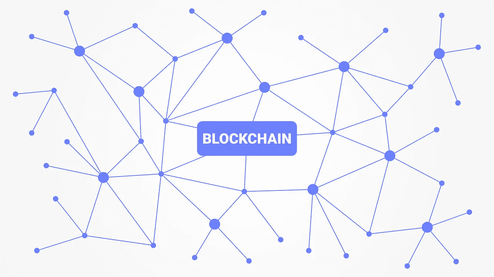

# 不断发展的生态系统推动 EOS 发挥潜力，尽管遇到挫折

> 原文：<https://medium.com/hackernoon/growing-ecosystem-pushes-eos-to-potential-despite-setbacks-ac22a15f8719>

Source: [Pixabay](https://pixabay.com/vectors/blockchain-cryptocurrency-network-3277335/)

EOS 去年在 ICO 期间筹集了高达 40 亿美元的资金，甚至没有一个可用的产品，这引起了人们的惊讶。虽然局外人对这个数字感到震惊，但 crypto 和区块链内部人士——主要推动了大规模 ICO——早就知道 EOS 的宏伟承诺和颠覆性潜力。该平台被[称为“以太坊杀手”](/@bitcurate/eos-potential-ethereum-killer-and-only-just-few-months-old-c9e5482ae5aa)，因为它独特地应用了 dApp 模型，并承诺提高性能和每秒更快的交易。

即便如此，EOS 的推出还是令人困惑。尽管该平台已经上线，但它还是遇到了一些问题，这让人们对其可行性产生了严重质疑。最近，该公司陷入了困境，因为有消息透露，一名用户发现了一种通过网络发送 3.6 万亿美元交易的[方法](https://www.trustnodes.com/2019/03/11/a-3-trillion-eos-transaction-fools-whale-alert)。

此外，由于过大的需求，EOS 链在可扩展性方面存在问题。在非技术方面，该平台被指责缺乏透明度，以及对质量保证的疏忽导致了发布时的一系列问题。无论如何，EOS 的承诺继续支撑着它，因为第二层提供商正在构建解决方案来支持新生的生态系统。随着对老问题的新修复，以及不断扩大的社区，EOS 可能最终会重新站稳脚跟。

**一段麻烦但可以修复的过去**

尽管围绕它的大肆宣传，EOS 也不是没有批评者，该公司不断给他们的投诉弹药。该公司的问题是多方面的，业内最大的担忧之一是该公司没有解决这些问题的紧迫感。

该平台最大的问题之一与其利益共识证明有关，尽管该平台在发挥作用，但由于超级节点是如何选举的，因此[引发了对公平性的担忧](https://cryptonews24x7.net/eos-facing-problems-of-fairness-and-operational-pressure-reports-chinese-media/)。根据最近的一项研究，在前 50 个节点之后，押注网络变得无利可图，甚至达不到盈亏平衡，这一事实加剧了这一问题。

从更技术性的角度来说，用户也表示困惑和不相信几个已知的错误和 EOS 代码和智能合约的问题在 Github 上仍然没有解决。伴随着对 EOS 团队在发布到 mainnet 之前没有对其代码进行充分的 QA 的抱怨，它描绘了一幅开发团队可能没有足够的责任感来承担平台潜力的画面。

最后[，为 EOS 制作钱包是一个不必要的复杂过程](https://news.bitcoin.com/eos-has-issues/)，需要现有会员帮助新用户开户。从整体上看，这些问题可能会在短期内给 EOS 带来严重的麻烦，但该公司及其背后的社区似乎最终理解了这个问题，并开始着手修复。

**众包解决方案**

有问题的推出在科技界并不新鲜，但通常情况下，一旦报告或检测到问题，公司几乎会立即修复。EOS 行动迟缓，损失了一些声誉点，但仍有希望的区块链周围的一些社区采取了更积极的立场。

社区对 EOS 的支持源于这样一个事实:理论上，它仍然是一个比以太坊更好的生态系统，可以在其上开发 dApp。仅此一点就帮助了一个有机的开发者社区在它周围萌芽。到目前为止，EOS 在很大程度上依赖于第一层实现来解决大多数问题，值得称赞的是，它取得了成功。现在，一些有趣的第二层解决方案已经出现，可以将 EOS 置于顶层。

例如，[liquid PPS，](https://www.liquidapps.io/)dApp 开发平台，解决了 EOS 最大的问题之一——[真正的可伸缩性和处理](https://www.newsbtc.com/2019/02/27/eos-blockchain-scaling/)。EOS 目前对 RAM 的使用有一个上限，包括资源成本(每 1MB 58 个 EOS)和大约 90GB 的最大供应。因此，dApp 开发受到可用开发和内存资源的限制。LiquidApps 在开发堆栈中增加了一层，并提供了 vRAM——一种模拟的内存存储，它与 EOS 链分开工作，并为开发人员增加了容量。

其他解决方案包括 [Oracle Chain](https://oraclechain.io/index-en) ，它通过支持在区块链上使用 Oracle 来改善实时数据传输(Oracle 是验证数据的可信第三方)。此外，还有一些项目和计划正在探索使用分片来改进可伸缩性和开发。Bitfinex 也通过他们的 EOSfinex 分散式交易所进入了游戏，这将允许用户购买和交易他们最喜欢的 EOS dApps 的令牌。

**EOS 和同行享有先发地位**

越来越多的交易所提供了一个门户，EOS 爱好者可以在 EOS 区块链之间交易价值，第二层解决方案使开发更容易，更具成本效益，应用程序吸引了新兴的受众，EOS 已经证明，它能够单独通过其卓越的区块链模型来鼓励增长。

还没有一个“完美的”区块链来创建或托管分散式应用程序，这并不重要。无论是 EOS、NEO、Ethereum 还是 Cardano，最早的自举 dApp 网络都在设定其他人必须衡量自己的标准。这些早期解决方案的大规模市场存在也确保了它们的开发社区随着时间的推移会像滚雪球一样越滚越大，从而提高了未来应用程序的门槛，但也使其更容易通过测试。说到底，EOS 是一个令人鼓舞的例子，表明了区块链模式在面临严重的发展困难时有多么坚定。