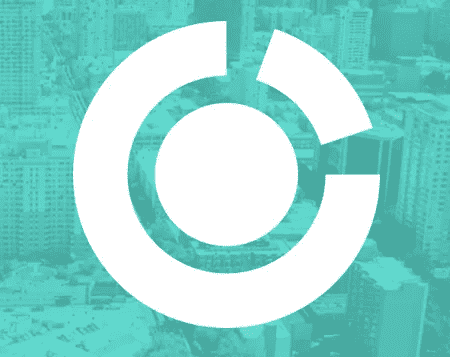

# 发展区块链社区开发部门——引入集体

> 原文：<https://medium.com/hackernoon/growing-the-blockchain-community-development-sector-introducing-the-collective-f743e813e149>

## 这个集体是加密货币领域新业务的一个例子

随着加密货币部门的发展，一个有趣的新层已经出现，我称之为“元”区块链部门。这些公司和组织没有建立将区块链技术应用于现有行业的平台。相反，它们旨在满足新兴的区块链发展部门本身的需求。

## 区块链社区管理

一个例子是越来越多的所谓区块链“社区管理”公司。这些新的商业实体专门从事初始代币/硬币产品(IT/COs)的孵化和管理。除此之外，许多公司正在尝试开发一个完全集成的生态系统，在其中管理 IT/COs、开发白皮书、创建和培养用户社区，并实现加密货币的交换。

为加密货币业务使用社区管理服务有很多优势。一个好的社区管理公司会为初创企业准备、设计和开发合法的社区建设策略。这些工作的中心功能是提供第一线的支持，这样开发团队可以专注于可交付成果。

在区块链地区提供有效的社区管理的关键是专业知识。区块链社区开发公司通常由密码爱好者运营，他们可以通过了解所有主要行业趋势和工具来帮助企业保持领先地位。

## 集体社区发展公司

Collective 是一家成功的金融科技公司，正在扩大其生态系统，包括 IT/COs 的创建和管理，以及更广泛的区块链社区管理。它的独特之处在于，它不是将 ITO/CO 与加密货币世界中的其他方联系起来，而是提供所有必要的结构，以在其 won 生态系统中增加社区参与。

集体计划提供的服务包括:

*   通过管理多个内容流提高公司的社交媒体曝光率。
*   白皮书开发服务，从审阅和编辑现有草稿到与公司合作从头开始编写白皮书。
*   该集体与领先的行业声音保持着持续的关系，并可以提供一个有影响力的网络。

为了有效地提供这些服务，该团体建议创建一个全面的生态系统，其中包括多个组件，并提供 24/7 支持。这些组成部分包括一个社区管理公司、一个分散的交易所、一个集中的交易所、一个视频游戏开发部门，以及一个旨在服务和保护区块链产业中每个人的利益的基于社区的倡议。

*   **综合数字交换机**

作为生态系统的一部分，这个集体正在建立一个混合数字交易所。该交易所的计划包括一个基于以太坊的令牌的一体化全球分散市场，称为 CDEX，以及一个集中式交易所，称为 TraderOne。这些系统共同支持所有不同类型的数字资产的交易，而不仅仅是基于 Ehtereum 的交易。

*   **加密增强现实游戏**

这个集体还包括一个视频游戏部门。视频游戏行业规模庞大，集体意识到随着加密货币的普及，利用游戏行业吸引的用户群的机会也会增加。

该生态系统内推出的第一款游戏名为“CollectiveGO”，这是一款增强现实游戏，将集成多种加密货币，并通过各种广告商货币化。例如，如果一家公司想要展示一种新的硬币或代币，CollectiveGO 可以在游戏中展示它。当用户玩游戏并遇到令牌时，会弹出一个带有链接的简短描述，以增加对该公司在线内容的参与度。

游戏将在手机上进行，使用摄像头将游戏性覆盖在屏幕上。玩家在虚拟世界中漫游，在这里他们可以遇到并使用不同的数字货币。用户将能够把他们的钱包地址链接到游戏，以便快速分发。为了确保玩家不浪费他们的时间，通过游戏分发的所有硬币和代币将被托管。

*   **全球集体倡议**

这个集体正在计划的一个有趣的部分被称为“全球倡议”，它被描述为一个自我监管的组织，目标是让加密货币行业更加安全。这个想法似乎是为了保护社区免受欺诈，并以不扼杀创新和增长的方式确保法律合规性。集体全球倡议希望为整个行业建立自愿的最佳实践(不是政府驱动的)，并为用户社区提供可信赖的空间来聚集和交换信息。

## 结论

这个集体是最近出现的为区块链部门提供孵化和管理服务的公司之一。它是区块链领域不断增长的一部分，该领域专注于创建包容的生态系统，不仅支持 ico，还支持整个加密社区。

*订阅我的频道* [*Medium*](/@minadown) *和*[*Twitter*](https://twitter.com/minad21)*如果您想了解区块链和加密货币项目。

如果您对本文有任何疑问，请在下面的版块发表评论。谢谢大家！福斯夫。*