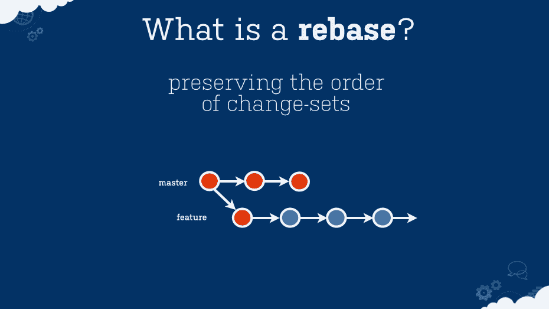
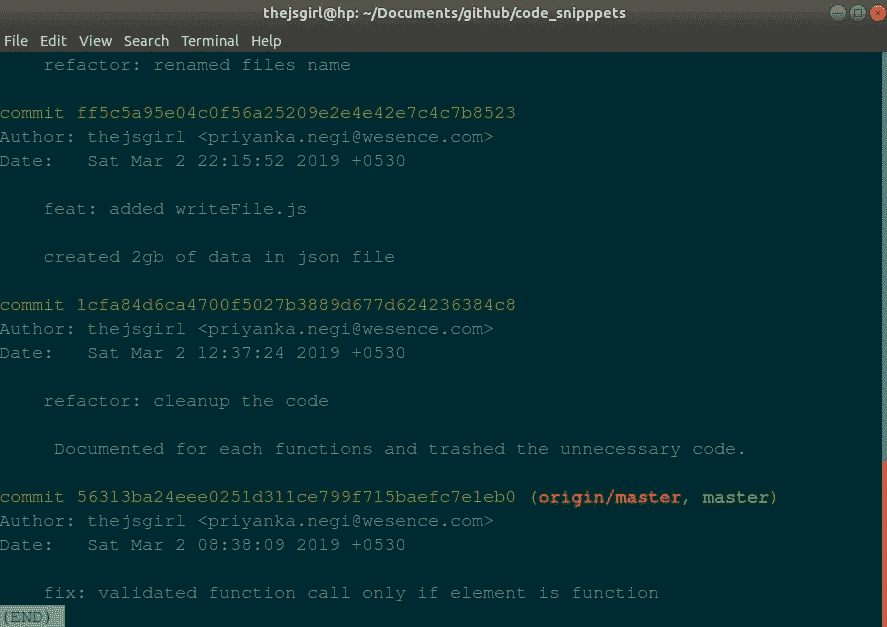
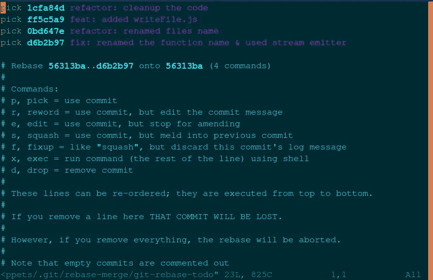

# 调整基数可能会有帮助

> 原文：<https://medium.com/hackernoon/guide-to-recover-from-accidental-commits-and-rebase-in-git-d46cc0b54046>



Traditional working of Git Rebase

> 在 **Git** 中， **rebase** 命令将变更从一个分支整合到另一个分支中。它是更广为人知的“合并”命令的替代选项。

你听说这很恐怖，对吧？你可以创造或再造历史！🌗

人们要求你远离 git rebase，但是，它有时非常有用。这篇文章介绍了 REBASE 命令的一个很好的用法，与官方的 [*git 文档*](https://git-scm.com/book/en/v2/Git-Branching-Rebasing) *中的定义相反。*

# git REBASE 的一个很好的应用

先说一个很常见的场景，我觉得所有开发者都可能遇到过或者有一天会遇到。

假设您为公司和您的个人项目使用同一台机器，并且当您为您的 **GitHub、**使用两个不同的帐户时，您像这样配置您的本地 git:

> git config —全局用户. name 您的姓名
> git config —全局用户. email you@companydomain

所以我也这样做了，同时也为我的个人项目做贡献。

# 黑色的一天

在一个晴朗的日子里，我刚刚在 GitHub 上查看了我的一个项目 ***提交历史，看到下面的消息时，我的心跳了几下😧***

> 提交显示 ***【未知】*** 用户😫

由于我的电子邮件不同，GitHub 无法识别我的身份，在我的个人资料上，我也无法获得我的贡献计数(提交已经消失，拉请求和问题创建仍然存在)

*我陷入了困境，我想以某种方式弥补我的错误，我不得不重写历史⏳*

# 救援基地！

然后，经过大量的努力，我得到了这个有用的命令😍，我的生命救星:

> git rebase -ip 提交散列

让我来给你解释如何正确使用这个*，否则*你可能会丢失你的跟踪历史*。*

Rebase 为您提供了编辑所有提交历史的工具，但在此之后，它可能会用当前时间和日期覆盖以前提交消息的时间和日期。

所以在这篇文章中，我将解释使用这个命令的每一个步骤。

1.  获取提交历史记录的所有哈希 id。

```
$ git log
$ git rebase -ip caaf71 
```

*   ***caaf71*** 是 git 历史的提交 id。它应该至少是 4 位数。



commit history

*   *如果你想重新存储整个提交历史，选择上次提交 id。*
*   *输入上面的命令后，你会得到下面的命令提示。*



vim file

2.现在，通过按“I”在 vim 编辑器中编辑这个文件。这将进入编辑模式，然后编辑的东西，并取代选择编辑，然后保存它按下 Esc，":x "，然后输入。

下面给出了一些有用的 vim 命令。如果您不熟悉 vim，请参考它们。

```
i  - insert mode 
wq - Save and quit
q! - Quit without saving
```

3.现在，您可以使用该命令轻松地相应更改用户名或电子邮件。

```
*git commit --amend --author=”username <current@email.id>”--no-edit*
```

> 这里——no-edit 起着非常重要的作用，如果你使用它，那么它不会影响其他事情，比如提交时间。

```
4\. git rebase --continue
```

5.重复第 3 步和第 4 步，直到您收到消息*“成功重置和更新参考/头/开发。”*
⑥。最后，只需将最后的修改从本地机器推送到 GitHub。它还会更新你现在的邮箱和用户名。

# 好吧，有一个黑客！

> *当你有很多很难处理的提交时，总是做 REBASE 是一件令人兴奋的事情。*

我建议先用两个命令配置你的本地机器 repo，然后再开始工作。

```
git config user.email <your email address>
git config user.name <username>
```

# 谢谢你💝

*我希望你喜欢我的写作，我喜欢学习&探索 JavaScript。我住在印度的诺伊达，在 Wesence 做软件工程师。*

*你可以访问我的网站:*[***the jsgirl***](https://thejsgirl.in)*，关注我的*[***Github***](https://github.com/thejsgirl)*&*[***Twitter***](https://twitter.com/thejsgrl)