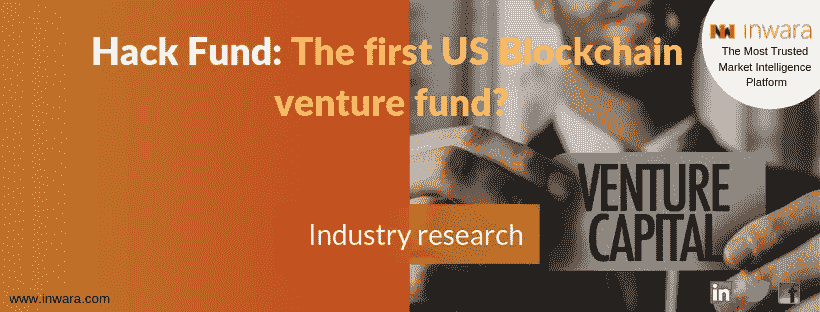
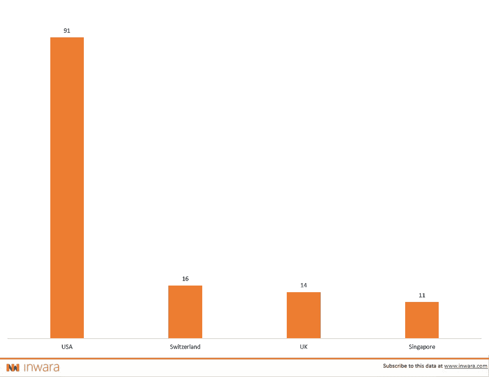

# 股票期权是金融领域的新趋势

> 原文：<https://medium.com/hackernoon/hack-fund-the-first-usa-base-blockchain-venture-fund-88f7b24001b0>

## 黑客基金:区块链风险投资基金分析

免责声明:这不是财务建议。更多详情请访问 [*条款与条件。*](https://www.inwara.com/disclaimer)

## 证券代币发行——投资和金融服务业的新趋势

安全令牌产品——sto 今年已经席卷了加密领域。随着世界各国政府对 ico 实施销售法规，区块链企业和密码爱好者正在寻找可行的替代方案。斯托斯似乎是答案。去年，据观察，随着 ico 数量的减少，sto 的数量急剧上升。数据显示，这一趋势也可以推断到今年。

要了解更多为什么 2019 年可能是 STOs 之年，请查看 InWara 的文章

# 投资和金融服务业增长势头强劲

在过去两年中，数百家旨在缓解投资和金融服务业企业所面临问题的初创公司涌现出来，它们总共筹集了超过 25 亿美元的资金。企业家和投资者似乎对这个行业特别感兴趣，这可能是因为这个行业巨大的增长潜力激励着他们。

考虑到这一点，下面的 STO 是值得注意的，因为他们设法在这个领域的无数初创公司中脱颖而出。

# 美国第一个区块链风险基金？

[黑客基金](https://hack.hf.cx/)

这家美国公司最近制造了新闻，据称它成为了第一家美国区块链风险基金，并计划筹集超过 1 亿美元。据该公司网站介绍，Hack Fund 是一家面向全球科技的公开交易风险基金。该公司旨在为使用数字股票的初创公司提供早期资金。

Hack Fund 的联合创始人乔纳森·尼尔森(Jonathan Nelson)认为，传统的风险投资已经让初创公司失败了，他的公司可以利用其独特的商业模式缓解一些问题。根据《T2》对福布斯的采访，乔纳森说“黑客基金代表了一种新的商业模式。因为 Hack Fund 利用了区块链，全世界各个层次的投资者都可以通过交易区块链股票参与创业投资。此外，它的 SEC 合规结构意味着它也适用于美国数量有限的合格投资者。”

黑客基金的创始人[乔纳森·尼尔森](https://crunchbase.com/person/jonathan-nelson-2)和[劳拉·尼尔森](https://www.linkedin.com/in/laura-nelson-6772202a)，也是[黑客/创始人集团](https://www.hf.cx/)诞生的原因。这是一个总部位于硅谷的科技企业家组织，据该组织网站称，该组织目前在 50 多个国家拥有超过 30 万名成员。

这个由技术人员和技术企业家组成的庞大网络，理应赋予 Hack Fund 独一无二的全球影响力。Hack Fund 旨在通过区块链技术提供快速流动性，通过能够购买可以立即买卖的令牌化股票证书，对投资者有用。

## 区块链的[伯克希尔哈撒韦](http://www.berkshirehathaway.com/)？

Hack Fund 将是一只公开交易的封闭式基金。与伯克希尔·哈撒韦公司的运作方式类似，该公司的风险投资将由外部机构按季度进行估值。该公司旨在加密审计报告，并将其发布在区块链网络上，以便令牌持有者可以对其进行评估。

创始人声称，Hack Fund 的运作方式与伯克希尔·哈撒韦公司的运作方式相似。乔纳森说:“没有发布 K-1 声明，没有合伙企业/有限责任公司，而是 HACK Fund 是一家类似于伯克希尔哈撒韦公司的投资公司，其投资方式与早期风险资本相同。”

# 黑客基金的宏伟计划

最近，Hack Fund 与沃达丰(Vodafone)签署了一项合作协议，每年投资 15 家公司，这些公司的年收入有可能增长到 1 亿澳元，涉及 100 多家合作电信公司和全球 12 亿客户。

# 各地区 sto 数量

[Source: InWara’s ICO+STO database](http://www.inwara.com/?utm_source=hackfundhacker&utm_medium=hackfundhacker&utm_campaign=hackfundhacker)

根据 InWara 汇编的数据，美国在 STO 发行的股票数量上领先，其次是瑞士、英国和新加坡。美国共有 91 家 sto，其中只有 8 家未能筹集到足够的资金。

# 根据行业的安全令牌产品(sto ):国家/地区-美国

[Source: InWara’s ICO+STO database](http://www.inwara.com/?utm_source=hackfundhacker&utm_medium=hackfundhacker&utm_campaign=hackfundhacker)

在美国的 91 家 sto 中，金融服务在贸易和投资等联合行业中也处于领先地位。房地产股票毫不奇怪地排在第二位。

