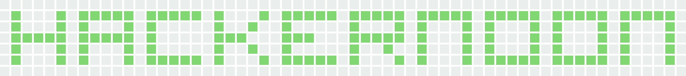
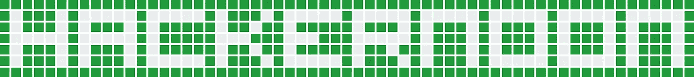
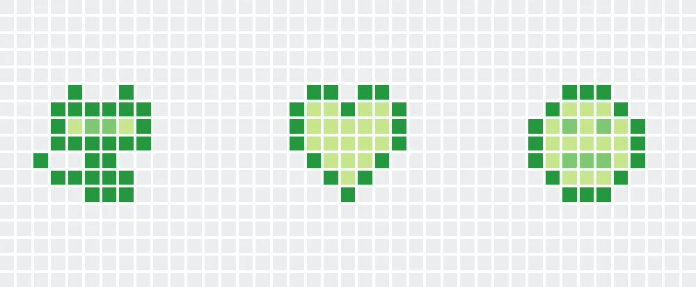
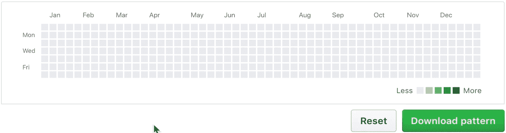
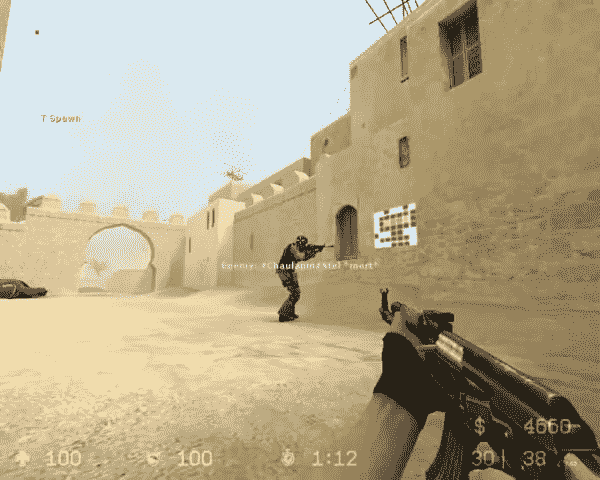

# 👾黑掉你的 GitHub 贡献图░▒▓█

> 原文：<https://medium.com/hackernoon/hack-your-github-contribution-graph-d88bdb417351>



各位黑客朋友好，今天我想和大家分享一个我最近开发的工具，作为 Javascript 中的 NodeJS 模块， [GitHub Spray](https://github.com/Annihil/github-spray) 。


这个 CLI 允许您在 GitHub 个人资料页面的日历上绘图。

热图的大小是 53x 7，但是你可以在更多的柱子上绘制，从过去到未来，从而创建你自己的中楣。

编写文本从未如此简单，`-t <text>`就是这样！

```
github-spray -t HACKERNOON --font led7 --invert
```



但这还不是全部，如果你愿意，你可以疯狂设计自己的图案！通过创建一个 JSON 格式的 7 个字符串的数组，字符代表像素，空格代表灰色，1 代表浅绿色，4 代表深绿色。

```
github-spray -f pattern-octocat+heart+smiley.json
```



Ain’t nobody got time for that

这在某种程度上不是最令人愉快的像素艺术方式，所以为了让你舒服，我提供了这个 [PWA](https://annihil.github.io/github-spray-generator/) 来给你图形化绘制图案的能力。点击添加贡献，右键删除贡献。完成后，您可以下载 JSON 文件，然后在 CLI 中使用它。



CLI 有几个选项，你可以弄乱，反转，翻转，改变字体，调整颜色，指定一个开始日期，设置和推动到一个原始报告。

“喷雾”这个名字来自反恐精英，你可以在墙上涂鸦。一些职业玩家在正确的位置放置喷雾来吸引敌人的注意力并击退他们。



我希望你喜欢这个小介绍，就像我喜欢开发这个工具一样！开心喷:)

