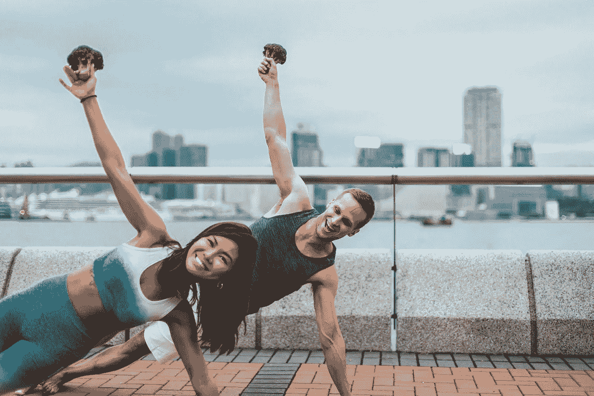

# 降低你的生产力

> 原文：<https://medium.com/hackernoon/hack-your-productivity-c0c504bf20f7>

你的饮食、生活方式和身心平衡是你幸福的基础。最终，它们会影响你的动力和能量水平。

就像人类如何训练计算机变得更聪明一样，我们也可以给自己“编程”并入侵我们的生产力！

除了你的新年决心之外，你怎样才能做到呢？

New Year. Better You.

你们中的许多人都认同设定健康和健身相关的目标。减肥，完成马拉松，成为素食主义者。健康的身心也意味着更清晰的思维。

但是，更多的时候，生活是以这种方式出现的…

你变得忙碌——工作、家庭、社会责任。你旅行。你错过/跳过你的健身课 1 天，这变成 1 周，1 个月；现在很难再回到这股潮流中来了。听起来很熟悉？

我们经常最终把钱都给了其他东西(筹款、编码、网络……)——除了我们自己。这导致了倦怠和不在场。然而，投资于我们自己对于保持我们的雄心是必不可少的。

你如何利用科技成为你健康生活方式的一部分？这样你就可以给你的大脑增压，保持你的大脑功能和生产力。

一步一步来，在入门门槛最低的工具的支持下！按需提供。方便。在旅途中。

# 1)强壮的身体

**睡眠。**看似容易实现的一件事。然而，大多数工作人口似乎还没有得到足够的。你可以使用 Sleep Cycle 等移动应用程序和 Fitbit 等可穿戴设备来跟踪你的睡眠效率、快速眼动睡眠、静息心率。Oura 的时尚智能戒指非常适合不喜欢在手腕上佩戴物品的人。根据数据做出更明智的决定，优化您的生活。

**搬家。**厌倦了枯燥的锻炼？从 Les Mills 的沉浸式虚拟现实健身工作室到人工智能运动跟踪健身应用 Kaia。企业正试图让锻炼对日常消费者更有吸引力。

**经常出差**而且总是忙个不停？从各种音频和视频在线培训计划中进行选择，这些计划通常只需要很少的订阅费。服装巨头耐克也开发了一款免费的 Nike+ Training 应用程序，提供高效的训练。与小威廉姆斯搬到获奖艺术家埃利·古尔丁，只需最少的设备。

**懒得踏出家门一步？Peloton 凭借其联网家庭健身设备和内容引领潮流。玩数以千计的现场和预先录制的健身课程，并参加虚拟旋转课程。这家公司最近在 2018 年的一轮融资中筹集了 5.5 亿美元。**

# 2)坚强的意志

从 Headspace 这样的冥想应用，到 Lumosity 这样的帮助大脑训练的工具。从跟踪你情绪的应用程序到自我保健应用程序，如 Shine Text。这些平台有一个共同的目标——成为现代压力个体的解决方案。

有时，我们可能需要的是暂停的时刻，那是我们独自思考和重新获得清晰的时间。

一个简单的步骤是开始培养与技术的健康关系。或者时不时断开连接。随着苹果拥抱数字健康趋势并在 iPhones 上实施“屏幕时间”，你现在可以记录你在社交媒体上花费的时间。这有助于建立我们的意识，让我们更加意识到我们把时间和精力花在了什么上面。

# 3)强大的人脉

成功的关键是与提升你的人在一起，他们的存在会激发出你最好的一面

无论是饮食的改变还是活动量的微小增加，和朋友一起可以帮助你保持专注。让彼此负责去健身房，减少饮食中的含糖食物。从长远来看，你们的进步可能会让你吃惊。注意你的新/旧友谊会如何演变！

根据哈佛医学院(Harvard Medical School)发表的一篇文章，强大的社会关系也“以与充足的睡眠、良好的饮食和不吸烟同样强大的方式影响着我们的长期健康……那些与家人、朋友和社区关系良好的人更快乐，健康问题更少，寿命更长。”

从长远来看，你今天可以采取什么样的一小步来改善你的幸福呢？

*jasslyn Koh 是*[*【BrocnBells.com】*](http://brocnbells.com/)*的创始人——一个为了健康&健身而结识志同道合者的社交平台。发现适合你生活方式的人——即使是在旅途中。*

*Jas 的灵感来自成长、力量和经历。她也是一名 lululemon 大使。在开始创业之旅之前，Jas 在投资银行工作。*