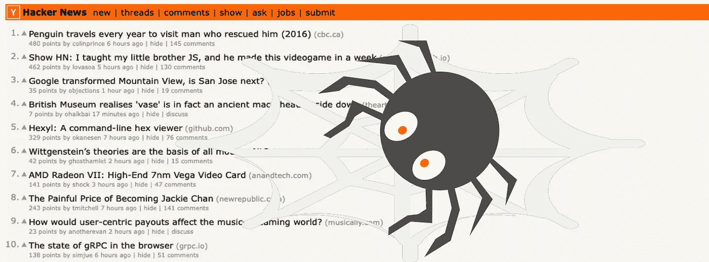
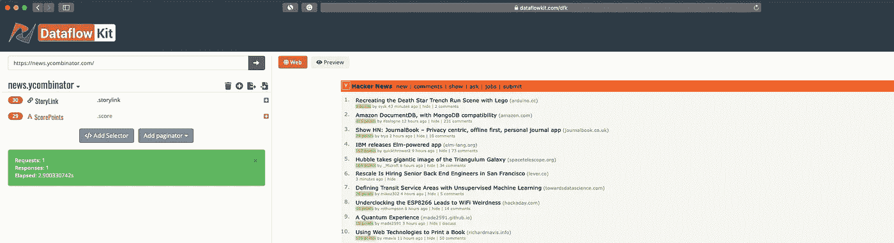
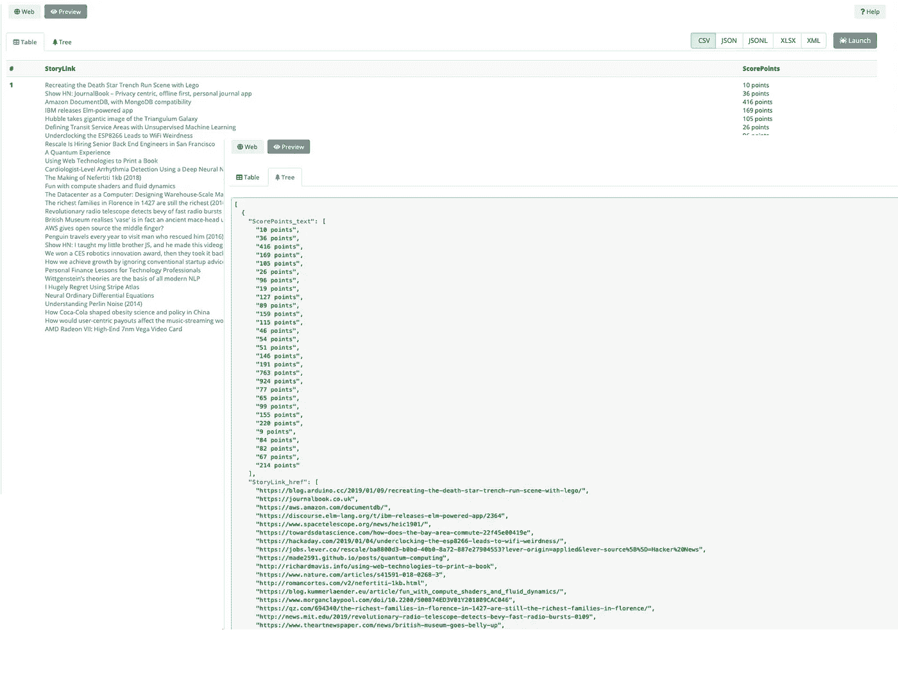
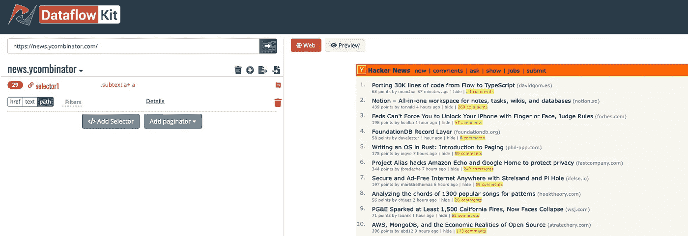
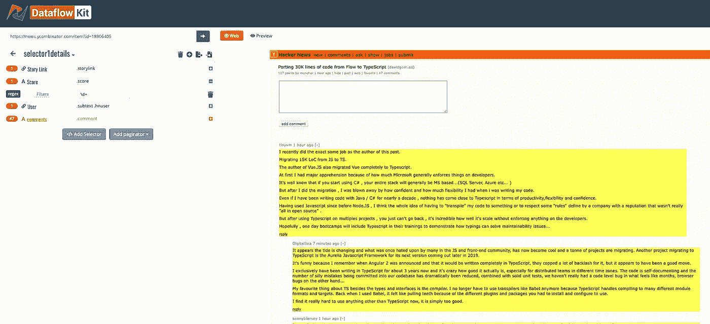
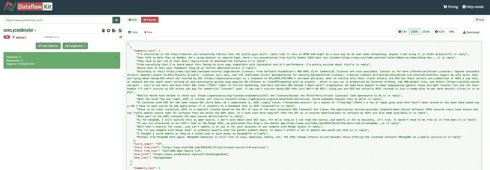

# 黑客新闻抓取挑战

> 原文：<https://medium.com/hackernoon/hacker-news-scraping-challenge-e0655479f85b>



Scrape Hacker News with Dataflow kit

互联网上几乎所有的网页都包含一些*噪音块*，如导航、侧栏、版权信息、隐私声明和广告，这些都与网页的主题没有直接关系。

区分主要内容块和噪声块是很重要的。姑且称之为*信息块*。从信息块中提取信息是 Web 爬虫最重要的任务。

每个信息块中的所有子 HTML 元素通常被分组到相似的结构中。

## 1.挑战。从[黑客新闻](https://news.ycombinator.com) (HN)网站提取信息块。

我们将使用 [Dataflow kit](https://dataflowkit.com/dfk) 服务从 HN 网站执行[数据抓取](https://hackernoon.com/tagged/scraping)。



Open Hacker News main page

1.  在左侧面板顶部的地址栏中输入[https://news.ycombinator.com/](https://news.ycombinator.com/)网址，点击旁边的按钮加载网页。
2.  抓取过程基于您选择的数据模式。点击“**添加选择器”**按钮，开始选择网页上的元素，以定义数据提取的模式。现在，从页面上的块中只选择两个 CSS 选择器就足够了。当选择一个元素时，所有其他与同级信息块中具有相同类别的被点击元素相似的元素被自动添加到适当的选择器中。结果 30 个“故事链接”与**。故事链接**类**类**和 29 个带**的分数点。分数**类相应地被突出显示。
3.  按下预览按钮发送生成数据流工具包后端返回的输出样本的请求。



Parsed results returned by Datafalow Kit in CSV and JSON formats.

不幸的是，我们有两个独立的“分数”和“故事链接”列表。结果字段似乎没有像预测的那样分组！

实际上，我们期望“故事链接”与它们对应的“分数”配对在一起。

> 那有什么问题呢？

让我们看看下面的 [HTML](https://hackernoon.com/tagged/html) 代码，它描述了一个包含上述字段的块。为了简洁起见，我从实际代码中省略了一些 HTML 元素。

```
<tbody>
    <tr> ... 
        <td>
            <a href="http://example.com" class="storylink"> Recreating the Death Star Trench Run Scene with Lego
            </a>
        </td>
    </tr>
    <tr>...
        <td>
            <span class="score">10 points</span>
        </td>
    </tr>

    <tr> ... 
        <td>
            <a href="http://example2.com" class="storylink"> Show HN: JournalBook – Privacy centric, offline first, personal journal app
            </a>
        </td>
    </tr>
    <tr>...
        <td>
            <span class="score">36 points</span>
        </td>
    </tr>
</tbody>
```

在这种特殊情况下，所有兄弟元素的公共父元素是`<tbody>`，并且没有父元素将信息块内的元素连接在一起。

问题是，我们的抓取算法将块中的所有字段组合在一起，并考虑到它们在 DOM 树中的共同父节点。所有这些“故事链接”和“分数”HTML 元素实际上都是*的兄弟节点*。但是尽管从视觉上看，它们似乎被组合在这些相似的块中。

类似的竞争抓取服务提供的黑客新闻主页的输出看起来大致相同。几乎所有这些元素都使用相同的方法来确定元素的公共父元素，从而将它们组合在一起。

> 用另一种方法可以很容易地解决这个问题。

在数据流工具包中，有一个特殊的**`路径`**链接提取器类型的选项，仅用于导航目的。当指定了 **`Path`** 选项时，将不会返回当前页面的任何结果。但取而代之的是，将访问 **`Path` links** 下的所有网页以提取详细信息。

在我们的例子中，我们可以选择“Comments”字段作为 **`Path`** 选择器，如下图所示。



Select “Path” Selectors on the main page

1.  用相应的 CSS 选择器 **`.subtext a+ a`** ,为**“comments”**字段添加新的选择器
2.  点击右侧的**“+”**显示附加控制元素。
3.  勾选**“路径”**选项，点击**“详细信息”**



Add selectors on detailed page

4.显示了一个详细的页面，您可以在其中指定所有需要的 CSS 选择器来提取数据。正如您所注意到的，在这里可以找到与主页上相同的信息，如**【故事链接】****【分数】****【用户】**和额外的**【评论】**字段。

5.按**“左上箭头”**返回主页面，点击**“预览”**按钮。

6.您可以在这里看到包含提取数据的**表格视图**中的一些行。如果数据有详细的字段，就像在这种情况下，它甚至可以更好地用一个**树形视图** JSON 结构来表示。

因此，我们已经在信息块中收到了适当的绑定元素结构，不再混乱。

## 2.挑战。从[黑客新闻](https://news.ycombinator.com)网站提取信息块。

如上所述，我们必须通过主页面上找到的所有 30 个 **`Path`** 链接爬行，并从链接的页面中提取一些信息。

不幸的是，我们在第一次尝试中未能获得预期的全部 30 行，尽管所有的获取请求都返回了 200 OK 成功响应。

> 发生了什么事？

经过调查，我们发现*黑客新闻网站总是返回 200 个状态码，*即使中途发生了错误。

在我们的例子中，一些页面带有类似的内容。


Message returned by HN

通常 Web APIs 会返回**状态代码 429，**，这意味着发送给服务器的请求太多了。但是黑客新闻用状态码 200 通知限制请求的速率。

通过实验，我们已经确定 *3 是从一个 IP* 向 HN web 服务器并发请求的最佳数量。

因此，在减少并发抓取器的数量后，我们成功地抓取了所有 30 个详细页面，并从中提取了所有需要的信息。

选择 JSON 格式，点击**“启动”按钮**开始数据抓取。完成数据提取工作后，按 **`Download`** 以所选格式提取结果。



Launch data extraction and Download results.

> 正如你所看到的，黑客新闻网站有 31 个请求(1 个主页+ 30 个路径链接)被执行，耗时约 33 秒。

## 3.每日挑战:)

这是我们准备给你的最终黑客新闻集锦的链接。

[](https://github.com/slotix/dataflowkit/blob/master/examples/news.ycombinator.collection.json) [## slot IX/数据流套件

### 从网站提取结构化数据。网站抓取。-slot IX/数据流套件

github.com](https://github.com/slotix/dataflowkit/blob/master/examples/news.ycombinator.collection.json) 

只需下载这个[news . y combinator . collection . JSON](https://github.com/slotix/dataflowkit/blob/master/examples/news.ycombinator.collection.json)集合并导入即可。查看[https://dataflowkit.com/collections](https://dataflowkit.com/collections)了解更多关于导出/导入功能的详细信息。

您可以自定义所有设置，如分页或添加/更改数据字段选择器，以便轻松抓取。

# 总结。

每个网站都有自己独特的结构。所有资源的抓取方法都是相同的，尽管有些资源需要单独的数据提取方法。

我们感谢您的反馈和意见。

刮的开心！