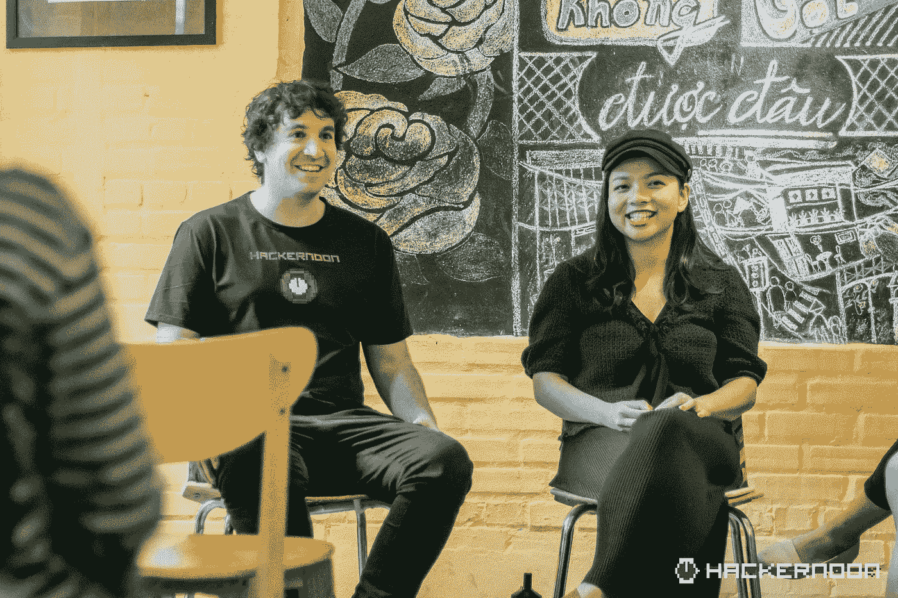
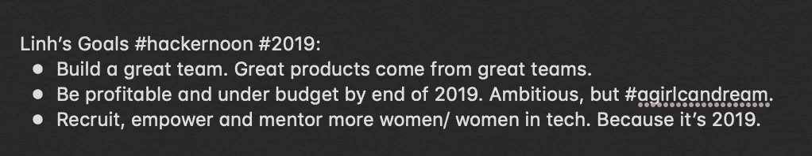
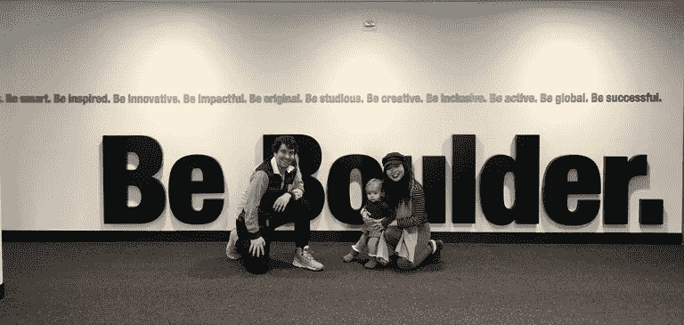
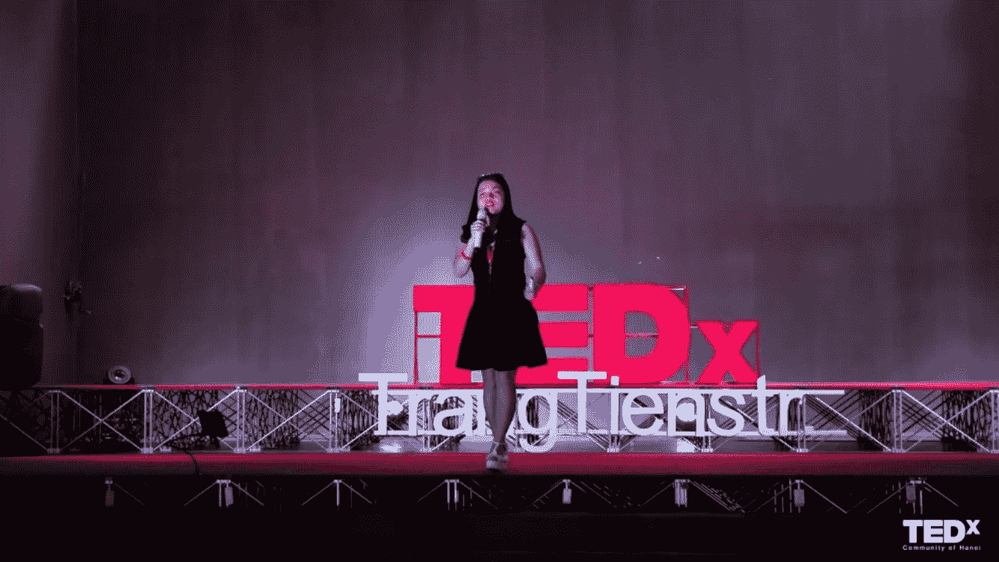

# 黑客中午公司更新从首席运营官林道 Smooke

> 原文：<https://medium.com/hackernoon/hacker-noon-company-updates-from-coo-linh-dao-smooke-a26d114ccb59>

## 我们要行动了，你听说了吗？

1.  *黑客中午最近入职* [*临时 CTO 戴恩·莱昂斯*](https://hackernoon.com/product-iteration-with-hacker-noon-interim-cto-dane-lyons-9ce7ec3cef55) *成为我们的全职首席产品官。与我们的首席前端工程师*[*Gian Franco Vitola*](https://www.linkedin.com/in/gfvitola/)*和我们的临时后端工程师*[*Austin Pocus*](https://www.linkedin.com/in/austin-pocus/)*一起，我们将从头开始构建 Hacker Noon 自己的内容管理系统。敬请期待* [*为黑客正午 2.0*](https://www.startengine.com/hackernoon) *:)*
2.  我们正在招人！大部分是合同角色。了解更多/申请于[*jobs.hackernoon.com*](http://jobs.hackernoon.com)*。*
3.  *Hacker Noon 将成为 1 月 24 日至 26 日在瑞士达沃斯举行的* [*区块链经济论坛*](http://bef.latoken.com/davos) *的媒体合作伙伴。如果你在附近，向你的同事贡献者* [*大卫·蔡*](https://hackernoon.com/@daviddecentralized) *问好，他将代表黑客正午出席会议！*

[This last one speaks for itself :)](https://www.startengine.com/hackernoon)

你好黑客们，

我的名字叫[林道 Smooke](https://everipedia.org/wiki/lang_en/linh-dao-smooke/) ，黑客正午背后的女人。以上是我在黑客正午总部的 4 个简短更新:)

对于你们中那些不知道的人，我和我的丈夫大卫·斯穆克(David Smooke)共同经营《黑客正午》(Hacker Noon)，我相信你们现在已经听说过他了。他是评论和发表你大部分故事的人。他还每月给 175，000 多名订户写几次简讯。但是你可能不认识我。

*I’m on the right, if that’s not clear :) More* [*#HninHn photos*](https://www.facebook.com/hackernoon/posts/2493186114241855)*.*

我是 2017 年夏天[加入 Hacker Noon 的，在我们的女儿 Norah 出生几个月后](https://www.instagram.com/norah.and.mama/)。我的主要工作是将黑客中午的流量转化为收入。一个简单的目标和一项艰巨的任务。

自从我加入黑客正午，[流量增长 2.5 倍，收入增长 2.7 倍](https://www.startengine.com/hackernoon)。我还主要负责 [Hacker Noon 的股权众筹活动](http://startengine.com/hackernoon)，其中[是 2019 年](https://twitter.com/woodien/status/1083710967295270912)第一个筹集到 100 万美元的股权众筹活动。融资的目标很简单:在我们自己的基础设施上主持我们的故事，恢复赞助，并在[HackerNoon.com](http://HackerNoon.com)上开辟新的收入来源，最终，重新成为一家盈利的企业。

> 你可以说我是这次行动背后的“钱”人。

但是我有太多的话要对你说，我们的黑客正午支持者。

**我是一名创业领导者**，有着筹集资金、与会计师、律师和银行家合作、寻找最好的亲小型企业软件以及招聘人员的经验。《黑客正午》的读者中有 41%是初创公司创始人[。你快跑！](https://hackernoon.com/hacker-noon-reader-survey-results-1d2c60573ec4)

**我是一名女性**——老实说——女性在《黑客正午》的读者中不到四分之一。现在是 2019 年，是时候改变这种状况了。

Empowering women in tech is one of my goals for 2019.

**我是一个职业母亲**，她[必须总是在职业和个人之间游走，在两者之间找到(不)完美的平衡](https://hackernoon.com/2018-reflected-b289fc758404)。我相信在职父亲也会有同感。

Our daughter Norah made a cameo at [an event](https://hackernoon.com/the-smookes-speak-at-university-of-colorados-disruptive-entrepreneurship-class-a59285bdd64b) where David and I spoke.

我是一名社区领袖和教育家。在 Hacker Noon 之前，我为越南的中学生成立了自己的非营利组织，名为 [CKP](https://www.facebook.com/ckpvn.org/) ，已经独立运营了 7 年。我还通过担任美国一所名为 Minerva 的全新大学的亚洲地区主任，为该校招收了 25%的学生。Minerva 项目已经筹集了 9500 万美元，并且正在筹集更多资金。在那之前，我是一名教师。我可以花几个小时谈论如何从头开始建立社区。

My talk about [Future of Higher Education in TedxTrangtienStreet.](http://athenatalks.com)

所以当大卫让我为 Hacker Noon 撰写一系列时事通讯时，我想我应该做些不同的事情。

我的时事通讯不会如此关注社论和最佳技术报道(那是大卫的领域)。但他们会专注于我的专业领域:**创业运营、科技领域的女性和社区建设:**

1.  我会在**为你更新《黑客正午》的幕后故事，并提供运营一家像我们这样的精益公司**所需的细节(*回答:仍然需要相当多的工作*)。
2.  我将与你分享我对科技和工作场所性别包容性的真实想法。
3.  我会和你一起打开关于**黑客正午公司的话题，而不仅仅是黑客正午网站** *(回答:我们有很多工作摆在我们面前，这很令人兴奋！)*

作为一家公司，我们 2019 年的主要目标之一是进一步参与我们的社区，我希望我的时事通讯系列将有助于实现这一目标。

如果你读到这里，我想说谢谢你。如果您是我们图书馆的 7000 名作者之一，感谢您的来信。如果您是每天 200，000 名读者中的一员，并且每天都觉得我们很有用，非常感谢您的阅读。

我们在这里是因为你，我们为你工作。

下周见:)

[林道吸烟](https://hackernoon.com/@linhdaosmooke)