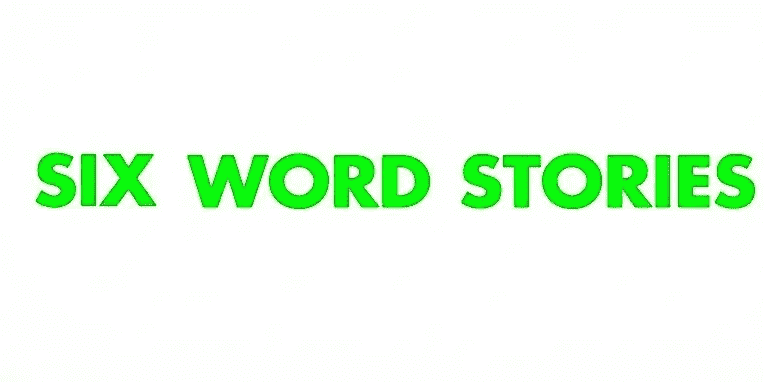

# 用六个字或更少的字回答常见问题[阅读时没有付费墙或弹出广告]

> 原文：<https://medium.com/hackernoon/hacker-noon-faqs-answered-in-six-words-or-less-494036574715>

***Why six? Because the most powerful stories are told*** [***in six words***](https://www.huffpost.com/entry/six-word-story_n_5332833)***.***

> *什么是黑客正午？*

一个独立的科技媒体网站

> *谁会读《黑客正午》？*

[技术专家](http://hackernoon.com/@hackernoontech)、[软件开发者](https://hackernoon.com/tagged/software-development)、[比特币制造者](https://hackernoon.com/tagged/bitcoin)、[区块链爱好者](https://hackernoon.com/tagged/blockchain)。

> *为什么在这里发布？*

你的故事值得更相关的[发行](https://help.hackernoon.com/app/page/1x-9-MYyfV2DiqaVrXLM4rhREA3oQcsfk)。

> *如何贡献一个故事？*

[创建账户](http://auth.hackernoon.com)，提交草稿

> 我可以在这里重新发表我的故事吗？

是的。我们也支持规范链接:)

> *我向 Hacker Noon 提交故事会发生什么？*

编辑将在 3 天内对进行审核。

> 主页上有哪些故事？

社论精选和最新标签。

> 如何让我的故事获得更多的流量？

[见解深刻的头条](https://help.hackernoon.com/app/page/1vO_9_oxFTKGbFZug-IzXt1sBmKcT3DcYSW4SNIdQQ6o)、[动人心魄的形象](https://help.hackernoon.com/app/page/1kTI09KgOPQgy3bEwlPyjtAvevmuL4zRd)、品质[的文字](https://help.hackernoon.com/app/page/1gRbkfKlrfqztzZDQzHGp4v2U0G36alVmE7iODP4d9rg)。

> 我多久可以提交一次故事？

你想多久就多久。

> 如何充分利用我的作者档案？

[更新你的简历](https://help.hackernoon.com/app/page/1nt2UE8q-7g6vxoz_ihHTSi4w1NUt0IzuZsfhgH_HwzA) & [优化你的 CTA](https://help.hackernoon.com/app/page/1SbI75hPiZa1lK13KpL_1ZmaYQ9IFBKXBtjmJDe5w5M4)

> 如何知道我的故事是否被拒绝/编辑/出版？

编写仪表板通知和/或通过电子邮件。

> 自从我提交我的故事已经 4 天多了，我没有看到任何回应？

很抱歉。[让我们知道](https://community.hackernoon.com/t/did-you-review-my-stories-thread-4-days-since-submission/1457/49)。

> *为什么我的故事会被自动拒绝？*

抄袭、垃圾邮件、误导或其他[危险信号](https://help.hackernoon.com/app/page/1vwmUUdI_wz06qPBm2z0xZfqYp2DJR3PwR0f61_19l78)。

> 我的故事里没有这些。为什么还是被拒绝了？

质量和与技术相关的问题！

> Hacker Noon 对提高我的写作有帮助吗？

是的。[工作人员编辑](https://help.hackernoon.com/app/page/16tXB0oyTocRc64fjJqVLumOltuiWTaWv3y3E0jBys-M)将提供反馈。

> *你是如何创作出最酷的特写照片的？*

[在 unsplash 上找到，用 lunapic 编辑](https://help.hackernoon.com/app/page/13ySMEdnR4pct6IiV6zlbyXAxtV_Xq2g2NDZ4WsW_LMQ):)

> *公司/品牌可以在黑客正午发布吗？*

是的。尽管品牌需要付费。

> 我可以付费出版吗？

即使作为品牌，出版也不能保证。

> *那么你对品牌收费是为了什么呢？*

[品牌为故事学分买单](http://sponsor.hackernoon.com/#brandasauthor)。

> *所以如果品牌付费，你会自动发布他们的内容？*

不。编辑纯粹是根据优点来判断的。

> 你付给你的作家报酬吗？

不是用现金，不是。

> 我可以编辑已经发布的文章吗？

是的。做出改变& [给我们发电子邮件](mailto: stories@hackernoon.com)。

> 你只用英文出版吗？我能把帖子翻译成另一种语言吗？

大部分是英语。但是请一定要翻译！

> 我在 Medium 上主持的黑客午间故事发生了什么？

现在可以通过 medium.com/hackernoon/your-story-title.到达

> *我的黑客正午故事网址发生了什么？*

同样的位置，由新软件驱动。

> 我该如何声明我在媒体上的旧故事？

[用中号手柄更新个人资料。](https://hackernoon.com/a-step-by-step-guide-to-connect-your-medium-account-to-your-hacker-noon-account-j02fo32rw)

> *就这么简单？*

不。我们会验证你的。

> *如何？*

我们的数据库，或通过电子邮件。

> 我只想读书。我需要创建一个帐户吗？

号码

> 我有理由创建一个读者账户吗？

跟踪阅读历史和评论。

> 我需要付费才能阅读你的网站吗？

不。我们永远不会传送门故事。

> 那么你是如何赚钱的呢？

我们[养了一些](http://startengine.com/hackernoon)。不过最主要的是，[赞助商](http://sponsor.hackernoon.com)！

> 你允许哪种广告/赞助？

[广告牌](http://sponsor.hackernoon.com/#billboard)，[品牌作者](http://sponsor.hackernoon.com/#brandasauthor)，[播客](http://sponsor.hackernoon.com/#podcast)。事件也是。

> 我有更多的问题。我该怎么办？

查看[help.hackernoon.com](http://help.hackernoon.com)或电子邮件[support@hackernoon.com](mailto:support@hackernoon.com)

> [最初发表于 HackerNoon.com。](https://hackernoon.com/hacker-noon-faqs-with-six-word-answers-aw1ls3z1q)