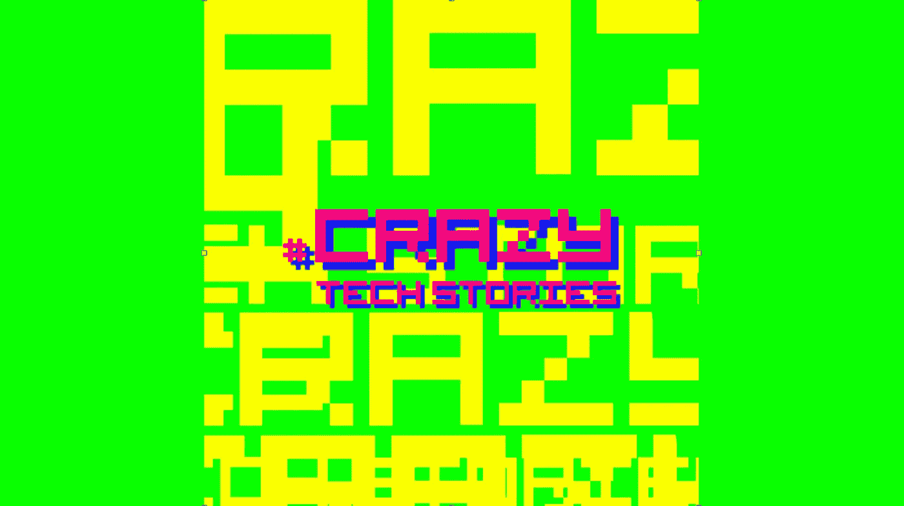
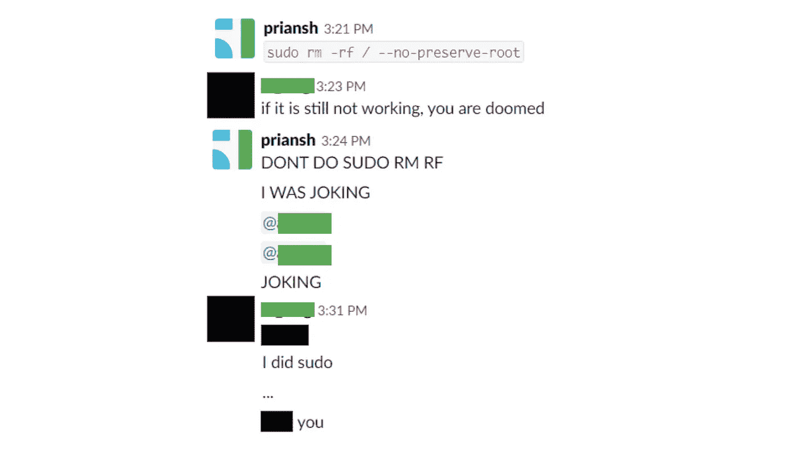
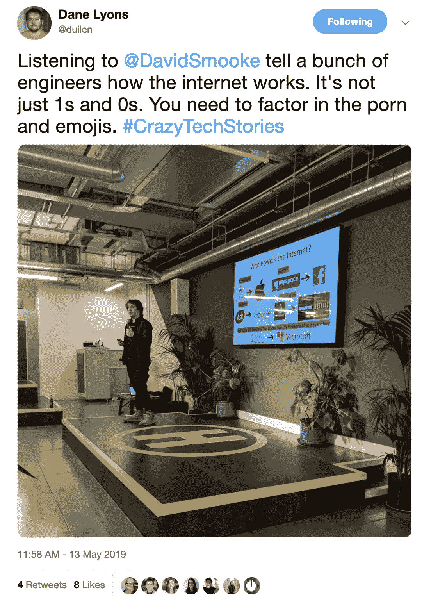
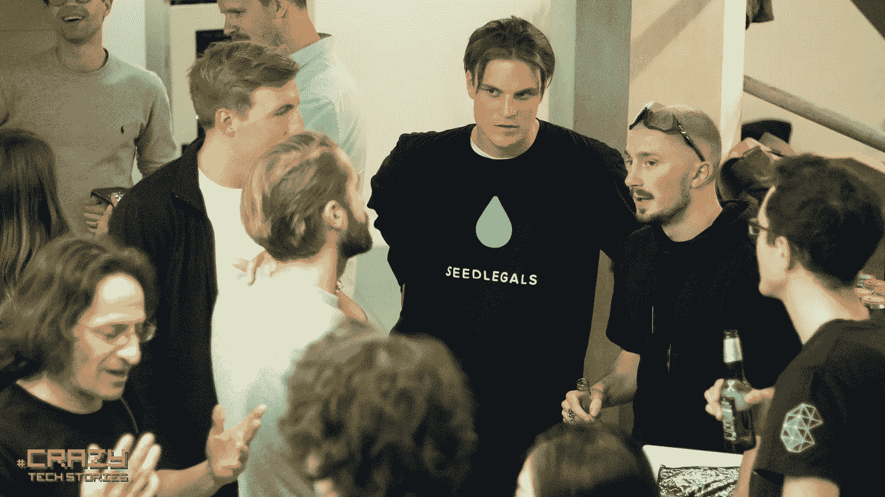

# 黑客正午

> 原文：<https://medium.com/hackernoon/hacker-noon-in-the-flesh-270ba4fefbfe>

## **科技事件回顾:** [**黑客正午**](http://hackernoon.com)&[**果然质数**](https://indeedhi.re/2Wiitd4)

****

# **嗨，黑客们，**

**昨晚，我们在伦敦肖尔迪奇的 Huckletree 的令人敬畏的共同工作空间举办了一场活动，在那里，来自大洋彼岸的 Hacker Noon 撰稿人展示了他们最疯狂的技术故事。就读者数量而言，伦敦一直是我们的前三大城市，所以在这里工作非常令人兴奋。**

****

**演讲者分享了一些来之不易的关于避免周五发布的智慧；幸存的海森堡；亚利桑那州冰茶罐的恐怖；当谈到推销你的创业公司时，要接受火的洗礼；重建你已经建造的东西；以及如何让 4000 万人认为你是黑客。**

> **“今晚的黑客午间活动非常精彩。我学到了你应该总是备份你的备份，不管你对技术了解多少，魔术仍然是魔术。我还学会了永远不要说‘sudo RM-RF/’是开玩笑……”德勤会计师事务所的技术专家埃德·库珀说**

****

**观众还观看了一场真实的魔术表演，并从大卫·斯穆克本人的角度看了 Hacker Noon 重建背后的过程和想法。**

****

> ***“骇客正午更是好上加好！听到那些做着如此酷的事情的人的声音真的很好。我还学到了一些关于笔记本电脑附近不能有液体的关键规则，以及演示文稿和如何粉碎它们。汤姆·韦伯的魔术表演真是太棒了。”——数据科学家埃斯特韦斯·沃森***

****

**非常感谢我们的演讲者分享了他们宝贵的时间和见解:[安东·莫兹戈沃伊](https://hackernoon.com/@amozgovoy)、[西蒙·伍尔夫](https://www.linkedin.com/in/simonwoolf/)、[普里安什·沙阿](https://hackernoon.com/@priansh)、[大卫·斯穆克](https://twitter.com/davidsmooke?lang=en)、[安东尼·罗斯](https://hackernoon.com/@anthonyrose)和[托马斯·韦伯](https://hackernoon.com/@webbsite)。**

**再见。**

**黑客正午团队**

****附言**对于那些常驻伦敦的人，[哈克树的技术团队正在招聘](https://www.huckletree.com/careers)！拥有包括每月好奇心预算在内的职业发展津贴，我们强烈建议查看他们在[的职位空缺](https://www.huckletree.com/careers)。**