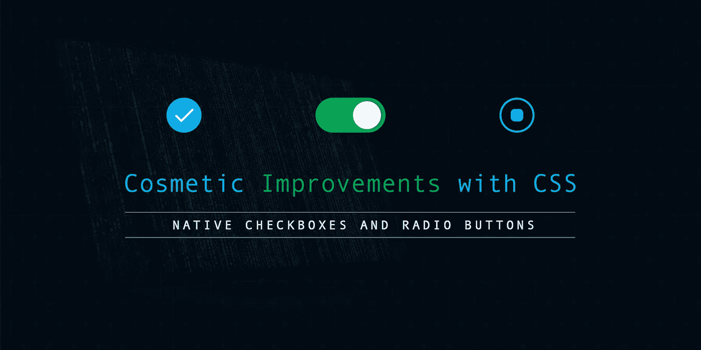
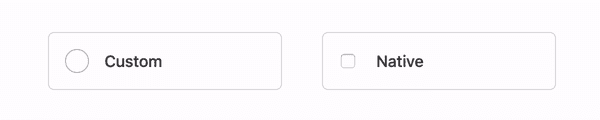
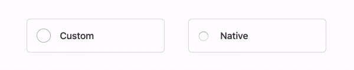
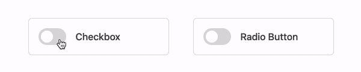
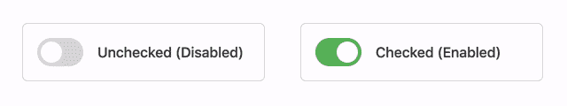

# 黑客定制复选框和收音机

> 原文：<https://medium.com/hackernoon/hacking-custom-checkboxes-and-radios-5d48230440d>

## 使用 CSS 对复选框和单选按钮进行修饰性改进



单选按钮(或称*单选按钮*)和复选框是非常重要的输入元素，常见于网络上的许多表单中。

**复选框**用于预定义值列表中的多个值可能适用的情况，例如，从文件列表中标记多个要删除的文件。

**另一方面，单选按钮**用于只有一个值适用的情况，例如，从列表中选择性别。

在本教程中，我们将使用一步一步的方法来检查如何使用 CSS **来**改善单选按钮和复选框的美观和外观**，同时仍然保持输入元素的可访问性**。

*为了充分理解本教程，需要对 CSS —选择器和样式规则有一个基本的了解。然而，你不必真的是一个 CSS 专家来跟进。*

# 动机

说到外观，单选按钮和复选框在不同的浏览器中有些笨拙和不一致。通常情况下，复选框和单选按钮需要统一的外观，不管使用的是什么浏览器。

大多数 [CSS](https://hackernoon.com/tagged/css) 框架，比如 Bootstrap，已经为这些输入元素的外观提供了定制样式。然而，如果你没有使用 CSS 框架，你可能需要定制你自己的复选框和单选按钮——这就是本教程的目的。

# 设计蓝图

**以下是创建定制单选按钮或复选框的步骤概要。在这个列表中，我将继续把一个*复选框*或*单选按钮*称为 ***输入元素*** 。**

*   **确保你有输入元素**的标签。
    用`<label></label>`元素包装输入元素，并在必要时为输入元素附加标签文本。这对于维护输入元素的可访问性也很有用。
*   **在输入元素后添加定制元素。定制元素是一个空元素，它将保存输入的定制外观的所有样式。它必须在 input 元素之后，并且它们必须有相同的父元素。**
*   **让原生输入元素消失。** 添加必要的样式，防止原生输入元素被可视化呈现。避免使用将 input 元素从页面的视觉流中移除的样式，因为它们会被屏幕阅读器忽略，还会对键盘的可访问性产生负面影响。

*   **随心定制。** 将必要的样式添加到定制元素中，以获得输入所需的定制外观。使用`:checked`伪类根据输入元素的检查状态添加样式。如果有必要，可以使用 CSS 生成的内容，利用`::before`和`::after`伪元素。

# 履行

我们将根据刚刚看到的[设计](https://hackernoon.com/tagged/design)蓝图继续实施我们的定制。我们将从定制输入元素的极简标记开始，然后是样式。

## **基本标记**

下面是 input 元素的示例标记 HTML。

这里的复选框元素是用一个`check-custom`类定义的。复选框的定制元素被赋予了一个类`check-toggle`。

以这种方式使用类使得加入或退出定制变得容易。例如，如果没有传递`check-custom`类，则显示本地复选框。

## 隐藏本机元素

您可以很容易地将`hidden`属性附加到 input 元素上，以防止它在视觉上呈现为这样:

```
<input type="checkbox" class="check-custom" **hidden**>
```

然而，这应该被劝阻。CSS 样式应该用来隐藏原生输入元素。

下面是一个简单的样式定义，确保本地输入元素不会以可视方式呈现。

这里，属性选择器和`.check-custom`类选择器与`input`类型选择器一起使用，以确保样式只应用于具有指定类的复选框。

## 自定义复选框

首先，我们将添加复选框外观的基本样式，如下所示:

注意*通用兄弟组合符* ( `**A ~ B**`)是如何在选择器中用于定位输入元素之后的定制元素的。又来了:

```
input[type='checkbox'].check-custom **~** .check-toggle
```

该选择器将匹配任何具有`check-toggle`类的元素，该类是任何具有`check-custom`类的 checkbox `input`元素的直接兄弟，并且位于该元素之后。

最后，是时候为复选框的不同状态添加样式了。

请注意，我使用了一个白色勾号的内嵌 SVG，以及一个蓝色的衍生颜色作为自定义复选框被选中时的背景。

虽然我在这里使用了非常简单的样式，但是您完全可以根据自己的需要使用尽可能多的样式。

以下是自定义复选框的完整样式:

## **对比演示**

这是一个非常简单的演示，比较了自定义和本地复选框的外观。(应用了额外的样式来帮助视觉呈现*)*



# 实现自定义单选按钮

我们已经看到了自定义复选框的实现。让我们快速地看看如何通过遵循我们前面看到的设计蓝图来实现一个定制单选按钮。

## 基本标记

下面是单选按钮的示例标记 HTML。

这里，我们将输入类型更改为`radio`。为了一致性，我们还保留了元素上的类名。

在我们继续编写自定义单选按钮的样式之前，让我们对单选按钮的外观有一个大致的了解。

下面是我们的自定义单选按钮和原生单选按钮的外观对比。



## 设置单选按钮的样式

从上面的截图可以看出，我们的自定义单选按钮在选中状态下，中间有一个看起来像小方框的东西。

为了创建选中状态的框，我们将利用定制元素的`::after`伪元素。

所有其他样式与我们之前看到的复选框几乎相同。下面是创建自定义单选按钮所需的样式。

请注意，我们现在使用`input[type=’radio’]`基底选择器来确保我们只针对单选按钮。请再次记住，如何设计定制单选按钮的样式完全取决于您自己。

# 案例研究:拨动开关

有几个定制复选框和单选按钮的用例可能不太明显。其中之一是**拨动开关**。

一个**拨动开关**可以被看作是一个复选框，它基于其选中和未选中状态在两个值之间切换——通常具有开关的外观。

我们可以修改自定义复选框的自定义元素的样式，使其具有开关的外观。

## 加价

让我们从修改标记开始，向 input 元素添加一个`toggle-switch`类。事情是这样的:

## 复选框—为什么不是广播？

注意，在切换开关的标记中，我们使用了输入类型`checkbox`作为切换开关。一个好问题是— **“我们是否也可以使用一个** `**radio**` **输入元素？”**

**答案是否定的。**原因是单选按钮和复选框处于选中状态时的切换行为不同。

当单选按钮已经处于选中状态时，它本身不能仅通过用户交互来取消选中。因此，用作拨动开关并不理想。

这个简单的演示展示了使用单选按钮和复选框作为拨动开关的区别。



## 款式

我们将对定制元素的样式进行一些修改，使它看起来像一个开关。

典型的开关由一个**外框架**和一个**内滑块**组成，根据开关的状态，内滑块可以对准框架的左侧或右侧。

为了实现这个设计，我们将利用定制元素的`::before`和`::after`伪元素。`::before`伪元素将是外部框架，而`::after`伪元素将是内部滑块。

由此产生的切换开关将看起来像下面的截图— *(已经应用了额外的样式来帮助视觉呈现)*



以下是拨动开关的样式:

# 关于可访问性

对于我们在本教程中所做的所有定制，我们能够确保我们的定制单选按钮和复选框仍然是可访问的——顺便说一下，这是一个非常好的壮举。

因此，保留了 tab 键聚焦、用空格键检查切换以及输入元素的所有其他可访问性特征。这是可能的，因为:

*   `<label></label>`元素用于包装输入元素。因此，一定要记住将原生输入元素和定制元素包装在父元素`<label>`中。
*   原生输入元素仍然保留在页面的可视流中，即使它们没有以可视方式呈现。

我们定制元素的可访问性的另一个重要改进是添加一个提供可读标签的文本或元素——使用以下任一选项:

*   父`<label>`元素中的子元素或文本。
*   使用`aria-label`属性指定的隐藏标签文本。
*   使用`aria-labelledby`属性链接到输入元素的独立元素。

还是在 ARIA 属性中，您也可以将`aria-checked`属性与基本的`checked`属性一起使用，来指示输入元素的检查状态。

对于拨动开关，您应该将 ARIA 角色`role=”switch”`添加到输入元素中，以表明它是一个拨动开关。

最后，始终确保为输入元素的`focus`状态使用适当的样式，以便提供有用的视觉提示。

# 结论

最后，我们已经到了本教程的结尾，我们已经看到了一个非常简单的设计蓝图，它可以指导我们只用 CSS 对原生单选按钮和复选框进行修饰性的更改，并且仍然保持它们的可访问性。

如教程中所述，您并不局限于教程中使用的自定义样式。事实上，如何设计定制元素的样式完全取决于您自己。

**拍手&跟着**

如果你觉得这篇文章很有见地，如果你不介意的话，请随意鼓掌。

你应该在**媒体** ( [高兴钦达](https://medium.com/u/ddcd0e9719e5?source=post_page-----5d48230440d--------------------------------))上关注我，了解更多像这篇文章这样有见地的文章的更新。也可以在我的 **Twitter** 手柄上关注我( [@gladchinda](https://twitter.com/@gladchinda) )。

***享受编码……***