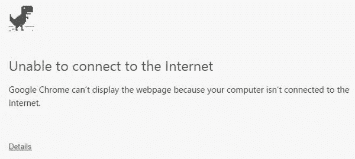
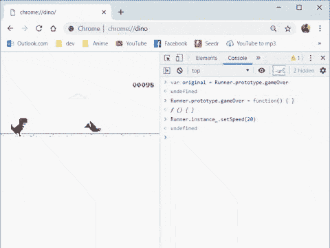

# 黑了谷歌 Chrome 的 T-Rex 游戏！

> 原文：<https://medium.com/hackernoon/hacking-google-chromes-t-rex-game-e88b0f31bd55>

## 谷歌 Chrome 和所有其他谷歌产品一样，有一个有趣的复活节彩蛋——恐龙游戏！它在无互联网连接页面上显示为 8 位恐龙。只要你按下空格键或点击它，它就会开始运行！

但是，你知道吗，你也可以黑它！

有了黑客，你可以改变游戏的速度，甚至让你的恐龙永生(即使你被击中也不会死)。

为之激动？那就开始吧！

# 以下是如何破解恐龙游戏(2 种方法)

首先，断开你的互联网打开“没有互联网”的页面。为此，你可以关闭你的无线网络，或者直接在地址栏输入 chrome://dino。

屏幕看起来会像这样。

现在，右键单击屏幕上的任意位置，从子菜单中选择 Inspect。或者，您可以使用热键组合 Ctrl+Shift+I 进行相同的操作。

这将在原始网页旁边打开相同的源代码版本。

在此部分中，转到控制台选项卡。

在这里，你会看到一个命令行界面，你可以输入代码行，以“黑掉”迪诺游戏，使它按照你的意思运行。

您可以使用下面提供的相应代码来破解以下特性。

# 1.提高速度

如果你觉得霸王龙以正常速度奔跑没那么有挑战性，那么这个 hack 就是给你的！

有一个秘密的方法，你可以用它来提高小恐龙的速度，让游戏变得更加困难和有趣。

您所要做的就是将下面这段代码放入 Console 选项卡中。

> Runner.instance_。设置速度(1000)

在 console 选项卡中粘贴代码后，按 Enter 键。

瞧啊。你的霸王龙很快就会加速。

万一，你还想要多一点疯狂，只要增加括号内的数字，就能看到神奇了。

不要忘记在每个命令后按回车键。

# 2.变得不朽

chrome dino 游戏的另一个漏洞是不朽或无限生活帮。出于显而易见的原因，我个人称之为欺骗而不是黑客，但我仍然与你分享它。

如果你想在谷歌恐龙游戏中赢你的表弟或办公室同事，我有一小段代码可以让你的霸王龙永生。

要成为不朽，只需将下面的代码复制并粘贴到控制台选项卡中，然后按回车键。

> var original = runner . prototype . gameover

上面一行将游戏代码中的原始 gameOver 函数存储到一个静态变量‘original’中(这将有助于恢复功能)。

现在，将以下代码粘贴到 console 选项卡中，并按 enter 键。

> runner . prototype . game over = function(){ }

这段代码将用一个空函数替换原来的 gameOver 函数。这就是让你霸王龙永生的原因。

如果你完成了无限生命并想切换回正常状态，只需在控制台标签中粘贴下面一行并按回车键。

> Runner.prototype.gameOver =原创

通过输入这段代码，我们实际上是通过将保存在变量“original”中的原始函数再次转换为其默认状态来恢复 gameOver 函数。

随着不朽的转变，游戏应该像下面的图片一样工作。

那都是朋友！这是破解谷歌恐龙游戏的两种简单易行的方法。对最终用户来说，把事情变得更有趣是一件有趣的事情。

通过入侵谷歌恐龙游戏，我不想传播任何对谷歌浏览器或其用户的恶意。

*免责声明:本黑客教程仅用于教育目的。*