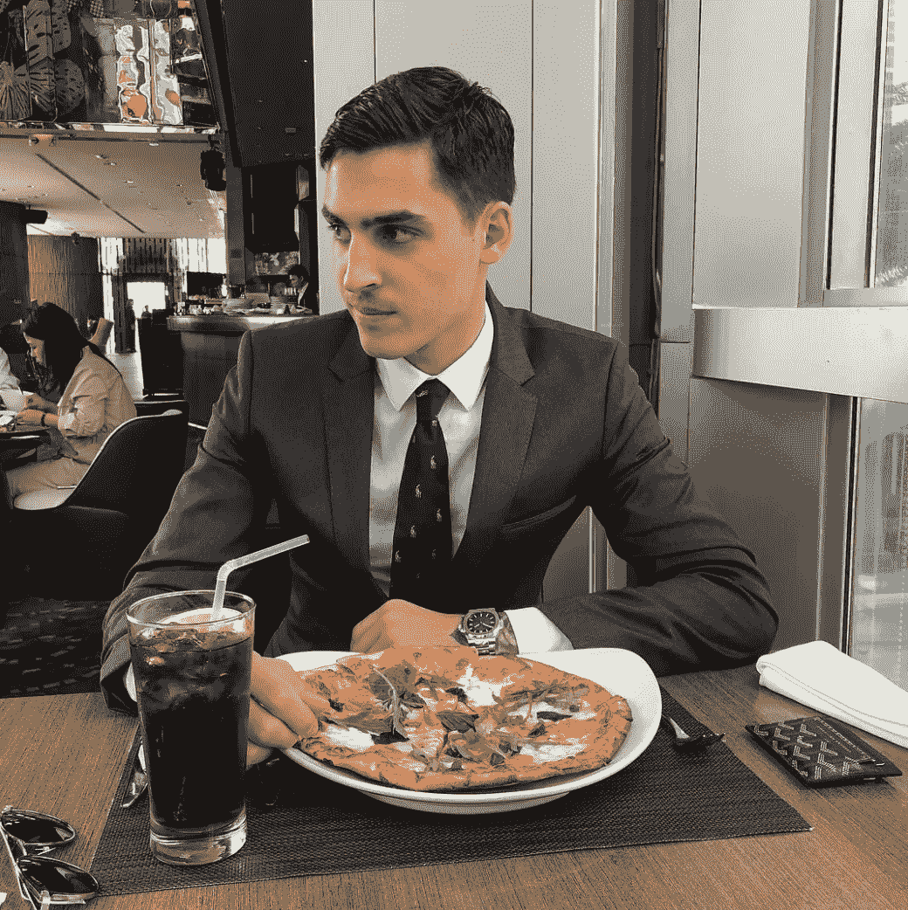
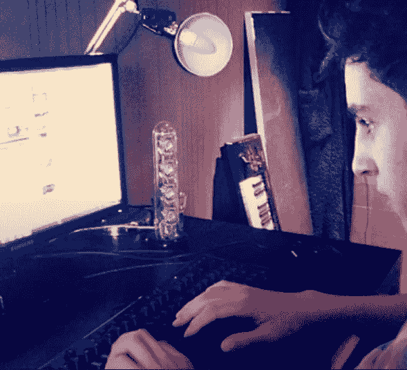

# 入侵 Instagram:文斯·范·梅尔如何发展成为一个时尚影响力帝国

> 原文：<https://medium.com/hackernoon/hacking-instagram-how-vince-van-meer-grew-a-fashion-influencer-empire-e60af4aed151>

A picture of Vince Van Meer

让我们面对现实吧，如果你今天正试图发展一个品牌，那么 Instagram 是必须的。没有其他社交媒体网站像 Instagram 一样将美学、影响力和正面认知结合在一起(它甚至躲过了母公司脸书在过去一年的公关灾难)。你可以找到你想要的关于社交媒体的所有负面信息，比如它如何令人上瘾，我们如何在社交媒体上过多地比较我们自己，但事实是，我们 T4 也在社交媒体上，它已经与我们的现实生活交织在一起，远远超出了人们的想象。

由此，一个新的年轻企业家阶层崛起，利用这一新的网络商机。其中一个是 23 岁的荷兰人文斯·范·米尔，他一度拥有六个不同的时尚账户，每个账户都有数十万粉丝。如今，他正致力于开发一批新的 Instagram 账户，其中一个是备受赞誉的单字 [@games](https://www.instagram.com/games/) handle。

范·梅尔在荷兰的小城鲁森达尔长大，一直被媒体和科技所包裹。像他成长过程中的许多同龄人一样，Van Meer 是一个狂热的游戏玩家，但当他开始编程并创建自己的游戏时，他更进了一步。这将引导 Van Meer 走上网络和媒体项目编程的道路。

十几岁的时候，范·梅尔在麦当劳兼职，并创办了自己的 YouTube 频道 Xtrasmallspacer，专注于游戏。这个频道很快就有了数百万的浏览量，他开始从中赚了不少钱。虽然他想从麦当劳退出，因为他的渠道不成功，但他的父母强迫他继续在那里工作，理由是这对他的整体发展有好处。事后看来，范·米尔说他很感谢呆在那里，这帮助他如何与他人一起作为一个团队工作。17 岁时，范·梅尔开始在一家夜总会拍摄专业照片和视频，他将这一梦想坚持了一年。这给了 Van Meer 在内容编辑领域更多的经验。

A picture of Van Meer on his computer

范米尔第一次接触社交媒体是在 2013 年，当时他创建了自己的第一个 Instagram 账户。在更加熟悉这个平台后，他很快意识到如何通过增长黑客技术来赚钱。他选择以时尚为目标，认为这是当时 Instagram 上最受欢迎的话题之一(现在仍然这么认为)。Van Meer 开始工作，并使用一些策略来增加他的帐户，例如跟随时尚用户，在类似级别的帐户中大声喊出来，以及从更大的帐户中购买大声喊出来。在巅峰时期，范·梅尔拥有 6 个时尚账户，总共有数十万粉丝；一些账户有超过 50 万。

那时，品牌开始联系他，在他的时尚帝国 Instagram 账户上做宣传。在接受了外部人士的广告后，他开始发现自己账户上的参与度有所下降，因此范·梅尔决定创立自己的品牌。他成功的关键在于，他不仅增加了他的受众，而且他还为他的目标受众策划了在其他任何地方都找不到的独特内容，以至于当他的付费帖子偏离了他们习惯的内容时，他们会通过不喜欢和不关注来表达他们的沮丧。一旦他推出了自己的品牌，他就发现自己的电子商务业务利润更高，而且会在几个月后卖掉它。

当被问及他在数字营销和电子商务中面临的逆境时，范·梅尔说，最困难的事情是平台格局变化得多快，以及他如何总是必须跟上它们。像脸书、谷歌和 Instagram 这样的平台可以与体育相提并论，每个平台都有自己的球员领域和自己的规则(类似于算法)，他们对自己领域的规则拥有完全的控制权。在任何时候，他们都可以决定改变他们的算法(或规则),这可能会对业务产生巨大的影响。问题是与实际的运动不同，平台不会告诉你他们何时或如何改变游戏规则，让用户通过试错来适应它们。例如，如果 Instagram 改变其算法，减少对浏览器页面的关注，更多地关注标签，那么帐户将需要适应以保持增长和参与度。

尽管算法在变，但随着时间的推移，账户增长的秘诀是不变的。Instagram 是一个竞争非常激烈的环境，拥有独特的内容是脱颖而出和扩大受众的关键。就发展账户而言，范·梅尔强烈建议不要仅仅因为某人有一个大账户就支付推销和促销费用；策划好你知道观众会喜欢的宣传和促销活动，对建立你的账户和整体品牌会有更大的帮助。

目前，Van Meer 拥有自己的电子商务咨询公司 Rocketviral，在那里他帮助大大小小的品牌和有影响力的人进行商业战略、营销、社交媒体接触和产品开发。此外，他目前正在开发一批新的 Instagram 账户，其中@games 是最重要的，他正在召集一个内容经理和创作者团队，尽快开始开发这些账户。在互联网之外，Van Meer 还在荷兰从事一些房地产项目和投资。

当人们说创业的美国梦已死时，事实并非如此。它刚刚搬到网上，来自世界各地的年轻人正在继承它的衣钵。