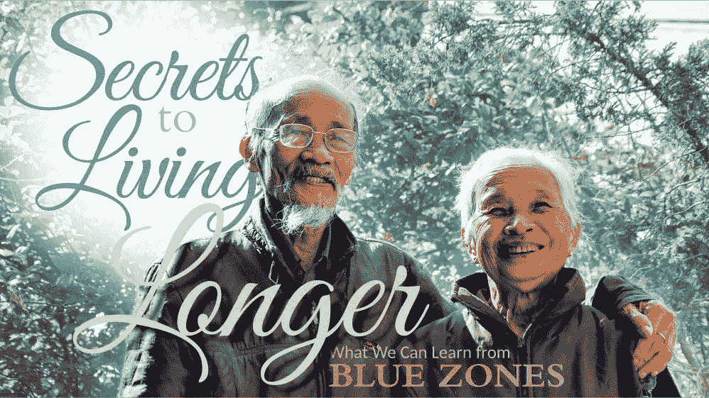
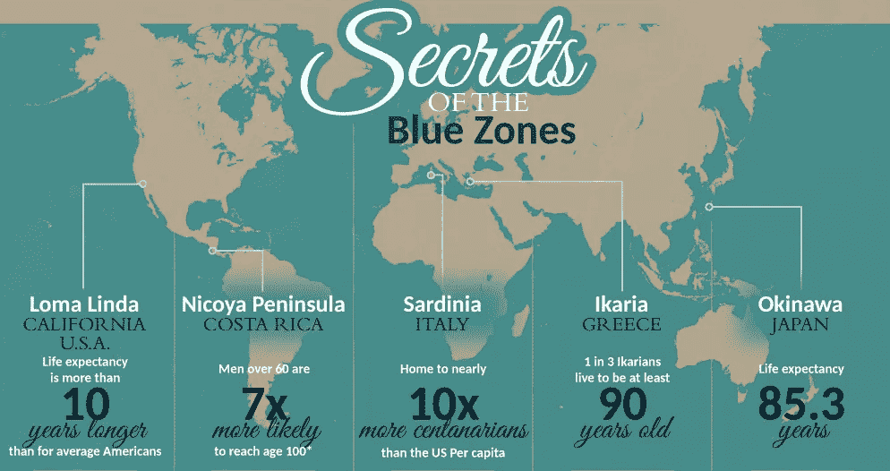

# 黑客长寿:如何活得更长

> 原文：<https://medium.com/hackernoon/hacking-longevity-how-to-live-longer-c9448fa13896>

去年年底，疾病预防控制中心宣布美国人的预期寿命再次持续下降，在我们似乎应该长生不老的时代，这是一个令人震惊的事实。根据美国家庭医师学会的说法，这种下降很可能是由于自杀和药物过量死亡的急剧增加。2017 年，CDC 宣布阿片类药物的使用已达到[流行水平](https://www.usdrugtestcenters.com/opioid-crisis-and-the-american-workplace.html)，阿片类药物危机远未解决。阿片类药物处方过多、缺乏治疗途径以及缺乏心理健康服务只是预期寿命下降的几个根本原因。但是，如果我们能够通过学习如何活到 100 岁甚至更长寿来对抗预期寿命的下降呢？

很快，百岁老人将会比以往任何时候都多。2015 年，全球百岁老人不到 50 万，但据许多人估计，到 2050 年，这一数字将激增至近 380 万。我们有医疗技术来更早地发现更多的疾病，并比以往任何时候都更有效地治疗它们。但是，即使所有这些医疗技术唾手可得，我们仍然可以做更多的事情来活得更长、更健康。

我们才刚刚开始真正理解肥胖症流行的增加以及对此可以做些什么。直到最近，人们还把肥胖归咎于肥胖者自身的肥胖，但最新的研究显示，这可能并不全面。据[美国新闻抗击儿童肥胖峰会](https://www.usnews.com/news/healthiest-communities/articles/2019-05-16/understanding-obesity-in-america)报道，加工食品的流行与遗传结合在一起，以越来越多的儿童陷入肥胖循环的形式创造了一场完美风暴。研究表明，食用含有已知且易于识别的成分的最低限度加工食品的人往往吃得更少，甚至在热量摄入和营养密度相同的情况下也能毫不费力地减肥。

世界上有些地方被称为“蓝色区域”，那里的人们通常比平均寿命更长，他们的共同点之一就是更健康的饮食。在哥斯达黎加的尼科亚地区，饮食主要包括玉米、豆类和南瓜，日常饮食中很少有肉、蛋和奶制品。类似地，在加利福尼亚的洛马琳达，居民遵循圣经的饮食，也包括很少的肉、鱼和家禽，主要包括蔬菜、水果、种子和坚果。在意大利的撒丁岛，居民吃低蛋白质的植物性饮食，而在希腊的伊卡利亚，居民吃动物产品含量很低的地中海饮食，在日本的冲绳，主要的饮食是植物性的。

除了非常相似的植物性饮食之外，这些地方还有什么共同之处？居民通常比平均寿命更长，许多人活到 100 岁甚至更长。世界上这些地区的饮食和锻炼对整体健康影响最大，而这些地区也都重视心理健康，这被认为是整体长寿的秘诀。每一个这样的社会都有自己对工作、志愿服务以及生活中的目标感和团体感的强调。

如果我们都开始把这些经验应用到日常生活中，会有什么好处呢？最坏的情况是我们都活得长一点，所以为什么不试一试呢？