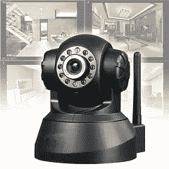
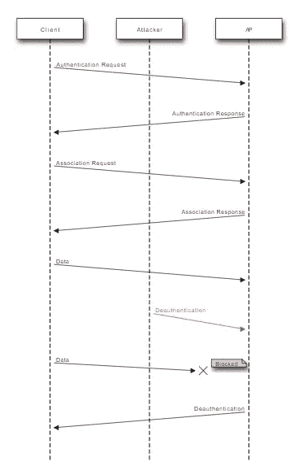
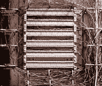

# 黑进我的 IP 摄像头

> 原文：<https://medium.com/hackernoon/hacking-my-ip-camera-1ca66682a739>

## 取消认证攻击+物理安全


**免责声明:** **本文提供的所有数据和信息仅供参考。主要目标是提高安全意识，讲授信息安全、对策，并向读者提供如何实现安全和功能系统的信息。如果您计划将这些信息用于非法目的，请立即离开本网站。**

几天前**我的一个朋友在他家购买并安装了一个新的 Wifi IP 摄像头**。想知道这个系统到底有多安全，他让我看一看，如果可能的话，试着“黑掉”它。

事实是，物联网(IoT)目前是一个非常热门的趋势，许多设备正在进入市场，其中许多都不那么可靠或安全。



IP 摄像头是这种设备的一个很好的例子，作为监控和安全的智能解决方案，这种设备已经侵入了许多家庭(在某些情况下甚至是小企业)。

言归正传，**我尝试使用两种通用技术**来入侵摄像头，而不是专注于寻找特定的软件漏洞。我使用的两种方法是**解除认证攻击**和**物理安全攻击。**那么让我们仔细看看它们:

# 取消认证攻击

> Wi-Fi 取消身份验证攻击是一种拒绝服务攻击，目标是用户和 Wi-Fi 无线接入点之间的通信。

利用这种攻击，人们可以 ***断开客户端与其连接的接入点*** 。更多细节请看以下链接:[https://en.wikipedia.org/wiki/Wi-Fi_deauthentication_attack](https://en.wikipedia.org/wiki/Wi-Fi_deauthentication_attack)和[https://www.aircrack-ng.org/~~V:/doku.php?id =解除认证](https://www.aircrack-ng.org/~~V:/doku.php?id=deauthentication)



Sequence diagram for a WiFi deauthentication attack

**解除认证攻击**属于**预连接攻击**的范畴，这意味着在连接到任何这些网络之前，您可以**将任何设备**从**任何网络**断开，因此**不需要**知道网络的**密码。**

话虽如此，还是有可能将 IP 摄像机从它所连接的接入点断开(**没有 AP 密码**，正如我前面提到的，因为甚至不需要连接到网络)，使它变得无用。

摄像头在正常情况下会检测运动和/或噪音，如果检测到什么，会通过电子邮件通知用户。相反， ***在攻击期间，当我们用动作和声音触发传感器时，IP camera 应用程序的视频反馈被冻结，没有发送任何通知。***

下面是**我用于这个简单攻击**的代码(关于如何执行解除认证攻击的更详细的分析，有一篇关于[黑客正午](https://hackernoon.com/forcing-a-device-to-disconnect-from-wifi-using-a-deauthentication-attack-f664b9940142)的很棒的文章):

**专门对 IP 摄像机(只有一个客户端)取消认证**

```
aireplay-ng --deauth [number of deauth packets] -a [AP MAC address] -c [IP camera MAC address] [interface]

**Ex: aireplay-ng --deauth 1000 -a 11:22:33:44:55:66 -c 00:AA:11:22:33:44 mon0**
```

如果您知道 IP 摄像机的品牌，您可能会找到该设备的 MAC 地址，因为 MAC 地址的前 6 位数字识别制造商([https://macvendors.com](https://macvendors.com/))。你也可以通过 SSID 的名称来推测哪个是 AP 的 MAC 地址。否则，您可以使用下面的代码进行更广泛的攻击。

**取消特定网络中所有客户端的身份验证**

```
aireplay-ng --deauth [number of packets] -a [AP MAC address] [interface]**Ex: aireplay-ng --deauth 1000 -a 11:22:33:44:55:66 mon0**
```

当然，如果相机应用程序被编程为 ***定期检查与路由器/设备的连接*** 并通过例如向用户发送电子邮件来报告连接丢失，情况就不会如此。

同样需要指出的是，如果 IP 摄像机有一个 ***有线连接，而没有一个*** 无线连接，这种攻击就不可能发生。使用无线通信时，我们应该始终牢记介质是空气，空气对所有人都是可访问的(因此更容易被黑客攻击)。

# 物理安全攻击

> 物理安全描述了旨在拒绝对设施、设备和资源的未授权访问，以及保护人员和财产免受损害或伤害(如间谍活动、盗窃或恐怖袭击)的安全措施。



Distribution frame

如果你在“软件方面”拥有顶级的安全性，这并没有多大作用，但是你试图保护的物理设备本身并没有放在安全的地方。在我们的例子中，**本地配线架**箱，互联网电话电缆的终端，在我朋友的房子前面，并且**没有锁**。很容易有人**干预机柜中的**，**切断线缆**，**移除互联网连接**，从而禁用 IP 摄像机。

如果没有互联网连接，用户会**误以为一切都是安全的**，因为他不会收到电子邮件通知(如果检测到什么东西，他应该会收到通知)，而**认为一旦有人试图入侵他的房子，他的 IP 摄像头就会提醒他**，而摄像头会在没有任何警告的情况下停止工作。

下面是我以前写的一篇文章的摘录，“[没有互联网的物联网…这对它的功能有什么影响？](https://hackernoon.com/iot-without-internet-how-does-it-affect-its-functionality-275cff90a018)"，**针对此问题提出解决方案**:

> 这就是为什么我提议连接到互联网的物联网设备都应该包含一个基本功能**。该功能是**，用于在设备**失去互联网连接时发出通知。如果物联网设备没有互联网接入，当然就没有任何发送警报的手段。这就是为什么我建议在客户端应用程序的 ***处应该有对设备和控制器应用程序*** 之间的连接的** (速率将由设备任务的严重性和需要在线的程度决定) ***。***
> 
> 在我们之前的 *IP 摄像头示例*中，即**智能手机应用**会**检测到家庭路由器的互联网连接**丢失，用户会**发送通知**，从而采取适当的措施**解决问题**(呼叫 ISP，派人检查等)。

## 按住👏来支持和帮助别人找到这篇文章。感谢阅读！！

**在推特上关注我**[**@ konpap 1996**](https://twitter.com/konpap1996)