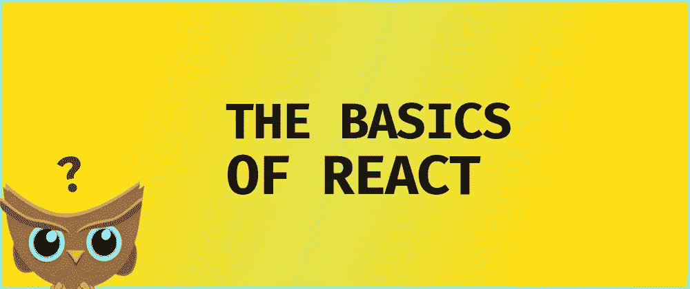
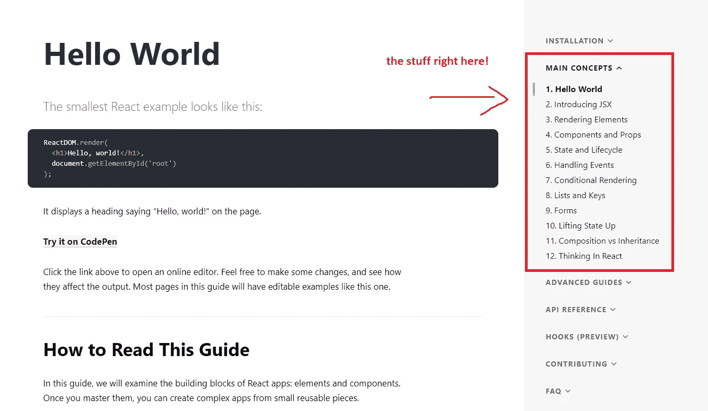
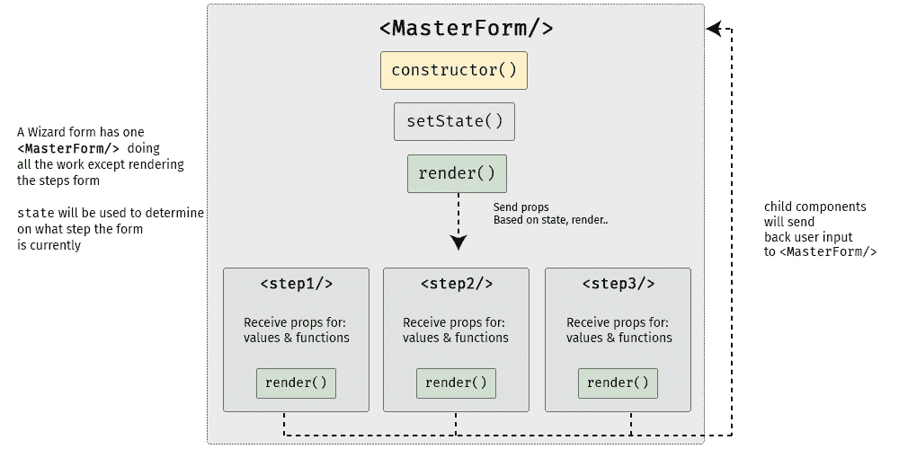

# 动手项目，学习 React 的基础知识

> 原文：<https://medium.com/hackernoon/hands-on-projects-to-learn-the-basics-of-react-3a06726514a8>



H 你看过 React 官方的井字游戏教程了吗？如果你有，你可能会注意到简介中的这个**加粗的**文本

> 你可能想跳过它，因为你不是在开发游戏——但是给它一个机会。

我猜即使 React 团队也知道构建井字游戏没什么意思，因为他们加入了这条线。虽然这个项目确实让你理解了 React，但是你需要很强的毅力来完成这个教程。

现在不要误会我，我很感激这个引进项目，但我只是不喜欢它。如果你在想同样的事情，我将在本教程中写一些你可以用来学习 React 的替代项目。

那么有哪些前端项目可以拿起来学习 React 呢？当我浏览教程和博客帖子时，我注意到一个好的 React 入门教程必须做到以下几点:

*   教授 React 的基础知识，如组件、状态和道具
*   处理动态数据、状态和道具的变化
*   显示了生命周期方法的使用

实际上，几乎所有内容都来自于*主要概念*选项卡。



Core React knowledge right in this tab!

在本教程结束时，您将更好地理解 React 概念的用法，如组件、状态和生命周期方法，以及它们如何在常见的 web 应用程序 UI 中使用。

## 目录

*   [前端乐趣与卡片列表](https://hackernoon.com/hands-on-projects-to-learn-the-basics-of-react-3a06726514a8#1ff5)
*   [使用向导表单变得复杂](https://hackernoon.com/hands-on-projects-to-learn-the-basics-of-react-3a06726514a8#1566)
*   [GitHub 搜索 App](https://hackernoon.com/hands-on-projects-to-learn-the-basics-of-react-3a06726514a8#4e78)
*   [结论](https://hackernoon.com/hands-on-projects-to-learn-the-basics-of-react-3a06726514a8#7342)

注意:对于本教程的 CSS 部分，我们将使用 Bootstrap 来使它看起来更好，而不用编写我们自己的 CSS。您可以放心地忽略示例代码的 `*className*` *部分，因为它们来自 Bootstrap*

# 卡片列表的前端乐趣

让我们从利用 JSX、组件和道具开始——React UI 的基本成分。这是我们的最终产品:

A list of cards with React

所以让我们来建造它。我们所要做的就是创建返回 JSX 元素的`<Card/>`组件:

```
function Card(props) {
    return (
      <div className="card">
        
        <div className="card-body">
          <h5 className="card-title">Title Placeholder</h5>
          <p className="card-text">Description Placeholder</p>
          <a href="#" className="btn btn-primary">Learn more</a>
        </div>
      </div>
    );
}
```

然后创建一个父组件，呈现三次`<Card/>`。我们可以把它命名为`<CardList/>`

```
function CardList() {
  return (
    <div className="row">
      <div className="col-sm-4">
        <Card />
      </div>
      <div className="col-sm-4">
        <Card />
      </div>
      <div className="col-sm-4">
        <Card />
      </div>
    </div>
  );
}
```

不要忘记在代码的底部添加`ReactDOM.render`调用。这是负责将 React 应用程序引入 HTML 元素的代码。

```
ReactDOM.render(<CardList />, document.getElementById('root'));
```

接下来，我们需要将我们自己的数据包含到这些卡片中，所以向其中传递一些`props`。

```
function CardList() {
  return (
    <div className="row">
      <div className="col-sm-4">
        <Card     **featureImage="**[**https://sebhastian.com/static/eb0e936c0ef42ded5c6b8140ece37d3e/fcc29/feature-image.png**](https://sebhastian.com/static/eb0e936c0ef42ded5c6b8140ece37d3e/fcc29/feature-image.png)**"
          title="How To Make Interactive ReactJS Form"
          description="Let's write some interactive form with React"
          link="**[**https://sebhastian.com/interactive-react-form**](https://sebhastian.com/interactive-react-form)**"
**        />
      </div>
      <div className="col-sm-4">
        <Card
          // your data
        />
      </div>
      <div className="col-sm-4">
        <Card
          // your data
        />
      </div>
    </div>
  );
}
```

然后在我们的`<Card/>`组件中使用这些道具:

```
function Card(props) {
  return (
    <div className="card">
      
      <div className="card-body">
        <h5 className="card-title">**{props.title}**</h5>
        <p className="card-text">**{props.description}**</p>
        <a href=**{props.link}** className="btn btn-primary">Learn more</a>
      </div>
    </div>
  );
}
```

现在这个`<Card/>`组件在它的 JSX 中使用了 JavaScript，非常类似于模板引擎，不是吗？

你可能想知道，“为什么我们使用`function`而不是`class`来声明组件？”

因为我们没有保留`state`或者使用生命周期方法。React 组件被声明为`class`以便使用这两个东西(虽然现在我们也可以用 React 钩子来做，但是我们现在不考虑钩子。)

正如我们在例子中看到的，React 的 UI 由三个基本成分组成:组件、JSX 和道具。

*   **组件**是由方法和 JSX 组成的一个 UI。
*   **JSX** 是用 JS 增压的 HTML，使我们能够用 JavaScript 语法描述 UI。
*   **Props** 是我们传递给组件的任意输入。

除了基本的 UI 模式之外，我们从这个简单的静态卡中真的学不到更多的东西，所以让我们继续一个更复杂的任务。

# 向导表单变得复杂

在第二个练习中，我们将构建一个向导表单，这是一个多步骤表单，旨在简化长而复杂的表单的填写过程。通过在屏幕上只显示几个输入，用户会感到被鼓励去填充空白输入，而不是感到不知所措并可能放弃表单。

让我们看看如何使用 React 构建这样的表单:

React wizard form

创建多步骤表单最简单的方法是创建一个容器表单组件，其中包含所有向导步骤组件。这个图表会帮助你清楚地理解它。



React wizard form diagram

虽然它看起来比常规表单更复杂，但向导表单仍然使用相同的反应原理。但是因为我们在这个练习中有`state`，我们需要包括一个新的原则:

*   **状态**用于存储动态数据

我们将拥有一个父组件和三个子组件，而不是一个表单组件。在上图中，`<MasterForm/>`组件将通过 props 向子组件发送数据和函数，子组件将触发`handleChange()`函数在`<MasterForm/>`的*状态*下设置值。我们还需要一个函数将表单从一个步骤移动到另一个步骤。

就像`CardList`如何给`Card`发道具一样，这些子组件会从`<MasterForm/>`那里收到道具用于`value`和`onChange`道具。

*   `<Step1/>`组件将呈现输入的电子邮件地址
*   `<Step2/>`将用户名输入渲染
*   `<Step3/>`将呈现密码输入和提交按钮

父组件`<MasterForm/>`将向子组件提供数据和功能，子组件将使用其`props`将用户输入传递回父组件。

首先，我们将创建表单子组件。本例中每个表单步骤只包含一个输入。注释将显示`props`的用法。

```
function Step1(props) {
  if (props.currentStep !== 1) {
    return null
  } 
  return(
    <div className="form-group">
      <label htmlFor="email">Email address</label>
      <input
        className="form-control"
        id="email"
        name="email"
        type="text"
        placeholder="Enter email"
        **value={props.email} // props from parent
        onChange={props.handleChange} // props from parent**
        />
    </div>
  )
}
```

因为子组件看起来几乎彼此相似，所以我只展示了上面的其中一个。您可以查看完整代码的演示。注意我们如何使用`function`而不是`class`，因为我们不使用`state`或生命周期方法。

然后我们可以把这个子组件放到主窗体`render()`函数中，传入必要的道具。为了处理用户在文本中输入内容的事件，我们使用了`onChange`合成事件，它是 React 核心库的一部分，用于处理事件。更多详情[此处](https://reactjs.org/docs/events.html#form-events)。

让我们制作`<MasterForm/>`组件并初始化它的状态和方法。`currentStep`状态将被初始化为值 1。这是一个步骤指示器，这样我们的表单就知道我们现在在哪一步。我们将使用 ES6 类，因为该组件需要本地状态:

```
class MasterForm extends React.Component {
  **constructor(props) {
    super(props)
    this.state = {
      currentStep: 1,
      email:  '',
      username: '',
      password: '', 
    }
  }**// creating functions with ES6 arrow function syntaxhandleChange = event => {
    const {name, value} = event.target
    this.setState({
      [name]: value
    })    
  }

  handleSubmit = event => {
    event.preventDefault()
    const { email, username, password } = this.state
    alert(`Your registration detail: \n 
           Email: ${email} \n 
           Username: ${username} \n
           Password: ${password}`)
  }

  // render method here...
}
```

接下来，我们在`<MasterForm/>`的渲染方法中添加步骤。它将发送`handleChange()`函数和所需的`state`值作为道具，注意突出显示的代码块:

```
render() {    
  return (
    **<React.Fragment>**
    <h1>A Wizard Form!</h1>
    <p>Step {this.state.currentStep} </p> 

    <form onSubmit={this.handleSubmit}>
    {/* 
      render the form steps and pass required props in
    */}**<Step1 
        currentStep={this.state.currentStep} 
        handleChange={this.handleChange}
        email={this.state.email}
      />
      <Step2 
        currentStep={this.state.currentStep} 
        handleChange={this.handleChange}
        username={this.state.username}
      />
      <Step3 
        currentStep={this.state.currentStep} 
        handleChange={this.handleChange}
        password={this.state.password}
      />
**    </form>
    **</React.Fragment>**
  )
}
```

因为`render()`必须返回单个元素，所以`<React.Fragment>`组件允许您在 render()方法中返回多个元素，而无需创建额外的 DOM 元素。更多详情[此处](https://reactjs.org/docs/react-api.html#reactfragment)。

然后我们添加下一步或上一步函数，它将检查当前步骤是否有上一步或下一步。如果是，它将向上或向下推动`currentStep`:

```
class MasterForm extends React.Component {
  /*
  * Test current step with ternary
  * _next and _previous functions will be called on button click
  */_next = () => {
    let currentStep = this.state.currentStep
    currentStep = currentStep >= 2? 3: currentStep + 1
    this.setState({
      currentStep: currentStep
    })
  }

  _prev = () => {
    let currentStep = this.state.currentStep
    currentStep = currentStep <= 1? 1: currentStep - 1
    this.setState({
      currentStep: currentStep
    })
  }// ... the rest of the code
```

我们将创建检查当前步骤是 1 还是 3 的函数。这是因为我们有 3 步向导表单。有多的可以换。如果当前步骤没有下一步或上一步，按钮将会消失。这些按钮将调用我们的`_next`和`_previous`方法。

```
/*
* the functions for our button
*/
previousButton(){
  let currentStep = this.state.currentStep;
  if(currentStep !==1){
    return (
      <button 
        className="btn btn-secondary" 
        type="button" onClick=**{this._prev}**>
      Previous
      </button>
    )
  }
  return null;
}nextButton(){
  let currentStep = this.state.currentStep;
  if(currentStep <3){
    return (
      <button 
        className="btn btn-primary float-right" 
        type="button" onClick=**{this._next}**>
      Next
      </button>        
    )
  }
  return null;
}
```

剩下的就是呈现下一个和上一个按钮

```
/*
* add buttons to our form in render
*/
render(){
  return(
    <form onSubmit={this.handleSubmit}>
      {/* 
        ... other codes
      */}

      **{this.previousButton()}
      {this.nextButton()}**
    </form>
  )
}
```

如果你想知道为什么我们在上面的按钮调用中使用了`()`，那是因为我们需要实际执行按钮功能。`_next`和`_previous`功能仅在点击按钮时执行，因此在通话时不能有`()`。

唷！这里有很多组件和状态之间的交互，但是我希望现在你已经理解了在 React 应用程序中使用`state`。综上所述，`state`只是我们在一个组件中定义的任意数据，它永远成为那个组件的一部分。我们可以把它传递给另一个组件，我们可以更新它，我们可以根据组件当前的状态做一些有条件的事情。

在这个示例表单中，我们使用了 state 来跟踪用户的输入和向导表单的当前步骤。因为 React 是从父组件到子组件的单向数据流，所以要记住只有`state`的所有者才能改变或更新它。

为了使用`state`,我们可以使用 ES6 类或者 React 钩子(将在另一个教程中解释)。)

还想再做一次练习吗？那就开始吧！

*附言:如果你正在开发 react 表单，你可能想看看这个由* [*Arinich*](https://goshakkk.name/wizard-form-collect-info/) 编写的深入教程

# GitHub 搜索应用

现在，对于我们的第三个练习，让我们实际使用一些 ES6 特性从 GitHub API 获取数据并显示其结果。这个练习将包括我们从以前的项目和新项目中学到的所有东西:*生命周期方法*和*渲染列表*。

Simple GitHub search app

*注意:有额外的 css，我为这个应用程序写的。如果你没有分叉笔*，确保访问上面代码笔的 CSS 标签并粘贴它

首先，让我们探索一下我们将要[使用](https://developer.github.com/v3/search/#search-users)的 Github API。因为我们只按用户名搜索，所以我们需要这个 API url:

```
[https://api.github.com/search/users?q={--search-string--}](https://api.github.com/search/users?q={--search-string--})
```

让我们先通过编写大的 header 组件来准备构建应用程序。它实际上只是静态自举大屏幕:

```
const Header = () => {
  return (
    <div className="jumbotron">
      <h1>Github Search App</h1>
      <h2>Search users in GitHub using this simple React application.</h2>
      <p>Click on the card to see more detail about individual user. The search default is nsebhastian (me!)</p>
    </div>
  );
};
```

现在让我们考虑制作输入表单。我们需要:

1.  搜索表单
2.  提交搜索表单时调用 Github API
3.  在卡片列表中显示搜索结果

我们将从声明 API 常量开始

```
const API = 'https://api.github.com/';
```

然后，让我们用两个状态值初始化“top”组件:`searchText`和`data`。

```
class App extends React.Component {
  constructor(props){
    super(props);
    this.state = {
      searchText: 'nsebhastian',
      data: '',
    }
  }

  fetchSearch = username => {
    let url = `${API}search/users?q=${username}`;
    fetch(url)
    .then((res) => res.json() )
    .then((data) => {
      **this.setState({
        data: data
      });**
    })
    .catch((error) => console.log('Oops! . There Is A Problem' + error) )
  }**componentDidMount() {
    this.fetchSearch(this.state.searchText);
  }**
```

`fetchSearch`函数将从 API url 获取数据，将其转换为 JSON 对象，然后用新获取的数据更新我们的`data`状态。它将在组件生命周期方法`[componentDidMount](https://reactjs.org/docs/react-component.html#componentdidmount)`中被调用。如果您不熟悉生命周期方法，它们基本上是在构建和呈现组件的过程中的特定时间运行的方法。除了`componentDidMount`还有其他方法，包括`constructor`方法。并不是所有的生命周期方法都被频繁使用，其中一些会比其他的更经常使用。

让我们继续我们的应用程序，编写`App`组件的`render`方法:

```
render() {
  return (
    <div>
      <MyHeader />
      **<SearchForm 
        fetchSearch={this.fetchSearch}
      />
      <Profiles 
        data={this.state.data}
      />**
    </div>
  );
}
```

您可能已经猜到了，我们需要创建另外两个组件，即`<SearchForm/>`和`<Profiles/>`。

让我们从`<SearchForm/>`开始。我们以前在 React 中写过表单，所以这不会很难。我们只需要一个单一的文本输入和提交按钮。另外，让我向您展示另一种不使用`state`获取输入值的方法:

```
class SearchForm extends React.Component {
  render() {
    return (
        <div className="search-bar">
          <form
            className="input-group"
            **onSubmit={this.handleForm}**>
            <input
              type="search"
              ref="username"
              placeholder="Type Username here"
              className="form-control"/>
            <span className="input-group-btn">
              <button type="submit" 
                className="btn btn-warning">Submit</button>
            </span>
          </form>
        </div>)
  }**handleForm = event => {
    event.preventDefault();
    let username = this.refs.username.value
    this.props.fetchSearch(username);
  }
}**
```

如您所见，我们通过使用`ref`获得用户名值。这样我们根本不需要初始化`state`。我们必须使用 ES6 类来声明组件，因为我们需要编写`handleForm`函数。

现在该写最后一个组件`<Profiles/>`了。我将利用这个机会向您展示组件声明— *箭头函数样式*。

```
Profiles = props => {
    if(props.data){
      let data = props.data;if (data.message === 'Not Found')
        return (
           <div className="notfound">
              <h2>Oops !!!</h2>
              <p>The Component Couldn't Find The You Were Looking For . Try Again </p>
           </div>
        );
        **else{
          // map the users into JSX elements
          let userList = data.items.map((name) => {
            return (
                <a key={name.id} href={name.html_url} target="blank">
                <div className="bs-callout bs-callout-info">
                  
                  <h4>Username : {name.login}</h4>
                  <p> Url : {name.html_url}</p>
                  <p> Score : {name.score} </p>
                </div>
                </a>
            );
          })
          // then render it
          return (
            <div>{userList}</div>
          );
        }**
    }
    else {
      return <div>Fetching data . . .</div>
    }
}
```

如果你从一开始就遵循这个教程，我想你可以理解这个`<Profiles/>`组件是做什么的。它将接受来自其父节点的`props`命名数据，然后基于该属性做一些事情。我们使用`map`函数迭代并写入来自`data`数组的 JSX 元素。然后简单的返回进行渲染。

注意一个`key`道具是如何传递到`<a>`元素中的，这样 React 就可以识别列表中的单个元素。更多细节[此处](https://reactjs.org/docs/lists-and-keys.html#keys)。

现在你可以搜索并点击结果，进入 GitHub 用户档案。干得好，走了这么远！我们实际上可以通过使用 React Router 来改进应用程序，并创建用户页面来查看单个用户的详细视图，但我们现在就到此为止，当我们实际了解 React Router 时，我们将继续学习 **React Router refactoring** 。

# 结论

我们构建了三个练习项目来学习 React 基础知识，从简单的静态卡片列表开始，到从 GitHub API 获取数据并显示数据的更复杂的 React 应用程序。我们还学习了使用`state`的动态数据管理。

从这些教程中获得的是简单且可重用的 React 模式，你几乎可以在任何 React 应用程序中看到:

*   **组件**是由方法和 JSX 组成的一个 UI。
*   **JSX**HTML 被 JS 增压，使我们能够使用 JavaScript 语法描述 UI
*   **Props** 是我们传递给组件的任意输入。
*   **状态**用于存储动态数据。我们可以用它来呈现用户界面和存储获取的数据
*   **生命周期方法**用于组件渲染需要调用的方法。最简单的例子是调用 API 和获取数据

感觉怎么样？通过实际构建您更可能在项目中使用的组件来学习 React 不是更有趣吗？对你来说太难了吗？请给我反馈，这样我可以提高我的写作技巧。

我很快会报道更多关于 React 的内容——比如使用钩子或者 React 路由器——所以如果你对此感兴趣，一定要关注我或者[订阅我的时事通讯。我保证不会给你的收件箱发垃圾邮件！](https://sebhastian.com/subscribe)

感谢阅读🙌

[](https://sebhastian.com/subscribe)

*原载于*[*sebhastian.com*](https://sebhastian.com)