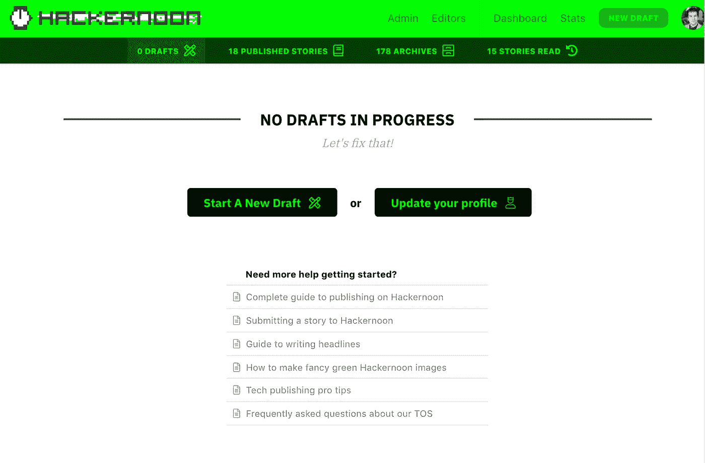
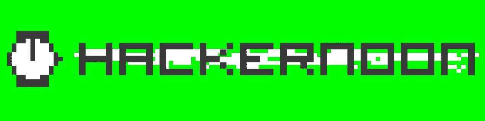
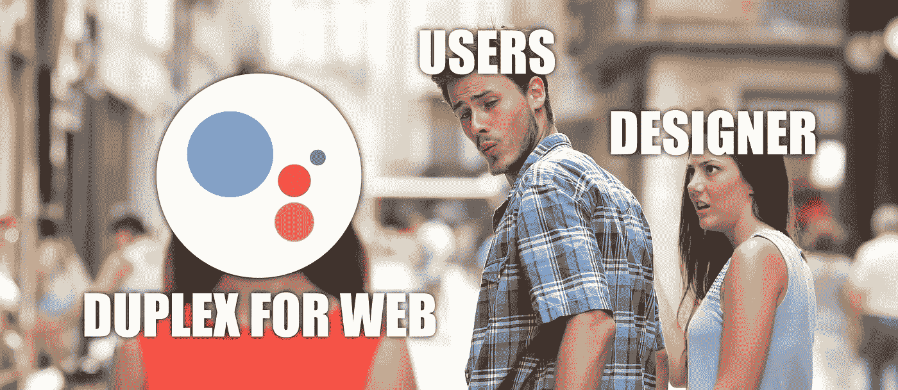
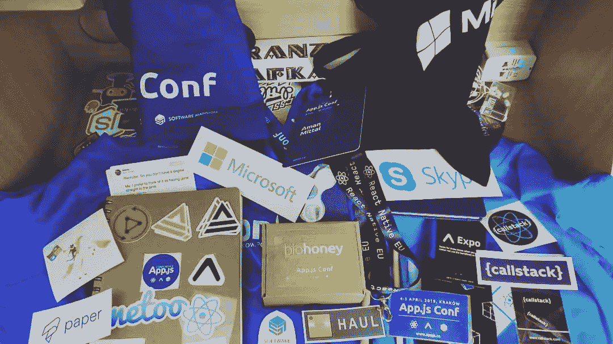
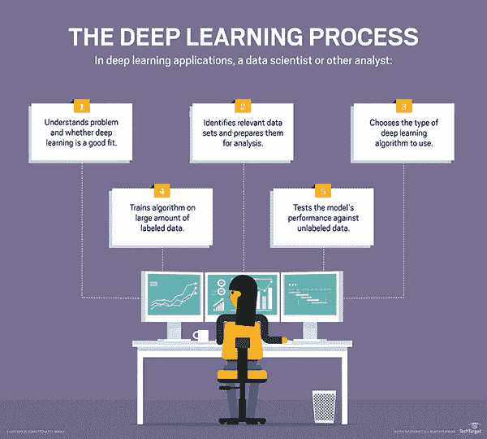
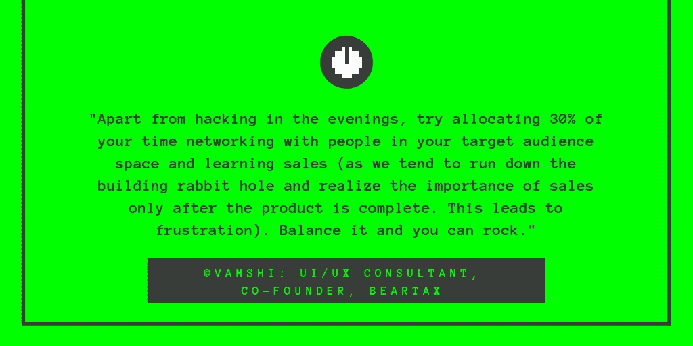
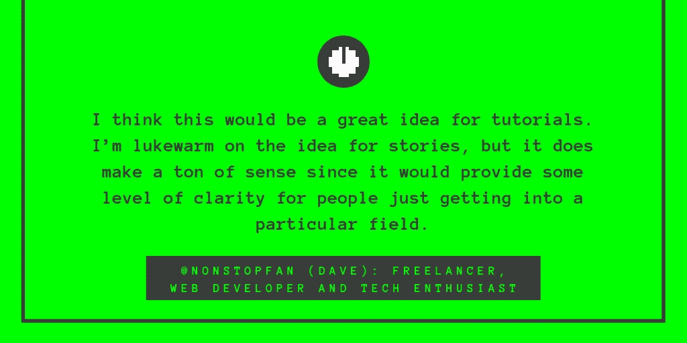
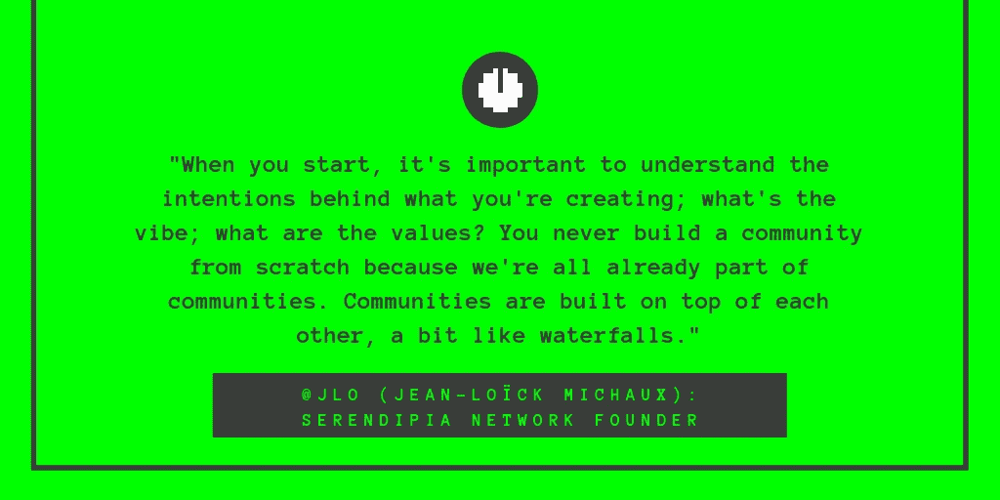
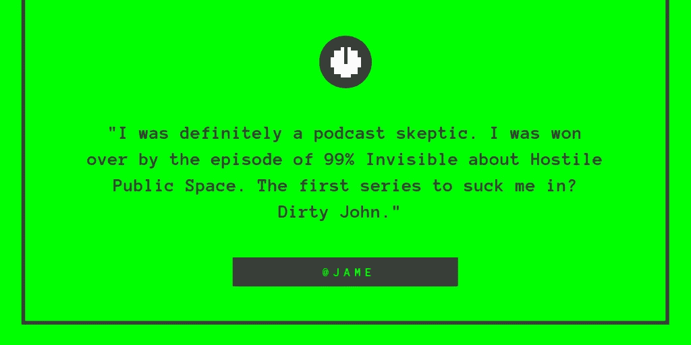
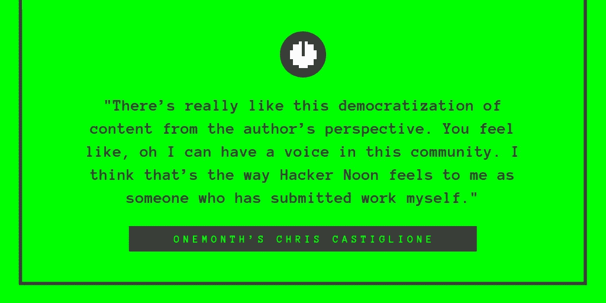

# 黑客们，4 周年快乐

> 原文：<https://medium.com/hackernoon/happy-4th-hackers-ffe1de2278ae>

## **来自一个(几乎)独立的黑客中午！**

让我们先澄清一下:我不是美国人。然而，鉴于**黑客努恩自己即将到来的独立日，我对今年的事情充满热情。** [这是](https://hackernoon.com/about-removing-medium-from-hackernoon-com-7c72353ba6e)一个漫长、艰难而又收获颇丰的旅程——特别感谢我们的[产品](https://community.hackernoon.com/c/product)团队( [Dane](https://community.hackernoon.com/u/dane/summary) 、 [Austin](https://community.hackernoon.com/u/austin/summary) 、 [Faith](https://community.hackernoon.com/u/faithcorinne/summary) )，感谢他们不懈的努力，为你带来科技专业人士发表文章的最佳场所。谢谢你。💚我们迫不及待地想让你们看看他们为你们做了什么。以下是 Writer Dashboard 欢迎屏幕 的 [**预览:**](https://community.hackernoon.com/t/hacker-noon-writer-dashboard-welcome-screen/4111)

# 与此同时:关于生命、自由和对 2.0 的追求

让我们来看看本周的顶级独立科技新闻综述，全部由你撰写并为你而写:我们的分散式[社区](http://community.hackernoon.com)由 7k+贡献黑客和 20 万+每日读者组成。

## 应该如何监管大型科技公司？

由[乔希·李](https://hackernoon.com/@joshleetufts) (7 分钟[改为](https://hackernoon.com/how-should-big-tech-companies-be-regulated-75e9a6281510))

> 考虑到大型科技公司在我们日常生活中的影响力，我们努力让一切透明化是至关重要的。

## 美国的个人主义正在伤害我们工作中的团队吗？

由阿米尔·阿里卡尼 (5 分钟[改为](https://hackernoon.com/is-american-individualism-hurting-our-teams-at-work-cdad9c591577))

> 个人主义通常被认为是自力更生或独立的品质，但它远不止于此。它已经发展成为一种道德立场、一种政治哲学、一种意识形态，甚至是一种强调个人道德价值高于一群人的社会观。

## [靠吃自己的狗粮取胜:83 家风险投资公司如何利用数据、人工智能&专有软件推动阿尔法回报](https://hackernoon.com/winning-by-eating-their-own-dogs-food-83-venture-capital-firms-using-data-ai-proprietary-da92b81b85ef)

由[巴托什·特罗查](https://hackernoon.com/@polishvc) (45 分钟[改为](https://hackernoon.com/winning-by-eating-their-own-dogs-food-83-venture-capital-firms-using-data-ai-proprietary-da92b81b85ef))

> 最具创新性的采购、评估和支持投资方法概述+ 263 个来源(文章、播客、视频等)。)进行进一步的学习。

## [Google Duplex 如何让 UI 设计过时](https://hackernoon.com/why-google-duplex-might-make-my-design-job-redundant-311cd47b5120)

由[托尼·奥布](https://hackernoon.com/@tonyaub) (5 分钟[改为](https://hackernoon.com/why-google-duplex-might-make-my-design-job-redundant-311cd47b5120))

> 去年，谷歌用 Duplex 震惊了世界，这是一款可以为你打电话的人工智能助手。这个演示像病毒一样传播开来，引发了许多伦理和哲学问题。

## [理想的创业工具扩大你的发展规模](https://hackernoon.com/the-ideal-toolstack-to-sustain-your-growth-by-timote-geimer-bb7983e2b6d3)

由 [Timoté Geimer](https://hackernoon.com/@TimoteGeimer) (20 分钟[改为](https://hackernoon.com/the-ideal-toolstack-to-sustain-your-growth-by-timote-geimer-bb7983e2b6d3))

> 在测试了数百种支持年轻公司成长的工具后，我决定列出并与大家分享在我工作的地方迄今为止最有效的工具。

## [威瑞森引发的互联网愤怒表明互联网路由是多么脆弱](https://hackernoon.com/internet-outrage-caused-by-verizon-shows-how-fragile-the-internet-routing-is-a367241130e8)

由[叶海鑫黄](https://hackernoon.com/@yahsinhuangtw) (6 分钟[念](https://hackernoon.com/internet-outrage-caused-by-verizon-shows-how-fragile-the-internet-routing-is-a367241130e8))

> 6 月 24 日星期一，由于威瑞森错误，发生了 BGP 路由泄漏事件，引起了全球互联网的愤怒。BGP 的失败影响了 Cloudflare、亚马逊、脸书和其他公司。

## [旅行、科技会议和百万点击量:回顾](https://hackernoon.com/to-travel-a-tech-conference-and-one-million-views-a-recap-22e135a598c3)

到[阿曼·米塔尔](https://hackernoon.com/@amanhimself) (6 分钟[改为](https://hackernoon.com/to-travel-a-tech-conference-and-one-million-views-a-recap-22e135a598c3))

> 我慢慢地将写作的热情转移到了技术领域，而男孩为我打开了我从来不知道存在的大门。

## [为什么物理邮件仍被用于共享敏感文档？](https://hackernoon.com/why-is-physical-mail-still-being-used-to-share-sensitive-documents-660ea3a65c4)

由[基里尔·希洛夫](https://hackernoon.com/@kirillshilov) (8 分钟[改为](https://hackernoon.com/why-is-physical-mail-still-being-used-to-share-sensitive-documents-660ea3a65c4))

> 所有邪恶的公司、政府和黑客都渴望得到你的机密信息，难怪你会担心把这些信息发到网上。

## [我为什么要购买警察暴力保险？](https://hackernoon.com/why-am-i-working-on-police-brutality-insurance-70a3d08d8de5)

由[约书亚·戴维斯](https://hackernoon.com/@joshuadavis31) (10 分钟[改为](https://hackernoon.com/why-am-i-working-on-police-brutality-insurance-70a3d08d8de5))

> 这周棒极了。我有一种“哦，我的上帝，我在过去的五年里都做了些什么”的感觉。我不认为这很有趣。

## [内文定律:量子计算机的范式转变](https://hackernoon.com/nevens-law-paradigm-shift-in-quantum-computers-e6c429ccd1fc)

由[詹姆斯·达根](https://hackernoon.com/@JimDargan) (5 分钟[改为](https://hackernoon.com/nevens-law-paradigm-shift-in-quantum-computers-e6c429ccd1fc))

> 旧的淘汰了，新的开始了，就像马蒂·小飞侠和他的悬浮滑板一样。世界在变化，而且变化很快。

## [深度学习简介](https://hackernoon.com/introduction-to-deep-learning-9064d6b87a51)

由[伊利亚·米哈伊洛维奇](https://hackernoon.com/@ilijamihajlovic) (12 分钟[改为](https://hackernoon.com/introduction-to-deep-learning-9064d6b87a51))

> 游戏改变者。

## [“比薪酬更广泛的东西推动着我们”——创始人访谈:Neo4j 的埃米尔·艾弗雷姆](https://hackernoon.com/something-much-broader-than-compensation-drives-us-emil-eifrem-neo4j-founder-interview-168278957077)

由[戴维斯拜尔](https://hackernoon.com/@davis1) (10 分钟[改为](https://hackernoon.com/something-much-broader-than-compensation-drives-us-emil-eifrem-neo4j-founder-interview-168278957077))

> 2000 年，埃米尔第一次在飞往孟买的途中，在一张餐巾纸的背面勾画了公司的构想。如今，该公司是世界领先的图形平台，为任务关键型企业应用提供支持，包括人工智能、欺诈检测、实时推荐和主数据。

## [建立企业人工智能项目时需要考虑的 10 个问题](https://hackernoon.com/10-questions-to-consider-when-setting-up-a-corporate-a-i-project-f7cc2a50188d)

由[阿德里安书](https://hackernoon.com/@ThePourquoiPas) (7 分钟[读](https://hackernoon.com/10-questions-to-consider-when-setting-up-a-corporate-a-i-project-f7cc2a50188d))

> 一个针对讨厌 Excel 和 PowerPoint 的人的风险分析框架。

## 谁想获得诺贝尔奖？

由[马特·斯旺](https://hackernoon.com/@mattgfx) (4 分钟[改为](https://hackernoon.com/who-wants-to-win-a-nobel-prize-eb076e64718d))

> 如果我们拍卖掉你身体中的所有元素——碳、氧、铁、钠等。——你的总价值约为 1 美元。五美元，如果你有合适的出价者，很明显。

# 本周黑客正午社区贡献者

## [在业余时间创办公司](https://community.hackernoon.com/t/why-start-a-company/3717/2) —

## [关于《黑客正午》是否应该给故事贴上入门、中级或高级的标签](https://community.hackernoon.com/t/should-we-label-stories-as-basic-intermediate-and-advanced/2089/10)

## [关于建设繁荣的共同工作和共同生活社区](https://community.hackernoon.com/t/jean-loick-michaux-jlo-founder-of-serendipia-network-and-3rd-place-on-draper-university-demo-day-ask-me-anything-friday-6-28-noon-pst/3804) —

## [哪些播客的哪几集让你喜欢上了播客](https://community.hackernoon.com/t/which-episode-of-which-podcast-got-you-into-podcasts/3780/7) —

# 加入讨论

找一个免费的地方 [**无耻地宣传你的技术业务或事件**](https://community.hackernoon.com/t/plug-your-tech-business-here-shamelessness-welcome/1464/8) ，发表你对 [**Hacker Noon 2.0 的产品路线图的看法**](https://community.hackernoon.com/t/what-are-the-killer-features-youd-like-to-see-in-hacker-noon-2-0/68/92) ， [**对我们的编辑指南草案投下阴影**](https://community.hackernoon.com/t/have-your-say-on-hacker-noons-submission-guidelines/989) ， [**当一些糟糕的事情从裂缝中溜走时请通知我们**](https://community.hackernoon.com/t/how-does-something-like-this-get-onto-hacker-noon/4001/6)**，或者 [**记录你的软件项目的进展和**](https://community.hackernoon.com/t/coding-school-project-diary/2008/43)**

****

*****到下周，*****

**[**来自黑客中午的娜塔莎**](https://community.hackernoon.com/u/natasha/summary) 🤖**