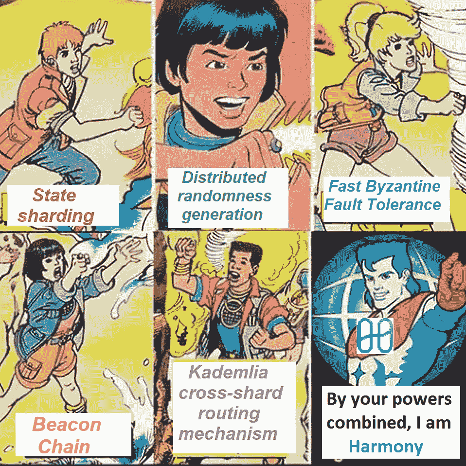

# 面向分散经济的高吞吐量、低延迟公共区块链平台

> 原文：<https://medium.com/hackernoon/harmony-a-high-throughput-low-latency-public-blockchain-platform-for-decentralized-economies-676de78a5654>

随着区块链技术在寻求大规模采用的过程中不断前进，它面临的最大障碍可以说是可扩展性。世界上越来越多的商家已经意识到接受加密作为支付手段的可能性，特别是比特币和以太网。但是，如果 crypto 被认为是无边界支付解决方案的有力竞争者，那么它必须与 Visa 和 Mastercard 等流行的电子支付服务正面交锋。就目前的情况来看，加密远远落后了。比特币可以处理不到 10 TPS，而以太坊在一个好的日子里可以管理高达 40 TPS 左右。将此与 Visa 的每日 2，000 TPS(理论上可以扩展到约 50，000 TPS)进行比较，您就会知道需要弥补的差距。

各种加密项目已经尝试了不同的技术来解决可伸缩性瓶颈。以太坊一直试图实现自己的[扩展解决方案](/connext/the-case-for-ethereum-scalability-d2a8035f880f)，这似乎是一种永恒。增加网络吞吐量通常涉及使网络更加集中或牺牲安全性。这被称为经典的[区块链三难困境](https://www.coinbureau.com/analysis/solving-blockchain-trilemma/)——当谈到去中心化、可扩展性和安全性时，你必须从 3 中选择 2。一种不损害安全性或分散性的可伸缩性技术叫做“[分片](https://en.wikipedia.org/wiki/Shard_(database_architecture))”。分片涉及将可用数据集水平分割成更小的数据集，称为“分片”。集中式系统已经使用这种技术很长时间了，但是最近它引起了分散式世界的注意。

谈到区块链项目，Zilliqa 可能是分片的典型代表。作为一个“高通量公共区块链”，Zilliqa 在他们的测试网中已经实现了 2828 TPS。这里应该注意，在分片解决方案中，TPS 随着节点数量的增加而增加。Zilliqa 用 3600 个节点实现了这一点。在过去的几个月里，一些项目已经基于相同的分片原则开展工作。 [Harmony](https://harmony.one/) 是目前这个领域最令人兴奋的项目之一。作为面向分散经济的下一代公共、可扩展区块链基础设施，Harmony 承诺通过应用“网络、系统和创新方面的 10 倍创新”，无缝连接 100 亿人。但是团队和谐做了什么不同的事情来确保他们实现他们的承诺呢？是什么让《和声》有别于《Zilliqa》和其他前辈？让我们在这里仔细看看。

网址: [*点击这里*](https://harmony.one/)

电报: [*在此加入*](https://t.me/harmony_one)

白皮书: [*阅读此处*](https://harmony.one/whitepaper)

**状态分片技术**

尽管 Zilliqa 和 Harmony 都使用分片，Zilliqa 实现了所谓的*网络分片*和*事务分片*，而 Harmony 则更进一步，实现了*状态分片*。简单来说，Zilliqa 将其网络分成多个分片，每个分片有数百个节点(网络分片)。这允许不同的事务由不同的分片同时处理(事务分片)。然而，为了能够处理事务，shard 中的每个节点都必须存储整个区块链状态信息。这阻止了资源有限的机器成为网络的一部分——这对于去中心化来说不是一个令人鼓舞的信号！

另一方面，和谐也分裂了区块链国家(国家分裂)。他们将这种独特的切分技术命名为[深度切分](/utopiapress/harmony-blockchains-deep-sharding-might-be-the-winning-decentralized-architecture-b1de02880186)，其中他们不仅切分事务层，还切分共识层。节点可以安全地定位与特定事务相关的其他节点，并且在共识过程中仅与那些特定节点进行事务处理。这提高了并行处理的水平，导致极高的网络吞吐量。此外，由于所有节点不需要存储整个区块链状态，简单的个人计算机也可以作为节点加入网络，从而实现更大程度的去中心化。

**PBFT 共识机制**

Zilliqa 使用一种被称为 [PBFT](https://blockonomi.com/practical-byzantine-fault-tolerance/) (实用拜占庭容错)协议的共识机制。在该算法中，一个节点被选为“领导者”，其他节点成为“验证者”。每个共识回合有两个阶段— *准备*和*提交*。在每个阶段，领导者节点向所有验证者节点广播一个提议，而验证者节点则向所有其他节点广播它们的投票。所有验证器的投票都需要被其他验证器计算。这将 PBFT 的通信复杂度增加到 O(n*n)，其中 n 是节点总数。不用说，这种算法对于具有数百个节点的网络来说变得不现实。

Harmony 使用了一种被称为 FBFT(快速拜占庭容错)的改进型一致性算法。在这种方法中，所有验证器节点不广播它们的投票。相反，领导者节点通过多重签名过程收集验证者的节点，然后广播它。多重签名的大小为 O(1)，这将通信复杂度从 O(n*n)降低到 O(n)——这是 Zilliqa 通信复杂度的巨大飞跃。基于 [PoS](https://en.wikipedia.org/wiki/Proof-of-stake) (利益证明)机制来选择验证器，其中希望成为验证器的节点必须持有某个最小数量的令牌。PoS 比 Zilliqa 等传统基于分片的区块链使用的 [PoW](https://en.bitcoin.it/wiki/Proof_of_work) (工作证明)耗能少得多。被下注的代币量越大，被选为领导节点的机会就越大。此外，具有更大利害关系的验证者有更大的动机遵循该协议并且不参与任何恶意行为，因为任何这样的活动将导致丢失整个有利害关系的令牌缓存。

**分布式随机生成**

为了降低任何攻击的风险，分片系统在向分片分配节点时通常采用基于随机性的方法。在这些情况下，使用随机数生成方案将节点随机分配给碎片。这个随机数应该是完全不可预测和无偏见的，这样恶意节点就无法知道它将被分配到哪个碎片。此外，生成的随机数还应该在任何给定时间都是可验证的，并且生成算法本身应该是可伸缩的。

让我们考虑一些基于分片的公共区块链解决方案，Harmony 将它们作为案例研究。OmniLedger 使用 RandHound 协议进行分布式随机生成(DRG ),包括将节点分成大小为 c 的组。这种方法的问题是复杂度为 O(n*c*c)，这对于大型分布式网络来说太慢了，不可行。另一方面，RapidChain 使用一种更简单、更快速的方法，其中每个节点都可以执行可验证的秘密共享(VSS)。不幸的是，这个协议速度很快，但并不完全安全。Algorand 则使用基于可验证随机函数(VRF)的加密程序。以太坊基于 PoS 的扩展解决方案([以太坊 2.0](https://cointelegraph.com/news/ethereum-20-pre-release-kicks-off-relatively-feature-complete) )提出了一个可验证的延迟功能(VDF)，随机数的泄露将被延迟，以减少任何攻击的机会。

Harmony 利用了 VRF 和 VDF 的优势。验证器节点各自创建一个基于 VRF 的随机数，并将其发送给领导者节点。领导者收集这组随机数，并从这组数据中生成最终的随机数。VDF 用于延迟该随机数的泄露，这使得该方法更加安全。此外，在这种情况下，算法复杂度仅为 O(n ),这也使得它具有极大的可伸缩性。

**卡迪莉娅跨碎片通讯**

对于任何基于分片的系统，跨分片通信的协议都是极其重要的。Zilliqa 依赖主链本身来发起跨不同碎片的事务。在 OmniLedger 中，碎片之间的消息通过客户端进行交换。RapidChain 依赖于碎片中的节点本身来发起与其他碎片中的节点的通信。Harmony 采用了 RapidChain 的分片驱动方法。通常，这种分片驱动方法的通信复杂度是 O(n)，但是 Harmony 使用 [Kademlia](https://en.wikipedia.org/wiki/Kademlia) 路由协议将这种复杂度降低到 O(log(n))。

在 Kademlia 路由协议中，网络中的每个节点都维护一个路由表，其中包含所有其他分片的距离。这个距离是碎片 ID 的函数。当某个碎片中的节点想要向另一个碎片发送消息时，节点将只向具有 closes ID 的碎片发送消息，而不是向所有相邻碎片广播消息。通过这种方法，消息在到达预期目的地之前只需通过 O(log(n))个碎片。

**信标链**

Harmony 的分片架构由一个信标链和分片链组成。每个碎片链处理全部事务的一个子集。信标链是一个特殊的碎片链，有两个额外的职责——为 DRG 生成随机数，以及接受来自验证器的赌注。信标链还增加了整个生态系统的安全性。在每个新块被添加到一个分片链之后，块头被发送到信标链(通过 Kademlia 路由)。信标链检查块报头是否有效，并将其广播到整个网络。每个碎片维护一个有效块头列表，用于检查其他碎片的事务是否有效。

在信标链存在的情况下，如果攻击者想要在链中插入无效块，他们必须破坏碎片和信标链。此外，由于信标链本身广播所有有效的块报头，所以通信复杂度再次仅为 O(n)。如果每个分片都必须单独向所有其他分片广播有效块头的列表，那么复杂度应该是 O(n*n)。事实证明，无论从安全性还是可伸缩性来看，信标链都是 Harmony 生态系统中极其重要的实体。

**离别的思念**

和谐有远大的梦想，但是如果你想取得不朽的成就，你需要远大的梦想。在他们的测试网络中，他们用大约 44，000 个节点实现了 118，000 TPS。老实说，将产品从测试网推向现实世界才是真正的挑战；而[团队和谐](https://harmony.one/team/)绝对拥有实现他们愿景的天赋。此外，他们是一个倾听社区意见的团队。你总能在 Telegram 和 Discord 上找到他们的开发人员，他们随时准备回答你的问题并听取你的反馈。最后，这篇文章是基于他们的 succint [技术白皮书](https://harmony.one/whitepaper)撰写的，我鼓励所有读者也阅读一下 WP。