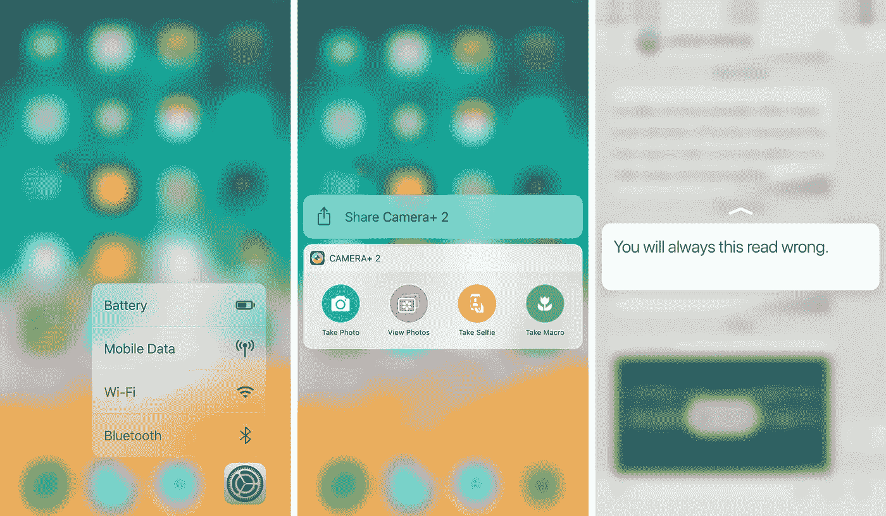

# 苹果听到我的无声抗议了吗？

> 原文：<https://medium.com/hackernoon/has-apple-heard-my-silent-protest-52b2afa25f0e>

If my old iPhone can shoot at this quality, why do I need a new iPhone?

事实 1:2016-2017 年，印度的平均年薪被认为会接近₹100,000(1436 美元)。

事实 iphone xs max 的基本款在印度的售价是₹109,900。这是令人瞠目结舌的 1561 美元，超过了印度人一年的平均工资。

列出的其他 iPhone 型号按美元计算也一样贵(只有一个例外)。因此，苹果在印度手机市场的份额不足 1%也就不足为奇了。正如你从列表中看到的，iPhone SE 是普通印度人唯一买得起的手机(它是上面列表中唯一的 32GB 手机，但我见过 64GB 的版本在₹20000 国内售价为[$284])。iPhone SE 价格低廉，因为苹果在印度组装，因此可以免除印度的高额进口税。我妻子有这款手机，如果你喜欢小屏幕，我可以保证它的价格是值得的。

问题是苹果已经停止生产这款 iPhone SE，可能是因为利润率不够。我明白，印度的高税收是该国获得世界上价格最高的 iPhones 这一可疑荣誉的原因。但是如果手机是在印度制造的，印度政府会免除这些税。事实上，中国公司小米充分利用了这一政策，成为印度最畅销的手机品牌。

继续说，尽管价格高昂，但印度确实有苹果粉丝。印度有超过 10 亿的公民，苹果 1%的市场份额对相当多的消费者来说是可行的。这些人大部分是富裕的印度人。但有些人像我一样，曾经在印度以外的地方工作，已经习惯了 iPhones、iPads 和 MAC。不管出于什么原因，我们都不想换成机器人。但是苹果在印度荒谬的定价让印度的苹果粉丝日子不好过。那么，当苹果在高价位徘徊时，我们应该做些什么呢？

这个特别的粉丝做了一些严肃的合理化工作。我看中了 iPhone XS Max 基本款，但₹109,900(1561 美元)的价格让我犹豫了。我用这笔钱换来了什么，让我有理由扔掉我值得信赖的旧 iPhone 6S+?我看看能不能列出来。

**两个摄像头**当然，人像模式会给我更好的照片。但 6S+相机的照片对于一部 3 年的旧手机来说已经很不错了，只要我能捕捉到像我标题图像一样的照片，我就可以用一台相机生活。

**Face ID vs 触控 ID** 我承认 Face ID 很神奇，而触控 ID 在印度热带的潮湿环境中经常让我汗津津的手指头疼。但同样，我可以接受，因为在我看来，这两个系统似乎同样安全。

XR 没有这个功能，所以我的 iPhone 6S+实际上比它强一点。3D Touch 对我来说是一个大器晚成的产品，因为我最近才开始使用这个功能。这些天，我发现从我的主屏幕快速访问和更改蓝牙或 WiFi，在我的相机+应用程序中调出微距模式，快速偷看 WhatsApp 图像，将键盘改为触控板等等都很有用。是的，如果 3DTouch 不见了，我会想念它的。然而，我认为“长按”似乎在没有 3D Touch 的苹果设备上做了类似的工作。例如，在我的 iPad 上，用苹果键盘长按就能把键盘变成触控板。

**增强现实**这款测量应用在我的 iPhone 上运行良好。其他 AR 的东西我就不知道了。无知是福。

**不能在老款 iPhone 上运行的应用**我遇到过几个不能在我的 iPhone 上运行的应用。但我都不记得是什么了，所以没什么大不了的。有些应用程序的功能在我的手机上无法运行。比如改变已经用双镜头相机拍摄的照片的焦点。当然，如果有这个功能就好了，因为我可以在相机聚焦于我的拍摄对象之外或之前的地方进行抢救。但这一特性能证明如此高昂的价格是合理的吗？不会吧。

与 XS 系列的 A12 相比，我的 iPhone 有一个 A9 芯片。然而，最近的 iPhones 和较新的 iPhones 之间的速度差异不像以前那么大了。我记得我的 iPad 3 在更新到 iOS 9 后变得非常慢，以至于在我启动它后的 2 到 3 分钟内触摸屏都无法工作。这让我非常恼火，因为我甚至无法回到 iOS 8。然而，iOS 12 实际上使旧 iPhones 更快，而不是更慢。这些是新苹果的标志吗？

电池问题对我来说是一个致命的问题。老款 iPhones 往往会在一天当中耗尽电量，尤其是当我们使用需要大量处理器使用的应用程序时。就像我的 iPhone6S+上的电池在拍摄视频时会迅速耗尽。更换电池可能会解决这个问题，但它会花费一个炸弹。所以升级到新的 iPhone 通常更可行。

## 苹果做出让步

对我来说幸运的是，苹果想出了一个有争议的解决方案，即抑制旧 iPhones 以防止电池耗尽。当这一消息披露后，公众的强烈抗议迫使苹果在全球范围内提供补贴电池更换计划。

我的 iPhone 电池健康下降到 85%。就像我说的，如果我在户外拍摄，电池很快就会耗尽。所以我欣然接受了电池更换补贴，换了电池。差别很大，当我在户外拍摄时，手机的充电时间要长得多。如果我要进行一整天的户外探险，我仍然需要携带电池组。但即使是我的老 DSLR 相机，在连续使用时也会没电，所以这是可以接受的。

事实上，性能的提升给我留下了深刻的印象，我也给我妻子的 iPhone SE 换了电池。更重要的是，我还影响了我的几个使用旧 iPhones 的朋友更换电池，甚至[在 Medium 上写了这个](https://hackernoon.com/the-wait-buy-apple-game-d84b8b4a4891)。

## 未来积极的

我相信有了[良好的电池充电实践](https://link.medium.com/rXAVmfJTaT)，我应该能够轻松地从我的 iPhone 6S+中提取出两年以上的时间。这将有助于我向自己证明为什么为 iPhone 支付额外费用是可以的。另外，两年后，很多事情都会改变。事实上，消息是[苹果已经开始在印度组装新手机型号](https://www.indiatoday.in/technology/news/story/apple-iphone-xr-xs-may-become-cheaper-in-2019-here-s-why-1418448-2018-12-27)，这意味着 iphone 将最终有资格免税。因此，印度人可以期待今年新款 iPhone 的大幅降价。

## 发出求救信号

在我看来，通过更换电池并坚持使用旧手机，像我这样的 iPhone 粉丝正在向苹果公司传递一个信息。

“我们爱苹果，会继续支持你们，但你们的价格太高了。”

看起来有不少顾客发了这条信息。今天早上，我读了蒂姆·库克写给苹果投资者的一封信，他在信中提到 iPhone 销量下降，其中一个原因是“…一些客户利用 iPhone 电池更换的大幅降价。”

嘿，我是那种“顾客”如果蒂姆·库克(Tim Cook)说“一些”，那么肯定有相当多的消费者选择更换电池，并继续使用他们目前的 iPhones，而不是升级。

看来苹果确实收到了我们的备忘录。