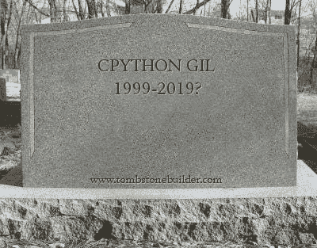
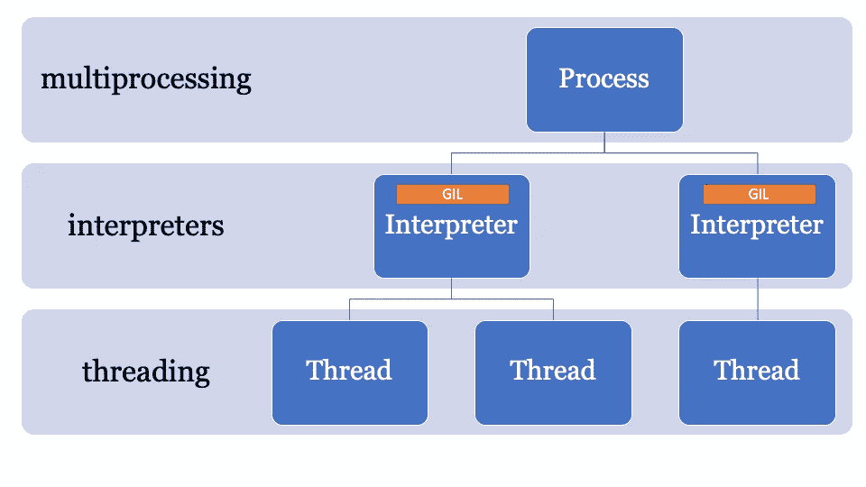
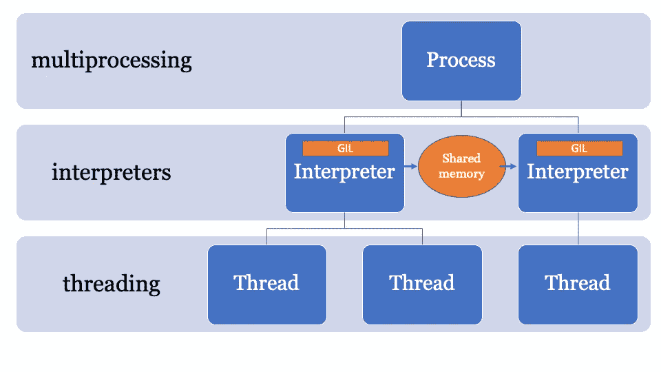

# 蟒蛇 GIL 被杀了吗？

> 原文：<https://medium.com/hackernoon/has-the-python-gil-been-slain-9440d28fa93d>



2003 年初，英特尔推出了全新的奔腾 4“HT”处理器。这款处理器的主频为 3 GHz，拥有“超线程”技术。

在接下来的几年里，英特尔和 AMD 通过提高总线速度、L2 高速缓存大小和减小芯片尺寸以最大限度地减少延迟，努力实现最佳的台式计算机性能。3Ghz HT 在 2004 年被“Prescott”型号 580 取代，其时钟频率高达 4 GHz。

看起来提高性能的途径是更高的时钟速度，但 CPU 受到高功耗和地球变暖热量输出的困扰。

你的台式机有 4Ghz 的 CPU 吗？不太可能，因为性能的发展方向是更高的总线速度和多核。英特尔酷睿 2 在 2006 年取代了奔腾 4，其时钟速度要低得多。

抛开消费级多核 CPU 的发布不谈，2006 年还发生了一件事，Python 2.5 发布了！Python 2.5 捆绑了一个测试版的`with`语句，您知道并且喜欢它。

Python 2.5 在利用英特尔的 Core 2 或 AMD 的 Athlon X2 时有一个主要限制。

> GIL。

# 什么是 GIL？

GIL 或全局解释器锁是 Python 解释器中的一个布尔值，受互斥体保护。CPython 中的核心字节码评估循环使用锁来设置哪个线程当前正在执行语句。

CPython 支持单个解释器中的多线程，但是线程必须请求访问 GIL 才能执行操作码(低级操作)。反过来，这意味着 Python 开发人员可以利用异步代码、多线程代码，而不必担心获取任何变量的锁或进程因死锁而崩溃。

GIL 使 Python 中的多线程编程变得简单。


GIL 还意味着，虽然 CPython 可以是多线程的，但在任何给定的时间只能执行一个线程。这意味着你的四核 CPU 正在这样做—(希望没有蓝屏)

GIL [的当前版本是在 2009 年](https://github.com/python/cpython/commit/074e5ed974be65fbcfe75a4c0529dbc53f13446f)编写的，支持异步功能，即使在多次尝试删除它或降低对它的要求后，它仍然相对完好。

对任何移除 GIL 的提议的要求是，它不应该降低任何单线程代码的性能。任何在 2003 年启用超线程技术的人都会理解为什么[它如此重要](https://arstechnica.com/features/2002/10/hyperthreading/)。

# 避开 CPython 中的 GIL

如果你想在 CPython 中实现真正的并发代码，你必须使用多个进程。

在 CPython 2.6 中，[多处理模块](https://docs.python.org/2/library/multiprocessing.html#module-multiprocessing)被添加到标准库中。多重处理是 CPython 进程(每个进程都有自己的 GIL)的包装器

```
**from** **multiprocessing** **import** Process

**def** f(name):
    print 'hello', name

**if** __name__ == '__main__':
    p = Process(target=f, args=('bob',))
    p.start()
    p.join()
```

可以生成进程，通过编译的 Python 模块或函数发送命令，然后重新加入主进程。

多重处理也支持通过队列或管道共享变量。它还有一个 Lock 对象，用于锁定主进程中的对象，以便从其他进程写入。

多重处理有一个主要缺陷。它在时间和内存使用方面都有很大的开销。即使没有站点，CPython 的启动时间也是 100-200 毫秒(参见[https://hacker noon . com/哪个是最快的 python-2ae7c61a6b2b 版本](https://hackernoon.com/which-is-the-fastest-version-of-python-2ae7c61a6b2b))。

所以你可以在 CPython 中使用并发代码，但是你必须仔细规划它在**长期运行的进程**中的应用，这些进程之间很少共享对象。

另一种选择是像 Twisted 这样的第三方包。

# PEP554 和 GIL 之死？

总而言之，CPython 中的多线程很简单，但它不是真正的并发，而多处理是并发的，但有很大的开销。

> 如果有更好的方法呢？

绕过 GIL 的线索就在名字中，全局**解释器**锁是全局解释器状态的一部分。CPython 进程可以有多个解释器，因此可以有多个锁，*然而*，这个特性很少被使用，因为它只通过 C-API 公开。

为 CPython 3.8 提议的特性之一是 PEP554，它实现了子解释器和一个 API，在标准库中有一个新的`interpreters`模块。

这使得在单个流程中从 Python 创建多个解释器成为可能。Python 3.8 的另一个变化是解释器都有自己的 Gil



因为解释器状态包含内存分配竞技场，所有指向 Python 对象(局部和全局)的指针的集合，PEP 554 中的子解释器不能访问其他解释器的全局变量。

类似于多重处理，在解释器之间共享对象的方法是将它们序列化，并使用某种形式的 IPC(网络、磁盘或共享内存)。Python 中有很多序列化对象的方法，有`marshal`模块、`pickle`模块和更标准化的方法，如`json`和`simplexml`。这些都有利弊，**所有这些都有开销。**

第一个奖励是拥有一个共享的内存空间，它是可变的，并由拥有它的进程控制。这样，对象可以从主解释器发送，并由其他解释器接收。这将是一个由 PyObject 指针组成的查找管理内存空间，每个解释器都可以访问该空间，由主进程控制锁。



这方面的 API 仍在开发中，但它可能看起来像这样:

这个例子使用了 numpy，通过用`marshal`模块序列化来发送一个 numpy 数组，然后子解释器处理数据(在一个单独的 GIL 上),所以这可能是一个 CPU 限制的并发问题，非常适合子解释器。

## 这看起来效率很低

`marshal`模块*相当快，*但是没有直接从内存中共享对象快。

[PEP 574 提出了一种新的 pickle](https://www.python.org/dev/peps/pep-0574/) 协议(v5 ),该协议支持将内存缓冲区与 pickle 流的其余部分分开处理。对于大型数据对象，一次性序列化它们并从子解释器中反序列化会增加很多开销。

新的 API 可以像这样接口(*假设*，两者都没有合并)

Pickle v5 and Sub-Interpreters PoC

## 这看起来像是一大堆样板文件

好的，这个例子使用了低级的子解释器 API。如果你用过多重处理库，你会发现一些问题。这不像`threading`那么简单，你不能只是说在单独的解释器中用这个输入列表运行这个函数。

一旦这个 PEP 被合并，我希望我们会看到 PyPi 中的其他 API 采用它们。

# 一个副解释器有多少开销？

**简答**:多一个线程，少一个进程。

**长回答**:解释器有自己的状态，所以虽然 PEP554 可以很容易地创建子解释器，但它需要克隆和初始化以下内容:

*   __main__ 命名空间和 importlib 中的模块
*   包含以下内容的 sys 字典
*   内置功能(`print()`、`assert`等)
*   线
*   核心配置

核心配置可以很容易地从内存中克隆出来，但是导入的模块就没那么简单了。用 Python 导入模块很慢，所以如果创建一个子解释器意味着每次都要将模块导入另一个名称空间，那么好处就会减少。

# 阿辛西奥呢？

标准库中的`asyncio`事件循环的现有实现创建了待评估的帧，但在主解释器中共享状态(因此共享 GIL)。

在 PEP554 被合并之后，很可能在 Python 3.9 中，一个替代的事件循环实现*可以被实现(尽管还没有人这样做)，它在子解释器中运行异步方法，因此是并发的。*

# 听起来不错，发货吧！

不完全是。

因为 CPython 已经用单个解释器实现了很长时间，代码库的许多部分使用“运行时状态”而不是“解释器状态”，所以如果 PEP554 以其当前形式合并，仍然会有许多问题。

例如，垃圾收集器(在 3.7

During the PyCon sprints [中的变化已经开始](https://github.com/python/cpython/pull/13219)将垃圾收集器状态转移到解释器，这样每个子解释器将拥有自己的 GC(正如它应该的)。

另一个问题是，在 CPython 代码库和许多 C 扩展中存在一些“全局”变量。因此，当人们突然开始编写适当的并发代码时，我们可能会开始看到一些问题。

另一个问题是，文件句柄属于进程，所以如果您在一个解释器中打开一个文件进行写入，子解释器将无法访问该文件(无需对 CPython 做进一步的更改)。

简而言之，还有许多其他事情有待解决。

# 结论:GIL 死了吗？

对于单线程应用程序，GIL 仍然存在。所以即使 PEP554 合并了，如果你有单线程代码，也不会突然并发。

如果您想要 Python 3.8 中的并发代码，您有 CPU 限制的并发问题，那么这可能是您的最佳选择！

## 什么时候？

Pickle v5 和用于多处理的共享内存很可能是 Python 3.8(2019 年 10 月)，子解释器将在 3.8 到 3.9 之间。

如果你现在想玩我的例子，我已经用所有需要的代码建立了一个自定义分支【https://github.com/tonybaloney/cpython/tree/subinterpreters