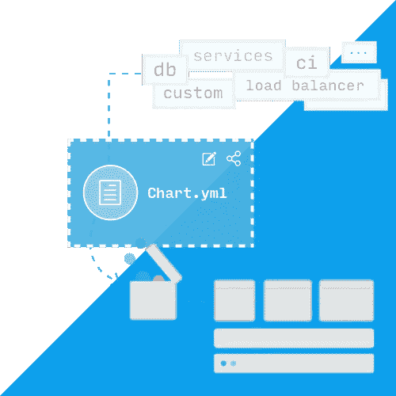

# 战壕里的头盔

> 原文：<https://medium.com/hackernoon/helm-from-the-trenches-17f87859ee47>

如果您正在使用 Kubernetes，那么您应该使用 [Helm](https://www.helm.sh) 来轻松地为您的应用程序更改 YAML 资源。Helm 就像一个用于在集群上部署应用程序的包管理器，它给你一个已经创建的准备安装的应用程序(图表)的列表，你也可以开始创建自己的应用程序，并在你自己的图表博物馆中发布它们。就像在操作系统上一样，没有包管理器的生活会困难得多。

Helm charts for an easier Kubernetes installation (image source: [https://helm.sh](https://helm.sh))

我每天都在使用 Helm，这些是我在创建新图表或修改现有图表时发现的事情。如果我在开始使用 helm 之前就知道这些，事情会变得更加顺利，我也不会浪费太多时间去搜索错误消息和各种问题的解决方案，或者可能只是花更少的时间去重构。

作为先决条件，我假设您已经安装了 kubectl，并且可以访问一个集群，不管它是在云平台上创建的还是仅仅是 [minikube](https://kubernetes.io/docs/tasks/tools/install-minikube/) 。我也希望你有一些关于如何使用头盔的知识，你已经安装了一些图表，你对更多地参与头盔充满信心。

在开始任何工作之前，看一下在[头盔库](https://github.com/helm/charts/tree/master/stable)中找到的包列表是个好主意。从这些图表中可以学到很多东西，我们将用它们作为例子来说明一些你可以用来创建自己的图表的想法。helm stable repo 是在安装 helm 时自动添加的，所以你已经可以开始下载和使用这些图表了。

## 总是使用 helm 创建新图表

创建一个图表并不复杂，您只需要在一个文件夹中创建一些文件，比如 Chart.yaml、values.yaml 和 templates 文件夹中的实际资源(比如部署)。你可能会想用手一个接一个地创建它们，这看起来确实是一个不错的练习。或者你可以在学习 go、node.js 或其他语言的时候为它搭建自己的脚手架。但这不是个好主意。相反，您应该始终尝试使用 helm create 命令。因为它总是与推荐的实践保持同步。比如你现在运行`helm create test-chart`，它设置的标签是[最新推荐的](https://kubernetes.io/docs/concepts/overview/working-with-objects/common-labels/)，比如`app.kubernetes.io/name,`、`app.kubernetes.io/instance`或者`app.kubernetes.io/managed-by`。如果你只是浏览一些来自 [helm stable repo](https://github.com/helm/charts/tree/master/stable) 的图表，你可以看到他们没有使用这样的标签，仅仅是因为当他们被创建时还有其他的推荐。

此外，如果您查看它创建的部署(在 templates/deployment.yaml 文件中)，您可以看到其他有趣的事情，例如，为您的容器参数化图像存储库和标记(尤其是标记，因为它会经常更改)是一个好主意，但是参数化活动或就绪探测路径之类的事情并不常见。如果将来参数化其他值会很有用，请确保模板会被更新。因此，通过使用 helm create 启动图表，您可以确保遵循最新的最佳实践，当然有一个条件:安装最新的 helm 客户端版本。

## 包含自定义值的图表

在尝试安装图表之前，最好先清理一下。林挺将应用模板(发生在客户机上),并验证输出是格式良好的 yaml。

有时默认情况下，应用模板时会排除一些资源。例如，web api 可以添加一个入口规则，以便仅当某个变量设置为*真(*并且默认为*假)*时，才启用外部通信。因为不会创建入口资源，所以不会被丢弃。在这种情况下， [lint 命令](https://docs.helm.sh/helm/#helm-lint)可以接受其他值文件而不是缺省值文件(并将该文件中的变量设置为 true)。

一个好的做法是在与您的*模板*文件夹相同的层次上创建一个 *ci* 文件夹，并将您想要验证的附加值文件放在那里。因此，如果您的 ci 文件夹中有一个名为*ingress-enabled-values . YAML*的文件，只需在稳定图表中运行`helm lint --values ci/ingress-enables-values.yaml`，您就可以看到[有几个有 ci 文件夹](https://github.com/helm/charts/tree/master/stable/karma)，我注意到最近越来越多的人添加了这个文件夹(这个文件夹可能不仅仅用于林挺，而是主要用于测试版本，对此我打算写一篇单独的文章)。

## 使用试运行和*调试*来查看图表将安装什么

我们将查看一下 [Postgresql 图表](https://github.com/helm/charts/tree/master/stable/postgresql)，看看它将为我们安装什么，而不需要实际安装，只需使用两个标志:模拟运行和调试

`helm install stable/postgresql --name standalone --dry-run --debug`

屏幕上将显示的是所有那些将被发送到 tiller (helm 服务器组件)以便在集群上应用的 YAML 文件。您还可以添加您的本地文件(使用`-f values.yaml`标志),该文件可以覆盖一些默认设置，这在您想检查如何修改要部署的资源而不安装应用程序时非常有用。

更重要的是，这种在本地呈现图表并验证其输出的方式可以在一个用于单元测试的[库中找到](https://github.com/lrills/helm-unittest)。看一看它，如果你发现它有用，把它添加到你的图表管道中。不幸的是，现在图书馆看起来不再维护了。

context is important for subcharts (image source: [https://podfanatic.com](https://podfanatic.com))

## 理解上下文，尤其是在使用子图表时

这是使用子图表时需要把握的一件非常重要的事情。为了解释上下文的意思，我们来看一下[孔图](https://github.com/helm/charts/tree/master/stable/kong)。Kong 是一个基于 nginx 的很好的 api 网关，可以通过一系列[插件](https://docs.konghq.com/hub/)进行扩展。孔使用 Postgres 或 Cassandra 来保持其状态，所以它们是图表中的要求。

如果你查看 [Postgres 图表模板函数文件](https://github.com/helm/charts/blob/master/stable/postgresql/templates/_helpers.tpl)，你会看到有几个函数使用了 *.Chart.Name* 值，你还可以看到图表名称是 [*postgresql*](https://github.com/helm/charts/blob/master/stable/postgresql/Chart.yaml) *。*所以每当我们使用`{{ template "postgresql.fullname" . }}`时，我们应该得到一个包含 *postgresql* 的值，因为 *.Chart.Name* 是方法的一部分。

但是，当在 kong chart 中使用模板并且 postgresql 是子图表时，Chart.Name 将实际指向 kong 图表名称。因为这是现在的上下文，所以我们不再使用 postgresql，在我们的示例中，我们将使用 [kong 图表名称](https://github.com/helm/charts/blob/master/stable/kong/Chart.yaml)。所以使用`{{ template "postgresql.fullname" . }}` 实际上会产生一个包含 *kong* 的名称(同样，当在 kong chart 下使用时—不是 postgresql subchart)。

`helm install stable/kong --name apigateway`

现在，这个问题可以通过添加另一个名为 *postgresql* 的硬编码方法来解决。所以这意味着代码重复，我们必须记住不要使用 postgresql chart 中定义的方法，而是需要使用下面的方法。但是在我们有 Helm 提供的更好的解决方案之前，社区使用这个。

**检查独立测试命名空间上的安装**

在将图表保存到您自己的图表博物馆之前，请在测试名称空间上进行实际安装。这个 helm 版本不应该影响集群中运行的任何其他应用程序，这就是为什么最好首先创建一个带有随机名称的测试名称空间。安装完成后，检查所有的 pod 是否处于运行状态，是否附加了所有的配置图和密码，所有的入口规则是否连接到服务，是否定义了资源和限制等等。

也尝试用一些不同的值升级当前版本。并检查升级是否正常，遵循与上面相同的规则。

最后，清理发布版本并删除测试名称空间。这是一个很好的功能测试，表明您的图表可以被其他开发人员使用。很有可能这样的测试需要成为你的*发布到图表博物馆*管道的一部分，以及 helm lint 完成的静态分析。

**其他有用的舵命令**

以下是一些有用的舵命令，但您可能不太熟悉:

对于大图表很有用，当调试和模拟运行标志产生一个很大的输出，很难跟踪。将-x 与要输出的资源的路径一起使用，将简化检查和调试。

`helm history [RELEASE]` —你可以用它来查看一个版本的修订，我们需要它以便在我们的安装/升级出现问题时能够呼叫`helm rollback [RELEASE] [REVISION]`。

`helm upgrade --reuse-values` —当您想要对某个版本进行小的更改，而不使用所有参数再次运行 helm 安装/升级时，重用值标志非常有用。例如，当您的安装中有一个输入错误，您修复了代码，但是不想再等 5 分钟让管道运行

`helm upgrade --install` —这非常有用，尤其是在管道中运行该命令时，您不需要编写代码来检查该版本是否已经存在，它会为您完成这项工作:如果找到该版本，它将使用提供的新值进行升级，如果没有版本，它将安装它

`helm install/upgrade --debug` —我知道我已经在上面提到了进行模拟安装时的调试标志，但是它非常有用，所以我会再做一次。将它添加到您的命令中是很重要的，尤其是在管道中运行时，因为它允许您在安装或升级的情况下看到实际发生了什么。如果没有它，输出的信息就不多，而且当您试图理解管道上出了什么问题以及向命令提供了什么值时，它也帮不了您太多。

`helm install/upgrade --set name=sandbox` —您可以使用 set 标志覆盖安装/升级的值。这对于设置在管道中计算的值很有用，比如 git 提交散列。但是有了这个标志，我不建议在你的管道上使用这个标志，因为这个值被隐藏了。相反，在计算之后，将它提交到 values.yaml 文件中的存储库中，并使用该文件。这样你就有了回购的变化历史，并遵循 gitops 方法。

就这样，现在你应该为使用舵图做更多的准备。如果你对 Helm 有用的东西有其他想法，请告诉我，我会把它们添加到文章中(连同致谢)。

*如果你喜欢这个并且想要更多的精神食粮* [*你也可以注册我的对云原生技术感兴趣的人的时事通讯*](https://mailchi.mp/8eac933e024a/cloud-native-newsletter) *。我一个月至少发一次。*