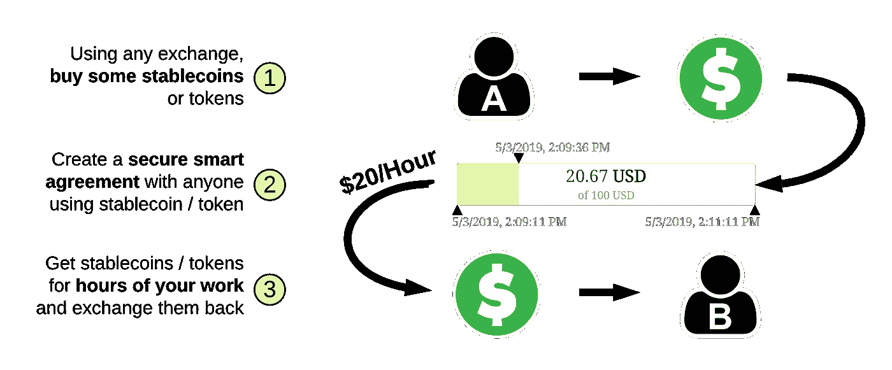
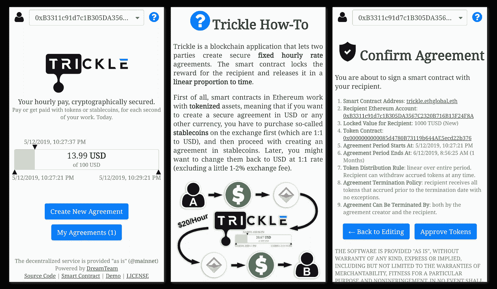
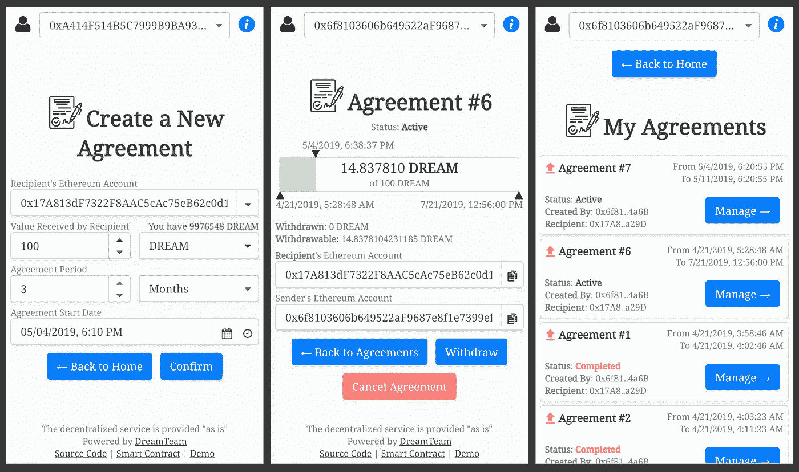
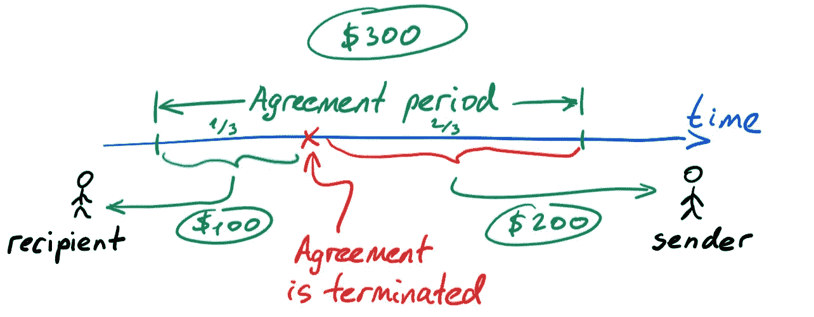
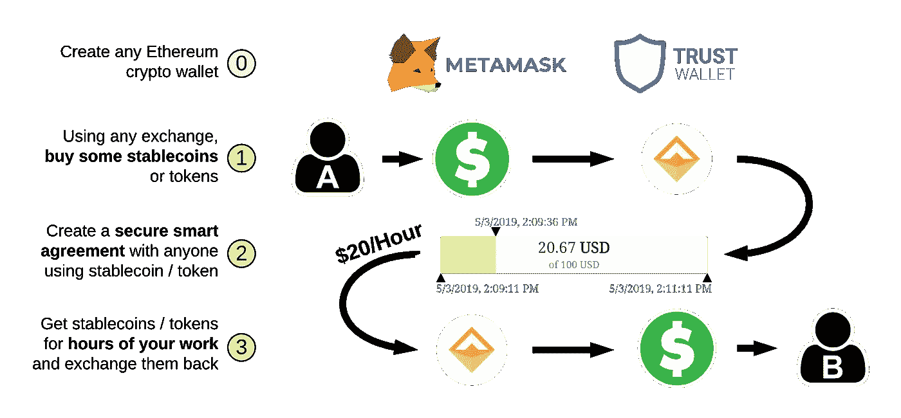

# 这里有一个现实世界的区块链应用程序，可以让你立即创建固定的小时费率合同

> 原文：<https://medium.com/hackernoon/heres-a-real-world-blockchain-app-that-lets-you-create-fixed-hourly-rate-contracts-right-away-17a5832b9d84>

你有没有想过如何利用区块链技术来保护今天的东西？也许把它应用到你的收入或任何有风险的协议中，包括那些完全通过互联网与陌生人达成的协议？的确，你可以。在这篇文章中，我们将告诉你怎么做。

Infographics: How you can secure your fixed hourly rate using blockchain & [Trickle](https://trickle.gg/)

# 问题是

> **🤔** [**工资盗窃**](https://en.wikipedia.org/wiki/Wage_theft) 就是克扣[工资](https://en.wikipedia.org/wiki/Wages)或[员工福利](https://en.wikipedia.org/wiki/Employee_benefits)正当地欠某[员工](https://en.wikipedia.org/wiki/Employee)。

在现代社会，你的报酬有一个“标准”:通常是两周一次或每月一次。通过互联网开始一份新的工作可能会让人紧张。这种感觉很常见，因为许多人发现很难信任他们不认识的人。

领工资时，你必须完全依靠你的雇主。在某些情况下，你甚至可能成为工资盗窃的受害者，工作几个月却领不到工资。

> 让第三方参与此类协议通常也不太好，否则你要么要等很长时间，要么要面临额外的费用。

然而，今天，随着区块链技术的使用，我们终于有办法避免欺诈或工资盗窃，而不需要任何中介。本文中描述的模型非常简单:

*   发送者和接收者商定固定的每小时费率(例如 20 美元/小时)。
*   使用区块链支持的服务，发送者在智能合同中保留等值的金钱，这反过来保证了接收者对工作时间的支付。
*   跟踪收件人的进度是发件人的责任(这很自然)；发送者可以终止协议，然而，智能合同保证接收者在任何情况下都可以获得与时间成比例的奖励。

不仅如此:

*   接受者从他们的每一项 **和第二项**工作中获得报酬；他们不需要等一个月才能拿到工资，因为他们可以随时根据固定的小时费率提取应计部分。
*   与银行电汇相比，使用加密方式转账需要支付的费用更少，而且在大多数情况下，法律纠纷也更少。
*   最后，加密货币具有非易失性，即所谓的“稳定硬币”，其价值保持在 1:1 的兑换率(即兑换美元)。

好奇自己怎么尝试？

# 介绍 Trickle —智能协议(D)应用程序

分散应用程序，或 dapp——这就是所谓的既不依赖于你的银行也不依赖于你的雇主的应用程序。使用区块链，它们总是按预期工作，其编程行为无法阻止平稳运行。因此，他们可以储存价值，并准确控制如何分配。

涓流是一种 DApp，在区块链以太坊上实现任意两方之间的固定小时费率协议。最令人兴奋的是**你今天就可以使用它**！

> 你必须完成的唯一步骤是让发送者(你的雇主)同意以加密方式(stablecoins 或 tokens)向你付款。

最初， [Trickle.gg](https://trickle.gg) 是由 [ETHGlobal](https://ethglobal.co/) 组织的世界级以太坊黑客马拉松 [ETHCapeTown](https://ethcapetown.com/) 的 [DreamTeam](https://dreamteam.gg/) 工程师开发的。涓涓甚至设法[赢得了一个奖项](/the-ethereum-name-service/trickle-dtok-and-more-meet-the-ens-winners-at-ethcapetown-ebf160bd9e78)！

DreamTeam 是一家电子竞技初创公司，它为游戏玩家提供了一个一体化的平台，帮助他们成为职业玩家，或者只是帮助游戏玩家与世界各地的团队一起玩游戏。涓流是梦之队使命的一部分。

在梦符[的背景下，Trickle 试图解决电子竞技行业最令人烦恼的问题——团队或玩家无法获得报酬或锦标赛奖金。](https://token.dreamteam.gg/)

你可以在 Trickle 的[文档页面](https://trickle.gg/info)和 [DevPost](https://devpost.com/software/trickle) 上阅读更多关于 Trickle 的内容，也可以关注我们的[开源库](https://github.com/dreamteam-gg?q=trickle)获取更新。下面你会找到更多关于如何在你的下一个固定时薪合同中使用它的信息！

Some Trickle DApp screenshots. [DREAM](https://etherscan.io/token/0x82f4ded9cec9b5750fbff5c2185aee35afc16587) is used as an example of the Ethereum token, though it may be any other token or stablecoin.

# 如何使用涓流

[涓流](https://dapp.com/dapp/trickle)应用的关键点是通过提供一种使用固定小时费率转移价值的安全方式，防止发送方和接收方不遵守协议。在协议创建时，发送方的资金被锁定在智能合约中，智能合约在协议期内线性分配资金，由接收方提取。

但是，发送方和接收方都有能力终止协议。**的关键点**是，在协议终止的情况下，接收方将根据其固定的小时费率，收到其余额在终止日期前累积的代币/稳定积分。因此:

*   **从接收者一方来看**，他们是安全的，因为区块链保证他们将收到迄今为止累积的代币/稳定币。在发送方自发决定终止协议的情况下，接收方只是停止提供服务而没有损失。
*   从发送方来看，他们没有向不诚实的接收方付款的风险；发送方(雇主)有责任检查接收方(雇员)的表现，如果表现不佳，可以随时终止协议。

An example of how smart contract distributes funds if the agreement gets terminated after 1/3rd of the period: the total of $300 is proportionally divided and $100 is sent to the recipient (earned so far) and $200 back to the sender (the rest of the funds which have not accrued to the recipient’s balance yet)

这两点至关重要。我们认为这是唯一真正透明的互联网或不可信金融关系模型，不需要第三方的参与。

以下是整个过程的工作方式(在本文档中也描述了[):](https://trickle.gg/info)

1.  发送者和接收者同意使用加密令牌/stablecoins 作为他们的金融协议，以及 [Trickle.gg](https://trickle.gg/) 来保护事物。他们决定接收方的固定年/月/周/日/小时费率，以及他们在协议中使用的代币/稳定币。此外，他们还约定了接收方获得付款的期限，以及发送方的令牌/稳定币将在区块链中保留的期限。他们还同意使用哪个账户(钱包)来获得补偿。必须在达成协议之前创建以太坊钱包([元掩码](https://metamask.io/)、[信任](https://trustwallet.com/)、 [MEWconnect](http://mewconnect) 或任何其他钱包)。
2.  发送者在他们偏好的交易所注册，并购买以太币代币/稳定币(以及在以太币网络上执行交易的一点以太币——支付[消耗的气体](https://kb.myetherwallet.com/posts/transactions/what-is-gas/))。
3.  使用 [Trickle](https://trickle.gg/) ，发送方按照与接收方的约定，以令牌/stablecoins 的形式创建协议([协议示例](https://trickle.gg/view-agreement/1))。
4.  一旦协议被创建，接收者确保协议是有效的(再次使用 [Trickle](https://trickle.gg/) )。当使用收件人的钱包浏览时，它应该出现在应用程序的[我的协议](https://trickle.gg/my-agreements)部分。
5.  然后，接受者开始做他们的工作，并从他们每一秒的工作中获得报酬。在任何时候，发送方和接收方都可以检查在区块链创建的协议是否仍然有效(再次使用 [Trickle](https://trickle.gg/) )。
6.  接受者可以随时通过执行提款交易(只需点击“提款”按钮)将累积的代币/稳定积分提取到他们的钱包中。对于这个操作，接收者还必须在他们的余额上有一点以太，以在以太网上执行交易。
7.  在任何时候，发送者或接收者都可以取消协议。然而，迄今为止接收者余额上累积的代币/稳定币无一例外地被发送给接收者。剩余的代币/稳定币被返回给发送者的余额。

参考[涓流的文档](https://trickle.gg/info)以获得更多关于它如何工作的信息。

Expanded step-by-step infographics of [Trickle](https://trickle.gg/), hourly-rate-driven decentralized smart agreements service.

如果您不熟悉 crypto，乍一看这可能很复杂。然而，*你只需经历这些步骤一次，之后的任何加密协议只需点击几下就可以完成。*

此外，在现场网络(以太坊主网)上执行事情之前，您可以在以太坊测试网(Ropsten 或 Kovan)上尝试 Trickle。为此，只需将您的钱包或[元掩码](https://metamask.io/)切换到所需的测试网络。你还需要在 testnet 上获得一些令牌以及一些测试以太网来运行事务(你可以使用 [Ropsten](https://faucet.ropsten.be/) 或 [Kovan](https://faucet.kovan.network/) 网络的水龙头获得免费的测试以太网)。

> 让加密时代开始吧！我们感谢[您对我们](https://github.com/dreamteam-gg/trickle-dapp/issues)[涓流 DApp](https://trickle.gg/) 的任何反馈，希望您会觉得有用！请随意访问/观看 [Trickle GitHub 资源库](https://github.com/dreamteam-gg/trickle-frontend)以获取更新，以及 [DreamTeam 的 Medium](https://medium.com/dreamteam-gg) —电子竞技和加密的未来发展中心。