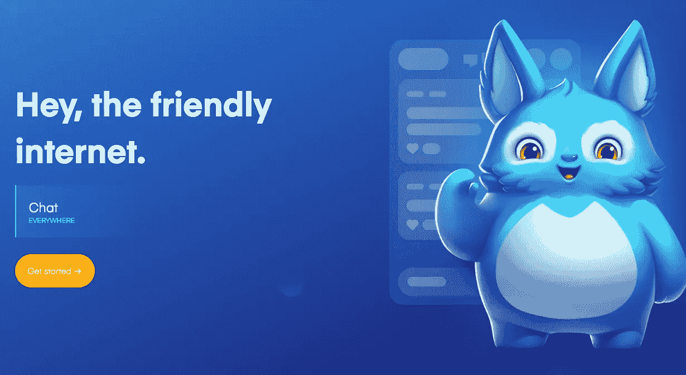

# 嘿，任何网站上的实时聊天

> 原文：<https://medium.com/hackernoon/hey-a-live-chat-on-any-website-92714eac94ee>

## 用区块链和 Karma 让网络再次变酷

网络已经今非昔比:看起来我们已经从年轻、狂野、自由的状态变成了严格、衰老、躺在床上的状态。

We’re here to say *Hey!*

# 一份更酷更友好的互联网宣言

互联网——一个我们学会了自由阅读、写作和漫游的地方——正日益受到审查，到处都是宣称*假新闻*并强迫有价值的信息被掩盖或删除的傻瓜。我们在这里说*嘿，*不酷。是时候放松一下，寻找我们的根源，夺回控制权了。我们想要一个新的互联网规范——积极的影响和支持性的互动。

这就是为什么 [Hey](https://hey.network) 被创造出来——一个为你的同行提供不受干扰的访问并建立在透明基础上的平台。Hey 为互联网洋葱添加了一个顶层，作为用户浏览器的扩展，嵌入每个网页的右侧。这个平台是一个分享想法、建议和见解的地方。例如，公开评论其他地方的可用产品和折扣，从其他开发者那里寻求帮助，或者警告虚拟朋友网站诈骗。最大的好处是:网站所有者自己不能删除或编辑 [Hey 扩展](https://chrome.hey.network),所以你的输入永远不会根据他们的议程被修改或删除。任何东西被修改的唯一时间是当它被其他用户认为对平台的健康有害时——仇恨言论和它的坏朋友。即便如此，仍有工具可以将误报风险降至最低。

[嘿](https://hey.network)将民主带到了一个新的高度，整合了奖励和推荐系统以及因果积分累积，以便将价值重新分配给创造它的用户。权力属于人民？是的，那，然后给人们一些利润。

嘿在这里是为了让改变发生，并在万维网上促进自由。我们希望你加入。

# 利用区块链实现透明

根据宣言价值观，Hey 利用区块链来确保所有价值转移都是完全透明的。想知道怎么回事吗？请查看 FOSDEM19 的最新视频:

或者，您可以随时前往 [Hey's Block Explorer](https://explorer.hey.network) 查看实时发生的事情。

# 这才刚刚开始…

如果你在这份宣言中认可了你的价值观，那就加入这一冒险吧:

*   安装[延长件](https://chrome.hey.network)
*   签出 [GitHub 库](https://github.com/hey-network)
*   阅读[宣言](https://manifesto.hey.network/)

很快还会有更多。让我们让网络再次变酷！