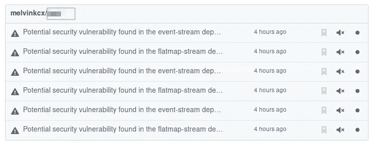
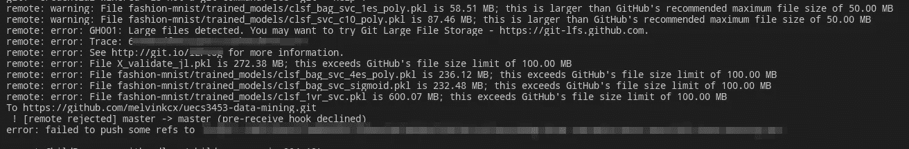

# 嗨，Github！再见，比特桶！

> 原文：<https://medium.com/hackernoon/hi-github-bye-bitbucket-c0ba7d5051a4>

几年前，当 Bitbucket 放在 Github 旁边时，它闪闪发光。在 Github 提出 Github 操作和免费无限私人回购之前，Bitbucket 已经这样做了。由于我是自由职业者，我的大部分回购需要保密，付费对我来说不是一个选择，所以我决定使用 Bitbucket。

然而，事情发生了很大的变化。Github 现在更加全面，Bitbucket 中仍然缺少一些必要的功能，比如标记 Git 问题。

使用 Bitbucket，我还得到了一个丢失的投资组合，即贡献活动图。我相信大多数人都同意这对于开发人员来说是必不可少的，尽管这并不能反映一个人所做的真实工作。

contribution activity of one of Arch Linux developers

有了 Github，如果我的任何回购有一个易受攻击的包，我会收到安全通知。

Security warnings from Github

# 将 Bitbucket Repos 迁移到 Github

有很多原因，我决定把我所有的回购从 Bitbucket 合并到 Github。当然，这是有代价的，我稍后会谈到。

## 怎么会？

我所期待的是我在 Github 中所有回购的副本，然后我将不再使用 Bitbucket 作为`origin`。

为了实现它，我必须:

1.  从 Bitbucket 克隆我的所有回购
2.  在 Github 中创建同名的 repos
3.  将现有回购的`origin`更新为 Github URLs。

如果你手动操作，这些看起来很乏味。幸运的是，有人为此准备了一个脚本。

## 使用`bitbucket-to-github`

我分叉了`bitbucket-to-github`并添加了一些额外的东西，使它更适合我的情况。在我的版本中，我做了以下更改:

*   同类操作同时运行
*   使用 SSH 而不是 HTTPS 克隆存储库

 [## melvinkcx/bitbucket-to-github

### 将 Bitbucket 存储库迁移到 Github。为 melvinkcx/bitbucket-to-github 开发做出贡献

github.com](https://github.com/melvinkcx/bitbucket-to-github) 

## 警告

这个剧本并不复杂，它的意思是“完成任务！”。因此，当脚本执行时，要一直监视控制台输出。任何错误都不会暂停整个脚本，但是消息会打印到控制台。

Error message printed to console while running the script

就我而言，我的一个回购无法推送到 Github，因为我有超过 100mb 的 blobs。我没有花时间去解决它，因为这些文件只是一些很久以前在我的大学课堂上经过训练的神经网络模型。

最后，感谢 [pouriaa](https://github.com/pouriaa) 创造了我可以分叉的脚本。随意叉我的或者他的给你自己用！