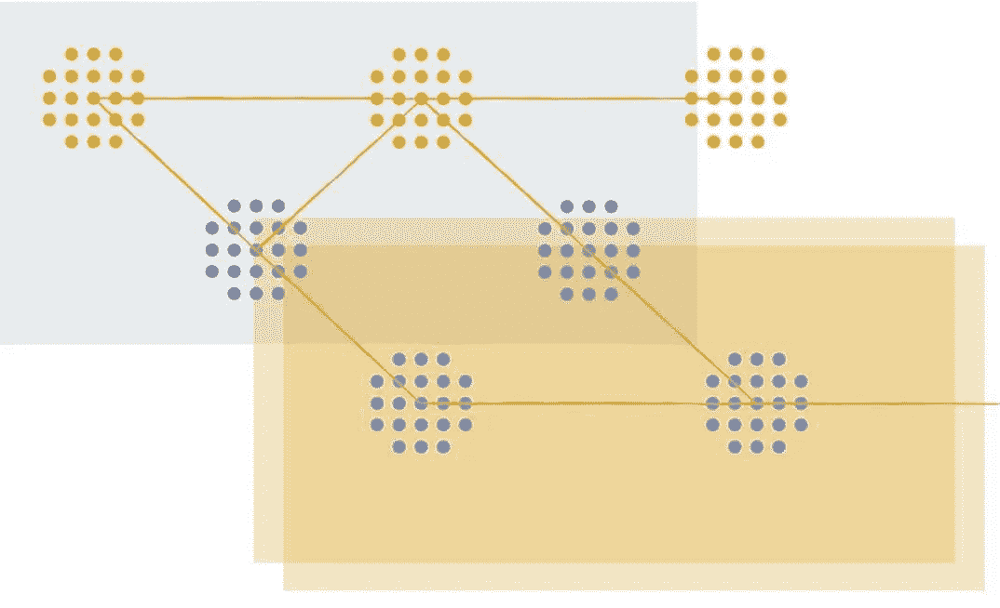

# 使用嵌套 Git 分支的高速软件开发

> 原文：<https://medium.com/hackernoon/high-velocity-software-development-using-nested-git-branches-69bfc2d1e54d>



在同一个特性分支中同时实现几个不同的不相关的代码更改，就像试图与同一个人同时就几个完全不同的主题进行对话，或者其他形式的多任务处理。从来都没有成果。我们最终会混淆问题或忘记考虑一个主题的重要边缘情况，因为我们被其他主题分散了注意力。我们只有部分大脑可以用来思考每个话题。同时处理几个问题可能会让人产生高效的错觉，但最终，分别处理每个主题会更快、更容易、更安全、更干净、更不容易出错。

这篇博客文章描述了一种通过使用一系列嵌套的 Git 分支实现代码更改的高度集中开发技术。我们使用专门的工具( [Git Town](http://www.git-town.com/) ，一个 Git 的开源插件)来使这种工作变得简单高效。

# 例子

举个例子，假设我们想为现有产品实现一个新特性。但是要做出如此复杂的改变，我们必须首先准备好代码库:

*   通过改进不再有意义的类名和函数名来清除一些技术上的偏差
*   给架构增加一些灵活性，这样就可以用更少的工作量来构建新特性
*   在查看代码库时，我们还发现了一些我们想要修复的错别字

让我们将这些东西实现为一个独立但相互连接的功能分支链！我提供了 [Git Town](http://www.git-town.com/) 命令，以及那些不熟悉该工具的人在没有 Git Town 的情况下必须运行的单个 Git 命令。首先，让我们修复这些错别字，因为这是最容易的改变，没有理由继续查看它们。

# 修复错别字

我们创建一个名为`1-fix-typos`的特性分支来包含来自`master`分支的错别字修复:

```
git hack 1-fix-typos
```

**git hack** 是 git Town 添加的 Git 命令。相应的普通 Git 命令是:

```
git checkout master
git pull
git checkout -b 1-fix-typos
```

我们总是希望在主分支的最新版本之上构建新的变更。

我们执行一些提交操作来修复打字错误，并提交一个拉取请求:

```
git new-pull-request
```

这个 Git Town 命令打开一个浏览器窗口，在您的代码托管服务上创建 pull 请求。

所有这些只花了我们不到一分钟的时间。当那些变更的代码评审发生时，我们继续修正技术偏差。

# 重命名`foo`

我们不想再看到我们刚刚修复的错别字，所以让我们在 branch `1-fix-typos`的顶部执行任何进一步的更改:

```
git append 2-rename-foo
```

`git append`通过从当前分支中剪切创建一个新的特征分支，产生如下分支层次:

```
master
  \
   1-fix-typos
     \
      2-rename-foo
```

相应的普通 Git 命令是:

```
git checkout -b 2-rename-foo
```

现在我们提交重命名变量`foo`的更改，并开始下一个拉请求:

```
git new-pull-request
```

因为我们使用了`git append`来创建新的分支，Git Town 知道分支的层次结构，并从分支`2-rename-foo`创建一个针对分支`1-fix-typos`的拉请求。这保证了分支 2 的 pull 请求只显示该分支中所做的更改(重命名变量)，而不显示分支 1 中所做的语法修正。

# 重命名`bar`

这与重命名`foo`不同，所以让我们在不同的分支中进行。其中一些变化可能发生在我们刚刚重命名为 foo 的地方。我们不希望以后不得不处理合并冲突。那些又无聊又冒险。因此，让我们在步骤 2 中所做的更改的基础上进行这些更改:

```
git append 3-rename-bar
```

我们以这种分支层次结构结束:

```
master
  \
   1-fix-typos
     \
      2-rename-foo
        \
         3-rename-bar 
```

相应的普通 Git 命令是

```
git checkout -b 3-rename-bar
```

# 修复更多错别字

在重命名`bar`的时候，我们又发现了一些错别字。让我们将它们添加到第一个分支。

```
git checkout 1-fix-typos
# make the changes and commit them here
git checkout 3-rename-bar
```

回到分支`3-rename-bar`，新修复的错别字再次可见，因为修复它们的提交现在只存在于分支`1-fix-typos`中。幸运的是，Git Town 可以通过所有其他分支自动传播这些更改:

```
git sync
```

相应的普通 Git 命令是:

```
git checkout -b 2-rename-foo
git merge 1-fix-typos
git push
git checkout 3-rename-bar
git merge 2-rename-foo
git push
```

# 推广基础设施

好吧，我们说到哪了？对！有了正确的名称，现在更容易理解更大的变化。我们剪切分支`4-generalize-infrastructure`并在其中执行重构。它必须是`3-rename-bar`的子分支，因为之前改进的变量命名将使我们现在要做的更大的改变更加直观。

```
git append 4-generalize-infrastructure
```

同样，在香草 Git 中:

```
git checkout -b 4-generalize-infrastructure
```

大量的编码和提交到这个分支中来概括事物。因为这就是我们在这里所做的一切，而不是别的，所以很容易就能完成。针对这些变更的代码评审开始了。

# 发布打字错误修复

与此同时，我们获得了对步骤 1 中的错别字修复的批准。让我们运送他们！

```
git ship 1-fix-typos
```

普通 Git 命令:

```
git stash -u         # move open changes out of the way
git checkout master  # update master so that we ship our changes 
                     # on top of the most current changes
git pull
git checkout 1-fix-typos  # make sure the local machine
                          # has all the changes made in the 
                          # 1-fix-typos branch
git pull
git merge master  # resolve any merge conflicts 
                  # between our feature and the latest master now,
                  # on the feature branch
git checkout master
git merge — squash 1-fix-typos  # use a squash merge 
                                # to remove all temporary commits 
                                # on the branch
git push                   # make our shipped feature visible to
                           # all other developers
git branch -d 1-fix-typo   # delete the shipped branch 
                           # from the local machine
git push origin :1-fix-typo  # delete the shipped branch 
                             # from the remote repository
git checkout 4-generalize-infrastructure  # return to the branch 
                                          # we were working on
git stash pop         # restore open changes we were working on
```

随着分支`1-fix-typos`的发布，我们的分支层次结构现在看起来像这样:

```
master
  \
   2-rename-foo
     \
      3-rename-bar
        \
         4-generalize-infrastructure
```

# 让我们的工作与世界同步

我们已经做了一段时间了。团队中的其他开发人员也发布了一些东西，从技术上来说，分支`2-rename-foo`仍然指向 master 上的前一次提交。我们不希望我们的分支与主分支上发生的事情偏离太多，因为这会导致以后更严重的合并冲突。让我们让一切同步！

```
git sync
```

相应的普通 Git 命令是:

```
git stash -u  # move open changes out of the way
git checkout master
git pull
git checkout 2-rename-foo
git merge master
git push
git checkout 3-rename-bar
git merge 2-rename-foo
git push
git checkout 4-generalize-infrastructure
git merge 3-rename-bar
git push
git stash pop     # restore what we were working on
```

因为我们使用了`git append`来创建新的分支，Git Town 知道哪个分支是哪个分支的子分支，并且能够以正确的顺序进行合并。

# 构建新功能

回到正题。有了新的通用代码架构，我们现在可以以一种简洁的方式添加新特性。要在新基础架构之上构建新功能，请执行以下操作:

```
git append 5-add-feature
```

我们到此为止吧。希望，Git Town 如何允许在几个 Git 分支中并行工作已经很清楚了。让我们回顾一下:

*   每个变化都发生在它自己的特征分支中
*   `git append`在现有工作的基础上创建一个新的特性分支
*   `git sync`保持所有功能分支与世界其他地方同步——一天做几次
*   `git ship`舰船一个特色分支

# 优势

这种工作方式有许多重要的优势:

*   专注的改变更容易、更快地产生:如果你只改变一件事，你可以很快地完成它，确保它有意义，然后转移到另一个分支的下一个问题。不要再陷入不确定在过去 10 分钟内你做的许多改变中的哪一个破坏了构建，也不需要启动调试器来解决这个混乱。
*   它们更容易和更快地被审查:拉请求可以有一个简单的描述来总结它。审阅者可以很容易地理解他们正在查看的更改，并确保它们是正确和完整的。如果只是自己写代码也是如此。
*   与包含许多变更的分支相比，包含焦点变更的分支导致的合并冲突较少。这让 Git 有更多的机会自动解决合并问题。
*   如果您不得不手动解决合并冲突，那么解决它们也更加容易和安全，因为每个分支中的变化更加明显。
*   其他人可以更快地开始审查您的部分变更，因为您更早地开始提交拉取请求。

最终，使用这种技术，你会更快地完成更多的工作。你会有更多的乐趣，因为很少会陷入困境、原地打转和重新开始。以这种方式工作需要运行更多的 Git 命令，但是对于 Git Town 来说，这完全不是问题，因为它可以为您自动完成这种重复。

# 最佳实践

为了充分利用这一技术，您所要做的就是遵循一些简单的规则:

推迟想法:当你正在做某件事，突然想到另一个改变的想法时，抑制住立即去做的冲动。相反，写下你想做的改变(在一张纸上或一个简单的文本文件上)，完成你现在正在做的改变，然后几分钟后在一个新的分支执行新的改变。如果你不能等待，将你打开的变更提交到当前分支，创建下一个分支，在那里执行新的变更，然后返回到前一个分支，在那里完成工作。

**使用一个分支链:**当不确定变更是否依赖于先前的变更，并且以后是否会导致合并冲突时，就在子分支中工作。它几乎没有副作用，除了你必须先运送祖先分支。如果你的分支是专注的，你会得到非常快的评论，能够快速出货，而且不会积累。

**首先进行大的重构:**在我们的例子中，我们在链中相对较晚的时候进行重构，因为它不是那么重要。但是，涉及大量文件的大型重构最有可能与来自其他人的变更产生合并冲突。你不想让它们停留太长时间，但是尽快把它们运出去。您可以使用 [git prepend](https://github.com/Originate/git-town/blob/master/documentation/commands/prepend.md) 在当前检出的特征分支之前插入特征分支*。如果您已经有一长串未审查的特性分支，那么尝试将大的重构插入到您的链的开始，以便它可以被尽快审查和发布:*

```
git checkout 2-rename-foo
git prepend 1-other-large-refactor
```

这导致了以下分支层次结构:

```
master
  \
   1-other-large-refactor
     \
      2-rename-foo
        \
         3-rename-bar
           \
            4-generalize-infrastructure
```

新的大型 refactor 在生产线的最前面，可以在审查时立即发布，我们的其他更改现在都建立在它的基础上。

黑客快乐！