# 见见美国收入最高的软件开发人员:Dev

> 原文：<https://medium.com/hackernoon/highest-paid-software-developer-c66b9f4cc53e>

Dev 在很小的时候就爱上了代码。

他大学毕业，获得工程学位，然后加入海军，成为一名网络战工程师。在受过高等教育的波斯父母的压力下，Dev 在服完兵役后回到学校，完成了 T2 的计算机科学硕士学位。他的整个职业生涯都是在软件开发中度过的，主要是用 [C++](https://en.wikipedia.org/wiki/C%2B%2B) 编写代码。

他很早就意识到工作负载正在向云转移，并花了数年时间重新装备和升级自己的技能，熟悉每一个主要的云供应商。他支持他的团队从内部 Oracle 数据库过渡到公共云中托管的新一代数据库。

Dev 总是站在最前沿，定期参加雇主赞助的培训课程和黑客马拉松。

多年来，Dev 使用了所有主要的编程方法，但最终还是选择了敏捷，成为了它的忠实粉丝。

现在，他是一家拥有 15，000 多名员工的大型科技巨头的经理，每周花时间在免费的公司健身房锻炼 3-4 次。即使在完成了一次敏捷冲刺后，他仍然坚持运动——大部分时间都是下班后慢跑回家。

升职后，Dev 将他的第二个班长给了他的一个年轻直接下属。他不再像过去那样花那么多时间疯狂地编码，所以额外的空间感觉是不必要的。

作为健康工作习惯的大力支持者，去年他为整个团队采购了一整套立式办公桌，并要求所有团队成员在远离他们的工作站的地方吃午餐。很少催促自己，他从不不吃饭。

在工作日，Dev 在上午 11 点后醒来。每一个。单身。日。

一定很棒吧？

然而，在 50 岁的时候，Dev 担心他的职业生涯是否已经达到顶峰。他没有计划很快退休，但是关于技术领域年龄歧视的传言和看到他的老同事被解雇让他怀疑自己是否是下一个。

也就是说，他知道作为一名自由职业者，他可以通过独立工作来弥补收入损失。他有预感自己单飞会赚更多。

作为一个自豪、慈爱的父亲，Dev 希望他的女儿能步他的后尘。他看到她有一个光明的、更好的未来。对他来说，整个世界都是她的。

# 这家伙是谁？

如果还不清楚的话，戴夫不是一个真正的人。

但他的个人和职业特征确实与高收入相关。

年龄。性别。种族。

教育。专业经验。编程语言。

方法论。黑客马拉松。甚至他用了多少台显示器。

与高收入相对应的特征并不总是我们所期望的——也不一定是我们所希望的。

开发者报酬的经济学对我来说是一个重要的话题。开发人员是软件生产中的关键投入者。除非你明白开发人员是如何获得报酬的，否则你无法理解科技——T2，你就是无法理解 T3。

然而，对这一重要问题的公开分析却很少。

# 大多数薪酬分析的问题是

[正如我在上一篇文章](https://whoisnnamdi.com/the-growth-share-matrix-of-software-development/)中提到的，Stack Overflow 对软件开发人员进行了年度调查，询问他们职业生涯的各个方面，如收入、职称等。

大多数薪酬分析的一个令人失望的特点是，它们显示的数据没有控制任何其他变量。避开任何比简单平均值更复杂的数学运算，典型的薪酬分析无法理解一个多元世界。

[Stack Overflow 自己撰写的调查结果](https://insights.stackoverflow.com/survey/2018/)有时会这样做，例如，采用所有全栈开发人员的简单平均收入，并比较 DevOps 专家的相同指标:

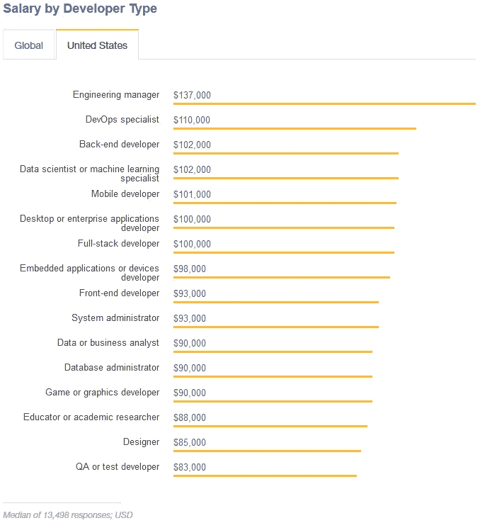

然后，人们会说“工程经理、开发专家和数据科学家的工资最高”，尽管这些话在技术上是正确的，但往往会误导不精通统计学的读者，让他们认为这些是“其他条件相同”的比较(“X 比 Y 高，其他条件相同”)、“T16”，而不是“T17”。

值得称赞的是，Stack Overflow 至少采取了额外的步骤，将这些工资与多年的专业经验进行比较，但这只是许多可能的控制措施之一。事实上，整个调查提供了一组丰富的潜在控制，以“保持平等”，从而产生关于潜在关系的更直观准确的陈述(“X 开发人员比其他方面相似的 y 开发人员赚得多”，这是一种与“X 比 y 赚得多”在质量上和数量上可能不同的陈述)。

不幸的是，大多数关于薪酬的公开讨论并没有控制*甚至一个单一的变量*。与其说这是在欺骗统计数据，不如说这是在误导统计数据。

简单地说——我们不仅想知道“45 岁的开发人员比 25 岁的开发人员挣得多还是少。”更重要的是:

> *“一个 45 岁的开发人员相对于一个在技能、经验、年龄、公司规模、国家等方面相当的 25 岁开发人员挣多少钱。)?"*

这两个问题都很重要，但对我来说，后者更有趣、更直观。这个问题也很难回答，因此很少有人尝试回答。

这是一次做得更好的尝试。不完美，但是好多了。

# 结果

我按调查问题分解结果，用图表显示每个特征对收入的控制效果，以及 [95%置信区间](https://www.google.com/url?sa=t&rct=j&q=&esrc=s&source=web&cd=2&cad=rja&uact=8&ved=2ahUKEwjjxKP2o-bfAhX7JTQIHSX4CEcQwqsBMAF6BAgBEAQ&url=https%3A%2F%2Fwww.khanacademy.org%2Fmath%2Fap-statistics%2Festimating-confidence-ap%2Fintroduction-confidence-intervals%2Fv%2Fconfidence-intervals-and-margin-of-error&usg=AOvVaw2C5TSH8Lk3H-OU1hI2pQAD)。相应地，任何对统计显著性的引用表示 [p 值](https://www.process.st/p-value/) < 0.05。

这些结果代表了来自堆栈溢出调查的大约 11，000 名美国开发人员的子集。

如果您想要一份带有全套结果的格式精美的报告，请在下面输入您的电子邮件，准备好后您将收到一封带有下载链接的电子邮件。

有关该方法的更多详细信息，请参见最后的附录。

# 人口统计数据

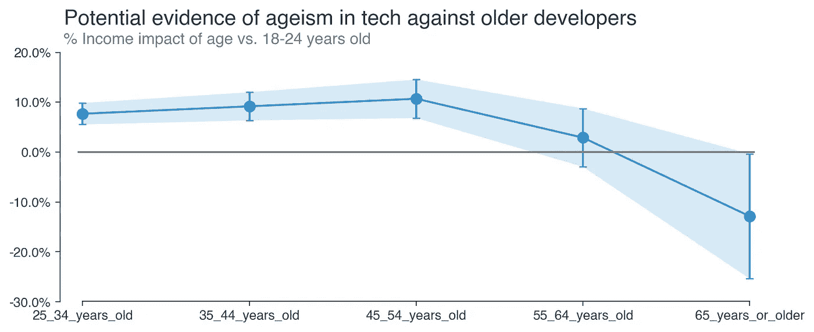

最初，年龄会增加收入。也就是说，年化[复合](https://whoisnnamdi.com/you-dont-understand-compound-growth/)收益相当微薄——45 岁至 54 岁之间约为 0.2%——其中大部分发生在开发人员 25 岁之前。

更有趣的是，当一个开发人员接近 65 岁时，年龄的影响如何下降并变成负面的(相对于 18-24 岁的开发人员):

*   在这种精确的水平上，**我无法区分 55 岁或以上的开发人员和 25 岁以下的类似人员的工资**
*   我可以相当肯定地说，**一个 65 岁以上的开发者比一个 18-25 岁的**相似的人赚得少。

年龄歧视可能是原因之一。科技公司，尤其是初创公司，被认为对年轻员工有偏好。年龄歧视的证据通常是轶事，但这一数据至少表明，这种担忧背后可能有真实的东西。

不幸的是，**众所周知，年龄歧视很难证明或反驳**，正是因为很难找到一个 25 岁的人在除了年龄以外的所有方面都和 65 岁的人一样。

*   首先，一个 25 岁的开发人员不可能有超过 5 年的专业开发经验，而一个 65 岁的开发人员几乎肯定有。这只是一个变量。

这当然是一个值得进一步探讨的问题。

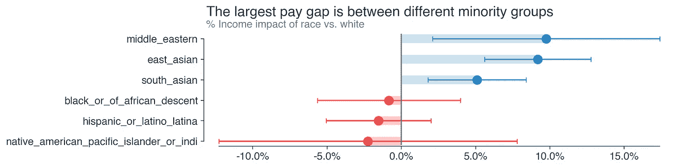

亚洲和中东的开发人员比类似的白人开发人员收入高得多，而且他们的工资*溢价*可能大于其他少数族裔面临的工资*折价*。

黑人开发人员的收入似乎比具有类似特征的白人开发人员低 0.8%，尽管有足够宽的置信区间来失去统计意义。

*   缺乏精确度(正负 5%)令人沮丧，但鉴于黑人软件开发人员在人口和数据集中的比例较低，这是不可避免的
*   **注意:在我的数据集中，只有 1.5%的开发人员是黑人**(与整个开发人员群体相比没有显著差异)

西班牙裔或拉丁裔/a 开发人员比同类白人少挣 1.5%。同样，由于缺乏足够的数据，我们看到相当大的置信区间。

亚洲和中东开发商的薪酬溢价如此之高，这本身就是一个有趣的事实，值得进一步探究

*   估计值从 5%到 10%不等，并且都具有统计学意义。

鉴于这些少数群体分别代表的数据集比例较小，这些影响的规模尤其令人印象深刻:

*   **东亚— 2.8%**
*   **中东— 0.6%**
*   **南亚人——3.6%**

即使只有很少的数据点，它们在统计上也是显著的，这表明这些影响是相当真实的。

薪酬歧视是一个严重的问题，需要进行严格的分析，比我在这里所做的要多得多。

*   总而言之，研究结果表明，平衡“薪酬”领域的努力还应关注各少数民族群体之间的薪酬平等，而不仅仅是少数民族群体和多数民族之间的薪酬平等

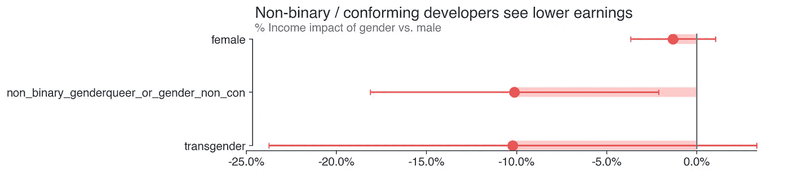

女性软件开发人员的薪酬差距在数量上与黑人开发人员相似，但统计意义较低——大约为 1.3%加 2.4%。

性别非二进制/非一致性开发人员相对于男性开发人员面临 10%的较大薪酬折扣。

鉴于数据集中很少的观察结果，对跨性别开发者的薪酬影响无法精确估计到足以得出任何有意义的结论。

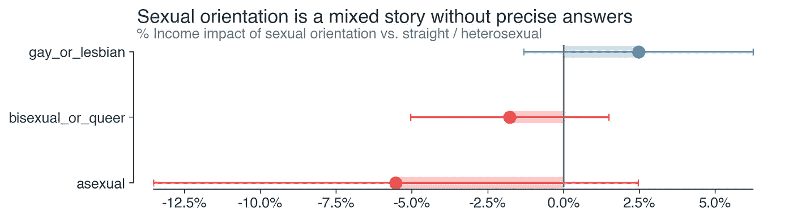

同性恋软件开发人员似乎比异性恋/异性恋开发人员多赚 2.5%，但这一估计在统计上并不显著。

事实上，考虑到上面的置信区间，没有一种性取向在统计上与异性恋有显著的不同。

*   同样，这部分是由于有限的数据——例如，样本中只有 2.4%的开发人员是同性恋

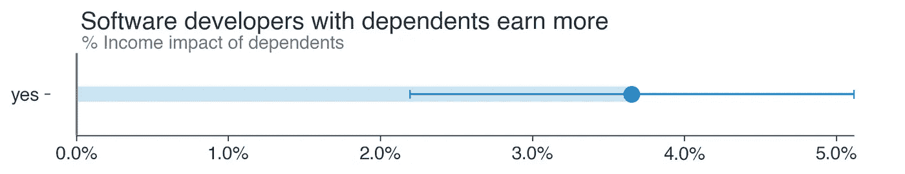

对父母来说是个好消息——有受抚养人(孩子、祖父母等)的开发人员。)在控制其他因素的情况下，比不工作的人多挣 3.7%。

对此有许多可能的解释

*   有家眷的工人可能想要/需要额外的收入，因此会寻找报酬更高的工作
*   我没有证据表明雇主会特别选择给那些有家眷的人支付比其他人更多的工资，尽管情况也可能是这样

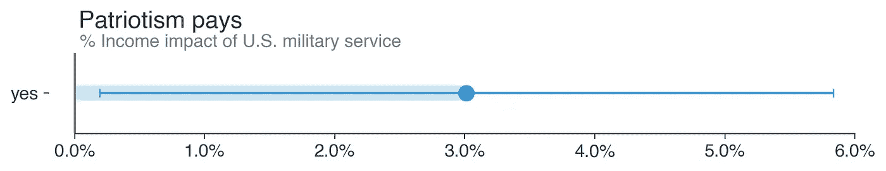

前任和现任美国军人的收入比没有服过兵役的人高出 3%。

与其他特征一样，老兵支付溢价的潜在驱动因素有很多，很难找到最可能的解释。

## 外卖食品

*   考虑到开发人员人口高度不平衡的本质，围绕人口统计特征对收入的影响得出合理的结论必然是棘手的
*   当定位因果关系时，谨慎是明智的，并且这些应该理想地伴随着一些理论机制
*   也就是说，结果是有趣的，并有望成为更深入和更严格分析的起点。

# 教育

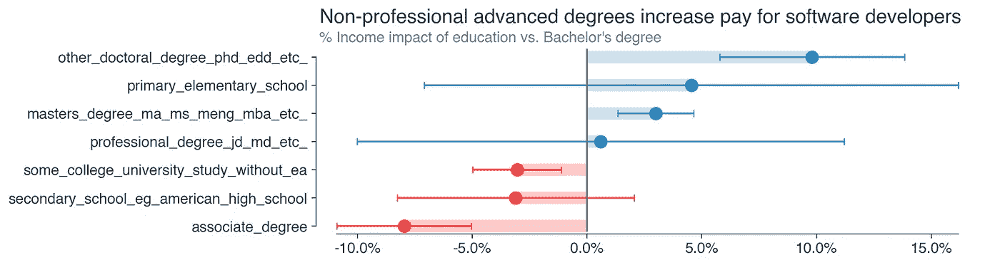

高级的非专业学位会带来更高的收入。硕士或博士学位。)相对于只有学士学位的同等开发人员，分别带来了 3%和 10%的显著收益。

上过大学但没有完成学业的人收入会减少 3%，而获得副学士学位的人比获得学士学位的人收入会减少 8%。同样，两者都具有统计学意义。

由于置信区间较大，像法学博士和医学博士这样的专业学位的影响在统计学上并不显著。

*   拥有这些学位的人很少从事软件开发工作，因此很难做出准确的估计。

对于从未达到大学水平的开发人员来说，没有什么可说的——由于缺乏数据，置信区间太宽，无法得出有意义的结论。然而，这些人几乎肯定比拥有高学历的人更糟糕。

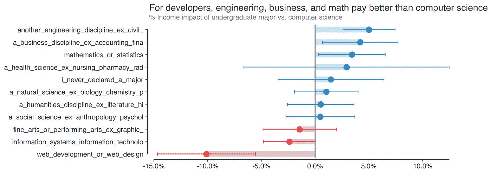

有趣的是，计算机科学并不是收入最高的大学专业。

*   事实上，其他工程学科(土木、机械、电气等。)( **5%涨幅**)、商科学位(会计、金融等。)( **4%增长**)，数学/统计专业( **3.4%增长**)都挣得多，其他都一样。

在这些领域之外，大学专业在很大程度上与开发者薪酬无关。薪酬低、教育程度高的社会学专业并不适用。

*   这可能是令人鼓舞的，因为它表明无论你的研究领域是什么，你都可以为优秀的开发工作获得报酬
*   随着开发学校和训练营如雨后春笋般涌现，如果你正在考虑转行并担心自己可能处于劣势，这是一个好消息。
*   另一方面，这确实提出了一个问题——为什么研究最相关领域的开发人员没有得到比其他人更高的报酬？
*   这说明了大学计算机科学教学的问题吗？人们经常批评大学计算机科学教学与专业软件开发工作毫不相干，脱节。

例外的是信息系统/技术和网页开发/设计学位，它们分别有 2.4%和 10%的薪酬折扣。

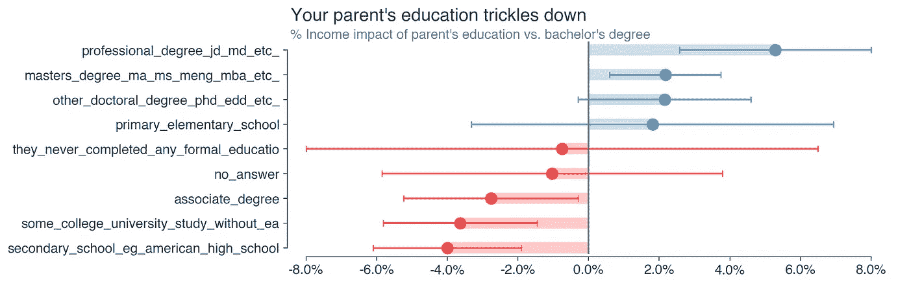

作为软件开发人员，你父母的教育水平很重要。

父母中至少有一方拥有法学博士或医学博士等专业学位的开发人员，其收入将比父母从未拥有学士学位的开发人员高出 5.3%。父母拥有硕士和博士学位与子女工资增长 2.2%相关，尽管这种关系在博士学位方面几乎没有统计学意义。

副学士学位、一些大学和高中都有 2.8-4%的显著负面影响。

小学和非正规教育在数据集中太少，无法产生精确的影响估计。

考虑这些影响如何在开发人员的职业生涯中表现出来是很有趣的

*   我们都可以想象父母的教育会对孩子的生活产生有意义的后续影响
*   随着更多的控制，这些影响也可能消失或失去意义
*   例如，这种影响可能通过收入或其他与教育相关(或受教育影响)的变量传递，而不是通过学校教育本身

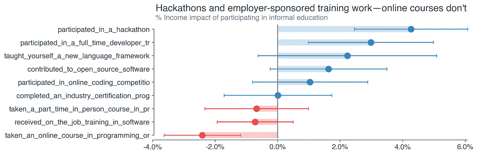

参加[黑客马拉松](https://hackathon.guide/)显然与更高的薪酬相关——高出 4.3%以上，全职开发人员培训项目(训练营)也是如此，提供 3%的加薪。

在过去的十年里，我们见证了编码训练营数量的[式爆炸。加薪幅度相当于硕士学位，这是令人难以置信的，因为训练营需要几个月才能完成，而不是几年，而且学费通常比高级学位便宜。](https://www.coursereport.com/reports/2018-coding-bootcamp-market-size-research)

对开源软件(OSS)的贡献(从某种意义上来说，肯定是一种教育体验)，有 1.6%的积极但不具统计意义的增长

*   典型软件栈的开源渗透只是在过去几年中有所增加——如果对 OSS 的积极贡献能得到更高的报酬，这是有意义的。

行业认证得了一个大大的零分。没有效果。

另一方面，在线编程课程、MOOCs 等。与略高于 2.4%的显著下降有关。考虑到这些年来在线软件开发课程在[的激增，这是一个不方便的发现。](https://www.creativebloq.com/web-design/online-coding-courses-11513890)

*   也就是说，我确实担心潜在的混淆或遗漏了没有被控制的变量
*   我想象不出参加在线课程和低收入之间有什么强有力的因果联系，但我可以肯定地想象，参加在线课程的“那种人”也可能是通常收入较低的那种人

同样，参加黑客马拉松的人可能有其他不为人知的特质，从而带来更高的收入

*   某些平均薪酬可能更高的公司也会在办公室举办黑客马拉松

换句话说，相关性可能不是因果关系，即使在控制了许多变量之后。

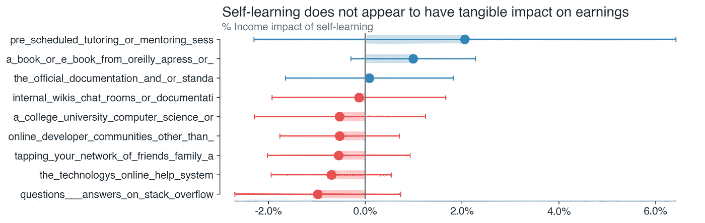

作为一个狂热的自学者，我失望地看到，没有任何形式的自学似乎对收入有统计上可辨别的影响。

*   书籍和电子书接近达到统计学意义，但即使如此，点估计也只有 1%。

自学是一种很好的方式，有针对性地学习你需要知道的关于某个主题或知识领域的知识。对许多人来说，这比传统的教学方法更有效。

然而，这似乎并不会影响薪酬本身。

## 外卖食品

*   教育很重要，很大程度上是以人们猜测的方式
*   如果你已经大学毕业，高级学位、黑客马拉松、训练营和开源项目可能是增加你作为开发人员的价值的明智方式，这些方式会体现在你的薪水上
*   如果你还没有毕业，要知道你选择的专业并不重要，至少在报酬方面

# 职业特征

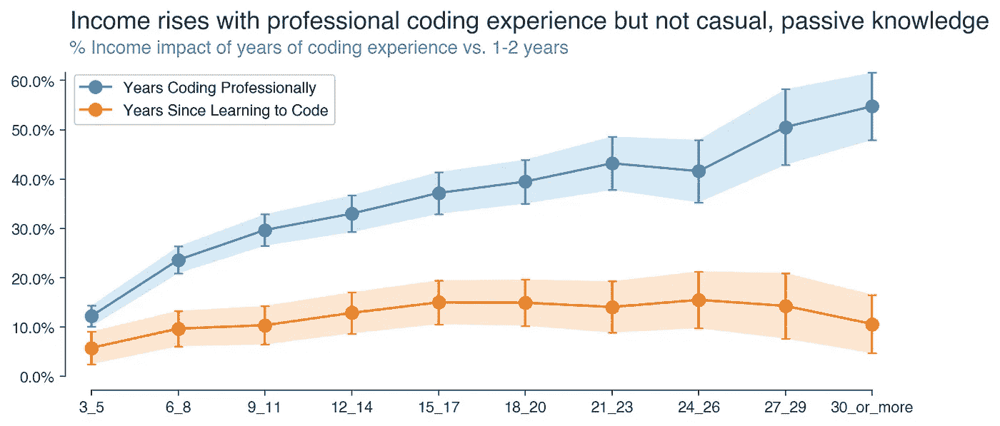

专业开发经验比随意编码重要得多。从多年的一般编码经验中获得的收益在 15 年后趋于稳定，而专业编码经验在 30 年内继续获得回报。

随意编码的经验(相对于 0-2 年)带来的好处最多为 10-15%，实际上在 26 年后开始下降。

*   同样，这是在保持其他因素不变的情况下，包括职业经验，所以这可能是有意义的
*   一个 30 年前就学会了编码的人，比一个只有 10 年编码经验的人没什么可展示的，可能会举旗。
*   然而，我们必须小心——考虑到一个人学习编码的年份，学习编码的年份与年龄完全相关，这表明年龄歧视可能在这里泄漏。我在这篇文章的其他地方专门探讨了年龄。

职业经验最快的收获出现在最初的十年。

*   在其他条件相同的情况下，拥有 9-11 年专业经验的开发人员可以比新手多挣 30%,这相当于每年增长约 2.5%。
*   当然，对于任何一个特定的开发者来说，在十年的时间跨度内，“其他一切”可能都不相等，这意味着在现实世界中，特定开发者的潜在年加薪幅度甚至更大。

在第一个十年后，这条线几乎是直的，除了在 25 岁时的职业生涯中期暴跌。

*   然而，不要被愚弄了——恒定的绝对收益事实上代表着下降的增长率
*   换句话说，每一年的职业发展经历都会带来几乎不变的加薪，但加薪的百分比却在下降。我将在接下来的文章中进一步探讨这一现象

尽管如此，随着时间的推移，随着专业经验的增加，开发人员的薪酬并没有完全持平或逆转，这仍然是令人鼓舞的。

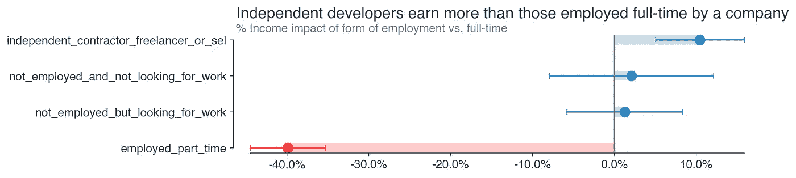

这并不奇怪——兼职工作对你的收入没有帮助。

更有趣的是，作为自由职业者或独立承包人的开发人员比全职人员挣得多

*   几乎可以肯定的是，可变收入可以弥补这一点
*   总的来说，稳定的全职工作是有代价的，不仅是在软件开发领域，在经济的其他领域也是如此

反向因果关系也可能在这里起作用——知道自己作为自由职业者能挣更多钱的人正是那种会成为自由职业者的人。

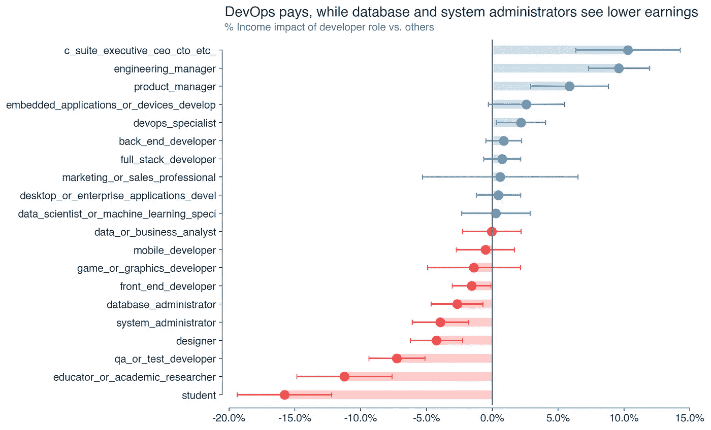

经理和高管收入更高不足为奇。这包括[产品经理](https://qz.com/766658/the-highest-paid-workers-in-silicon-valley-are-not-software-engineers/)，他们自己可能不会写大量的代码。

*   工程经理和最高管理层高管的收入高出 10%，而产品经理的收入高出 5.8%，其他条件相同。

唯一一个比其他职位挣得更多的非经理职位是 DevOps:

*   开发运维专家的薪酬水平比非开发运维专家的同类开发人员平均水平高出约 2.2 个百分点。

相反，尽管有相似的经验、教育水平等，还是有一些职位的薪水明显较低。

*   数据库管理员、系统管理员、设计师、QA /测试开发人员的收入比不属于这些类别的开发人员低 2.5-7.5%
*   除了设计师之外，这些角色通常被视为 IT 的“后台”,尽管人们可以根据特定的团队或组织很容易地找到相反的例子
*   或许不用说——学者和学生的收入明显低于学术界以外的人

## 外卖食品

*   专业经验很重要，而且永远重要
*   偶然的开发经验也有帮助——但从经验的数量和对收入的影响来看，也只能有这么多
*   在工业界工作的人当中，角色对经理和开发人员来说是积极的，对系统和数据库管理员以及设计师来说是消极的

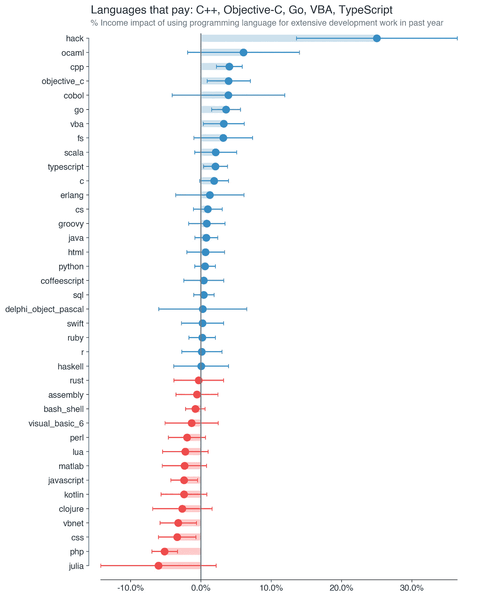

这些结果的主要含义是——语言在很大程度上与薪酬无关。相对于不需要这种语言的工作，绝大多数语言并没有提供统计上显著的工资提升或折扣。在所有语言中，编程语言的工资水平是相当低的。

Hack 是一个明显的异常值——与 Hack 一起工作会获得 25%的提升。然而，不要马上放下一切去学习黑客

*   Hack 不是一种广泛使用的语言
*   它是由脸书开发的，与其他来自大型科技巨头的语言和框架不同，Hack 背后没有同样的营销推动。
*   我们在这里看到的效果可能反映了在脸书工作的开发人员——没有迹象表明黑客人才的招聘市场很强劲。

在 Hack 之外，从积极的方面来看，我们发现 Objective-C、C++、Go、VBA 和 TypeScript 具有统计上显著的收入效应，范围从 2.1%到 3.9%。

从负面来看，我们有 JavaScript、VB.NET、CSS 和 PHP

*   JS、CSS 和 PHP 可能反映了某些网络开发工作的低工资
*   这些语言代表了 web 开发的基本技术
*   然而，出于同样的原因，他们被认为是表桩
*   因此，在工作中使用这些技术不会带来太多的加薪，尽管你可能很有竞争力

请注意，上面的结果是**而不是**所说的“懂语言 X 会增加/减少薪酬。”懂一门语言不太可能*损害一个人的收入，但是从事使用这门语言的开发工作可能会(相对于其他开发工作而言)。*

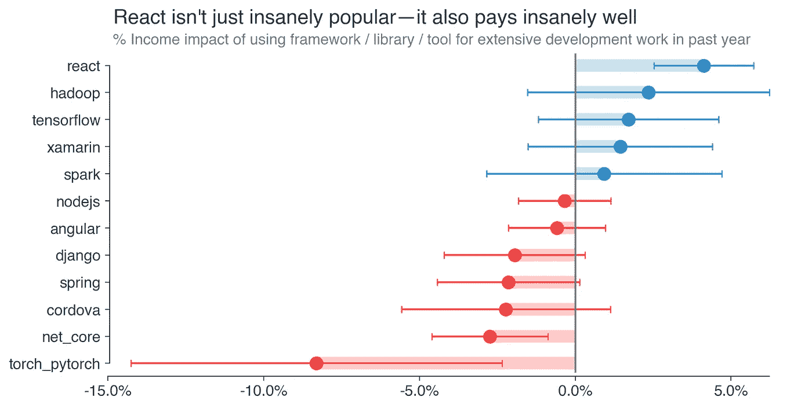

反应——需要说什么？

*   由脸书发明并维护的尖端 JavaScript 框架广受欢迎，尤其是在前端开发人员中，他们正在寻找一种易于使用但功能强大的方法来制作引人注目的用户界面。
*   React 与 4.1%的加薪相关，并且是唯一具有统计显著正面影响的框架。

一起工作。净核心和 PyTorch 对收入产生负面影响

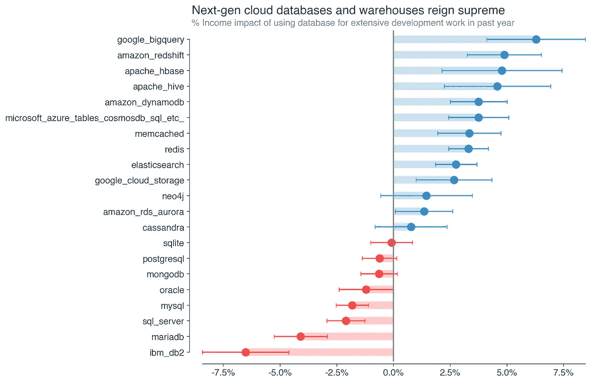

一个字——云。几乎所有具有积极收入效应的数据库都托管在云中，通常由一个主要的公共云服务提供商(谷歌、亚马逊、脸书)专门提供托管服务。

谷歌的 BigQuery 数据仓库高居榜首，紧随其后的是亚马逊与之竞争的 Redshift。接下来是 Apache Hbase 和 Hive。之后是亚马逊的 DynamoDB 和微软的 Azure Tables、Cosmos DB 和 SQL。这份名单还包括 Memcached、Redis、Elasticsearch、Google Cloud Storage 以及 Amazon RDS 和 Aurora——所有这些都是积极的，具有统计学意义。

来自传统供应商的较老的数据库技术占据了不利的一端。这包括 Oracle 曾经无处不在的数据库、MySQL、SQL Server、MariaDB 和 IBM 的 Db2。

看到云革命的影响如此鲜明地展现出来，真是令人着迷。使用下一代支持云的数据库可以带来可观的收入。对于希望提升技能和薪酬的开发人员来说，这个事实应该是最重要的。

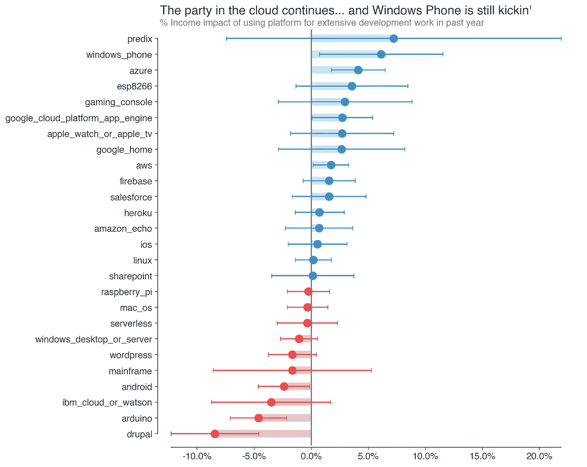

我再说一遍——云。除了 Windows Phone 之外，各种公共云是唯一对开发者收入产生积极、统计上显著影响的平台。Azure 的薪酬高 4.1%，GCP 高 2.7%，AWS 高 1.7%。

而 Windows Phone 呢？我不想解释这个。

Android、Arduino 和 Drupal 与收入呈显著负相关，分别为 2.4%、4.6%和 8.5%。

安卓无处不在的操作系统无需介绍，尽管它的负薪酬关系可能需要一个解释。不幸的是，我在这里被难住了。

Arduino 是一个[开源原型平台](https://www.arduino.cc/)，带有相关的硬件微控制器，简化了电子设备的开发。虽然被用于严肃的开发工作， [Arduino 也被工程系学生大量使用](https://www.arduino.cc/en/main/education)，这很可能导致负面价值。

Drupal 是一个基于 PHP 的内容管理系统，其受欢迎程度在 2011 年达到顶峰，但此后一直在缓慢下滑。

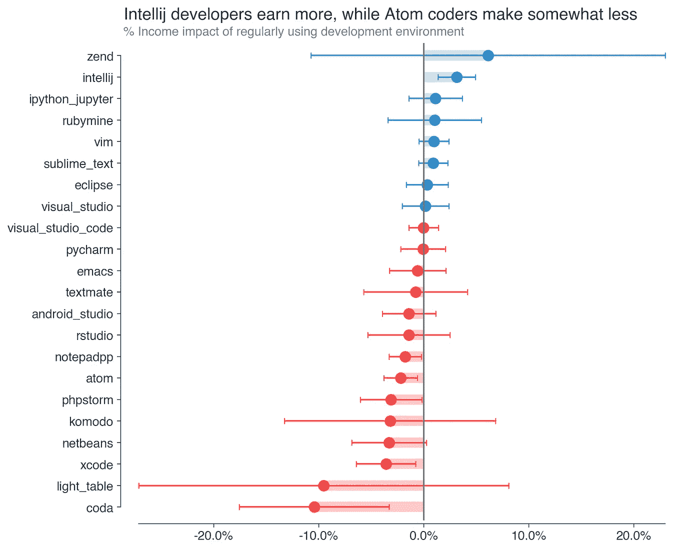

您可能认为开发人员对 IDE 或文本编辑器的选择并不重要——而且您(在很大程度上)是正确的！这里的相关影响通常很小。

然而，IntelliJ 脱颖而出

*   它的创造者 JetBrains 称其为“专业开发人员的 Java IDE ”, IntelliJ 用户比非用户多赚 3.1%
*   当然，对于那些在开发工作中不使用 Java 的人来说，这并不是一个完全有用的比较

Notepad++和 Atom 与稍低的收入相关，大约为 2%，这在统计上是显著的。值得注意的是，两者都很受欢迎，但通常被视为文本编辑器，而不是成熟的 ide。

PhpStorm、Xcode 和 Coda 也有显著的负面影响。

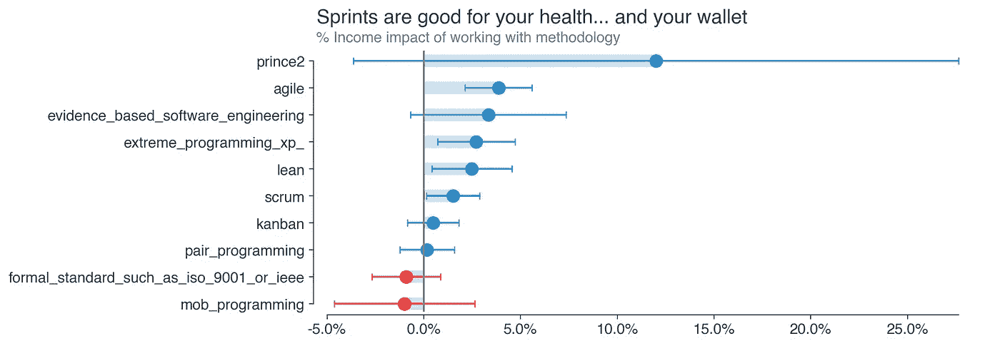

非常流行的敏捷在项目管理方法中处于领先地位。在开发工作中使用敏捷的开发人员比不使用敏捷的人多挣 3.9%。

不太常见的极限编程方法会带来 2.7%的高收入。

精益的收入是 2.5%，而 Scrum 开发人员的收入要高 1.5%，其他都一样。

Prince2 似乎处于异常值，但这主要是由于数据有限——样本中只有 0.1%的开发人员使用该方法。

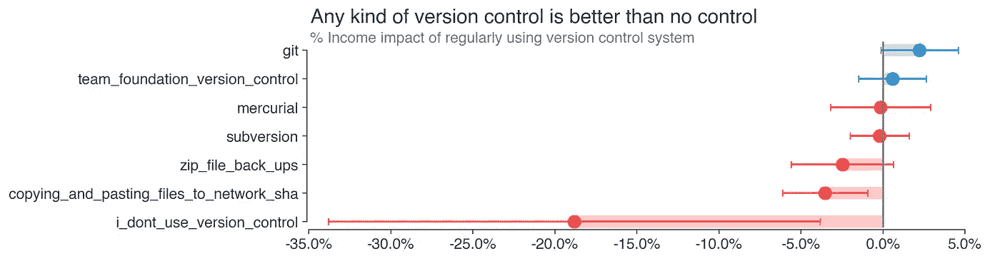

在大多数情况下，所使用的版本控制的确切形式并不重要。

这里的要点是——任何版本控制都比没有版本控制好，但是请不要将文件复制和粘贴到网络共享中。

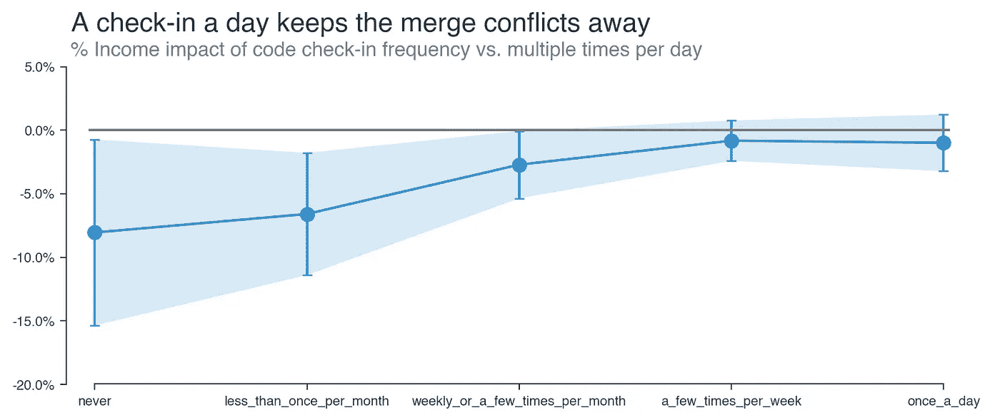

最佳实践似乎是报酬最高的

*   每天多次签入代码
*   显然，以某种节奏检入代码非常重要——理想情况下至少每月一次
*   如果你每月检入代码少于一次或者根本不检入，你的收入很可能会因此受到影响。

听起来不像一个坏记录，但反向因果警告在这里也适用。更频繁地签入代码会增加开发人员的收入，这是完全合理的。也有可能支付更多的公司更有可能遵循和强制开发最佳实践，例如频繁的代码签入。

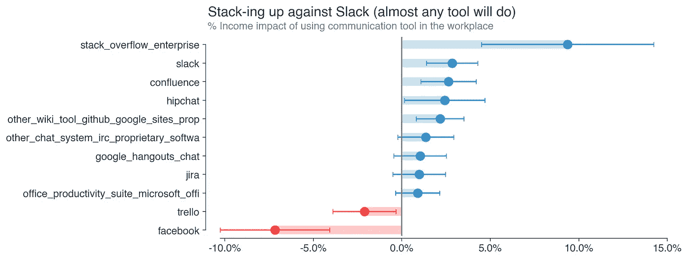

在 Stack Overflow 进行的一项调查中，它自己的企业产品与高得多的开发人员薪酬相关联，这似乎太方便了，但我只能去数据带我去的地方。使用 Stack Overflow Enterprise 的开发者比不使用的多赚 9.4%。

这可能会对在使用 Stack Overflow Enterprise 的公司工作产生一些影响，这可能会带来更高的平均薪酬。

其他通信工具的积极影响较小，如非常受欢迎的 Slack、Atlassian's Confluence、HipChat 和内部内部网网站(维基、谷歌网站等)，它们的收益影响都在 2-3%的范围内。

特雷诺和脸书是阴性的，具有统计学意义。

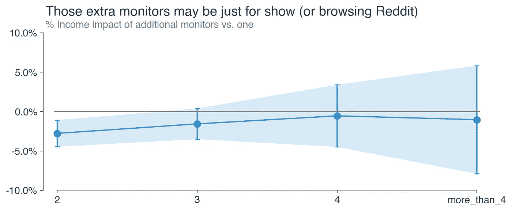

令人惊讶的是，在其他条件相同的情况下，使用两台显示器的开发人员比只使用一台显示器的开发人员收入低 2.8%。

目前，尚不清楚为什么更多的显示器会对收益产生负面影响。将额外的屏幕空间用于[非工作活动](https://www.reddit.com/)的诱惑可能会淹没提高生产力的潜力。

相对于 1，没有其他监视器计数对收入有统计上的显著影响。

## 外卖食品

*   与更高的开发人员报酬相关的工具非常有趣，不一定是人们所期望的
*   在某些情况下，最受欢迎的工具也最赚钱
*   在其他情况下，更晦涩的工具似乎更有优势
*   签入你的代码(至少每隔一段时间)！
*   一个明显的趋势是向云迁移对开发人员的影响——公共云对开发人员薪酬的影响很大，并且在美国三大云公司中一直具有统计显著性
*   了解如何使用和利用这些下一代计算环境，并找到一份能够利用这些技能的工作，可以为普通开发人员带来有意义的薪酬增长

# 工作生活、健康和福利

无可否认，这些结果很难解释。起床时间对收益的影响没有明显的线性时间趋势。

在早上 7 点以后，晚一点似乎会好一点——在某种程度上。奇怪的是，在上午 11 点到 12 点之间的开发人员比那些在早上 5 点之前起床的人工资高 15.4%。

最重要的一点是——**有一个固定的时间表**。这比优化一个特定的起床时间更好。没有规律的起床时间会使软件开发人员的收入降低 7.7%。

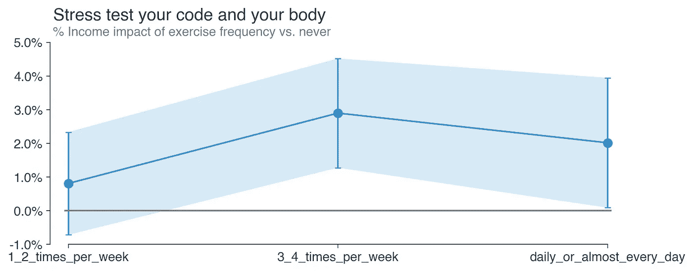

锻炼与收入密切相关。虽然一周只锻炼一到两次似乎没有效果，但每周锻炼三次或更多会比一个完全不锻炼的类似开发人员高出 2-2.9%的工资。

然而，反向因果关系可能会导致收入更多的开发人员进行更多的工作——也许是因为他们有更多的时间或者更容易支付健身房会员的费用。另外，高薪公司通常在内部有健身房，这样更容易锻炼。

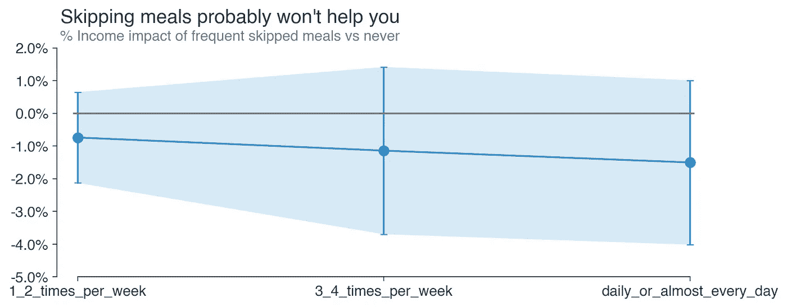

不要不吃饭。任何数量的不吃饭都与较低的工资有关，尽管从来没有统计上的显著性。开发人员不会因为这种不健康的工作习惯而得到回报。

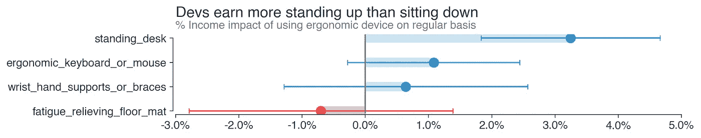

在符合人体工程学的设备中，[立式办公桌](https://thewirecutter.com/reviews/best-standing-desk/)与 3.2%的高工资相关，这在统计上是显著的。

同样，薪酬较高的公司可能更愿意为员工提供站立式办公桌，因此这里的因果关系是值得怀疑的。

每天花在电脑前的时间与报酬没有明显的关系。作为一名开发人员，把自己束缚在笔记本电脑上不会让你获得更高的报酬。

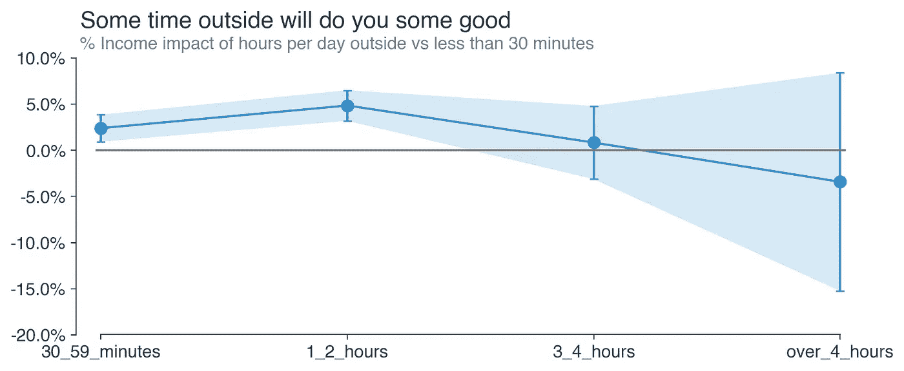

与花在电脑前的时间不同，花在户外的时间确实会对薪酬产生影响，理想的时间是 1-2 小时。在户外的时间少于 30 分钟会比 30 分钟到 1 小时的工资低 2.4%。

在户外花费超过 4 个小时与较低的工资相关，但是没有足够的开发人员定期这样做以产生精确的估计。

## 外卖食品

*   数据表明，常见的最佳实践通常是最好的方法
*   每天至少花少量时间在户外
*   不吃饭只会让你的银行存款增加到你省下午餐钱的程度
*   每周锻炼几次比从不去健身房要好

# 结论

从研究和上面的图表中有许多重要的收获。

这个分析是探索影响开发者报酬的各种因素的第一次尝试。为此，我希望它能有启发性和启发性。

然而，正如许多回答难题的尝试一样，这项分析提出的问题和它回答的问题一样多。

我发布完整的代码来重现这个分析，因为我相信开源的、可复制的研究是知识强劲发展的关键

*   我希望这篇分析能为那些希望提升这个重要话题的知识水平的人提供一个起点
*   如果您发现错误或不同意分析的某些方面，请随时向我的 [GitLab](https://gitlab.com/whoisnnamdi/highest-paid-software-developer) 或 [GitHub](https://github.com/whoisnnamdi/highest-paid-software-developer) 库提交编辑(拉请求)

我非常关心科技行业。但是解决它的问题和增强它的优势需要对它的组成元素有一个严格的理解。[开发者是技术难题](https://www.cnbc.com/2018/09/06/companies-worry-more-about-access-to-software-developers-than-capital.html)的关键一环，他们值得我们关注。

# 附录

# 数据

正如在我的上一篇文章中，我利用了 Stack Overflow 的年度软件开发人员调查数据，该调查询问了收入以及许多其他感兴趣的问题。

例子包括

*   以下哪一项最好地描述了你所完成的最高水平的正规教育？
*   你工作的公司或组织大约雇用了多少人？
*   在过去的一年中，您使用以下哪种编程、脚本和标记语言进行了大量的开发工作？

我对这些问题的答案如何影响收入很感兴趣。虽然不可能完全避免反向因果关系或相关性而不是因果关系的问题，但通过使用机器学习技术增强的回归，我们可以更有信心，我们的结果准确地代表了真实的关系收入。

本质上，我们将分析每个可能的答案如何影响收入，保持所有其他答案不变。

我将数据集仅限于 18 岁以上、收入在 1 万至 25 万美元之间的非退休美国受访者。超过 250，000 美元的回答更有可能是 troll(即编造的)回答，这是我想排除的，不管怎样，很少有回答超过这个阈值。

这给我们留下了大约 11，000 名开发人员的数据集。

# 方法学

我根据数据估计了以下等式:

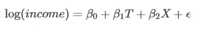

其中 T 是我们感兴趣的特征，B1 是该特征相对于基本类别对收入的影响，X 是一组控制(在我们的例子中，回答者对调查中其他问题的回答)，B2 是每个相应控制的一组影响，e 是我们估计的不可约误差。

假设我们已经包括了一个“完整的”和“正确的”控制集合，这应该提供了一个合理的关于兴趣特征 T 与收入之间关系的精确估计。收入的对数转换意味着我们的结果将大致以百分比表示，这意味着在其他条件相同的情况下，性状 T 与相对于“基础”类别的收入增加 B1*100%相关。基本类别会因性状而异。

选择正确的控件集并不简单。在所有可用的控件中选择一个子集的自由度是任意的，这为“p-hacking”和其他臭名昭著的行为打开了大门，这些行为可能导致对目标参数的不正确(有偏差)估计。

为了避免这种情况，我利用一种强大的机器学习技术，双重选择(特别是双重套索选择)，对每个性状 T 进行原则性的协变量选择，对每个性状重新进行回归。如 [Belloni，Chernozhukov，Hansen (2011)](https://arxiv.org/abs/1201.0224) 所述，与简单地使用所有协变量或试图手动选择一个子集相比，这将提供对每个特征的收入影响的更准确的估计。我不会在这里详细介绍该方法，但可以参考原始论文了解更多信息。[这篇文章](/teconomics-blog/using-ml-to-resolve-experiments-faster-bd8053ff602e)提供了一个相对直观的解释，这也是我最初学习这项技术的地方。

长话短说，双重选择让我们更加确信结果代表了准确的效果。

**如果你喜欢这篇文章，请用掌声表示你的支持👏👏👏或者和朋友分享。**

**如果您想了解最新的未来内容，请在下面输入您的电子邮件地址💌**

*原载于 2019 年 1 月 15 日*[*whoisnnamdi.com*](https://whoisnnamdi.com/highest-paid-software-developer/)*。*